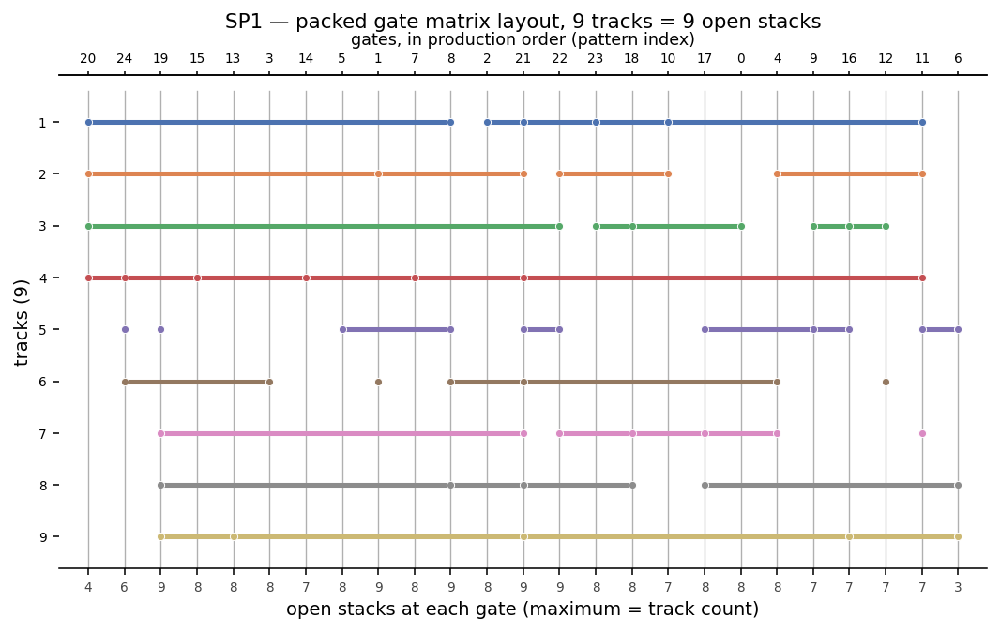
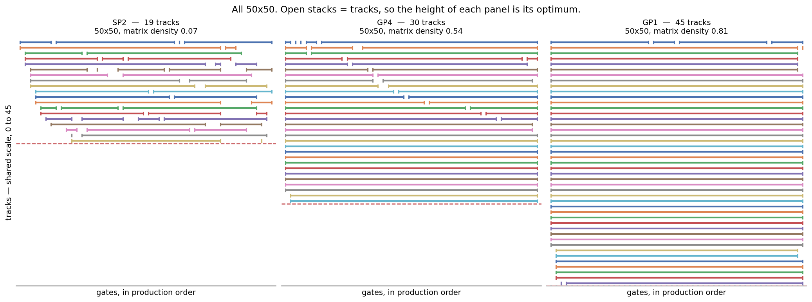

# MOSP Solver — Direct SAT Encoding

Exact solver for the **Minimization of Open Stacks Problem (MOSP)** using a direct SAT encoding with Kissat, graph-theoretic lower bounds, and a quick tabu search for the upper bound. Includes an in-progress Lean 4 formalization of the underlying pathwidth theory.

**6,226 of 6,376 published benchmark instances solved to certified optimality**, each with a witness ordering in `solutions/` that can be checked without trusting the solver.

MOSP arises in manufacturing: given a set of customer orders (each requiring some subset of products), find a production sequence that minimizes the maximum number of simultaneously open customer stacks. This problem is NP-hard (Linhares & Yanasse 2002).

## The same problem is a VLSI layout problem

Linhares & Yanasse (2002) show MOSP *is* the **gate matrix layout problem** from
VLSI design. A gate matrix circuit is a set of gates — vertical wires — carrying
transistors, with horizontal *nets* joining the gates that share a transistor.
Permuting the gates does not change the logic, but it changes how many physical
rows, or **tracks**, the nets need, and tracks are what determine circuit area.
Their Proposition 2: **the number of open stacks equals the number of tracks.**

So every solution here can be drawn as a packed circuit. Customers become nets,
patterns become gates in production order, and nets whose stacks never overlap
share a track:



Nine tracks, so nine open stacks — the answer is the height of the picture. Dots
are transistors, marking the gates a net actually connects to; a net spanning a
single gate is a customer needing one pattern, whose stack opens and closes at
the same step.

### Why some instances are hard and others are not

The same drawing explains why instance density dominates everything about this
problem. These three are all 50x50, so only density varies:



Same track scale in all three, so the height each fills is its optimum. Sparse
instances leave slack a sequence can exploit: SP2's nets are short, several share
a track, and 50 customers pack into 19. Dense ones do not — in GP1 almost every
net spans the whole circuit, so no two can share a track and 50 customers need
45. No permutation can help, which is why its optimum is 45 rather than anything
a better search might find.

That split runs through the whole project. It is why the maximum-clique lower
bound is exactly tight on the dense instances and useless on the sparse ones, why
contraction degeneracy is needed for the latter (see [Lower bounds](#lower-bounds)),
and why the instances still unsolved are overwhelmingly sparse.

(Two quantities get called "density" in this literature: the fill rate of `M`,
and the edge density of the MOSP graph. The figures report both; Frinhani et
al.'s tabulated `D` is the second.)

## Approach

The solver encodes the MOSP decision problem ("can patterns be sequenced with at most k open stacks?") directly as a SAT formula, then uses **binary search** over k to find the exact optimum.

Given a MOSP instance with binary matrix M (rows = customers, columns = patterns):

1. Compute **bounds**. Lower bound: the largest clique found in the MOSP graph, and its contraction degeneracy (see [Lower bounds](#lower-bounds)). Upper bound: a **quick tabu search** -- the best of identity, reverse, and 10 random permutations, improved by tabu search over swap moves (500 iterations, tenure 7, 200 sampled neighbours per step, with an aspiration criterion).
2. **Binary search** over k in [lower, upper]: at each step, encode "MOSP <= k?" as CNF and solve with **Kissat404** (see [SAT backend](#sat-backend)).
3. The smallest satisfiable k is the exact optimal MOSP value. If the bounds already meet (`lower >= upper`), the tabu ordering is optimal and no SAT call is made.
4. **Verify** by simulating the production sequence on the witness ordering.

Solutions are cached as JSON in `solutions/` — subsequent runs verify cached solutions instead of re-solving.

### SAT Encoding

Position-based formulation with three variable families:

| Variable | Meaning |
|---|---|
| `x[p,t]` | Pattern p is placed at position t |
| `y[p,t]` | Pattern p is placed by step t (prefix) |
| `o[c,t]` | Customer c's stack is open at step t |
| `any[c,t]`, `all[c,t]` | Auxiliaries for the open-stack condition |

**Constraints:**
- **Permutation**: each pattern exactly one position, each position exactly one pattern (at-least-one + ladder at-most-one)
- **Prefix linking**: `x[p,t] -> y[p,t]`, monotonicity, converse (including t=0 base case)
- **Open stack forcing**: (a) `x[p,t] -> o[c,t]` for each pattern p of customer c; (b) `y[p,t] -> any[c,t]`, `all[c,t] -> y[p,t]`, and `any[c,t] AND NOT all[c,t] -> o[c,t]`
- **Width bound**: at most k open stacks per step (totalizer cardinality constraint)
- **Symmetry breaking**: pattern with most customers in first half of positions

Constraint (b) costs `2|P_c| + 1` clauses per (customer, step). Writing it
directly over pairs of c's patterns instead -- `y[p,t] AND NOT y[q,t] -> o[c,t]`
-- costs `|P_c|(|P_c| - 1)`, which on dense instances dominates the entire
formula: GP5 (100x100, customers needing nearly every pattern) encoded to 76.7M
clauses and cost 10.3 GB and 60s to build, against 3.25M clauses, 461 MB and
2.3s now. Only the polarities above are needed; neither auxiliary is pinned to
its full definition, but `any` occurs negatively in the forcing clause so it
stays false unless some `y[p,t]` forces it true, and `all` occurs positively so
it goes true whenever every `y[p,t]` allows. So `o[c,t]` is forced exactly when
the customer is genuinely open, never spuriously -- which would over-tighten the
width bound. The pairwise form is retained behind `pairwise_open_stacks=True`
and both are tested against exhaustive search.

## Lower bounds

The lower bound decides which decision problems the solver poses, and the
expensive ones are refutations at values *below* the optimum -- exactly what a
weak bound fails to rule out. Two bounds are computed on the MOSP graph (nodes
are customers, an arc iff some pattern is required by both):

- **Maximum clique.** Any clique forces that many simultaneously open stacks:
  take the member that closes earliest; every other member shares a pattern with
  it, that pattern is produced by the time it closes, so all of them are open at
  that step. Proved directly, with no appeal to pathwidth. Subsumes the
  "maximum customers per pattern" bound, since each pattern is itself a clique.
- **Contraction degeneracy** (MMD+, least-c). Stronger, but rests on
  `MOSP = pathwidth + 1` rather than a direct argument, so it is validated
  against every known optimum rather than assumed.

Measured over 900 solved instances:

| bound | mean gap to optimum | tight | max gap |
|---|---|---|---|
| max customers per pattern (Yuen & Richardson 1995) | 5.58 | 1.2% | 19 |
| maximum clique | 2.02 | 36.9% | 13 |
| **contraction degeneracy** | **0.54** | **63.4%** | **5** |

The two are complementary by density: clique carries the dense instances,
contraction the sparse ones. On GP5-GP8 both are exactly tight, so no refutation
is needed at all. Full analysis in [`reports/lower_bounds.md`](reports/lower_bounds.md).

## SAT backend

`benchmarks/solver_portfolio.py` times all 19 working pysat backends on hard
instances, in both directions separately, with known optima as ground truth.
On the refutation at k-1, which is what decides an instance's runtime:

| backend | refutations closed |
|---|---|
| **Kissat404** (in use) | **6/6** |
| Cadical300 | 4/6 |
| Cadical153 | 3/6 |
| cd195 (previously in use) | 2/6 |
| Glucose / Minisat family | mostly 1/6 |

No backend gave a wrong answer in 228 trials. The choice is a named constant,
`satisfiability.mosp_solver.SAT_BACKEND`; re-run the portfolio before changing it.

## Visualising a solution

`mosp/visualize.py` draws a solution two ways.

**`plot_gate_matrix`** is the packed gate matrix layout of Linhares & Yanasse
(2002), Fig. 2(c). Gates are vertical wires, one per pattern in production order;
nets are horizontal wires, one per customer, running from the first gate it needs
to the last, with a dot at each gate it actually connects to. Nets are **packed
into tracks**, so customers whose stacks never overlap share a physical row.
Their Proposition 2 is that open stacks equal tracks, which makes the count
immediate: the number of rows *is* the answer. Per-gate open-stack counts run
along the bottom, pattern indices along the top.

**`plot_solution`** is the unpacked fill-in matrix — one row per customer, each
row's zeros filled between its first and last 1 — which shows the staircase
structure rather than the compressed circuit.

```bash
python -m mosp.visualize SP2 --out sp2.png      # any cached solution
python -m mosp.visualize GP5 --colors 5         # 5 or 10 cycling colours
```

`figures/*_gatematrix.png` holds the packed layouts for the published instances.

Rows cycle through a small palette and are drawn with a gap between them, so
open stacks in a column can be counted by eye. Rows are sorted by opening step
into the staircase form the gate-matrix literature draws; that is cosmetic, since
reordering rows cannot change a column sum. Steps attaining the peak are shaded.

`plot_comparison` draws several solutions side by side on a shared vertical
scale, so the fraction of customers open at once is comparable between panels.
`figures/density_contrast.png` uses it on SP2, GP4 and GP1 — all 50x50, so only
density varies — and the progression from a sparse staircase to a near-solid
block is the visual reason dense instances have so little to optimise, their
optima running 19, 30, 45 of 50 customers.

Note that two different densities get called "density" in this literature. The
figures report both: the fill rate of M, and the edge density of the MOSP graph.
Frinhani et al. (2018) tabulate the latter — their D of 0.21 for SP2 is the graph,
whose matrix is only 7% full.

## Validation Against Published Optima

**Why only these instances.** Per-instance optimal values are barely published in
this literature. Frinhani et al. (2018) tabulate 21 of them; Chu & Stuckey (2009)
confirm SP2, SP3 and SP4. For their 200 random instances, Chu & Stuckey state
that their method "finds and proves the optimal in all cases" but report node
counts, times and average deviations rather than the values themselves. So for
the other ~6,200 instances we solve, **there is nothing published to compare
against** — not because nobody solved them, but because nobody tabulated them.
That is the gap the witness orderings in `solutions/` are meant to fill.

| Instance | Size | Published | Ours | Status |
|---|---|---|---|---|
| GP1 | 50×50 | 45 | 45 | exact |
| GP2 | 50×50 | 40 | 40 | exact |
| GP3 | 50×50 | 40 | 40 | exact |
| GP4 | 50×50 | 30 | 30 | exact |
| GP5 | 100×100 | 95 | 95 | exact |
| GP6 | 100×100 | 75 | 75 | exact |
| GP7 | 100×100 | 75 | 75 | exact |
| GP8 | 100×100 | 60 | 60 | exact |
| Miller | 20×40 | 13 | 13 | exact |
| NWRS1 | 10×20 | 3 | 3 | exact |
| NWRS2 | 10×20 | 4 | 4 | exact |
| NWRS3 | 15×25 | 7 | 7 | exact |
| NWRS4 | 15×25 | 7 | 7 | exact |
| NWRS5 | 20×30 | 12 | 12 | exact |
| NWRS6 | 20×30 | 12 | 12 | exact |
| NWRS7 | 25×60 | 10 | 10 | exact |
| NWRS8 | 25×60 | 16 | 16 | exact |
| SP1 | 25×25 | — | 9 | exact (no published value) |
| SP2 | 50×50 | 19 | 19 | exact |
| SP3 | 75×75 | 34 | 36 | in progress — descending |
| SP4 | 100×100 | 53 | — | in progress |

**Eighteen of the twenty published values match, and none disagrees.** SP3 and SP4
are being worked by the descending ratchet, which improves a solution without
ever asking for a refutation; SP3's best is 36 and still falling.

A caution on what this establishes: the published values are themselves
uncertified, so agreement is mutual corroboration rather than proof that either
side is right — which is the argument for shipping checkable witnesses. The
literature records a case in point: Yanasse & Senne (2010) note that later
authors found *better* solutions than Faggioli & Bentivoglio's (1998) **exact**
method reported, and conclude its implementation was faulty.

Two results are worth singling out. SP2 is where the earlier pathwidth approach
gave 21, overcounting by 2; the direct SAT encoding finds 19. GP5 needed 76.7M
clauses before the linear open-stack encoding and could not be built in practice;
it now solves in 285s.

"Exact" means optimality was certified: satisfiable at k with a witness ordering
and unsatisfiable at k-1 — or, where the lower bound already equals the optimum,
a satisfiable call alone, which is how GP7 and GP8 were settled. Witness orderings
are cached in `solutions/` and can be re-checked independently of the SAT solver
by simulating them with `mosp.verify.max_open_stacks`.

### Corpus

The full benchmark tree has been swept: **6,226 of 6,376 instances solved**, each verified by simulating its own witness ordering, with **zero disagreements** between the reported value and the simulation across every instance and every pass. The 150 still open are concentrated -- 144 of them are Chu & Stuckey, the collection built to be harder than its predecessors.

## Checking the claims without trusting this code

An optimality claim here is two statements, and they are not equally easy for
someone else to check.

**`MOSP(I) <= k`** is witnessed by an ordering. Checking it means simulating that
ordering against the instance file and counting open stacks — no SAT solver, no
encoding, none of this code. `mosp/certify.py` does it with an implementation
deliberately sharing nothing with the solver, because a checker built on the same
code checks less than it appears to:

```bash
python -m mosp.certify check SP2     # one instance
python -m mosp.certify check         # every cached solution
```

All **6,229** cached witnesses pass. Re-implementing this checker in another
language is an afternoon's work, and doing so would remove us from the trust
chain entirely for this half of the claim.

**`MOSP(I) > k-1`** is harder. It rests on a solver reporting the CNF
unsatisfiable, so re-running our code reproduces our result *including any bug in
our encoding* — that is reproducibility, not verification. What can be done today
is to export the formula and have it refuted by somebody else's solver:

```bash
python -m mosp.certify export SP2 --k 18 --out sp2_k18.cnf
```

UNSAT at `k-1` from an independent solver, plus a witness at `k`, is the
optimality claim. That narrows what has to be trusted from our whole pipeline to
one question: whether the encoding faithfully expresses MOSP. Two routes would
close even that, and neither is done:

- **proof logging** — emit a DRAT refutation checkable by a verified checker such
  as `cake_lpr`. Measured at roughly 10 MB of proof per second of solving, which
  puts the easy 94% of the corpus at about 7.5 GB and the whole of it past a
  terabyte. Shelved on those grounds.
- **the Lean formalization** — prove the CNF satisfiable iff `MOSP(I) <= k`.
  `lean/` currently formalizes the pathwidth theory, not the encoding.

So the honest summary: the upper bounds are already checkable by anyone, the
lower bounds are reproducible and independently re-refutable, and full
certification of the lower bounds remains open.

## Project Structure

```
satisfiability/                 -> SAT-based solvers
    mosp_encoding.py                Direct MOSP-to-SAT CNF encoding
    mosp_solver.py                  Solver: binary search, tabu bounds, solution caching
    encoding.py                     Pathwidth CNF encoding (legacy)
    solver.py                       Pathwidth solver (legacy)

mosp/                           -> MOSP instance handling
    instance.py                     Parse/represent MOSP instances (binary matrix)
    visualize.py                    Packed gate matrix layout drawing
    certify.py                      Independent witness checking, CNF export
    agreement_graph.py              Build agreement graph via M^T @ M overlap
    reduction.py                    Formal reduction: MOSP <-> pathwidth
    solver.py                       End-to-end pipeline (agreement graph approach)
    verify.py                       Simulate production sequence to count open stacks

customer_inter/                 -> Customer intersection graph approach (legacy)
    customer_graph.py               Build customer graph via M @ M^T overlap
    reduction.py                    MOSP <-> customer-graph pathwidth reduction
    solver.py                       End-to-end pipeline using customer graph
    compare.py                      Side-by-side comparison of graph formulations

fixed_parameter_algorithm/      -> Pathwidth solvers (used as subroutines)
    pathwidth.py                    Exact DP over vertex subsets (n <= 18)
    pathwidth_fpt.py                Branch-and-bound with iterative deepening (n <= 100+)
    path_decomposition.py           Extract path decomposition from ordering

solutions/                      Cached optimal solutions (JSON)

benchmarks/
    solve_parallel.py               Parallel solving: across instances, and across k
    overnight.py                    Escalating-budget driver for unattended runs
    solver_portfolio.py             Times every pysat backend on the hard calls
    solve_all_sat.py                Batch SAT solver for large benchmark instances
    solve_all.py                    Batch solver for published benchmark files
    generator.py                    Random/structured instance generation
    run_benchmarks.py               Batch solver with CSV output
    instances/                      Published MOSP benchmark collections
        ChallengeInstances2005/         2005 Constraint Modelling Challenge
            Harvey/ Miller/ Shaw/ Simonis/ Wilson/
        MOSP_Instances/                 SCOOP dataset collection
            Challenge/ Chu_Stuckey/ Faggioli_Bentivoglio/ SCOOP/
    results/                        Benchmark result CSVs (tracked for regression)

lean/
    MOSPFormalization/              Lean 4 proofs of the MOSP-pathwidth reduction

validate_published_optima.py    Batch validation against published optima

tests/                          184 tests across 11 test modules
reports/
    lower_bounds.md                 The clique and contraction degeneracy bounds
    fpt_theory_practice_gap.md      Why FPT tractability failed in practice
literature/                     Reference papers
reports/                        Analysis documents
```

## Usage

### Installation

```bash
pip install -r requirements.txt
```

Requires Python 3.9+ with `networkx`, `numpy`, `python-sat`, `matplotlib`, and `pytest`.

### Solve a MOSP instance

```python
from mosp.instance import MOSPInstance
from satisfiability.mosp_solver import solve_mosp_sat

instance = MOSPInstance.from_benchmark_file("path/to/instance.txt")[0]
val, ordering = solve_mosp_sat(instance)
print(f"Optimal MOSP: {val}")
print(f"Ordering: {ordering}")
```

### Solve in parallel

Two axes of parallelism, both in `benchmarks/solve_parallel.py`:

```bash
# Fan out across instances (defaults to min(32, cores) workers)
python -m benchmarks.solve_parallel sweep --workers 30 --timeout 300 \
    --output benchmarks/results/sweep.csv

# Parallelise the binary search over k for one hard instance
python -m benchmarks.solve_parallel one GP5 --workers 28
```

`sweep` gives near-linear speedup: the benchmark tree holds 6,376 instances and
they are completely independent. Each instance still runs in its own process, so
a hung or memory-hungry solve is killed without taking the run down, and rows are
flushed to CSV as they complete.

`one` attacks a single instance. The sequential binary search issues `log2(gap)`
CaDiCaL calls strictly in order, and its hardest call is almost always the UNSAT
proof at the optimum minus one -- which it reaches *last*. Probing many k at once
starts that proof immediately. Since SAT at k implies SAT at k+1, every answer
shrinks the live interval, so each round cuts it by a factor of `workers + 1`
rather than 2, and probes whose result can no longer move either endpoint are
killed rather than awaited.

### Unattended runs

```bash
# Escalating budgets against whatever is still unsolved
python -m benchmarks.overnight --rounds 3600,12000 --workers 30
```

The solution cache is the state, so this needs no bookkeeping between runs:
anything already solved is verified from disk in milliseconds and skipped, and
each run spends its budget only on what is still open. Killing it loses at most
the instances in flight. A round whose per-instance budget exceeds the time left
(`--hours`) is skipped rather than run, so a reported timeout always means the
solver failed and never that the clock ran out.

### Validate against published optima

```bash
# Runs all 11 instances, caches results, stops on mismatch
python validate_published_optima.py
```

### Run tests

```bash
python -m pytest tests/ -v
```

### Instance file formats

`MOSPInstance.from_file` reads this project's own single-instance `.mosp` format:

```
instance_name
n_customers n_patterns
<n_customers rows of n_patterns space-separated 0/1 values>
```

`MOSPInstance.from_benchmark_file` reads the published collections in
`benchmarks/instances/` and returns a **list** of instances, since many of those
files concatenate several instances (`Harvey/wbp_10_10.txt` holds 40). It handles
both layouts found there:

- **Format A** (`MOSP_Instances/`) -- one instance per file, leading `m n` line,
  matrix transposed to customers x patterns.
- **Format B** (`ChallengeInstances2005/`) -- multiple instances per file, optional
  description lines before each `m n` line, matrix already customers x patterns.

The format is auto-detected from the path; pass `transpose=` to override.

## Theoretical Foundation

The MOSP-pathwidth connection (Kinnersley 1992, Yanasse 1997):

```
VS(G) = PW(G) = IT(G) = SN(G) - 1 = GML(G) + 1
```

Two graph formulations appear in this repository, and it is worth being precise
about which one the literature's equivalence concerns. Yanasse & Senne (2010)
defines both and calls them "completely different":

- **MOSP graph** -- nodes are *item types* (customers), an arc between two iff
  some pattern contains both (`M @ M^T`). A pattern with k items is a clique of
  size k. **This is the graph of the pathwidth equivalence**, due to Yanasse
  (1997c). Here: `customer_inter/customer_graph.py`.
- **Pattern connection graph** -- nodes are *patterns*, an arc between two iff
  they share an item type (`M^T @ M`). The literature uses it only to decompose
  an instance into independent clusters. Here: `mosp/agreement_graph.py`; the
  name "agreement graph" is this project's, not the literature's.

Earlier versions of this README attached the `pathwidth + 1` equality to the
agreement graph, which is the wrong object -- the undercounting measured there
is not a counterexample to Yanasse's result. Whether the equality is tight on the
MOSP graph is a question this project has not yet answered properly.

The direct SAT encoding bypasses both reductions, encoding MOSP as a
self-contained decision problem, and does not depend on the resolution.

### Formal Verification in Lean 4

The `lean/` directory contains a Lean 4 formalization of the pathwidth theory. It is a work in progress, and it formalizes the *pathwidth* side of the story -- not the direct SAT encoding, and not an exact-MOSP claim.

**Complete (no `sorry`):**

- **Vertex separation = pathwidth** (Kinnersley 1992), in `VSEquivPW.lean`: proven in both directions via explicit constructions (`LayoutToDecomposition.lean` and `DecompositionToLayout.lean`).
- Supporting definitions and lemmas: linear layouts, vertex separation, path decompositions, pathwidth, MOSP instances, open-stack counting.
- `Examples.lean`: small concrete instances checking that the agreement-graph and open-stack *definitions* behave as intended. No instance is solved inside the proof assistant -- pathwidth is defined via `sInf` and is noncomputable.

`MOSPFormalization/Check.lean` cross-checks the open-stack definition against
what `mosp/verify.py` reports on small instances, by `decide`. That check earned
its place immediately: `isActive` required a pattern *strictly* after position
`i`, so a stack closed one step before its last pattern was produced, and on one
customer needing one pattern Lean gave 0 where the implementation, the
independent checker and the literature all give 1. The definition is now
inclusive at both ends, matching Yanasse & Senne's fill-in matrix.

**Incomplete (2 `sorry`s, both in `Reduction.lean`):**

- `openStacksAt_le_bag_card` (line 61) -- the core injection step, which needs Hall's marriage theorem under the `IsReduced` hypothesis.
- `exists_instance_achieving_equality` (line 111) -- the tightness direction.

What is stated in Lean is the one-sided bound `mospValue <= pathwidth + 1` (`mosp_le_pathwidth_add_one`, for `IsReduced` instances), and it currently rests on the first `sorry`. **Equality is not proven, and is not expected to hold in general** -- the empirical results above show `pathwidth(G_a) + 1` undercounting and `pathwidth(G_c) + 1` overcounting on real instances. Closing the tightness `sorry` would require the reduced-instance hypothesis to do real work.

The formalization includes candidates for contribution to Mathlib (`ForMathlib/`).

Building requires `elan`/`lake` with the toolchain pinned in `lean/lean-toolchain`:

```bash
cd lean && lake build
```

## Known Limitations

- **Two of the twenty published values are not yet matched** (SP3, SP4). The obstacle is not building the formula -- these encode in 0.4-3.3M clauses -- but the refutation at k-1 that certifies optimality. Both have loose lower bounds, unlike GP7 and GP8, which were closed by a single satisfiable call once their bound turned out to be tight.
- **150 of 6,376 benchmark instances remain unsolved**, 144 of them from the Chu & Stuckey set. They are sparse, which is the regime where the bounds are weakest.
- **The Lean formalization is incomplete** (2 `sorry`s) and covers the pathwidth reduction, which the SAT solver no longer relies on. Only VS = PW is fully proven.
- **The pathwidth code paths are legacy.** `mosp/solver.py`, `customer_inter/`, `fixed_parameter_algorithm/`, and `satisfiability/solver.py` are retained for comparison and for the analysis in `reports/`. Their measured disagreement with published optima should be read against the graph correction above.
- **The contraction degeneracy bound is validated, not proved.** It rests on `MOSP = pathwidth + 1`, so a bound that were too high would make the search start above the true optimum and return a wrong answer that still passes witness verification. It is checked against all 6,226 known optima (zero violations) and re-checked by `tests/test_lower_bounds.py`, but that is evidence rather than proof.
- **The arc contraction bound of Yanasse, Becceneri & Soma (1999) is unobtained**, and may be the same bound as contraction degeneracy. *Pesquisa Operacional* is digitised only from 2001, so it is not the easy download it appears to be. No novelty should be claimed until this is settled.
- **No preprocessing.** Six operations are on record in Yanasse & Senne (2010); none are implemented on the SAT path. Two of them were measured as nearly useless on the Chu & Stuckey instances; the other four are untested here.
- **The binary search discards learning between k values**, re-encoding and re-solving from scratch at each step. Incremental SAT with assumptions would carry learned clauses across the search.
- **`matplotlib` is listed as a dependency but imported nowhere** in the codebase.
- **There is no `LICENSE` file**, although this README states MIT and the Lean sources carry Apache 2.0 headers.

## References

- **Kinnersley, N.G.** (1992). The vertex separation number of a graph equals its path-width. *Information Processing Letters*, 42(6), 345-350.
- **Yanasse, H.H.** (1997). On a pattern sequencing problem to minimize the maximum number of open stacks. *European Journal of Operational Research*, 100(3), 454-463.
- **Linhares, A. & Yanasse, H.H.** (2002). Connections between cutting-pattern sequencing, VLSI design, and flexible machines. *Computers & Operations Research*, 29, 1759-1772.
- **Chu, G. & Stuckey, P.J.** (2009). Minimizing the maximum number of open stacks by customer search. *CP 2009*, LNCS 5732, 242-257.
- **Frinhani, R.M.D. et al.** (2018). A PageRank-based heuristic for the minimization of open stacks problem. *PLOS ONE*, 13(8), e0203076.
- **Yanasse, H.H. & Senne, E.L.F.** (2010). The minimization of open stacks problem: A review of some properties and their use in pre-processing operations. *European Journal of Operational Research*, 203(3), 559-567. (*)
- **Martin, M., Yanasse, H.H. & Pinto, M.J.** (2022). Mathematical models for the minimization of open stacks problem. *International Transactions in Operational Research*.

## License

MIT
