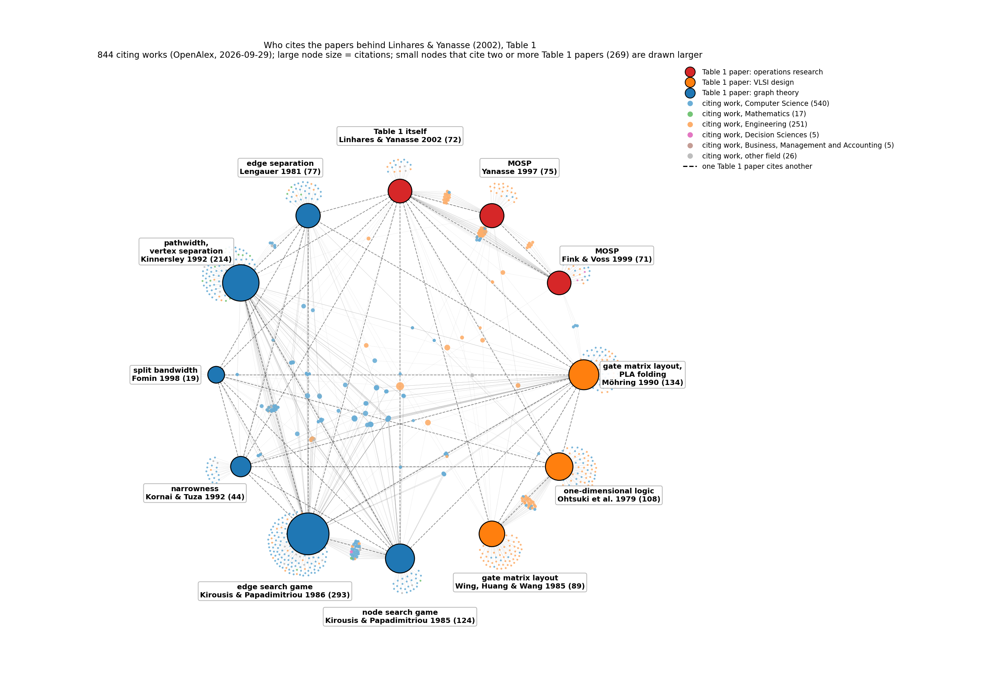
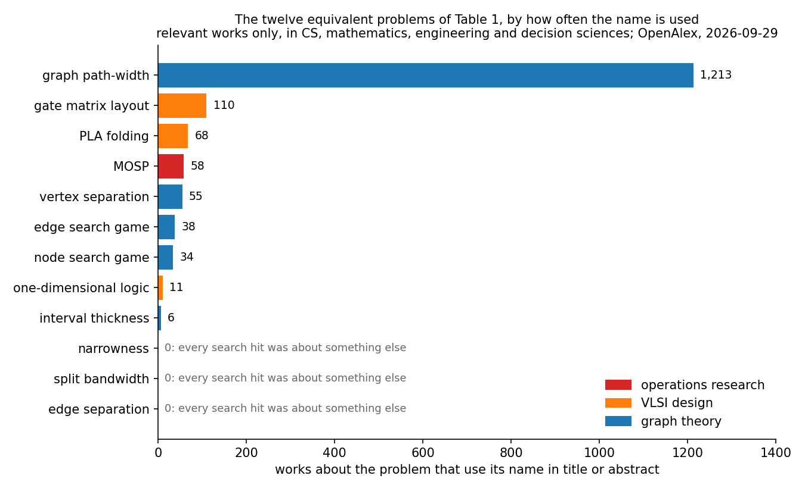
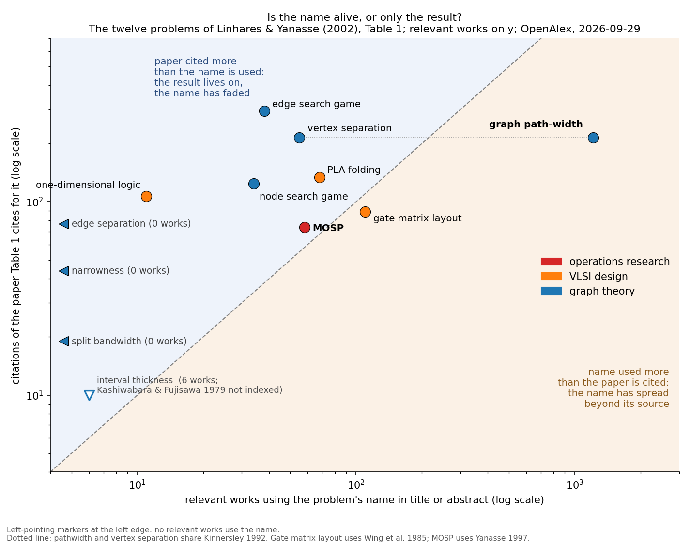
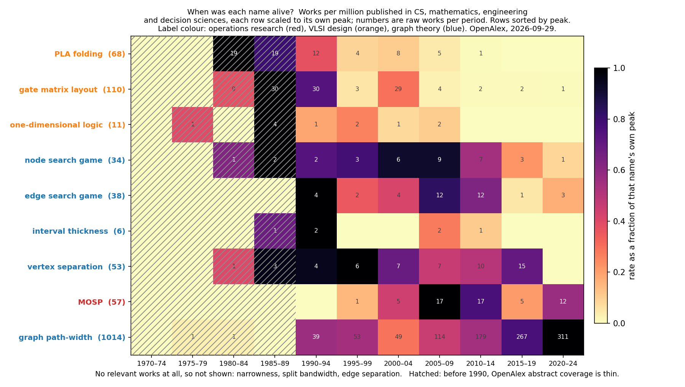
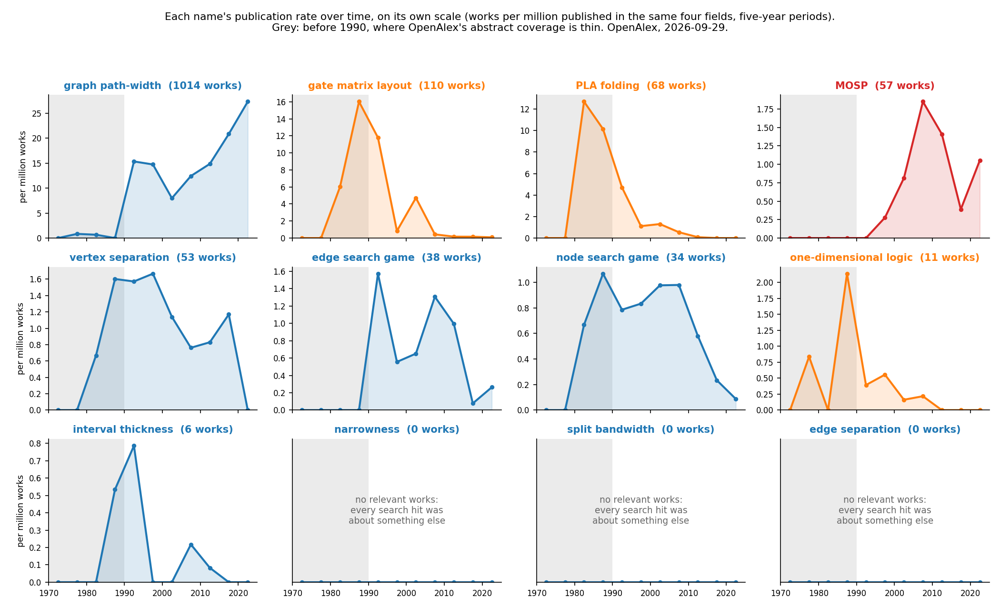
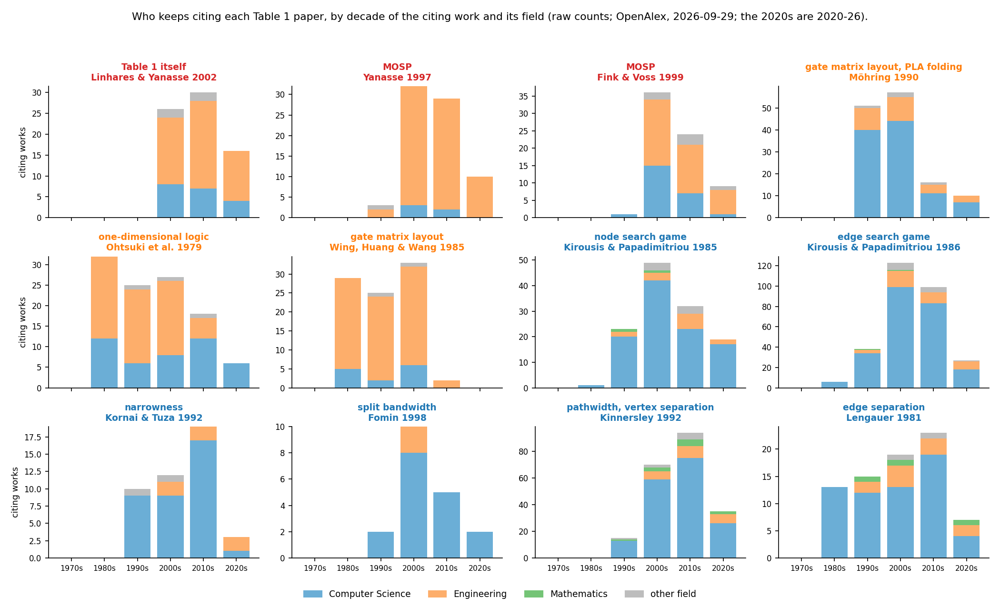

# How popular is each of the twelve equivalent problems?

First measured 2026-09-17 against OpenAlex; **corrected 2026-09-29**, when a
check of the search results showed that for several names most hits were about
something else (see *Correction* below). Two different questions get two
different answers, and they disagree sharply, so both are given.

- **Problem literature** — works about the problem that use its *name* in
  title or abstract, restricted to Computer Science, Mathematics, Engineering
  and Decision Sciences. This measures how alive the *name* is.
  The restriction to those four fields is there because several of these
  names are ordinary words or phrases that other fields use for something
  else. Unrestricted, "narrowness" returns over a million works, mostly
  physics, optics and medicine; "edge separation" returns aerodynamics papers
  on leading- and trailing-edge flow separation; "open stacks" picks up
  OpenStack, the cloud platform; and "interval thickness" picks up petroleum
  geology. The full list, with the raw counts, is under *Method and its
  limits* below. Even inside the four fields the searches catch other senses
  of the words, so every hit was then checked for relevance.
- **Defining paper citations** — `cited_by_count` for the Table 1 reference that
  Linhares & Yanasse attach to that problem. This measures how much the
  *result* is used, which is not the same thing. The column is OpenAlex's
  count as cached on 2026-09-29 (`paper2/data/openalex_citations.json`).
  *(2026-10-03, number audit: it was the 2026-09-17 count until now; four
  entries moved by one, Kinnersley 215 to 214, Kirousis & Papadimitriou 1986
  294 to 293, Yanasse 1997 74 to 75, Ohtsuki et al. 107 to 108.)*

| Problem | Relevant works using the name | (search hits) | Table 1 ref | Citations of that paper |
|---|---:|---:|---|---:|
| Graph path-width | **1,213**\* | 1,571 | [13] Kinnersley 1992 | 214 |
| Gate matrix layout | 110 | 125 | [6] Möhring 1990 / [8] Wing et al. 1985 | 134 / 89 |
| PLA folding | 68 | 74 | [6] Möhring 1990 | 134 |
| MOSP | 58 | 60 | [1] Yanasse 1997 / [4] Fink & Voss 1999 | 75 / 71 |
| Vertex separation | 55 | 100 | [13] Kinnersley 1992 | 214 |
| Edge search game | 38 | 95 | [10] Kirousis & Papadimitriou 1986 | **293** |
| Node search game | 34 | 127 | [9] Kirousis & Papadimitriou 1985 | 124 |
| One-dimensional logic | 11 | 18 | [7] Ohtsuki et al. 1979 | 108 |
| Interval thickness | 6 | 10 | [5] Kashiwabara & Fujisawa 1979 | not indexed |
| Narrowness | **0** | 35 | [11] Kornai & Tuza 1992 | 44 |
| Split bandwidth | **0** | 35 | [12] Fomin 1998 | 19 |
| Edge separation | **0** | 21 | [14] Lengauer 1981 | 77 |

\* 1,212 distinct works: OpenAlex returned one record (`W4416062387`, 2026)
twice in the pathwidth search, and every count in this report counts records.
The same holds for the 1,571 hits (1,570 distinct).

For scale, outside Table 1 and *not* relevance-checked: **treewidth** 6,222
search hits; **bandwidth minimization** 306.

## What the numbers say

**Pathwidth has absorbed the whole family.** At 1,213 relevant works it is 21×
MOSP and more than three times the other eleven names put together (380).
Anything we want to know about algorithms for this equivalence class was most
likely published under "pathwidth", not under any of the other eleven names.

**Three of the twelve names are not in use at all, and two more barely.**
Narrowness, split bandwidth and edge separation have **no** relevant works:
every search hit was about something else ("narrowing" in term rewriting,
radar interferometry and photonic beam splitters, graph drawing and flow
separation). Split bandwidth is Fomin's own coinage in the very paper Table 1
cites, and nobody adopted it. Interval thickness (6) and one-dimensional logic
(11) are nearly as rare.

**MOSP is one of the better-used names.** At 58 relevant works it ranks fourth
of twelve, behind pathwidth and the two VLSI layout names and ahead of vertex
separation and both search games. The first version of this report, from the
uncorrected counts, said the opposite; it was an artefact of searches that
inflated the graph-theory names with unrelated work. *(2026-10-03: the rank depends on the
labels. Under the mechanical phrase rule MOSP is fifth, behind vertex
separation; see "For the paper".)*

**Citation counts do not track name usage, and the gap is informative.**
Kirousis & Papadimitriou 1986 is the most-cited paper in the table (293) while
only 38 works use "edge search game" in its sense. The paper is cited as a
foundational graph-searching result, not because people work on the edge
search game as such. The same split is starker for Ohtsuki et al. 1979: 108
citations against 11 works using "one-dimensional logic" — it is cited for its
interval-graph characterisation, and the problem name died with the
technology.

**Kashiwabara & Fujisawa 1979 has no OpenAlex record at all**, so no citation
count exists for it. That is the same fact that made it undownloadable: a 1979
ISCAS proceedings paper that was never digitised is invisible to modern
bibliometrics, whatever its actual influence.

## Method and its limits

Counts come from OpenAlex `title_and_abstract.search` with
`primary_topic.field.id` restricted to fields 17, 26, 22 and 18. Raw unrestricted
counts are useless for several of these terms and were discarded after
inspecting sample titles:

| Term | Raw count | What it was actually counting |
|---|---:|---|
| "narrowness" | 1,109,296 | "narrow" in physics, optics, medicine |
| "edge separation" | 1,755 | trailing- and leading-edge separation in aerodynamics |
| "open stacks" | 601 | includes OpenStack, the cloud platform |
| "interval thickness" | 152 | includes petroleum-reservoir stratigraphy |

The tightened queries are now in the code (`QUERIES` in `paper2/trends.py`).
In the first version each was checked only by sampling a few returned titles,
which was not enough; see the correction below. Remaining caveats:

- **These are lower bounds.** A paper can work on pathwidth without putting the
  word in its abstract, and OpenAlex abstract coverage is incomplete for older
  material — which biases against exactly the 1979–1985 VLSI papers here.
- **The relevance check is a judgement.** The eleven smaller names were
  labelled work by work from title, topic, venue and abstract; pathwidth by a
  rule checked on samples of both what it keeps and what it drops, which errs
  by a few percent each way. Both are recorded (below) and can be re-examined.
- **Gate matrix layout and PLA folding overlap**, since Möhring [6] is Table 1's
  reference for both.
- Citation counts are OpenAlex's, which run lower than Google Scholar's.

## Correction, 2026-09-29

The first version of this report counted OpenAlex search hits as works using a
name. They are not. OpenAlex's `title_and_abstract.search` stems words and
ignores punctuation, so a quoted phrase matches far more than the phrase:

| Name | What the search also returned |
|---|---|
| narrowness | "narrowing" in term rewriting and functional logic programming; narrow-band graph cuts in image segmentation |
| split bandwidth | split-bandwidth radar interferometry; photonic crystal fibre beam splitters; speech coders |
| edge separation | edge cuts in graph drawing and network analysis; flow separation |
| node search game | node lookup in peer-to-peer networks and delay-tolerant networks; XML query processing |
| edge search game | edge detection in images; sensor-network data collection; robotics |
| vertex separation | vertex separators in the cut sense; control theory ("separation" of vertices in fuzzy systems) |
| path-width | physical path widths: roads, pedestrian routes, tool paths, vehicle steering; datapath widths |

So every hit was fetched with its title, abstract, topic and venue
(`paper2/relevance.py`, cache `paper2/data/openalex_candidates.json`) and
kept only if it is about the problem in the Table 1 sense. The eleven smaller
names were labelled work by work (700 works, labels in
`paper2/data/relevance_labels.json`); pathwidth, at 1,571 hits, by a rule
(`keep_pathwidth`) checked by reading samples on both sides. The corrected
counts are the table at the top. What changed in the conclusions: MOSP moves
from seventh to fourth; three names fall to zero rather than being merely
small; node search and edge search lose most of their counts; and pathwidth's
lead grows, from larger than the other eleven combined to more than three
times their total. The claim "four of the twelve names are effectively dead"
is replaced by the three-with-none, two-nearly statement above.

## Who cites whom (added 2026-09-29)

The bar chart is on a linear scale on purpose: pathwidth's bar is more than
three times the other eleven put together, which is the first finding above.
The scatter puts the report's two measures against each other, using the
corrected counts. Above the diagonal, the paper Table 1 cites is cited more
often than the problem's name is used: the result is still in use but the
name is not. Nine of the eleven indexed problems sit there, including the
three whose names nobody uses (drawn at the left edge); edge search, with 293
citations against 38 works, and one-dimensional logic are furthest out.
Below the diagonal the name has outgrown its source paper, and only two
problems are there: pathwidth, far below, with about 5.7 works using the name
for every citation of Kinnersley (1992), and gate matrix layout, just below.
MOSP sits just above the line, with the name and the paper at similar counts.
*(2026-10-03, number audit: the counts in this paragraph are the 2026-09-29
cache's. The scatter figure itself still draws the 2026-09-17 counts, which
`SCATTER` in `citation_graph.py` carries by hand: 294, 215 and 107 where the
cache has 293, 214 and 108, and 5.6 works per citation where the cache gives
5.7. No point changes side of the diagonal.)*

Regenerate with `python -m paper2.citation_graph` (OpenAlex responses cached in
`paper2/data/openalex_citations.json`; `--refresh` re-fetches). The network
has the eleven indexed Table 1 papers plus Linhares & Yanasse (2002) itself on
a circle, coloured by the discipline Table 1 gives their problem, and the 844
distinct works citing them, coloured by OpenAlex field. Kashiwabara & Fujisawa
(1979) has no OpenAlex record and is absent.

- **The communities barely touch.** 269 of the 844 citing works cite two or
  more Table 1 papers, but most of those (195) stay inside one discipline. 74
  span two or more disciplines (72 two, 2 three), counting the eleven problem
  papers and not Linhares & Yanasse (2002), and 63 of those join graph theory
  to VLSI design. *(2026-10-03, number audit: this said "almost all" stay
  inside one discipline, which 195 of 269 is not, and "two disciplines" where
  the count is two or more.)*
- **The operations-research side is an island.** Only 6 works cite both a MOSP
  paper (Yanasse 1997, Fink & Voss 1999, or Linhares & Yanasse 2002) and a
  graph-theory paper. Two are from the Table 1 authors themselves (Linhares
  & Yanasse 2001; Yanasse & Limeira 2004). One is MOSP work (Lopes &
  Valério de Carvalho 2015, on graph properties of MOSP). Three are pathwidth
  or vertex-separation work from computer science (Fraire-Huacuja,
  Castillo-García and colleagues, two papers in 2016; Ding et al. 2017). Every
  one of the six except the 2001 paper cites Linhares & Yanasse (2002).
- **The fields follow the disciplines.** Works citing the MOSP papers are
  mostly Engineering (86 of 135); works citing the graph-theory papers are
  mostly Computer Science (417 of 507).

Counts are OpenAlex's, which misses citations Google Scholar has, so these are
lower bounds on how connected the literature is. The field of a citing work is
OpenAlex's `primary_topic` assignment, which is automatic.

## Growing and fading over the decades (added 2026-09-29)

Regenerate with `python -m paper2.trends` (yearly totals for the four fields
cached in `paper2/data/openalex_trends.json`; relevant works from
`paper2/relevance.py`). Counts are turned into **rates**, works per million
published in the same four fields in the same five-year period, because those
fields publish many times more now than in 1980 and raw counts rise for nearly
every name. The heatmap scales each row to its own peak, so every row reaches
full colour once and the figure reads as a timeline of when each name was
alive; the small multiples show the rates themselves. The heatmap's row
totals, and the periods, run 1970-2024, since 2025-26 is not fully indexed;
that is why pathwidth shows 1,014 there against 1,213 over all years.

- **The VLSI names belong to the 1980s.** PLA folding and gate matrix layout
  peak in 1980-89 and fall to almost nothing after 2010; one-dimensional
  logic, never common, has no relevant work after 2009. The technology they
  described was superseded, and the names went with it.
- **The graph-searching names peak later and fade.** Node search peaks in
  the late 1980s and holds through 2009; edge search peaks in the early 1990s
  and again in 2005-14; vertex separation is highest in 1985-99; all three
  are in decline, and interval thickness is a handful of works throughout.
- **MOSP is the operations-research generation.** It first appears in the
  1990s, peaks in 2005-14, and is still active (12 works in 2020-24).
- **Only pathwidth is growing.** Its rate has roughly doubled since the
  1990s, from about 15 to 27 works per million, and 311 relevant works in
  2020-24 are more than the whole history of any other name. It is the one
  name in the family still gaining ground.
- **Citations tell a similar story.** Wing, Huang & Wang (1985) is cited
  mostly from Engineering and hardly at all after the 2000s; Möhring (1990),
  mostly from Computer Science, falls away after the 2000s too; Ohtsuki et al.
  (1979) is the exception among the VLSI papers, still cited in every decade.
  Kirousis & Papadimitriou peak in the 2000s. Kinnersley (1992) is cited most
  in the 2010s, mostly from Computer Science. The MOSP papers are cited mostly
  from Engineering, and still in the 2020s.

Caveats: OpenAlex's abstract coverage is thin before about 1990 (shaded in
the figures), which undercounts exactly the early VLSI names, so their decline
from a peak in the 1980s may be steeper than their real history; and names
with a few works per period (interval thickness, one-dimensional logic) move
by whole cells on one paper, so their rows are anecdote, not trend.

## For the paper (added 2026-10-03, loop0008 item 06)

Section 2 uses three of the six figures above, redrawn for print. Everything
here is regenerated from the caches fetched from OpenAlex on 2026-09-29, with
no network access:

    python -m paper2.section2_figures            # the three PDFs, and every number below
    python -m paper2.section2_figures --numbers  # the numbers only
    python -m pytest tests/test_section2_figures.py

The PDFs are vector, with embedded TrueType fonts, at most 6.5 in wide (the
text width of a one-column page; INFORMS JoC is one-column), and no text is
below 7 pt at that width. *(2026-10-03, number audit: two small exceptions.
Figure 2.2's PDF is 468.8 pt, 6.51 in, wide, and Figure 2.3's legend is set at
6.8 pt, `fontsize=6.8` in `section2_figures.py`. Both fixed in loop0008 item 09: Figure 2.2
is now 467.7 pt wide and the legend is at 7 pt, and `tests/test_section2_figures.py` pins
both limits.)* They have no titles; the captions below go in the
LaTeX. A PNG preview sits beside each PDF in `figures/`.

### The three figures, and why these three

**Figure 2.1, name usage** (`figures/sec2_fig1_name_usage.pdf`; the bar chart
above). It carries the section's first two claims, and does it in one glance.
Pathwidth has more relevant works than the other eleven names together, three
times over (1,213 against 380), and three names have none at all. The axis is
linear on purpose, because the claim is about the size of that gap and a log
axis would hide it. The zero rows say how many search hits each name had
(21, 35, 35), so the reader sees a name that the search found and that nobody
uses in this sense, not a name that the search missed. The scatter of name use
against citations is not used. Its message, that a result can outlive its name,
is secondary. It mixes two fetch dates (see the notes below), and its
interval-thickness point has no citation count. It stays in this report and in
the repository.

**Figure 2.2, when each name was alive** (`figures/sec2_fig2_timeline.pdf`; the
heatmap above, in a single-hue scale that prints in grey). It carries the
generations claim: VLSI in the 1980s, graph searching in the 1990s and 2000s,
MOSP in 2005–14, and pathwidth the only name still rising. The shading is a rate,
works per million published in the same four fields, so the growth of
publishing as a whole does not make every row rise. Each row is scaled to its
own peak, so a name with six works reads as clearly as one with a thousand,
and the raw counts are printed in the cells so that the scaling cannot
mislead. The small multiples show the same rates in twelve panels. That is
three times the space, and the order in time, which is the point, is harder
to see there.

**Figure 2.3, who cites the Table 1 papers**
(`figures/sec2_fig3_citation_network.pdf`; the network above). This is the
only one of the six that shows whether the communities read each other, which
is the section's last claim. Works that cite one Table 1 paper ring that paper.
Works that cite several are pulled inside the circle, and the eye finds few of
them on the operations-research side. The figure is dense, so the caption has
to state the claim in numbers. The citers-by-decade panels are not used: they
repeat Figure 2.2's timeline from the citation side and add the citing field,
which Figure 2.3 already shows by colour.

### Captions (draft)

- **Figure 2.1.** Works that use each problem's name, in title or abstract, in
  the sense of Linhares & Yanasse (2002, Table 1). OpenAlex, fields Computer
  Science, Mathematics, Engineering and Decision Sciences, all years, fetched
  2026-09-29. Only works judged relevant are counted (Section 2.1). Colour
  gives the discipline that Table 1 assigns the problem. OpenAlex returned
  one pathwidth record twice, so pathwidth's 1,213 are 1,212 distinct works.
- **Figure 2.2.** When each name was in use. The shade is the name's rate,
  relevant works per million works in the same four fields in each five-year
  period, as a fraction of that name's own peak rate. The numbers are raw
  counts. Rows are ordered by the period of their peak. Counts cover 1970–2024,
  since 2025–26 is not fully indexed; this is why pathwidth's row total is
  1,014 here, against 1,213 in Figure 2.1. Before 1990 (hatched), OpenAlex
  has few abstracts, so the early VLSI names are undercounted there.
- **Figure 2.3.** The twelve Table 1 papers that OpenAlex indexes, on a
  circle, sized by citations (in brackets) and coloured by discipline, and the
  844 works that cite them, coloured by OpenAlex field. 269 of the 844 cite
  two or more Table 1 papers. 74 of them cite papers of two or more
  disciplines, counting the eleven problem papers and not Table 1's own paper,
  and 63 of those 74 join graph theory to VLSI. Only 6 cite both a MOSP paper
  (Yanasse 1997, Fink & Voss 1999 or Linhares & Yanasse 2002) and a
  graph-theory paper. Kashiwabara & Fujisawa (1979) has no OpenAlex record.

### Method paragraph (draft for Section 2.1)

> We measured how much each name is used with OpenAlex (Priem et al. 2022), on
> 2026-09-29. For each of the twelve problems we searched titles and abstracts
> for its name and its common variants (the twelve queries are in the
> repository, `paper2/trends.py`, `QUERIES`). We restricted the search to the
> four fields in which the problems are studied: Computer Science, Mathematics,
> Engineering and Decision Sciences. Without that restriction, several names
> are ordinary words. "Narrowness" returns over a million works, and "edge
> separation" returns aerodynamics.
>
> Even inside those fields, a search hit is not a work that uses the name.
> OpenAlex's search stems words and ignores punctuation, so a quoted phrase
> matches more than the phrase. "Narrowness" matches "narrowing" in term
> rewriting. "Node searching" matches look-ups in peer-to-peer networks.
> "Split bandwidth" matches radar interferometry and 5G spectrum assignment.
> "Path-width" matches the widths of roads, tool paths and datapaths.
>
> We therefore fetched all 2,271 hits with their titles, abstracts, topics and
> venues, and kept a work only if it is about the problem in the sense of
> Table 1. For the eleven smaller names, the 700 hits were judged one by one.
> For pathwidth, the 1,571 hits were filtered by a rule: keep a work that
> uses the one-word spelling, that OpenAlex places in a theory subfield, or
> that mentions graphs, treewidth or minors and not roads, vehicles,
> trajectories or datapaths. We checked the rule by reading samples of what it
> kept and what it dropped.
>
> The check changed the counts and two of the conclusions. Of 2,271 hits, 1,593
> are relevant (1,213 for pathwidth, 380 for the other eleven names).[^dup] Three
> names (narrowness, split bandwidth and edge separation) have no relevant work
> at all. The two search-game names keep 27% and 40% of their hits. MOSP
> moves from seventh to fourth.
>
> The counts are lower bounds. A work can study a problem without naming it
> in its abstract, OpenAlex has few abstracts before about 1990, and its
> citation counts run below Google Scholar's. The labels, the rule, the cached
> responses and the code that redraws every figure are in the repository.
>
> [^dup]: OpenAlex returned one pathwidth record twice. The counts are of
> records, as in the figures; there are 1,212 distinct relevant pathwidth
> works, 1,592 in all, among 2,270 distinct hits.

Sources the paragraph rests on, all regenerated by the command above: the hit
and relevant counts (`numbers()["names"]`), 2,271 and 700 (`hits_total`,
`labelled`), 1,593 = 1,213 + 380. The 27% and 40% are node search, 34 of 127,
and edge search, 38 of 95. The seventh-to-fourth move is recorded in the
*Correction* above. **Priem et al. (2022)** stands for OpenAlex's own
recommended citation. It was not fetched in this session and is not in
`table1.bib`, so item 08 must fetch it from OpenAlex's documentation and
check it before citing it.

### How much the conclusions depend on the judgement

The labels are a judgement. They were made in one model-assisted session on
2026-09-29, from the `candidates_to_classify.tsv` sheet (title, topic, venue
and the start of the abstract). They record a yes or no per work and not the
reason, and no second labeller has checked them. The repository's mechanical
phrase rule (`relevance.relevant`) gives an independent second reading: the
literal phrase, with a context term and with no exclusion term.

| | labels / pathwidth rule | phrase rule |
|---|---:|---:|
| pathwidth | 1,213 | 1,215 |
| the other eleven, total | 380 | 335 |
| pathwidth ÷ the other eleven | 3.2 | 3.6 |
| MOSP (rank of twelve) | 58 (4th) | 47 (5th; vertex separation 65) |
| node search, edge search | 34, 38 | 11, 12 |
| narrowness, split bandwidth, edge separation | 0, 0, 0 | 0, 1, 0 |

- **Agreement on the eleven names.** The two readings agree on 543 of the 700
  labelled works (78%). Most disagreements are on the search games: the
  phrase rule drops works that use "searching" without one of its context
  terms. The single split-bandwidth work the phrase rule keeps is the 5G
  spectrum paper above.
- **Agreement on pathwidth.** The rule and the phrase disagree on 528 of the
  1,570 distinct records, and the totals coincide by accident.
  - 266 kept works do not contain the word in our cached text. 261 of them
    have no abstract in OpenAlex's response, and are kept by their theory
    subfield.
  - Works the phrase keeps and the rule drops are mostly physical path widths,
    but they include at least two real ones that the rule misses: "Path-Width
    and Proper-Path-Width" (1991) and "Mixed-searching and proper-path-width"
    (1991).
- **What holds under both readings.** Pathwidth is more than three times the
  other eleven together. Three names have no relevant work (or one false
  positive). The search games lose most of their hits.
- **What is sensitive.** MOSP's rank is fourth or fifth, so the paper should
  say "one of the better-used names", not "fourth". The search-game counts
  move by a factor of three.

### Notes for the number audit (item 07)

- **1,213 counts one work twice.** OpenAlex returned `W4416062387` ("A Simple
  Layered-Wheel-Like Construction") twice in the pathwidth search, so the
  distinct count is 1,212. Every conclusion is unchanged. The published
  figure stays 1,213 because it is what `relevance.relevant_counts()` and the
  figures report. The paper should say 1,212 distinct, or footnote it.
  *Resolved 2026-10-03 (number audit):* the paper quotes records, 1,213, as
  the figure draws them, and footnotes 1,212 distinct (the method paragraph's
  footnote and the Figure 2.1 caption above; the top table carries the same
  footnote). The phrase rule's 1,215 is records too (1,214 distinct).
- **The citation column of the table at the top is from 2026-09-17; the
  network is from 2026-09-29.** Four counts moved by one: Kinnersley 215 to
  214, Kirousis & Papadimitriou 1986 294 to 293, Yanasse 1997 74 to 75,
  Ohtsuki et al. 107 to 108. The paper should quote one date, and that should
  be the 2026-09-29 cache (`numbers()["cited_by"]`).
  *Resolved 2026-10-03 (number audit):* the table and the prose now quote the
  2026-09-29 cache, each count checked against `numbers()["cited_by"]`
  (Kinnersley 214, Kirousis & Papadimitriou 1986 293, Yanasse 1997 75,
  Ohtsuki et al. 108; the other eight unchanged). Only the unused scatter
  still draws the 2026-09-17 counts.
- **"74 span two disciplines"** (in *Who cites whom*) counts the disciplines
  of the eleven problem papers only. Counting Linhares & Yanasse (2002) as an
  operations-research paper gives 81. The "6 works" in the same section does
  count it, since it is named there as a MOSP paper. Both numbers are right
  under the definition stated in the Figure 2.3 caption.
  *Checked 2026-10-03 (number audit):* recomputed from the cache, 74 without
  Linhares & Yanasse (2002) and 81 with it as an operations-research paper.
  The paper quotes 74, with the caption's definition.
- `relevance.py`'s docstring said the phrase rule was "the whole of the
  method". It is not; the counts come from the labels and `keep_pathwidth`.
  The docstring was corrected on 2026-10-03.
