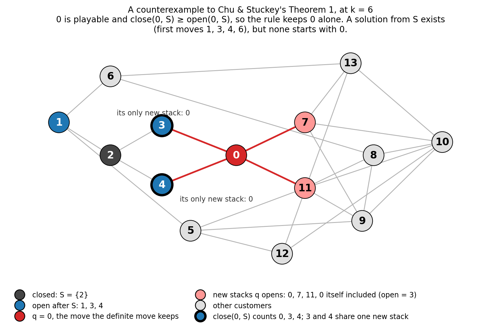

# Chu & Stuckey's (revised) algorithm

Section 4 of *The pathwidth complex* (`plan.md` §4) in paper form. It distils
the working report `search_soundness.md` (Ralph loop0006, items 05 to 13),
which holds the code references, the full check tables and the history. Every
statement here is proved in Lean unless it says otherwise. The Lean names
refer to `../lean/MOSPFormalization/Search/`, namespace
`MOSPFormalization.Search`: ten files (`Basic`, `DefiniteMove`,
`SubsetRule`, `BetterMove`, `Memo`, `Decide`, `DefiniteMatching`,
`PublishedTheorems`, `ChuThesis`, `Layout`), with no
`sorry` and no axioms beyond `propext`, `Classical.choice` and `Quot.sound`
(`axiom_check.lean`). Page numbers for Chu & Stuckey (2009) are those of the
preprint `../literature/chu_stuckey_2009.pdf`. Page numbers for Chu (2011),
Chu's PhD thesis, which restates the search in its chapter 6, are the printed
ones of `../literature/chu_2011_phd_thesis_improving_combinatorial_optimization.pdf`.

---

## 4.1 Introduction

Let $M$ be a MOSP instance and $k \ge 0$ an integer. The algorithm of this
section decides whether some sequence of the products keeps at most $k$
customer stacks open at once, that is, whether $Z(M) \le k$. By (E2) of
section 3 (Lean: `mospValue_eq_pathwidth_add_one`), $Z(M) \le k$ holds exactly
when the MOSP graph $G_M$ has pathwidth at most $k - 1$. So the algorithm is
also a decision procedure for pathwidth. Any graph $G$ is the MOSP graph of the
instance with one customer per vertex and one product per edge, each product
needed by the two ends of its edge.

The algorithm is the *customer search* of Chu & Stuckey (2009). It searches
over the orders in which the customers' stacks close, not over product
sequences, and it prunes the search with several dominance rules. Chu &
Stuckey state three of these rules as theorems (their Theorems 1, 2 and 3) and
a fourth, the subset rule, in their §2.

**Two of the published theorems are false as stated.** Theorem 1, the
*definite move*, can discard the last solution at a node. A 14-customer graph
shows it, and Lean proves the counterexample. Theorem 2, the *better move*,
rests on Theorem 1 applied one step deeper, and it inherits the fault. Its
form as the code ran it from 2026-09-26 to 2026-10-01 is still false. Chu's
thesis (Chu 2011, §6.3) restates both: its Theorem 6.3.6 is Theorem 1
verbatim, and its Theorem 6.3.8 is the better move with a different premise.
The same graph refutes both, in Lean.

**The revised algorithm** keeps the search and every rule. It replaces the
premises of Theorems 1 and 2 by a stronger, *hereditary* premise. That premise
is proved sound, and it is proved equivalent to a bipartite matching
condition, so it costs one small matching per candidate. With the two repairs,
the whole search is proved sound in Lean: a refutation at $k$ means
$Z(M) > k$ and $\mathrm{pw}(G_M) > k - 1$.

**In pathwidth language** (section 4.7) the search is a memoised
vertex-separation search. The repaired definite move is an instance of
Tamaki's commitment lemma, and the published one is that lemma with its
interior condition dropped. The subset rule, the better move and the old move
have no counterpart in the pathwidth papers we hold.

No wrong answer of the unrepaired search on a whole instance is known. The
gap is at the level of a node, and the search has always recovered through
another branch.

**The owner's decision** (2026-10-01, `plan.md`, *Decisions*), now carried
out. This paper states the gap and the repaired rule. Both solvers, the MOSP
customer search and the graph pathwidth solver, apply the repaired rules by
default since 2026-10-01 (Ralph loop0007, `solver_fix.md`), and the published
rules remain behind a flag. Of the 115 corpus values that rested on the
customer search alone, 108 have been re-refuted by the repaired solver and none
changed; the other 7 need a longer run. Section 4.4.4 states what holds for the
code, and section 4.6.3 what is left.

---

## 4.2 The search as a mathematical object

### 4.2.1 Definitions

Chu & Stuckey observe that the products matter only through the MOSP graph:
"all functions c(p) that produce the same customer graph have the same minimum
number of stacks" (PDF p. 4). So fix a finite simple graph $G = (C, E)$ whose
vertices are the customers, and an integer $k \ge 0$. For a customer $c$ and a
set $T \subseteq C$, write

- $N[c] = \{c\} \cup \{d : cd \in E\}$, the closed neighbourhood: the stacks
  that must be open when $c$'s stack closes;
- $O(T) = \bigcup_{c \in T} N[c]$, the stacks *opened* once the customers of
  $T$ have closed, with $O(\emptyset) = \emptyset$;
- $\mathrm{fin}(X) = \{c : N[c] \subseteq X\}$, the customers that could close
  at no cost once the stacks $X$ are open;
- $\mathrm{cl}(T) = \mathrm{fin}(O(T))$, the *free closure* of $T$;
- $b(T) = |O(T) \setminus T|$, the stacks open after $T$ has closed;
- $o(c, T) = N[c] \setminus O(T)$, the stacks that closing $c$ next would newly
  open, and $\mathrm{open}(c, T) = |o(c, T)|$.

Two facts are immediate: $T \subseteq \mathrm{cl}(T)$ and
$O(\mathrm{cl}(T)) = O(T)$ (Lean: `subset_cl`, `opened_cl`). The second says
that free closing opens nothing.

**Moves and costs.** A *move* at $T$ closes one customer $c \notin T$. Its cost
is the number of stacks open at that moment, counting $c$ itself:
$$\mathrm{cost}(T, c) = |O(T \cup \{c\}) \setminus T| = b(T \cup \{c\}) + 1.$$
This is Chu & Stuckey's $|O(S) - S \cup o(c, S)|$ (PDF p. 4). The move is
*playable* when $\mathrm{cost}(T, c) \le k$. A *closing order from* $T$ is an
enumeration $c_1, \dots, c_m$ of $C \setminus T$. Its cost is the largest of
its step costs $\mathrm{cost}(T \cup \{c_1, \dots, c_{i-1}\}, c_i)$, and $0$
when $m = 0$. Write $P_k(T)$ when some closing order from $T$ costs at most
$k$. (Lean: `stepCost`, `orderCost`, `Solvable`;
`stepCost_eq_openStacks_insert_add_one` for the second form of the cost.)

**States.** On entering a node, the search closes every customer whose
neighbourhood is already open. One pass suffices, because closing such a
customer opens nothing. So the search only ever stands at a *state*, a set
$S$ with $S = \mathrm{cl}(S)$. The root $\emptyset$ is a state, since every
$N[c]$ is nonempty. The *child* of a state $S$ by $c \notin S$ is
$$S \cdot c = \mathrm{cl}(S \cup \{c\}).$$

**The decision predicate.** $\mathrm{Sol}_k(S)$ holds when $S = C$, or when some
$c \notin S$ has $\mathrm{cost}(S, c) \le k$ and $\mathrm{Sol}_k(S \cdot c)$.
This is the question the search answers: "is there a run of playable moves,
each followed by its free moves, that closes everyone?" (Lean: `SearchSol`,
defined inductively and not through $P_k$, so that the link between the two is
a theorem.)

**The invariant.** Every node the search visits satisfies
$$b(S) = |O(S) \setminus S| \le k.$$
It holds at the root, where $b(\emptyset) = 0$. At a child it holds because
$b(S \cdot c) \le |O(S \cup \{c\}) \setminus (S \cup \{c\})| =
\mathrm{cost}(S, c) - 1 < k$ (Lean: `card_opened_insert_sdiff_lt`). Several
results below need it, and it is never an extra assumption about the search.

### 4.2.2 Lemma F: free moves never hurt

**Lemma 4.1 (monotonicity).** If $T \subseteq T'$ and $O(T') \subseteq O(T)$,
then $P_k(T) \Rightarrow P_k(T')$.

*Proof.* Take a closing order from $T$ of cost at most $k$ and delete the
customers of $T'$ from it. Each remaining step closes some $c$ at a prefix
$T' \cup A$ in place of $T \cup A$. Its opened set
$O(T' \cup A \cup \{c\}) \subseteq O(T \cup A \cup \{c\})$ is no larger, and the
set removed from it, $T' \cup A \supseteq T \cup A$, is no smaller. So no step
costs more. $\square$ (Lean: `solvable_mono`, via `orderCost_filter_le`.)

**Lemma 4.2 (Lemma F).** If $b(T) \le k$, then
$P_k(T) \iff \mathrm{Sol}_k(\mathrm{cl}(T))$. The direction ($\Rightarrow$)
needs no hypothesis. At the root, $P_k(\emptyset) \iff \mathrm{Sol}_k(\emptyset)$.

*Proof.* ($\Rightarrow$) By Lemma 4.1 with $T' = \mathrm{cl}(T)$, it suffices
to show $P_k(S) \Rightarrow \mathrm{Sol}_k(S)$ for a state $S$. Induct on
$|C \setminus S|$. If $S \ne C$, let $c$ be the first move of an order from
$S$ of cost at most $k$. Then $\mathrm{cost}(S, c) \le k$, the rest of the
order gives $P_k(S \cup \{c\})$, Lemma 4.1 gives $P_k(S \cdot c)$, and
induction gives $\mathrm{Sol}_k(S \cdot c)$.

($\Leftarrow$) First, $P_k(\mathrm{cl}(T)) \Rightarrow P_k(T)$ when
$b(T) \le k$. Close the customers of $\mathrm{cl}(T) \setminus T$ one at a
time. Each step at a prefix $U$ with $T \subseteq U$ costs
$|O(T) \setminus U| \le b(T) \le k$, because the customer closed lies in
$O(T)$ already. Then follow the order from $\mathrm{cl}(T)$.
Second, $\mathrm{Sol}_k(S) \Rightarrow P_k(S)$ at a state with the invariant,
by induction on $\mathrm{Sol}_k$. At a move $c$, the child $S \cdot c$
satisfies the invariant, so induction gives $P_k(S \cdot c)$. The first step
then gives $P_k(S \cup \{c\})$, because $b(S \cup \{c\}) =
\mathrm{cost}(S, c) - 1 < k$. Prepending $c$, at cost at most $k$, gives
$P_k(S)$. $\square$ (Lean: `solvable_iff_searchSol_cl`,
`searchSol_cl_of_solvable`, `solvable_of_searchSol`, `solvable_cl_iff`;
at the root, `solvable_empty_iff`.)

The hypothesis is needed. On $K_2$ with one customer closed and $k = 0$,
$\mathrm{cl}(T)$ is everything, so $\mathrm{Sol}_0(\mathrm{cl}(T))$ holds, but
closing the other customer costs one stack.

*In plain English.* Once every neighbour of a customer has an open stack, that
customer can close straight away without opening anything new. Doing so never
makes later steps dearer, and it makes some cheaper, because one fewer stack
is left open. So a search that always closes such customers first loses
nothing. The only proviso is that the stacks already open must fit within the
budget, since closing the free customers one by one costs exactly that many.

### 4.2.3 Cost is narrowness, so the search decides pathwidth

For a full closing order $\tau = c_1, \dots, c_n$ from $\emptyset$, write
$S_i = \{c_1, \dots, c_i\}$ and
$\partial X = \{v \notin X : v \text{ has a neighbour in } X\}$. The $i$-th step
costs
$$|O(S_i) \setminus S_{i-1}| = 1 + |\partial S_i|,$$
because $O(S_i) \setminus S_{i-1}$ is $c_i$ together with the customers
outside $S_i$ that have a neighbour in $S_i$. The maximum of these numbers over
$i$ is the *narrowness of the sequence* $\tau$, in the dual shack process of
Kornai & Tuza (1992), formalised as `Complex.outNarrowness`.

**Theorem 4.3 (the search decides pathwidth and MOSP).** For nonempty $C$,
$$\mathrm{Sol}_k(\emptyset) \iff \min_\tau \mathrm{cost}(\tau) \le k \iff \mathrm{pw}(G) + 1 \le k.$$
For a MOSP instance $M$ with at least one requirement, $\mathrm{Sol}_k(\emptyset)$
on $G_M$ holds iff $Z(M) \le k$.

*Proof.* The first equivalence is Lemma 4.2 at the root. For the second, read
$\tau$ backwards as a layout $L$, so that the cut after position $n - i$ of
$L$ separates $C \setminus S_i$ (left) from $S_i$ (right). The left vertices
with a right neighbour are exactly $\partial S_i$. So
$\max_{1 \le i < n} |\partial S_i|$ is the vertex separation of $L$, and the
last step ($i = n$, $\partial C = \emptyset$) costs 1. Hence
$\mathrm{cost}(\tau) = \mathrm{vs}(L) + 1$. Minimising over $\tau$ gives
$\mathrm{vs}(G) + 1 = \mathrm{pw}(G) + 1$ by (E1). The MOSP form is (E2).
$\square$ (The Lean statement counts the active suffix of $\tau$ itself, the
development's convention, so no reversal appears there.) (Lean: `orderCost_ofFn_eq_outNarrowness`,
`orderCost_ofFn_eq_vertexSepOfLayout_add_one`,
`searchSol_empty_iff_narrowness_le`,
`searchSol_empty_iff_pathwidth_add_one_le`,
`searchSol_mospGraph_iff_mospValue_le`; behind them
`Complex.narrowness_eq_pathwidth_add_one` and
`mospValue_eq_pathwidth_add_one`.)

So the only thing a refutation, $\neg\mathrm{Sol}_k(\emptyset)$, may mean is
$Z(M) > k$, equivalently $\mathrm{pw}(G_M) > k - 1$. The rest of this section
shows that the pruning rules do not change the answer.

*In plain English.* Close the customers one at a time. When a customer
closes, every neighbour must already have its stack open, so the stacks open
at that moment are the customer itself plus every not-yet-closed customer
touching the closed group. Read the closing order backwards and this is the
count that vertex separation takes at each cut. So the best closing order uses
exactly vertex separation plus one stacks, which is pathwidth plus one.

Section 4.7 restates this, and every rule below, in the vocabulary of the
pathwidth literature: open stacks are the border $|N(S_i)|$ of a layout
prefix, read forwards, and the free closure is a full set.

**A modelling remark.** The code drops customers with no product. In $G_M$
they are isolated vertices, which are free at the root and change nothing.
This is argued, not formalised.

---

## 4.3 The rules

### 4.3.0 What a rule must satisfy

At a node the search has a state $S$ with the invariant, and a set $Q$ of
*old moves* (section 4.3.5). Its *candidates* are the customers outside
$S \cup Q$. The *cost cut* keeps the playable candidates $P$, in increasing
customer index. The cost cut is exact, since an unplayable move is not a move
of $\mathrm{Sol}_k$. A *filter* then keeps a sublist $L \subseteq P$, and the
search recurses on $S \cdot c$ for $c \in L$.

**Node soundness.** Suppose $\neg\mathrm{Sol}_k(S \cdot q)$ for every
$q \in Q$. The filter is node-sound at $(S, Q)$ if $\mathrm{Sol}_k(S)$ implies
$\mathrm{Sol}_k(S \cdot c)$ for some $c \in L$ (Lean: `NodeSoundAt`;
`FilterSound` when it holds at every node with the invariant).

Each rule is justified by a *covering*: a discarded move $r$ is covered by $c$
when $\mathrm{Sol}_k(S \cdot r) \Rightarrow \mathrm{Sol}_k(S \cdot c)$. A node
is sound when every link a rule cites is a true covering and every chain of
cited links from a discarded candidate ends in $L$ or in $Q$ (Lean:
`nodeSoundAt_of_covering`, with `Covered` for the chains). The second
condition can fail even when every link is true, through a cycle. Section
4.3.4 has the example.

The rules run in the code's order: the free move on entry; the memo; the
old-move candidate set; the cost cut; then the *definite move*, the *subset
rule* and the *better move*, each once.

### 4.3.1 The free move

**Published form.** Chu & Stuckey have no separate rule. It is the
$\mathrm{open} = 0$ case of their Theorem 1.

**Precise form.** On entering a node at $T$, move to $\mathrm{cl}(T)$.

**Soundness.** Lemma 4.2. The search's predicate is defined over states, and
by Lemma 4.2 it agrees with the plain question $P_k$ at every node the search
visits.

### 4.3.2 The definite move

**Published form.** "**Theorem 1.** Suppose S ++ [q] is playable and
close(q, S) ≥ open(q, S), then if U′ = S ++ R is a solution, there exists a
solution U = S ++ [q] ++ R′" (§3.1, PDF p. 6). Here close(q, S) =
|{d | o(d, S) ⊆ o(q, S)}| (PDF p. 4). Chu (2011) restates it word for word,
with the same proof, as Theorem 6.3.6 (p. 142), with the same definition of
close (Definition 6.3.4, p. 141).

**Precise form, as coded.** At a state $S$, let $q \in P$ and let
$$\mathrm{close}(q, S) = |\{d \in C \setminus S : o(d, S) \subseteq o(q, S)\}|,$$
which counts $q$ itself and counts customers in $Q$. (Read literally, the
paper's $d$ ranges over all customers. A closed $d$ has $o(d, S) = \emptyset$
and would always be counted, so the code's reading, $d \notin S$, is the
sensible one.) If $\mathrm{open}(q, S) \le \mathrm{close}(q, S)$, the filter
keeps $L = [q]$ for the first such $q$ in index order, and nothing else runs at
the node (Lean: `closeCount`, `IsDefinite`). This was the code's rule until
2026-10-01 and is `repaired_rules=False` since; section 4.6.1 gives the rule the
code now runs.

**Claimed soundness.** $\mathrm{Sol}_k(S) \Rightarrow \mathrm{Sol}_k(S \cdot q)$.

Write $X = S \cdot q = \mathrm{cl}(S \cup \{q\})$ throughout.

**Lemma 4.4 (what the premise says).** For every $S$ and $q$,
$\mathrm{close}(q, S) = |X \setminus S|$. Hence the premise
$\mathrm{open}(q, S) \le \mathrm{close}(q, S)$ holds iff $b(X) \le b(S)$: the
child has no more open stacks than the parent.

*Proof.* For $d \notin S$: $o(d, S) \subseteq o(q, S)$ iff
$N[d] \subseteq O(S) \cup N[q] = O(S \cup \{q\})$ iff $d \in X$. For the second
claim, $O(X) = O(S) \cup N[q]$ gives
$b(X) = |O(S)| + \mathrm{open}(q, S) - |X|$, while $b(S) = |O(S)| - |S|$, and
$|X| - |S| = \mathrm{close}(q, S)$. $\square$ (Lean: `closeCount_eq`,
`isDefinite_iff`.)

**Counterexample 4.5.** Let $G$ be the graph on customers $0, \dots, 13$ with
the 26 edges
$$\begin{aligned}
&0\text{–}3,\ 0\text{–}4,\ 0\text{–}7,\ 0\text{–}11,\ 1\text{–}2,\ 1\text{–}5,\ 1\text{–}6,\ 2\text{–}3,\ 2\text{–}4,\ 5\text{–}9,\ 5\text{–}11,\ 5\text{–}12,\ 6\text{–}8,\\
&6\text{–}13,\ 7\text{–}9,\ 7\text{–}10,\ 7\text{–}13,\ 8\text{–}9,\ 8\text{–}10,\ 8\text{–}11,\ 9\text{–}10,\ 9\text{–}11,\ 10\text{–}11,\ 10\text{–}12,\ 10\text{–}13,\ 12\text{–}13,
\end{aligned}$$
and take $S = \{2\}$, $k = 6$, $q = 0$. Then:

- $S$ is a state, $O(S) = N[2] = \{1, 2, 3, 4\}$, and $b(S) = 3 \le 6$;
- $o(0, S) = \{0, 7, 11\}$, so $\mathrm{open}(0, S) = 3$, and
  $\mathrm{cost}(S, 0) = |\{0, 1, 3, 4, 7, 11\}| = 6$, so $0$ is playable;
- the customers $d \notin S$ with $o(d, S) \subseteq \{0, 7, 11\}$ are $0$,
  $3$ and $4$ (both of the latter have $o = \{0\}$), so
  $\mathrm{close}(0, S) = 3 \ge \mathrm{open}(0, S)$;
- $0$ is the first customer in index order, so the code keeps $\{0\}$ alone;
- $\mathrm{Sol}_6(S)$ holds: the order $1, 3, 4, 6, 12, 13, 0, 5, 7, 8, 9, 10, 11$
  costs at most 6;
- the child is $X = \{0, 2, 3, 4\}$, and $\mathrm{Sol}_6(X)$ fails: only seven
  sets are reachable from $X$ by moves of cost at most 6, and none of them is
  $C$.



*Figure 4.1. The graph of Counterexample 4.5 at the state where the definite
move fails. Customer 2 is closed, and 1, 3 and 4 are open. Moving 0 opens the
new stacks 0, 7 and 11, and closes 0, 3 and 4, so open = close = 3 and the rule
keeps 0 alone. But 3 and 4 have the single new stack 0 between them: closing
them first gains two stacks for the price of one, which a solution starting
with 0 cannot match. Regenerate with `python -m paper2.counterexample_figure`,
which recomputes every labelled fact from the instance (PDF beside it).*

So Theorem 1 is false, both as published and as coded. (Lean:
`definiteMove_counterexample`, `cexGraph`, `cex_solvable`, and
`cexFamily_closed` for the seven sets, checked by `decide +kernel`.) The published implication itself is refuted as a universal statement, with
the bridge from the free-closed child to $S \cup \{q\}$ inside the proof,
under the code's reading of $\mathrm{close}$ and under the literal one, which
also counts closed customers and so is a weaker premise
(`chuStuckey_theorem1_false`, `chuStuckey_theorem1_false_literal`,
`Search/PublishedTheorems.lean`). The same two theorems refute the thesis's
Theorem 6.3.6, restated under its number as `chuThesis_theorem636_false` and
`chuThesis_theorem636_false_literal` (`Search/ChuThesis.lean`). Fink (2012,
pp. 27–28) restates the rule with a stronger premise: it counts only dominated
customers of smaller index than $q$, so not $q$ itself, and needs the child to
have strictly fewer open stacks than the parent. The graph of Counterexample 4.5
does not refute it under any labelling, but adding a third twin of $3$ and $4$
gives a 15-customer graph that refutes it (Lean: `fink_theorem1_false`;
`python3 -m paper2.fink_check`).

**Why the published proof fails.** The proof moves $q$ to the front of a
solution $U' = S \mathbin{+\!\!+} [c_1, \dots, c_m, q, \dots]$ and claims that
after each prefix "we have at most open(q, S) extra stacks open, but at least
close(q, S) extra stacks closed" (PDF p. 6). Compare the two runs at a prefix
$T \supseteq S$ of $U'$ that does not yet contain $q$. Moving $q$ forward
changes the open stacks from $b(T)$ to $b(T \cup X)$, and
$$b(T \cup X) - b(T) = |N[q] \setminus O(T)| - |X \setminus T|.$$
At $T = S$ this is $\mathrm{open} - \mathrm{close} \le 0$. But the customers of
$X$ that $U'$ has *already* closed are in $T$, so they are no longer extra
stacks closed, while the stacks $q$ opens may still be new. In the example,
$U'$ may begin with $3$, after which $4$ is free and $T = \{2, 3, 4\}$. Then
$N[0] \setminus O(T) = \{7, 11\}$ and $X \setminus T = \{0\}$, so moving $0$
forward costs one more stack: $b(T) = 2$ and $b(T \cup X) = 3$. Customers $3$
and $4$ each counted once in $\mathrm{close}(0, S)$, but they share the single
new stack $0$, and a solution that closes them first gains two closed stacks
for one opened.

There is a second, independent slip. Even where the conclusion holds, the
literal sequence $S \mathbin{+\!\!+} [q, c_1, \dots]$ need not be a solution,
because a customer that $q$ makes free stays open until its turn comes. With
edges $0\text{–}3$ and $1\text{–}2$, $S = \emptyset$ and $q = 0$
($\mathrm{open} = \mathrm{close} = 2$), the order $1, 2, 0, 3$ costs 2 but
$0, 1, 2, 3$ costs 3. Closing $3$ right after $0$ fixes it. The argument needs
the free moves.

**Repair.** Call $q \notin S$ *hereditarily definite* at $S$ when
$$b(X) \le b(B) \quad \text{for every } B \text{ with } S \subseteq B \subseteq X \text{ and } q \notin B.$$
By Lemma 4.4, the code's premise is the case $B = S$. The repair asks that no
intermediate set avoiding $q$ is a better place to stand than $X$ (Lean:
`IsHereditarilyDefinite`; `IsHereditarilyDefinite.isDefinite`). In the
counterexample it fails at $B = \{2, 3, 4\}$, where $b(B) = 2 < 3 = b(X)$
(Lean: `not_isHereditarilyDefinite_cex`).

**Lemma 4.6 (open stacks are submodular).** For all $A, B \subseteq C$,
$$b(A \cup B) + b(A \cap B) \le b(A) + b(B).$$

*Proof.* Since $T \subseteq O(T)$, $b(T) = |O(T)| - |T|$. Now
$O(A \cup B) = O(A) \cup O(B)$ and $O(A \cap B) \subseteq O(A) \cap O(B)$, so
$|O(A \cup B)| + |O(A \cap B)| \le |O(A)| + |O(B)|$. Subtract
$|A \cup B| + |A \cap B| = |A| + |B|$. $\square$ (Lean:
`openStacks_submodular`, from `openStacks_add_card`.)

*In plain English.* Count the stacks opened by two groups of closed customers.
The union of the groups opens exactly what either opens, and their overlap
opens at most what both open. So the two counts on the left can only fall
short of the two on the right, and subtracting the customers themselves, who
balance exactly, keeps that.

**Theorem 4.7 (the repaired definite move is sound).** If $q \notin S$ is
hereditarily definite at $S$, then $P_k(S) \Rightarrow P_k(X)$, with no other
hypothesis. At a state with the invariant,
$\mathrm{Sol}_k(S) \Rightarrow \mathrm{Sol}_k(S \cdot q)$, so keeping only a
playable hereditarily definite $q$ is sound.

*Proof.* Take a closing order $c_1, \dots, c_m$ from $S$ of cost at most $k$,
with prefixes $T_i = S \cup \{c_1, \dots, c_i\}$, and let $c_j = q$. Build an
order from $X$ by following $c_1, \dots, c_{j-1}$ and skipping any customer
already in $X$. For $i < j$ with $c_i \notin X$, the step closes $c_i$ at
$T_{i-1} \cup X$ and costs $b(T_i \cup X) + 1$. Put $Z = T_i$. Then
$S \subseteq Z \cap X \subseteq X$ and $q \notin Z$, so the hypothesis gives
$b(X) \le b(Z \cap X)$, and Lemma 4.6 gives
$$b(Z \cup X) \le b(Z) + b(X) - b(Z \cap X) \le b(Z).$$
So the step costs at most $b(T_i) + 1 = \mathrm{cost}(T_{i-1}, c_i) \le k$.
After these steps the closed set is $T_{j-1} \cup X$. It contains $T_j$, and
since $S \subseteq T_{j-1}$ its opened set is $O(T_{j-1}) \cup N[q] = O(T_j)$.
The rest of the original order gives $P_k(T_j)$, so Lemma 4.1 gives
$P_k(T_{j-1} \cup X)$, and together $P_k(X)$.

For the search's form, the invariant and Lemma 4.2 give $P_k(S)$, hence
$P_k(X)$, hence $\mathrm{Sol}_k(\mathrm{cl}(X)) = \mathrm{Sol}_k(X)$ by Lemma 4.2
again. $\square$ (Lean: `solvable_cl_insert_of_hereditarilyDefinite`, by
`solvable_union_cl_of_hereditarilyDefinite` and `stepCost_union_cl_le`;
`searchSol_cl_insert_of_hereditarilyDefinite`.)

The hereditary premise is Tamaki's commitment condition for the jump from $S$
to $X$, and this proof is the proof of Kitsunai et al.'s (2016) Lemma 1, the
commitment lemma. Section 4.7.3 gives the details and the sources.

*In plain English.* Take any good closing order and imagine closing $q$, with
everything it makes free, before anything else. At each moment before the
order reaches $q$, compare the two situations. The hereditary condition says
that standing on the "$q$ and its free customers" side never leaves more stacks
open than standing at any point between where you started and there, provided
$q$ itself has not closed. Submodularity turns that into a step-by-step
guarantee: the order with $q$ first never has more stacks open than the
original. Once the original order closes $q$, the two have the same stacks
open and the shifted one has closed at least as much.

**Corollary.** Every $q$ with $\mathrm{open}(q, S) \le 1$ is hereditarily
definite, so the code's rule is right in those cases. For
$S \subseteq B \subseteq X$ with $q \notin B$, the stacks in $O(X)$ but not in
$O(B)$ lie in $N[q] \setminus O(S) = o(q, S)$, so there is at most one of
them. Since $O(B) \subseteq O(X)$, $b(X) - b(B) = |O(X) \setminus O(B)| -
|X \setminus B| \le 1 - 1 = 0$, because $q \in X \setminus B$. (Lean: `isHereditarilyDefinite_of_openCount_le_one`.)

**The matching form.** The repair quantifies over all sets $B$. An equivalent
form is cheap. Let $Y = X \setminus (S \cup \{q\})$, the customers the child
closes besides $q$, and for $D \subseteq Y$ let
$o(D) = \bigcup_{d \in D} o(d, S)$. Every $d \in Y$ has
$o(d, S) \subseteq o(q, S)$, so consider the bipartite graph joining each
$d \in Y$ to the stacks of $o(d, S)$.

**Theorem 4.8 (the repair is a matching condition).** For every $S$ and $q$,
$q$ is hereditarily definite at $S$ iff some set $M \subseteq Y$ with
$|M| \ge \mathrm{open}(q, S) - 1$ can be matched injectively to stacks
$f(d) \in o(d, S)$. Equivalently, the largest matching of the bipartite graph
has at least $\mathrm{open}(q, S) - 1$ edges.

*Proof.* Let $q \notin S$; if $q \in S$ then $\mathrm{open}(q, S) = 0$ and both
sides hold trivially. The sets $B$ of the repair are exactly $B = S \cup D$
with $D \subseteq Y$. Since $|O(S \cup D)| = |O(S)| + |o(D)|$ and
$|X| = |S| + 1 + |Y|$,
$$b(X) \le b(S \cup D) \iff \mathrm{open}(q, S) + |D| \le |o(D)| + |Y| + 1 \iff |D| - |o(D)| \le \delta,$$
with $\delta = |Y| + 1 - \mathrm{open}(q, S)$. (At $D = \emptyset$ this gives
$\delta \ge 0$.) By the deficiency form of Hall's theorem (Ore 1955), the
largest matching of $Y$ into the stacks has size
$|Y| - \max_{D \subseteq Y} (|D| - |o(D)|)$. So the repair holds iff that
maximum is at most $\delta$, iff the largest matching has size at least
$|Y| - \delta = \mathrm{open}(q, S) - 1$. $\square$

The Lean proof uses the textbook reduction of the deficiency form to Hall's
theorem: give every $d \in Y$ the same $\delta$ dummy stacks besides $o(d, S)$,
check Hall's condition from the deficiency inequality, apply Mathlib's
`Finset.all_card_le_biUnion_card_iff_existsInjective'`, and keep the customers
matched to real stacks, of which at most $\delta$ are lost. (Lean:
`HasDefiniteMatching`, `card_opened_union_eq`, `card_cl_insert`,
`hall_of_isHereditarilyDefinite`, `exists_matching_of_isHereditarilyDefinite`,
`isHereditarilyDefinite_of_matching`, and
`isHereditarilyDefinite_iff_hasDefiniteMatching`.)

*In plain English.* Closing $q$ opens some new stacks, and it lets some other
customers close for free, each of whom needed one or more of those new stacks.
The rule is safe exactly when you can pair all but one of the new stacks with
a different free customer who needed it. In the counterexample, closing $0$
opens three new stacks, $0$, $7$ and $11$, and frees customers $3$ and $4$.
Both of them needed only stack $0$, so only one pairing is possible where two
are required.

### 4.3.3 The subset rule

**Published form.** "if o(cᵢ, S) ⊆ o(cⱼ, S) and i < j, then clearly, we can
always play i before j rather than playing j immediately, since closing j will
close i in any case. Hence move j can be removed from the candidates R
considered for the next customer to close" (§2, PDF p. 5).

**Precise form, as coded.** Say $d$ *dominates* $r$ at $S$ when $d \ne r$,
$o(d, S) \subseteq o(r, S)$, and either the inclusion is strict or $d < r$.
The rule drops every $r \in P$ dominated by some $d \in C \setminus S$, where
$d$ ranges over all remaining customers, including those in $Q$. If every
candidate would be dropped, it keeps $P$ whole (the *fallback*). It runs only
when the definite move did not fire (Lean: `Dominates`, `IsSubsetDominated`,
`subsetFilter`).

**Claimed soundness.** $\mathrm{Sol}_k(S \cdot r) \Rightarrow \mathrm{Sol}_k(S \cdot d)$
for the dominator $d$. **Sound as coded.**

**Lemma 4.9 (the covering).** If $o(d, S) \subseteq o(r, S)$ and
$\mathrm{cost}(S, r) \le k$, then
$\mathrm{Sol}_k(S \cdot r) \Rightarrow \mathrm{Sol}_k(S \cdot d)$, for every set
$S$, with no invariant and no tie-break. Moreover $d$ is playable.

*Proof.* $N[d] \subseteq O(S) \cup o(d, S) \subseteq O(S \cup \{r\})$, so
$d \in S \cdot r$, and $O(S \cup \{d\}) \subseteq O(S \cup \{r\})$ gives
$S \cdot d \subseteq S \cdot r$ and $\mathrm{cost}(S, d) \le \mathrm{cost}(S, r)$.
If $r \in S \cdot d$, the two opened sets are equal and $S \cdot d = S \cdot r$.
Otherwise close $r$ at $S \cdot d$. It costs
$|O(S \cup \{r\}) \setminus S \cdot d| \le |O(S \cup \{r\}) \setminus S| =
\mathrm{cost}(S, r) \le k$, and it lands on
$\mathrm{fin}(O(S \cup \{r\})) = S \cdot r$. $\square$ (Lean:
`searchSol_cl_insert_of_newlyOpened_subset`, with
`mem_cl_insert_of_newlyOpened_subset`,
`cl_insert_subset_of_newlyOpened_subset`,
`cl_insert_cl_insert_of_newlyOpened_subset`,
`stepCost_le_of_newlyOpened_subset`.)

**Proposition 4.10 (node soundness).** At any state $S \ne C$, if every
$q \in Q$ has $\neg\mathrm{Sol}_k(S \cdot q)$, the subset filter is node-sound.
When a solution exists, the fallback never fires.

*Proof.* Domination is irreflexive and transitive, so it is a strict order.
Given $\mathrm{Sol}_k(S)$, some playable $r$ has $\mathrm{Sol}_k(S \cdot r)$,
and $r \notin Q$. Among the customers $m \notin S$ with
$o(m, S) \subseteq o(r, S)$, take the least by $(|o(m, S)|, m)$. Any dominator
of $m$ would come earlier in that order, so $m$ is undominated. By Lemma 4.9,
$m$ is playable and $\mathrm{Sol}_k(S \cdot m)$ holds, so $m \notin Q$. So $m$
is a candidate that survives. $\square$ (Lean: `not_dominates_self`,
`Dominates.trans`, `exists_undominated`, `subsetKept_nonempty`,
`subsetFilter_sound`.)

*In plain English.* If closing $d$ opens only stacks that closing $r$ would
open anyway, then closing $r$ makes $d$ free. So closing $d$ first, then $r$,
reaches the same place as closing $r$, never at a higher cost, and the search
may as well try $d$. Follow such domination downwards and you reach a customer
nobody dominates, which the rule keeps.

**The tie-break is necessary (Counterexample 4.11).** Without it, two
customers with equal new stacks dominate each other and both go. Take the
7-customer graph with edges $0\text{–}2$, $0\text{–}3$, $0\text{–}6$,
$1\text{–}4$, $1\text{–}6$, $3\text{–}6$, $4\text{–}5$, $4\text{–}6$, the
state $S = \{2\}$ and $k = 3$. The playable candidates are $\{0, 3, 5\}$, with
$o(0, S) = o(3, S) = \{3, 6\}$ and $o(5, S) = \{4, 5\}$. Without the tie-break
$0$ and $3$ both go, $5$ survives, so the fallback does not fire, and the
filter keeps $\{5\}$. A solution exists from $S$ ($0, 3, 1, 4, 5, 6$), but none
from $S \cdot 5 = \{2, 5\}$, where no move costs at most 3. With the tie-break,
only $3$ goes and the filter keeps $\{0, 5\}$. (Lean:
`noTieBreak_counterexample`, `tieGraph`, `WeakDominates`, `weakSubsetFilter`.)
The paper's own form, which requires $d < r$ even for a strict inclusion, is a
subrelation of the code's, uses the same covering and is acyclic by index. It
is checked, not stated in Lean.

### 4.3.4 The better move

**Published form.** "**Theorem 2.** Suppose S ++ [q] and S ++ [r, q] are
playable and close(q, S ∪ {r}) ≥ open(q, S ∪ {r}) then if U′ = S ++ [r] ++ R is
a solution there exists a solution U = S ++ [q] ++ R′" (§3.2, PDF p. 6). The
proof begins: "The conditions imply that if r is played now, q becomes a
definite move."

**Precise form, as coded** (the published premises; in the C since 2026-09-26, in
the Python since 2026-10-01, and under `repaired_rules=False` since then). The input is the
list $W$ of subset survivors, in index order. Let $X_r = O(S \cup \{r\})$. A
member $r$ is dropped if some earlier $q \in W$, among the first $L$ of $W$ if
$L > 0$, satisfies

- *(premise 3)* $|(X_r \cup N[q]) \setminus (S \cup \{r\})| \le k$, and
- *(premise 4)* $\mathrm{open}' \le \mathrm{close}'$, where
  $\mathrm{open}' = |N[q] \setminus X_r|$ and $\mathrm{close}'$ counts the
  $d \notin S \cup \{r\}$ with $\emptyset \ne N[d] \setminus X_r \subseteq N[q] \setminus X_r$.

Premise 2 is $q \in W \subseteq P$. Whether $q$ itself survives is not
consulted. (Lean: `IsBetter`, `betterCite`, `withinLimit`, `betterFilterBy`.)

**Claimed soundness.** $\mathrm{Sol}_k(S \cdot r) \Rightarrow \mathrm{Sol}_k(S \cdot q)$.

**Lemma 4.12 (the premise is Theorem 1 at the child).** Premises 3 and 4 hold
iff $\mathrm{cost}(S \cup \{r\}, q) \le k$ and the code's definite premise
holds for $q$ at the child $T = \mathrm{cl}(S \cup \{r\})$.

*Proof.* Premise 3 is $\mathrm{cost}(S \cup \{r\}, q)$ by definition. Since
$O(T) = X_r$, $\mathrm{open}' = \mathrm{open}(q, T)$. A customer
$d \notin S \cup \{r\}$ has $N[d] \setminus X_r \ne \emptyset$ exactly when
$d \notin T$, and then $N[d] \setminus X_r = o(d, T)$. So
$\mathrm{close}' = \mathrm{close}(q, T)$. $\square$ (Lean: `isBetter_iff`,
`betterOpen_eq`, `betterClose_eq`.)

So the better move is Theorem 1 at the child, followed by a swap of $q$ and
$r$. The swap is sound. The appeal to Theorem 1 is not.

**Counterexample 4.13.** Take the graph of Counterexample 4.5 at the root,
$S = \emptyset$, with $k = 6$ and $Q = \emptyset$. No playable customer meets
the definite premise, so the definite move does not fire. Customers $0$ and $2$
both survive the subset rule, $0 < 2$, and premises 3 and 4 hold for $r = 2$,
$q = 0$, so the code drops $2$ citing $0$. But $S \cdot 2 = \{2\}$ has a
solution (Counterexample 4.5), and $S \cdot 0 = \{0\}$ has none. The child
$\{2\}$ is exactly the state at which Theorem 1 wrongly moves $0$ forward.
(Lean: `betterMove_counterexample`, by an invariant family of 18 sets,
`bmFamily_closed`.) Theorem 2's published implication is refuted the same way, under both
readings of $\mathrm{close}$ (`chuStuckey_theorem2_false`,
`chuStuckey_theorem2_false_literal`). At this node the filter still keeps customer $1$, which has
a solution, so this is a *false link*, not a lost node (Lean:
`betterMove_counterexample_node`). No node where the better move loses the last
solution has been found (section 4.5).

**The thesis's form.** Chu (2011) states the better move as "**Theorem 6.3.8.**
Suppose S is some sequence, and q, r ∉ S are customers such that: S ++ [q] and
S ++ [r, q] are both k-playable, and close(q, S) ≥ open(q, S ∪ {r}). If
S ++ [r] has an extension that uses ≤ k stacks, then S ++ [q] also has an
extension that uses ≤ k stacks" (p. 143). The premise takes close at $S$, not at
$S \cup \{r\}$. The proof derives the CP premise from it
("close(q, S ∪ {r}) ≥ close(q, S) ≥ open(q, S ∪ {r}), so after r is played, q
becomes a definite move") and then appeals to Theorem 6.3.6, so it fails at the
same step. Counterexample 4.13 does not cover it, but the graph of
Counterexample 4.5 does: take $S = \{2\}$, $r = 3$, $q = 0$, $k = 6$. Then
$\mathrm{close}(0, S) = 3 \ge 2 = \mathrm{open}(0, S \cup \{3\})$, both
$S \mathbin{+\!\!+} [0]$ and $S \mathbin{+\!\!+} [3, 0]$ are playable (costs 6
and 5), $S \mathbin{+\!\!+} [3]$ extends by
$1, 4, 6, 12, 13, 0, 5, 7, 8, 9, 10, 11$, and $S \mathbin{+\!\!+} [0]$ has no
extension, which is Counterexample 4.5's child. Under the literal reading of
close the premise is weaker and the same witness serves; a second witness,
$S = \{1\}$, $r = 6$, $q = 12$, holds under the literal reading only.
(Lean: `chuThesis_theorem638_false`, `chuThesis_theorem638_false_literal`,
`chuThesis_theorem638_literal_witness`, `Search/ChuThesis.lean`; the brute
force over all $2^{14}$ sets that found the witnesses is
`python3 paper2/thesis_check.py`: 13 failing (state, $r$, $q$) triples under
the code's reading, 22 under the literal one.)

**Repair.** Cite $q$ for $r$ only if premise 3 holds and $q$ is hereditarily
definite at $\mathrm{cl}(S \cup \{r\})$ (Lean: `IsRepairedBetter`;
`IsRepairedBetter.isBetter` shows it implies the code's premise). By Theorem
4.8 this is one matching at the child.

**Theorem 4.14 (the repaired better move is sound).** If $r, q \notin S$,
$\mathrm{cost}(S, r) \le k$ and the repaired premise holds, then
$\mathrm{Sol}_k(S \cdot r) \Rightarrow \mathrm{Sol}_k(S \cdot q)$.

*Proof.* Let $T = S \cdot r$, which has the invariant because $r$ is playable.
If $q \in T$, put $T' = T$. Otherwise Theorem 4.7 at $T$ gives
$\mathrm{Sol}_k(T')$ for $T' = \mathrm{cl}(T \cup \{q\})$. Now let
$Z = S \cdot q$. Both $\mathrm{cl}(Z \cup \{r\})$ and $T'$ equal
$\mathrm{fin}(O(S) \cup N[q] \cup N[r])$. If $r \in Z$ then $Z = T'$. Otherwise
closing $r$ at $Z$ costs
$$|O(S \cup \{q, r\}) \setminus Z| \le |O(S \cup \{q, r\}) \setminus (S \cup \{q\})| = |O(S \cup \{q, r\}) \setminus (S \cup \{r\})| \le k,$$
where the middle equality exchanges $q$ and $r$, both of which are opened and
neither of which is in $S$, and the last step is premise 3. So $r$ is a
playable move from $Z$ to $T'$, and $\mathrm{Sol}_k(Z)$ follows. $\square$
(Lean: `solvable_cl_insert_of_repairedBetter`,
`searchSol_cl_insert_of_repairedBetter`, with `card_sdiff_insert_eq`.) The
implication needs $r$ playable, not $q$. Playability of $q$ is what makes $q$ a
child of the search.

*In plain English.* The better move says: "if closing $r$ now would make $q$ a
safe next move, then closing $q$ first and $r$ second is at least as good as
closing $r$ first." The swap at the end is fine, because both orders end in the
same place and neither step overflows. What fails is "would make $q$ a safe
next move", which was Theorem 1. With the repaired test there, the argument
goes through unchanged.

**Two earlier faults, now proved.** The 2026-09-26 fix corrected two bugs in
this rule, both caught by testing (`../reports/better_move_bug.md` §7). Lean
now proves a counterexample to each.

- *Bug A, the close count.* Counting also the customers that $r$ finishes on
  its own makes the rule's own conclusion false, on a 12-customer graph at
  $k = 4$ (Lean: `IsBetterOld`, `bugA_counterexample`, `bugAGraph`).
- *Bug B, the order of the rules.* Running the better move before the subset
  rule lets the subset rule cite a customer the better move has already
  dropped. On an 8-customer graph at $S = \{2\}$, $k = 4$, the better move drops
  $3$ citing $0$ and the subset rule drops $0$ citing $3$. Every premise is the
  corrected one and true, and the node is lost through the cycle (Lean:
  `oldOrderFilter`, `bugB_counterexample`, `bugBGraph`).

### 4.3.5 The old move

**Published form.** "**Theorem 3.** Let S = [s₁, s₂, …, sₙ]. Suppose that
S′ = [s₁, s₂, .., sₘ, q, sₘ₊₁, …, sₙ] is playable, then if U′ = S ++ [q] ++ R is
a solution then U = S′ ++ R is a solution" (§3.3, PDF p. 7), with the rule
"if it is found that at some ancestor node, the q branch has been searched and
U is playable, then q can immediately be pruned".

**Precise form, as coded.** A node carries a set $Q$ of old moves, empty at the
root. When a candidate's subtree returns *false* without aborting, the
candidate joins the node's list `seen`. A later sibling $c'$ passes to its child
those $q \in$ `seen` with
$$\mathrm{cost}(S \cup \{q\}, c') = |(O(S) \cup N[q] \cup N[c']) \setminus (S \cup \{q\})| \le k,$$
which is the test that the step $c'$ stays playable with $q$ reinserted before
it. Old moves are removed from the candidates (Lean: `Inherits`, `pathEnd`).

**Claimed soundness.** Every $q \in Q$ at a node has
$\neg\mathrm{Sol}_k(S \cdot q)$. **Sound as coded.**

**Lemma 4.15 (reinsertion).** If $\mathrm{cost}(S \cup \{q\}, c) \le k$, then
$\mathrm{Sol}_k(\mathrm{cl}(\{q\} \cup S \cdot c)) \Rightarrow \mathrm{Sol}_k(S \cdot q)$,
for every set $S$, with no invariant. Iterated along a path whose every move
passes the test: if the $q$ branch at an ancestor has no solution, neither has
$q$ at the end of the path.

*Proof.* Both $\mathrm{cl}(\{q\} \cup S \cdot c)$ and
$\mathrm{cl}(\{c\} \cup S \cdot q)$ equal $\mathrm{fin}(O(S) \cup N[q] \cup N[c])$.
If $c \in S \cdot q$, then the second is $S \cdot q$ itself. Otherwise $c$ is a
move at $S \cdot q$ of cost
$|O(S \cup \{q, c\}) \setminus S \cdot q| \le |O(S \cup \{q, c\}) \setminus (S \cup \{q\})| \le k$,
because $S \cup \{q\} \subseteq S \cdot q$. Induction on the path gives the
second statement. $\square$ (Lean: `searchSol_reinsert`,
`cl_insert_cl_insert_comm`, `stepCost_cl_le`, `searchSol_reinsert_path`,
`not_searchSol_of_oldMove`.)

**The test is necessary.** On the path $4\text{–}0\text{–}2\text{–}1\text{–}3$
with $S = \emptyset$, $q = 2$, $c = 3$ and $k = 2$, the move $c$ is playable but
$\mathrm{cost}(\{2\}, 3) = 3$. Here
$\mathrm{Sol}_2(\mathrm{cl}(\{2\} \cup \mathrm{cl}\{3\})) = \mathrm{Sol}_2(\{1, 2, 3\})$
holds and $\mathrm{Sol}_2(\{2\})$ does not. This is the smallest such graph,
by exhaustion to 5 vertices (Lean: `reinsert_needs_test`). Chu & Stuckey make
the same point: the condition "is in fact crucial" (PDF p. 7).

*In plain English.* Suppose that at some earlier node the search tried closing
$q$ and found no way to finish. Since then it has closed some other customers.
If, at every one of those steps, closing $q$ first would still have kept the
step within budget, then "close $q$ now" leads to a place the search could also
have reached from the earlier attempt. That attempt failed, so this one fails
too, and $q$ can be skipped.

The paper's "synergy" (adding $r$ to $Q$ when an old move is better than $r$)
is implemented in neither the C nor the Python and is not covered.

### 4.3.6 The memo

**Published form.** Nogood recording: "if it failed, we record the nogood and
return false when we revisit it" (PDF p. 4).

**Precise form, as coded.** When a node's loop finishes with no child answering
*true* and without an abort, its closed set $S$ is recorded. At any later node
with the same closed set the search answers *false* at once. The memo may
store fewer entries (a limit, a load factor), which only stores less.

**Claimed soundness.** A recorded $S$ has $\neg\mathrm{Sol}_k(S)$.

**Lemma 4.16 (the key).** If $b(T) \le k$, $b(T') \le k$ and
$\mathrm{cl}(T) = \mathrm{cl}(T')$, then $P_k(T) \iff P_k(T')$. So a state
refuted once is refuted whatever path reached it.

*Proof.* Lemma 4.2 at both sides. $\square$ (Lean: `solvable_iff_of_cl_eq`.)

The memo is sound once every recorded entry is a genuine refutation. With old
move on, that is not a property of the node alone, and it is proved for the
whole run in section 4.4.2.

---

## 4.4 The composition and the theorem

### 4.4.1 The filter

The filter runs in the order

$$\text{definite move} \;\to\; \text{subset rule} \;\to\; \text{better move},$$

each once, and each cites only customers still standing or in $Q$. If the
definite move fires, $L = [q]$. Otherwise the subset rule runs over $P$ with
dominators from all of $C \setminus S$, while nothing has yet been discarded.
The better move then runs over the subset survivors and cites only an earlier
survivor (Lean: `fullFilter`; `codeFullFilter` with the code's premises,
`repairedFullFilter` with both repairs).

**Proposition 4.17 (the repaired filter is node-sound).** At every state with
the invariant, for every limit $L$ and every set $Q$ of refuted old moves,
$\text{definite} \to \text{subset} \to \text{better}$ with both repairs is
node-sound.

*Proof.* If the definite move fires on a playable hereditarily definite $q$,
Theorem 4.7 gives $\mathrm{Sol}_k(S \cdot q)$. Otherwise Proposition 4.10 gives
a subset survivor with a solution. Let $w$ be the earliest such survivor in
index order. If the better move dropped $w$, it cited an earlier survivor $q$
under the repaired premise, and Theorem 4.14 gives $\mathrm{Sol}_k(S \cdot q)$,
which contradicts the choice of $w$. So $w \in L$. $\square$ (Lean:
`betterFilterBy_sound`, `fullFilter_sound`, `repairedFilter_sound`,
`repairedFullFilter_sound`.)

The argument needs no chain of citations and does not use $L$. Bug B shows
that the order matters. With the better move first, a subset link can point
backwards at a customer already discarded, and every premise can be true while
the chain cycles.

*In plain English.* If the safe-move test fires, the one move it keeps is
proved safe. If it does not, the subset rule always keeps some move that still
leads to a solution. Among the moves that do, look at the first one. The better
move can only throw it out by pointing at an even earlier move that it proves
at least as good, and there is none. So something that still works always
survives.

### 4.4.2 Runs, the memo and old move together

A run of the search is described by a big-step semantics of its *false*
answers (Lean: `Exec`). A node intersects $Q$ with its remaining customers,
enumerates the filter's output in any order, runs each child with any subset of
the old moves that pass the reinsertion test, adds each refuted child to
`seen`, and records its state in the memo or not. A memo hit answers *false*.
An aborted run produces no `Exec` at all, which matches the code: an abort
answers *unknown* and records nothing. So the child order, the memo policy and
old move on or off are all covered.

**Theorem 4.18 (runs are sound).** Let the filter be node-sound and return only
playable customers. Suppose that at the start of a run the invariant holds at
$S$, every memo entry is a genuine refutation, and every $q \in Q \setminus S$
has $\neg\mathrm{Sol}_k(S \cdot q)$. Then the run leaves only genuine memo
entries, and if it answers *false* then $\neg\mathrm{Sol}_k(S)$.

*Proof.* Induct on the run, which follows the order in which subtrees complete.
Each entry of `seen` at a node is either a sibling subtree that has already
completed with *false*, refuted by the induction hypothesis, or one of the
node's own old moves, refuted by hypothesis. Each old move a child inherits
passed the test, so Lemma 4.15 makes it genuinely refuted at the child. When a
node's loop has refuted every member of the filter's output, node soundness
gives $\neg\mathrm{Sol}_k(S)$, so recording $S$ is correct. A memo hit is
correct by the hypothesis on the memo. $\square$ (Lean: `Exec.sound`,
`exec_root_sound`; `exec_repairedFullFilter_sound` with
`repairedFullFilter_filterSound` and `repairedFullFilter_playable`.)

**Why one implementation refused the combination.** The Python reference drops
the memo under old move, on the ground that a failure reached with old-move
pruning depends on the branches an ancestor searched. What is true in this is
local: a node's run *taken on its own*, with an old move that is not refuted,
can refute a solvable state and record it. One isolated customer with $k = 1$
and the old move $Q = \{0\}$ is enough (Lean: `exec_fake_oldMove`). But the
hypothesis of Theorem 4.18 holds in every real run, because every old move is a
refutation completed earlier in the same run. So the combination is sound,
which is what the C has always run and what every production refutation used.
What is lost is that a memo entry cannot be checked without re-deriving the
cited subtree's $Q$, which is why the certificate checker declines that
configuration.

### 4.4.3 The theorem

**Theorem 4.19 (the revised search is sound).** Run the customer search with
free moves, the memo, old move and the filter
$\text{definite} \to \text{subset} \to \text{better}$, with the definite move
firing only on a hereditarily definite customer and the better move citing only
under the repaired premise, with any limit $L$, any child order and any memo
policy. If the run refutes $k$ from the root, then:

| conclusion | Lean |
|---|---|
| no closing order costs at most $k$, $\neg P_k(\emptyset)$ | `exec_repairedFullFilter_sound` |
| $k < \nu(G)$, the narrowness | `exec_repairedFullFilter_narrowness` |
| $\mathrm{pw}(G) > k - 1$, for nonempty $C$ | `exec_repairedFullFilter_pathwidth` |
| on the MOSP graph of an instance $M$ with a requirement, $Z(M) > k$ | `exec_repairedFullFilter_mospValue` |
| the same in pathwidth form, $\mathrm{pw}(G_M) > k - 1$ | `exec_repairedFullFilter_mospGraph_pathwidth` |

*Proof.* Proposition 4.17 makes the filter node-sound, and it returns only
playable customers. At the root the invariant holds, the memo is empty and
$Q = \emptyset$, so Theorem 4.18 gives $\neg\mathrm{Sol}_k(\emptyset)$. Lemma 4.2
at the root turns this into $\neg P_k(\emptyset)$, and Theorem 4.3 turns it into
$\mathrm{pw}(G) + 1 > k$ and, on $G_M$, $Z(M) > k$. $\square$

*In plain English.* Each rule throws away only moves that some kept move is
proved to be at least as good as. The memo and the old-move list only ever
remember failures that really happened earlier in the same search. So when the
search says "no", every way of finishing was either tried or provably no better
than one that was tried, and no closing order fits in $k$ stacks. By the
earlier sections, that means the instance needs more than $k$ stacks and its
graph has pathwidth at least $k$.

### 4.4.4 What holds for the code

**The code runs the revised search.** Since 2026-10-01 (Ralph loop0007, items
01 to 03) the repaired rules are the default in both solvers: in
`satisfiability.customer_search.decide` and `satisfiability.native.decide_native`
for MOSP, and in `pathwidth.search.decide` and `pathwidth.native.decide_native`
for graphs, each with the flag `repaired_rules=True`. Every caller that does not
name the flag runs them, including `solve_mosp_exact`, `benchmarks.csearch`,
`benchmarks.recertify` and `pathwidth.compute_pathwidth`. The definite move
fires on the first playable $q$ in index order that passes the published test
$\mathrm{close} \ge \mathrm{open}$ and then the matching test of Theorem 4.8. A
$q$ that fails the matching is passed over, and a later candidate may fire, so
the pick is `repairedFullFilter`'s. The better move cites $q$ for $r$ only under
premises 3 and 4 and the same matching at $\mathrm{cl}(S \cup \{r\})$, which is
`IsRepairedBetter`. The free moves, the subset rule with its index tie-break,
the order $	ext{definite} 	o 	ext{subset} 	o 	ext{better}$, the old move
with its reinsertion test and the memo are unchanged, and they are the ones
proved sound as coded. So a refutation by the code is a refutation by the
search of Theorem 4.19, and gives $Z(M) > k$ and $\mathrm{pw}(G_M) > k - 1$,
as far as the code is that search.

**That the code is that search is checked, not proved.** Lean models the
rules; the C and the Python are read against the model and checked against it
by brute force (`solver_fix.md`, items 01 to 05):

| check | scope | result |
|---|---|---|
| production filter against a transcription of the Lean `repairedFullFilter` | 16,244,090 node checks, graphs on 1–17 vertices, exhaustive to 6 | equal everywhere |
| the matching against the hereditary premise | 36,939,226 candidates | equal everywhere |
| C against Python, MOSP, both settings | 1,557,980 calls, 1,529 instances at up to 125 customers | equal in answer, nodes and witness |
| eight implementations of the graph solver (Python, the multiword C at 2–16 words, the single-word C, MOSP's Python and C) | 12,582,320 calls, 1,319 graphs at 4–992 vertices | equal |
| the whole revised search written from the theorems with the oracle's predicates, against the C, the Python and the oracle | 17,431,232 runs, 52,592 graphs at 1–17 vertices, all 64 configurations | zero answer failures, zero node losses in 51,454,712 nodes, C and Python equal node for node |
| differential harness (relabellings, re-coverings, both configurations, $\mathrm{opt} - 1$ and $\mathrm{opt}$) | every certified instance at 9–75 customers, 1,786,824 calls | zero disagreements |

The matching is Kuhn's augmenting paths, over at most 128 stacks in the
single-word C and $64 \cdot 	ext{WORDS}$ in the multiword C. Three things still
run the published rules: the flag `repaired_rules=False`, kept for comparison;
the C entry points kept for old processes (`cs_decide_variant`, `cs_decide_fan`,
`cs_decide`); and the certificate emitter (`learning/search_certificate.py`),
which does not yet model the repairs. What the published rules give is the rest
of this section.

**The published rules, as the code ran them until 2026-10-01.** They use the
unrepaired premises: $\mathrm{close} \ge \mathrm{open}$ for the definite move,
and premises 3 and 4 for the better move. This filter is **not** node-sound. On
the graph of Counterexample 4.5 at $k = 6$, for every $L$, it keeps only $0$ at
the state $\{2\}$, which has a solution, while $\mathrm{cl}(\{0, 2\})$ has none
(Lean: `codeFullFilter_cex`). Against the named property `CodeFilterSound` (the
code's filter is node-sound at every state of one instance at one $k$), this is
`not_codeFilterSound_cexGraph`.

What holds for them is conditional, and the condition is named rather than
assumed.

- **The gap, named.** `CodeRunSound` says that the code's run expands only
  nodes at which its filter keeps a solution whenever one exists. It is a
  hypothesis, not a theorem. Under it, a code refutation is genuine and gives
  $Z(M) > k$ (Lean: `ExecOn`, `ExecOn.sound`, `codeExec_sound_of_runSound`,
  `codeExec_pathwidth_of_runSound`, `codeExec_mospValue_of_runSound`).
- **A checkable condition at one node.** `CodeNodeRepaired` holds at a node
  when, if the definite move fires, its pick is hereditarily definite, and, if
  it does not fire, every customer the better move drops has *some* earlier
  cited survivor meeting the repaired premise. It implies node soundness
  (Lean: `nodeSoundAt_codeFullFilter_of_repaired`). A run of the code whose
  every expanded node passes it is sound and gives $Z(M) > k$ (Lean:
  `codeExec_sound_of_repaired`, `codeExec_mospValue_of_repaired`). This is what
  a certificate would have to carry to certify a refutation by the unrepaired
  code.

**Why a false refutation is hard to produce.** Every node the search expands is
reached from the root by playable moves. If the root has no solution, no
expanded node has one, and every expanded node is node-sound for free. So a
false refutation needs a $k$ at which a solution exists, together with a lost
node on every branch that leads to a solution.

**Lost nodes do occur in real runs.** In the check of section 4.5, a run under
the published rules reaches a node where its filter loses the last solution in 58 of
570,206 runs. All 58 are on graphs built around the definite-move
counterexample (29 graphs, each at two values of $L$), all at
$k = \mathrm{opt}$ and never at $\mathrm{opt} - 1$, as the previous paragraph
requires. The smallest has 14 customers. Every one of the 58 runs found a
solution through another branch and answered correctly. In 26 of them the lost
subtree joined `seen` and passed a non-refuted old move to its siblings, at 83
nodes in all, which is the cascade Theorem 4.18's hypothesis excludes. It did
not change an answer. Over the same runs, `CodeNodeRepaired` held at
1,781,000 of 1,782,100 expanded nodes and failed at 1,100, most of which still
kept a solution.

**The refutations made under the published rules, audited** (`solver_fix.md`,
items 06 and 07). Of the 6,374 certified values in the corpus, 115 (113
distinct graphs, 40–125 customers, all Chu & Stuckey `Random` instances plus SP3
and SP4) had no evidence for the refutation of $\text{value} - 1$ outside the
customer search under the published rules. A C audit mode re-runs those
searches as they were run and evaluates `CodeNodeRepaired` at every expanded
node, without changing the search. Of the 103 that finish in 1,200 s, **33
pass at every node**, so they are sound as run, by
`codeExec_mospValue_of_repaired`, independently of the repaired code. **70 do
not**: they fail at 0.11% of their nodes, mostly at the definite move and, in
all 8 runs with Theorem 2, at the better move too. A failing node is one where
the repaired premise does not hold, not one where a solution was lost. All 70
are re-refuted by the repaired solver. So for most of these values the
evidence is the repaired refutation, not the old one.

**The certificate checker.** The search certificate
(`learning/search_certificate.py`) checks each pruning step against a premise.
For the free moves, the memo, the subset rule, the covering condition and the
old moves, the premise it checks is the one the Lean lemma needs. For the
definite and better steps it checks the published premises, which
Counterexamples 4.5 and 4.13 show can certify a false link, and its emitter
models only the published rules. A certificate whose definite and better steps
meet the repaired premises proves $Z(M) > k$ with no trust in the search, by
`nodeSoundAt_of_covering` at each node, then `ExecOn.sound`, then Theorem 4.19's
chain. Item 07 of `solver_fix.md` does this check outside the checker: it walks
58 emitted certificates of old refutations with its own matching and finds 32
that meet the repaired premises at every node. That the checker's Python
computes the quantities named is a reading of the code, backed by tests, and not
proved.

**Open.** Whether the published rules ever answer *unsat* wrongly on a whole
instance. None is known. None of the 115 values above changed when re-refuted.
The only open question about the solvers as they now run is the reading that
the code is the search of Theorem 4.19, which the checks above support and do
not prove.

---

## 4.5 The evidence

Every statement above was checked by brute force before it was proved.
`paper2/search_check.py` implements the model and the rules from the written
statements, sharing no code with the solver, and compares them with an exact
oracle for $\mathrm{Sol}_k$ computed over all states. The first check (item 06)
covered every labelled graph on 1 to 6 vertices (33,867 graphs), every graph on
7 vertices under the identity and 24 random labellings (26,100), 6,000 random
graphs on 8 to 16 vertices, and three pinned instances, at every $k$. For the
rules as coded it found zero failures of node soundness, of cited links, of the
covering condition and of whole-search answers, over 111,288,536, 90,915,044
and 355,181,036 node checks in the three families. It also confirmed that both
pre-fix forms of the better move fail: Bug A's conclusion first fails at 12
vertices, and Bug B first loses a node at 8. The same runs went through the C
solver, and **the port matched the C in answer and node count on all 4,418,084
runs**, including the faulty variants. That is what shows the rules of section
4.3 are the rules the C runs.

That check did not see Theorem 1's fault. The smallest graph on which the
definite move loses the last solution has 14 customers. There is none on any
graph to 9 vertices (exhaustive) and none on the 88,802 connected graphs on 10
vertices with at most 14 edges. The counterexample was found by a hunt in a
"gadget" family built from the failed proof, and minimised by deletion to 14
customers and 26 edges, never fewer. Under the repair and its matching form the
hunt found zero losses in 2.05 G premise checks. A port of the search with the
code's definite move gave no false refutation at the optimum on 600,000 random
graphs at 10 to 18 vertices and 90,000 gadget graphs at 12 to 17. The final
check (item 12) ran 570,206 searches with memo and old move: the repaired
search agreed with the oracle on every one, and the code gave zero wrong
answers. Each later item has its own check table in `search_soundness.md`
§4.1.4 to §5.4, all with zero failures for the proved statements.

---

## 4.6 What changes in practice

### 4.6.1 The revised algorithm

The search is unchanged except for two tests. Below, $\mathrm{MaxMatch}(S, q)$
is the size of a largest matching between the customers
$Y = \mathrm{cl}(S \cup \{q\}) \setminus (S \cup \{q\})$ and the stacks
$o(q, S)$, joining $d$ to the stacks of $o(d, S)$.

```
filter(S, Q):                                   # S a state, Q the old moves
  P := [c not in S ∪ Q : cost(S, c) ≤ k], in index order
  for q in P:                                   # definite move
    if open(q, S) ≤ close(q, S)                 #   the published test
       and MaxMatch(S, q) ≥ open(q, S) − 1:     #   the repair (Theorem 4.8)
      return [q]
  W := [r in P : no d in C∖S dominates r]       # subset rule, index tie-break
  if W is empty: W := P                         #   fallback
  kept := []
  for r in W, in index order:                   # better move
    T := cl(S ∪ {r})
    drop := exists an earlier q in W (among the first L if L > 0) with
              |(O(T) ∪ N[q]) ∖ (S ∪ {r})| ≤ k   #   premise 3
              and open(q, T) ≤ close(q, T)      #   premise 4, Theorem 2's test
              and MaxMatch(T, q) ≥ open(q, T) − 1   # the repair at the child
    if not drop: append r to kept
  return kept
```

The free moves, the memo, the old moves with their reinsertion test, the cost
cut and the child order are as before. Keeping the published test in front of
the matching is only a shortcut, since the repair implies it.

This is what both solvers run by default since 2026-10-01 (section 4.4.4). In
the code, `MaxMatch(S, q) ≥ open(q, S) − 1` is `_has_definite_matching` in
`satisfiability/customer_search.py` and `has_definite_matching` in
`customer_search.c` and its two counterparts in `pathwidth_solver/pathwidth/`
(`closing_search.c`, a byte copy, and the multiword `closing_search_w.c`). All
stop at `open − 1` edges and return at once when `open ≤ 1`. In the code the better
move's freed set at the child is the customers $d \ne q$ outside
$S \cup \{r\}$ with $\emptyset \ne N[d] \setminus O(S \cup \{r\}) \subseteq
N[q] \setminus O(S \cup \{r\})$. `repaired_rules=False` gives the published
filter.

### 4.6.2 Its cost

The repair adds one bipartite matching per candidate that passes the published
test, and nothing for the others. The matching is small: it joins at most
$\mathrm{close} - 1$ customers to $\mathrm{open}$ stacks, and it can stop as
soon as it has $\mathrm{open} - 1$ edges. Every candidate with
$\mathrm{open} \le 1$ passes at once (Corollary to Theorem 4.7). In the better
move the same matching is computed at the child $\mathrm{cl}(S \cup \{r\})$,
once per pair $(r, q)$ that passes premises 3 and 4. By Theorem 4.8 the test is
exact: where it fails, the repaired premise fails, and a solution may avoid
$q$. So no sound pruning that the repaired theorems allow is given up.

Measured in paired runs, the same decision under both rule sets in one worker
(`solver_fix.md`, items 04 and 08). Nodes are totals over the pairs that
finished under both settings; a censored pair says nothing about cost.

| where | size | pairs finished | nodes, repaired / published |
|---|---|---|---|
| MOSP corpus, refuting $\mathrm{opt} - 1$ | 9–40 customers | 6,135 of 6,135 (two configurations) | 1.00003, 1.00004 |
| Chu & Stuckey classes | 50–100 customers | 118 of 125 | 1.0030 (worst class `100-50-4`, 1.010; worst pair 1.013) |
| Chu & Stuckey classes, to $2 \times 10^8$ nodes | 125 × 125 | 11 of 23 | 0.9999 |
| graph pathwidth, whole descents | 22 to over 1,000 vertices | 731 of 880 graphs | 1.020 |
| graph benchmarks rerun at the first sweep's caps, graphs refuted by both runs | up to 957 vertices | 8,456 | 1.003–1.017 per set; median pair 1.000, worst 1.64 |

Per node, measured quietly on six hard instances at 75–125 customers, the
repaired rules cost about 2% in the MOSP C (from −0.1% to +5.8%). In the graph
solver's descents, measured under load, they cost about 6%. The published test
passes and the matching then fails on 0.07–0.27% of definite-move candidates
(the rate rises with size: 0.07–0.11% at 9–40 customers, 0.13% at 50–100,
0.27% at 125 × 125 to the node cap) and on 0.02–0.06% of better-move pairs. The definite move
stops firing at a node on 0.007–0.08% of filter calls; elsewhere a later
candidate fires instead. No answer differed between the two settings in any of
these runs, and every width the graph benchmarks had proved was proved again.

Not measured: the tree size of the longest refutations (`Random-100-100-2` and
the 125 × 125 instances at densities 2 and 4) under the published rules, which
were censored on both sides. There the per-node cost and the counter rates are
the evidence.

### 4.6.3 What was redone, and what is left

- **The solvers: done** (2026-10-01). The definite move and the better move
  are repaired in the C customer search, in its Python reference (which also
  gained the better move, until then C-only) and in the graph pathwidth solver
  (`../pathwidth_solver/`), as the owner decided. The repaired rules are the
  default in both. Section 4.4.4 lists the checks.
- **Re-certification: 108 of 115 done, 7 left.** Values certified by the
  subset-lattice oracle, by a checked DRAT refutation through the SAT path, by
  the SAT binary search before the customer search existed, or by a lower bound
  equal to the value, do not depend on the search and stand as they are (6,259
  of the 6,374 certified values). The other 115 rested on the customer search
  under the published rules. The repaired solver re-refutes $\text{value} - 1$
  on 108 of them (106 of 113 distinct graphs; every one at 40–100 customers and
  16 of 23 at 125 × 125), in $9.73 \times 10^{10}$ nodes. **No value changed.**
  The 7 left are 125 × 125 instances at densities 2 and 4
  (`Random-125-125-2-{1,4,5}_0`, `Random-125-125-4-{1,2,4,5}_0`), censored
  after 10.1 hours each at $5.0$–$6.9 \times 10^{10}$ nodes and priced at 13 to
  153 core-hours each, which is probably low. They keep their values as
  verified upper bounds. For them the refutation of $\text{value} - 1$ under
  the repaired rules is still to be made, and none of the old runs passes the
  audit of section 4.4.4. A resumable runner continues them
  (`solver_fix.md`, item 07, "Needs a long run").
- **The certificate route: left.** The certificate checker's definite and
  better steps must check the repaired premises, and the emitter must model the
  repaired rules: one matching per step. With that change, an accepted
  certificate proves $Z(M) > k$ by Theorem 4.19's chain without trusting the
  search, which is the route this paper's dataset relies on for values the SAT
  path cannot reach. Item 07's walk is a first form of the check, run outside
  the checker.
- **A faster route for the 7, proposed and not built.** The repaired filter is
  node-sound at the root, and by Theorem 4.18 each root child can be refuted in
  its own process from its own state with no old moves and an empty memo. That
  spreads one refutation over many cores. It needs a C entry point that starts
  from a given state, and a short Lean statement of the composition.

---

## 4.7 The search in pathwidth language

Sections 4.2 to 4.6 speak of customers, stacks and closing orders. This section
says the same things about vertex layouts, for a reader who knows the exact
pathwidth literature. It shows that the customer search is an exact
vertex-separation search, that its rules are statements about the borders of
layout prefixes, and that the repaired definite move is an instance of a known
theorem, Tamaki's commitment lemma. It also says which rules have a published
counterpart in that literature and which do not. Chu & Stuckey place MOSP among
"graph path-width and gate matrix layout", citing Linhares & Yanasse (2002) for
twelve equivalent problems (PDF p. 1). They do not use pathwidth in the search.

The Lean statements of this section are in `../lean/MOSPFormalization/Search/Layout.lean`.
They are proved with no `sorry`, and on the axioms `propext`, `Classical.choice`
and `Quot.sound` only (`axiom_check.lean`). Everything else is cited to the
results of sections 4.2 to 4.4.

**Sources**, all held in `../literature/` and read for this section, with printed
page numbers:

- Coudert, Mazauric & Nisse (SEA 2014, LNCS 8504, pp. 46–58,
  `coudert_mazauric_nisse_2014_branch_and_bound_pathwidth_sea.pdf`) and its
  journal version (ACM JEA 21, 2016, HAL preprint,
  `2016-Coudert-Mazauric-Nisse-Branch-and-Bound-Pathwidth-Directed-Pathwidth-JEA.pdf`);
- Kobayashi, Komuro & Tamaki (SEA 2014, LNCS 8504, pp. 388–399,
  `kobayashi_komuro_tamaki_2014_commitments_pathwidth_sea.pdf`);
- Kitsunai, Kobayashi, Komuro, Tamaki & Tano (*Algorithmica* 75, 2016,
  pp. 138–157, `2016-Kitsunai-...-Algorithmica.pdf`), which restates Tamaki's
  commitments (WG 2011, not held) with proofs;
- Suchan & Villanger (IWPEC 2009, LNCS 5917, pp. 324–335,
  `2009-Suchan-Villanger-Computing-Pathwidth-Faster-Than-2n-IWPEC.pdf`);
- Bodlaender, Fomin, Koster, Kratsch & Thilikos (*Theory Comput. Syst.* 50,
  2012, pp. 420–432, `2012-Bodlaender-...-Vertex-Ordering-TOCS.pdf`).

### 4.7.1 The dictionary

Let $G = (V, E)$ be a graph. For $T \subseteq V$, write
$N(T) = \{v \notin T : v \text{ has a neighbour in } T\}$ for the *border* of
$T$, $N[T] = T \cup N(T)$, and $d(T) = |N(T)|$. This is the notation of
Kobayashi, Komuro & Tamaki (p. 390). A *vertex sequence* $\sigma = v_1, \dots, v_n$
is *$w$-feasible* when every prefix has $d \le w$, and the vertex separation
number $\mathrm{vs}(G)$ is the least $w$ for which some permutation of $V$ is
$w$-feasible (Kobayashi et al., p. 391; Kitsunai et al., p. 141). Coudert,
Mazauric & Nisse use the same quantity, $\nu(L, i) = |N^+(\{v_1, \dots, v_i\})|$
(SEA, pp. 48–49). Kinnersley's form, which Bodlaender et al. use (p. 428),
counts the vertices *inside* a prefix with a neighbour outside, which is the
same number for the reversed sequence. That reversal is the one in the proof
of Theorem 4.3.

Read a MOSP instance through its graph $G_M$, or read any graph as the MOSP
instance with one product per edge (section 4.1). Then:

| customer search | layout | Lean (`Search/`) |
|---|---|---|
| customer | vertex | — |
| closing order from $\emptyset$ | vertex sequence, read forwards | `orderOfLayout` |
| closed set $T$ | vertex set of a prefix | — |
| opened stacks $O(T)$ | $N[T] = T \cup N(T)$ | `opened_eq_union_boundary` |
| open stacks $b(T) = \lvert O(T) \setminus T \rvert$ | border size $d(T)$ | `openStacks_eq_card_boundary` |
| $\mathrm{cost}(T, c)$ | $d(T \cup \{c\}) + 1$ | `stepCost_eq_card_boundary_add_one` |
| $c$ playable at budget $k$ | $T \cup \{c\}$ is a $(k-1)$-feasible step | — |
| $P_k(T)$ | $T$ extends to a permutation whose prefixes containing $T$ all have $d \le k - 1$ | `Solvable` |
| $\mathrm{Sol}_k(\emptyset)$ | $\mathrm{vs}(G) \le k - 1$, that is $\mathrm{pw}(G) \le k - 1$ | `searchSol_empty_iff_pathwidth_add_one_le` |
| free closure $\mathrm{cl}(T)$ | the *full set* of $T$ | `mem_cl_iff` |
| state ($S = \mathrm{cl}(S)$) | full set | — |
| new stacks $o(c, S)$ | $N[c] \setminus N[S]$ | `newlyOpened` |
| $\mathrm{close}(q, S)$ | $\lvert \mathrm{cl}(S \cup \{q\}) \setminus S \rvert$ | `closeCount_eq` |
| memo | failure table | — |

**Lemma 4.20 (the dictionary).** For every $T \subseteq V$ and $c \notin T$:
$O(T) \setminus T = N(T)$, so $b(T) = d(T)$;
$\mathrm{cost}(T, c) = d(T \cup \{c\}) + 1$; and
$v \in \mathrm{cl}(T)$ iff $v \in N[T]$ and every neighbour of $v$ lies in
$N[T]$. $\square$ (Lean: `opened_sdiff_eq_boundary`,
`openStacks_eq_card_boundary`, `stepCost_eq_card_boundary_add_one`,
`mem_cl_iff`.)

The last clause is the *full set* of Suchan & Villanger (p. 328):
$U^* = N[U] \setminus N(\tilde U)$ with $\tilde U = V \setminus N[U]$, "the set
of vertices in $N[U]$ that do not have a neighbor in $V \setminus N[U]$". It
is Kitsunai et al.'s $\mathrm{fullset}(U)$ (p. 143). Theorem 4.3 in these words
says that the search, started from $\emptyset$ at budget $k$, decides whether
$\mathrm{vs}(G) \le k - 1$. In the pathwidth solver (`../pathwidth_solver/`),
`pathwidth.search.decide_pathwidth(G, w)` is the same search at $k = w + 1$.

*In plain English.* A stack that is open after some customers have closed is a
vertex outside the closed set with a neighbour inside it. So the number of
open stacks is the size of the border of the closed set, and the best closing
order is a vertex ordering whose largest border is as small as possible. That
smallest largest border is the vertex separation number, which equals
pathwidth.

### 4.7.2 The same skeleton

Kobayashi, Komuro & Tamaki's Algorithm 1 (p. 393) decides whether a vertex set
$S$ extends to a $w$-feasible permutation. It first replaces $S$ by a committed
extension $T = f^*(S)$. It answers *false* if $T$ is in a *failure table*, and
*true* if $T = V$. Otherwise it recurses on $T \cup \{v\}$ for every $v$ with
$d(T \cup \{v\}) \le w$, and records $T$ in the table on failure. Chu & Stuckey's
search is this loop with $w = k - 1$:

- the free closure and the definite move play the part of $f^*$;
- the memo is the failure table;
- the cost cut is the test $d(T \cup \{v\}) \le w$.

Coudert, Mazauric & Nisse's branch and bound (SEA, §3.2, pp. 51–52) has the
same three parts: a greedy extension of the prefix, a table of explored prefix
sets, and a bound on $\nu$. It minimises against an incumbent rather than
deciding a fixed $w$. What the customer search adds to the skeleton is the
subset rule, the better move and the old move (section 4.7.3). The pathwidth
literature's own additions, the reduction rules of Coudert et al. (SEA §3.1)
and Kitsunai et al.'s component push (Lemma 2, p. 143), are not in the
customer search.

Neither line cites the other in the papers held. Chu & Stuckey (CP 2009)
predates Tamaki's commitments (WG 2011) and both SEA 2014 papers. None of the
pathwidth papers listed above cites Chu & Stuckey, and Chu & Stuckey's ten
references include no pathwidth algorithm.

### 4.7.3 The rules as statements about layouts

Throughout, $S$ is a full set with $d(S) \le k$ (the invariant of section
4.2.1; below the root it is $d(S) \le k - 1$). A move is $q \notin S$, and $X = \mathrm{cl}(S \cup \{q\})$ is the full
set of $S \cup \{q\}$, the child.

#### Commitments

Tamaki's notion, as Kitsunai et al. state it (p. 142): a $w$-feasible proper
extension $\tau$ of a $w$-feasible sequence $\sigma$ is *$w$-committable* if
$$d(X') \ge d(V(\tau)) \quad \text{for every } X' \text{ with } V(\sigma) \subseteq X' \subseteq V(\tau).$$
Their Lemma 1, the *commitment lemma* (p. 142, proof pp. 142–143, attributed
to Tamaki 2011), says that if $\sigma$ extends to a $w$-feasible permutation,
so does $\tau$. A search at $\sigma$ may therefore *commit* to $\tau$ and drop
every other branch. In set form, write $S \preceq T$ (Lean: `IsCommittable`)
when $S \subseteq T$ and $d(X') \ge d(T)$ for every $X'$ with
$S \subseteq X' \subseteq T$.

**Theorem 4.21 (the commitment lemma).** If $S \preceq T$, then
$P_k(S) \Rightarrow P_k(T)$.

*Proof.* Kitsunai et al.'s, in the notation of section 4.2. Take a closing
order from $S$ of cost at most $k$, with prefixes $T_i$, and follow it from
$T$, skipping the customers already in $T$. A step that closes $c \notin T$
lands on $T_i \cup T$. Since $S \subseteq T_i \cap T \subseteq T$, the
hypothesis gives $d(T) \le d(T_i \cap T)$, and submodularity of $d$ (Lemma 4.6,
their Proposition 1, p. 141) gives $d(T_i \cup T) \le d(T_i)$. So no step costs
more than the step it follows. $\square$ (Lean: `solvable_of_isCommittable`.)

The Lean statement needs no feasibility of the extension itself, because $P_k$
counts only the steps after its argument. The feasibility half matters only
for turning a solution from $T$ back into one from $S$, which the search's
witness does by construction.

#### The free move

**Layout form.** If $v \in N(S)$ and every neighbour of $v$ is in $N[S]$, then
appending $v$ lowers the border by one and never hurts: $P_k(S) \Rightarrow
P_k(S \cup \{v\})$, and the converse holds when $d(S) \le k$. So the search may
stand on full sets only (Lemma 4.2; Lean: `solvable_insert_of_free`,
`solvable_cl_iff`, with `mem_cl_iff` for the full set).

**Published counterpart.** The same. Suchan & Villanger restrict their dynamic
programme to full sets (p. 328). Kitsunai et al.'s Proposition 3 (p. 143) shows
that $\mathrm{fullset}(U)$ is a committable extension of $U$. Coudert et al.'s
greedy step contains it (below).

#### The definite move

**Lemma 4.22 (what the two premises test).** For $q \notin S$:

1. the published premise, $\mathrm{open}(q, S) \le \mathrm{close}(q, S)$, holds
   iff $d(X) \le d(S)$, the commitment condition at the single set $X' = S$;
2. the repaired premise (hereditarily definite) holds iff $S \preceq X$, the
   commitment condition at every $X'$ between $S$ and $X$.

*Proof.* (1) is Lemma 4.4 with Lemma 4.20. (2): the repair asks
$d(X) \le d(X')$ for the $X'$ that avoid $q$. If $q \in X' \subseteq X$, then
$N[X'] = N[X]$, because $N[X] = N[S] \cup N[q] \subseteq N[X'] \subseteq N[X]$.
Since $|X'| \le |X|$, it follows that $d(X') = |N[X']| - |X'| \ge d(X)$. So the
sets the repair leaves out meet the condition anyway. $\square$ (Lean:
`isDefinite_iff_endpoint`, `isHereditarilyDefinite_iff_isCommittable`.)

So **Theorem 4.7 is the commitment lemma at $T = X$** (Lean:
`solvable_cl_insert_of_hereditarilyDefinite'`, a second proof by
`solvable_of_isCommittable`). Its proof in section 4.3.2 is the proof of
Kitsunai et al.'s Lemma 1, found independently, and it is not new.

**What the published rule does wrong, in these terms.** Chu & Stuckey's Theorem
1, and Chu (2011) Theorem 6.3.6, commit to the full set of $S \cup \{q\}$ after
checking the commitment condition at the endpoints only. Counterexample 4.5
shows that the interior cannot be skipped, even when the target is a full set
one move away. At $S = \{2\}$, $q = 0$, $X = \{0, 2, 3, 4\}$, the endpoint test
passes with $d(X) = 3 = d(S)$. But the interior set $X' = \{2, 3, 4\}$ has
$d(X') = 2$ (Lean: `cex_isDefinite_not_isCommittable`).

**The premise is not wasted.** Kitsunai et al.'s Lemma 10 and Corollary 2
(pp. 148–149) state that if $\tau$ extends $\sigma$ with $d(\tau) \le d(\sigma)$,
then the set $W$ of least border with $V(\sigma) \subsetneq W \subseteq V(\tau)$
is committable, and they find it with a minimum $s$–$t$ separator. The published
premise is exactly that hypothesis, with $\tau$ the move $q$ followed by its
free customers.

**Proposition 4.23.** If $q \notin S$ and $d(X) \le d(S)$, then some $W$ with
$S \subsetneq W \subseteq X$ has $S \preceq W$, so $P_k(S) \Rightarrow P_k(W)$.
$\square$ (Lean: `exists_isCommittable_of_isDefinite`.)

The published rule's error is therefore its target, not its premise. It
commits to $X$ where the premise only guarantees a commitment to the least-border
set $W$, which need not contain $q$. In Counterexample 4.5, $W = \{2, 3, 4\}$,
with border 2 against the child's 3 (Lean: `cex_isCommittable_234`). This
suggests a second repair that never gives up a pruning the published test
allows: when the test passes and the matching of Theorem 4.8 fails, commit to
$W$ instead of skipping $q$. It is **proposed, not built**. The search would then
move to a set that is not a child $S \cdot c$, so the code, the run semantics of
section 4.4.2 and the certificate would all need the extra case. Section 4.6.2
measured that the matching fails on 0.07–0.27% of the candidates that pass the
published test, so the pruning at stake is small.

**Depth.** Kobayashi, Komuro & Tamaki classify a commitment from $S$ to $T$ by
its *depth* $|T| - |S|$ (p. 392). The definite move's commitment has depth
$\mathrm{close}(q, S)$.

**Lemma 4.24 (depth 1).** For $q \notin S$, $S \preceq S \cup \{q\}$ iff
$\mathrm{open}(q, S) \le 1$. $\square$ (Lean: `isCommittable_insert_iff`.)

Coudert, Mazauric & Nisse's greedy step (SEA Lemma 3, p. 49; JEA Lemma 6)
appends $v \notin S$ when $N(v) \subseteq S \cup N(S)$, or when $v \in N(S)$ and
$N(v) \setminus (S \cup N(S))$ is a single vertex $w$. For a symmetric digraph
this is exactly $\mathrm{open}(v, S) \le 1$ (Lean: `isGreedyStep_iff`). Suchan &
Villanger's Monotone Push Rule (Rule 1, p. 330) is a case of it: $u \in N(U)$
with exactly one neighbour outside $N[U]$. So **every published pathwidth rule
of this kind lies in the region $\mathrm{open} \le 1$**. There the published
definite move is right (Corollary to Theorem 4.7), and every depth-1
commitment is a hereditarily definite move. Kobayashi et al. report that
depth-1 commitments are "extremely effective" on TreewidthLIB and that depth 2
to 10 adds little (abstract, p. 388; Table 2, p. 394). Chu & Stuckey's
Theorem 1 reaches past depth 1 into $\mathrm{open} \ge 2$, and that is where it
fails.

**Cost of the test.** Kobayashi et al. find commitments of depth at most $d$ by
exhaustive search, at cost $O(n^d)$ (p. 393). Kitsunai et al. decide, for a
*given* extension, the least border between its ends by a minimum $s$–$t$
separator, in $O(km)$ (Corollary 2). Theorem 4.8 is that computation for the
single candidate $T = X$. There the separator problem becomes a bipartite
matching between the customers $Y = X \setminus (S \cup \{q\})$ and the new
stacks $N[q] \setminus N[S]$, with target $\mathrm{open}(q, S) - 1$. We found
this special form in none of the papers held. The general method is theirs.

*In plain English.* The pathwidth literature already has a safe version of the
definite move, called a commitment. It is safe to jump from one set of placed
vertices to a bigger one when no set in between has a smaller border than the
bigger one. Chu & Stuckey checked only the two ends of the jump. The repair
checks the sets in between, and a small matching does it at once. The
published check is not useless: it guarantees that some jump is safe, only
not necessarily the one they made.

#### The subset rule

**Layout form (Lemma 4.9).** If $N[d] \setminus N[S] \subseteq N[r] \setminus N[S]$
and $d(S \cup \{r\}) \le k - 1$, then $d \in \mathrm{cl}(S \cup \{r\})$, appending
$d$ is no dearer than appending $r$, and any completion after $r$ gives one
after $d$ followed by $r$. With the index tie-break, the domination is a strict
order, so some undominated move with a completion survives (Proposition 4.10).
Without the tie-break the rule can lose a node (Counterexample 4.11). (Lean:
`searchSol_cl_insert_of_newlyOpened_subset`, `subsetFilter_sound`,
`noTieBreak_counterexample`.)

**Published counterpart.** None found in the papers held. It is a dominance
between sibling moves, not a commitment: it removes $r$ without committing to
$d$. Coudert et al.'s Lemma 4 (SEA p. 50) compares two orders of the *same*
prefix set, which is the memo's principle, not this one.

#### The better move

**Layout form (Lemma 4.12, Theorem 4.14).** Suppose $r$ is playable at $S$, and
$q$ is playable at $S \cup \{r\}$, that is $d(S \cup \{r, q\}) \le k - 1$. If
the full set of $\mathrm{cl}(S \cup \{r\}) \cup \{q\}$ is a commitment from
$\mathrm{cl}(S \cup \{r\})$, then a completion after $r$ gives one after $q$,
so $r$ may be dropped in favour of $q$. Chu & Stuckey's Theorem 2, and Chu
(2011) Theorem 6.3.8 in its own form, test the commitment condition at the
endpoints only, and Counterexample 4.13 and section 4.3.4 refute both. The
repair is the full commitment condition at the child, which is one matching.
(Lean: `isBetter_iff`, `searchSol_cl_insert_of_repairedBetter`,
`betterMove_counterexample`, `chuThesis_theorem638_false`.)

**Published counterpart.** None found. It combines a commitment one level down
with an exchange of $r$ and $q$, and no paper held states such a rule.

#### The old move

**Layout form (Lemma 4.15).** Suppose the prefix set $S \cdot q$ has no
completion within width $k - 1$. Let $c$ be the next vertex appended instead,
with $d(S \cup \{q, c\}) \le k - 1$: inserting $q$ before $c$ keeps the step
feasible. Then $(S \cdot c) \cdot q$ has no completion either. By induction this
holds along any path whose every step passes the test, so a refuted sibling
stays refuted below. (Lean: `searchSol_reinsert`, `not_searchSol_of_oldMove`,
and `reinsert_needs_test` for the necessity of the test.)

**Published counterpart.** None found. Coudert et al.'s table (SEA Lemma 4;
JEA Lemma 7) prunes a prefix whose *set* was explored before. The old move
prunes a vertex refuted at an *ancestor*, which is a different set, and that is
why it needs the feasibility test.

#### The memo

**Layout form (Lemma 4.16).** Whether a full set $S$ with $d(S) \le k$
extends to a $(k - 1)$-feasible permutation depends on $S$ alone, not on the
order of the prefix that reached it. (Lean: `solvable_iff_of_cl_eq`.)

**Published counterpart.** The same principle underlies the subset dynamic
programme for vertex separation (Bodlaender et al., Theorem 1, p. 422, and
§5.3, p. 428), Coudert et al.'s prefix table (SEA Lemma 4, p. 50; JEA Lemma 7),
and Kobayashi et al.'s failure table (Algorithm 1, p. 393). What differs is the
company it keeps. In the customer search the memo runs beside the old move, and
a refutation then depends on the old moves inherited from ancestors. Theorem
4.18 proves the combination sound for whole runs. No paper held combines the
two.

### 4.7.4 What is known and what is not

Stated for the pathwidth reader, and limited to the papers listed at the head
of this section:

| rule | layout statement | published counterpart | status of the statement |
|---|---|---|---|
| free move | append a vertex of the full set | full sets (Suchan & Villanger p. 328; Kitsunai et al. Prop. 3) | known |
| definite move, $\mathrm{open} \le 1$ | depth-1 commitment | Coudert et al.'s greedy step; Suchan & Villanger Rule 1; Kobayashi et al.'s $f_1$ | known |
| definite move, published | commit to the child after an endpoint test | — | **false** (Counterexample 4.5) |
| definite move, repaired | commit to the child after the full condition | Tamaki's commitment lemma (Kitsunai et al. Lemma 1) | known; the matching test for this target (Theorem 4.8) we found nowhere |
| endpoint test, retargeted | commit to the least-border set $W$ | Kitsunai et al. Lemma 10, Cor. 2 | known; not built in the search |
| subset rule | sibling dominance by new neighbourhoods | none found | proved here (Lemma 4.9, Prop. 4.10) |
| better move, published (both forms) | exchange after an endpoint test one level down | none found | **false** (Counterexample 4.13, §4.3.4) |
| better move, repaired | exchange after a commitment one level down | none found | proved here (Theorem 4.14) |
| old move | a refuted sibling stays refuted after feasible steps | none found | proved here (Lemma 4.15) |
| memo | refutation depends on the prefix set only | subset DP; Coudert et al.'s table; Kobayashi et al.'s failure table | known; with the old move, proved here (Theorem 4.18) |

So a pathwidth reader should take three things from this section:

- the customer search is Kobayashi, Komuro & Tamaki's memoised search, with
  three extra dominance rules that we found nowhere in that literature;
- its one rule outside the commitment framework, the published definite move,
  is a commitment whose interior condition was dropped, and the interior
  condition is necessary;
- the whole search, with the repair, is proved sound in Lean (Theorem 4.19),
  and so is the commitment lemma it rests on (Theorem 4.21).

"Found nowhere" covers only the papers listed at the head of this section,
together with the prior-art sweep of `prior_art_counterexample.md`, which
looked for reports of the error and not for the rules. It is not a claim of
priority.

**Regenerate.** `cd lean && lake build MOSPFormalization` checks every
statement. `cd lean && lake env lean ../paper2/axiom_check.lean` prints their
axioms, under the heading "loop0008 item 03". The quoted wording and page
numbers come from the held PDFs, read with `pdftotext -layout` on 2026-10-03.
