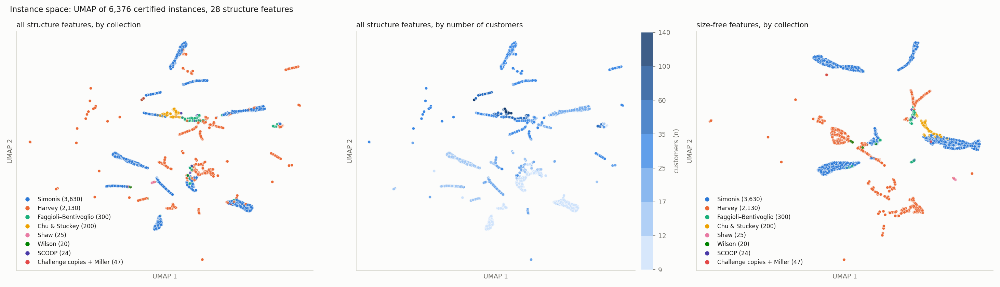

# Machine learning and the nature of MOSP — findings

*Started 2026-09-25. The report `reports/ml_nature_plan.md` lays out the
questions; this file collects the answers, one section per Ralph-loop
iteration, appended and never rewritten. Where a later section contradicts an
earlier one it says so and the earlier one stays. Every number here is
regenerated by the command named in its section. Nothing in this file is a
bound.*

## 1. Isomorphism classes: how many instances does the corpus really hold? (§2.1a)

*Iteration 1, 2026-09-25. Code: `learning/canonical.py`. Regenerate:*

```bash
pip install pynauty                      # optional; without it only WL hashes are computed
python -m learning.canonical --workers 16 --out reports/canonical_tables.md
```

*Under a second on 16 cores. Writes `learning/data/canonical.csv` (one row per
instance: matrix digest, bipartite and MOSP-graph nauty certificates, WL hash,
automorphism group order) and the tables below.*

**Question.** The optimum is `pathwidth(MOSP graph) + 1`, so two instances with
isomorphic MOSP graphs have the same optimum and are, for every question about
the optimum, one instance. How many distinct instances does the corpus of 6,376
certified optima actually contain, per collection and per size, and do
isomorphic instances carry equal optima?

**Method.** Three nested notions of "the same instance", each a canonical form:
(1) the matrix byte for byte; (2) the matrix up to renaming customers and
products, as a nauty certificate of the two-coloured bipartite graph
customers–products; (3) the MOSP graph up to renaming customers, as a nauty
certificate of `M·Mᵀ > 0`. Alongside (3), the 3-iteration Weisfeiler–Lehman
hash from networkx, which is cheap and what graph kernels and message-passing
GNNs can see, but is not a complete invariant. Classes are counted per
collection, per `(n_customers, n_patterns)` and per size band, and within every
level-3 class the optima are compared.

**Baseline.** The count everything else in this repository has been using:
6,376. And, for the WL hash, nauty's exact class count.

### Corpus totals

| level | classes | redundant instances |
|---|---:|---:|
| instances | 6,376 | — |
| (1) identical matrix | 6,332 | 44 |
| (2) isomorphic matrix | 6,313 | 63 |
| (3) isomorphic MOSP graph | **3,667** | **2,709** |
| WL hash (not complete) | 3,653 | 2,723 |

### Per collection

| collection | instances | (1) identical | (2) iso. matrix | (3) iso. MOSP graph | WL |
|:--|--:|--:|--:|--:|--:|
| ChallengeInstances2005/Harvey | 2,130 | 2,130 | 2,111 | 1,398 | 1,384 |
| ChallengeInstances2005/Miller | 1 | 1 | 1 | 1 | 1 |
| ChallengeInstances2005/Shaw | 25 | 25 | 25 | 25 | 25 |
| ChallengeInstances2005/Simonis | 3,630 | 3,630 | 3,630 | 1,784 | 1,784 |
| ChallengeInstances2005/Wilson | 20 | 20 | 20 | 20 | 20 |
| MOSP_Instances/Challenge | 46 | 46 | 46 | 46 | 46 |
| MOSP_Instances/Chu_Stuckey | 200 | 200 | 200 | 200 | 200 |
| MOSP_Instances/Faggioli_Bentivoglio | 300 | 300 | 300 | 287 | 287 |
| MOSP_Instances/SCOOP | 24 | 24 | 24 | 24 | 24 |

Within-collection counts hide the cross-collection duplicates, which the next
table shows: `MOSP_Instances/Challenge` is 46 distinct instances *on its own*
and zero new ones for the corpus.

### Classes shared across collections (level 2)

| collections | classes | instances |
|:--|--:|--:|
| Miller + MOSP_Instances/Challenge | 1 | 2 |
| Shaw + MOSP_Instances/Challenge | 25 | 50 |
| Wilson + MOSP_Instances/Challenge | 18 | 36 |

All 44 byte-identical duplicates are these: `MOSP_Instances/Challenge` is a copy
of the Miller, Shaw and Wilson files of `ChallengeInstances2005`. The two
Challenge instances not matched at level 2, `NWRS7_0` and `NWRS8_0`, are the
Wilson `NWRS7` and `NWRS8` with one all-zero product column removed
(25×59 against 25×60); their MOSP graphs are isomorphic and their optima agree
(10 and 16). So every one of the 46 Challenge instances is certified twice under
two names, and the corpus count of 6,376 includes each of them twice. The
remaining 19 level-2 duplicates are all inside Harvey (2,130 → 2,111), the only
generator that re-emitted a matrix up to relabelling.

### Per size band

| size band | instances | (1) identical | (2) iso. matrix | (3) iso. MOSP graph | WL |
|:--|--:|--:|--:|--:|--:|
| n ≤ 30 | 5,938 | 5,905 | 5,886 | 3,287 | 3,273 |
| n > 30 | 438 | 427 | 427 | 380 | 380 |

### Per (n_customers, n_patterns), sizes with at least 20 instances

| n | m | instances | (1) | (2) | (3) MOSP graph | WL |
|--:|--:|--:|--:|--:|--:|--:|
| 10 | 10 | 670 | 670 | 664 | 317 | 315 |
| 10 | 20 | 714 | 712 | 712 | 225 | 225 |
| 10 | 30 | 190 | 190 | 190 | 68 | 68 |
| 15 | 15 | 730 | 730 | 724 | 377 | 375 |
| 15 | 30 | 460 | 460 | 460 | 169 | 169 |
| 20 | 10 | 710 | 710 | 710 | 516 | 516 |
| 20 | 20 | 540 | 515 | 511 | 307 | 302 |
| 30 | 10 | 740 | 740 | 740 | 589 | 589 |
| 30 | 15 | 470 | 470 | 470 | 366 | 366 |
| 30 | 30 | 555 | 555 | 552 | 335 | 330 |
| 40 | 20 | 120 | 120 | 120 | 73 | 73 |
| 40 | 40 | 25 | 25 | 25 | 25 | 25 |
| 50 | 50 | 35 | 30 | 30 | 30 | 30 |
| 50 | 100 | 25 | 25 | 25 | 25 | 25 |
| 75 | 75 | 27 | 26 | 26 | 26 | 26 |
| 100 | 50 | 25 | 25 | 25 | 25 | 25 |
| 100 | 100 | 35 | 30 | 30 | 30 | 30 |
| 125 | 125 | 25 | 25 | 25 | 25 | 25 |

### Where the redundancy comes from: complete graphs

| complete MOSP graph | share of corpus | optimum = n | in Harvey | in Simonis | elsewhere |
|--:|--:|--:|--:|--:|--:|
| 1,669 | 26.2% | 1,669 | 457 | 1,212 | 0 |

| largest classes: instances | n | m | edges | optimum | files | collections |
|--:|--:|:--|--:|--:|--:|:--|
| 643 | 10 | 10/20/30 | 45 | 10 | 11 | Harvey + Simonis |
| 447 | 15 | 15/30 | 105 | 15 | 7 | Harvey + Simonis |
| 287 | 30 | 10/15/30 | 435 | 30 | 10 | Harvey + Simonis |
| 250 | 20 | 10/20 | 190 | 20 | 7 | Harvey + Simonis |
| 108 | 10 | 10/20/30 | 44 | 9 | 10 | Harvey + Simonis |
| 86 | 30 | 10/15/30 | 434 | 29 | 10 | Harvey + Simonis |
| 76 | 20 | 10/20 | 189 | 19 | 7 | Harvey + Simonis |
| 72 | 15 | 15/30 | 104 | 14 | 8 | Harvey + Simonis |
| 45 | 10 | 10/20/30 | 43 | 9 | 8 | Harvey + Simonis |
| 42 | 40 | 20 | 780 | 40 | 1 | Simonis |

| classes | singletons | classes of size ≥ 10 | instances in them | classes spanning > 1 file |
|--:|--:|--:|--:|--:|
| 3,667 | 3,464 | 26 | 2,364 | 157 |

The four largest classes are the complete graphs K₁₀, K₁₅, K₃₀ and K₂₀, and
the next four are the same graphs minus one edge, optimum `n − 1`. A quarter of
the corpus is instances whose optimum is `n_customers` and whose MOSP graph is
complete, which the trivial lower bound alone certifies if any single product is
required by every customer, and which contraction degeneracy certifies
otherwise. Every one of them comes from Harvey or Simonis at densities that
saturate the graph; no other collection contains a single complete graph.

### The WL hash against nauty

| WL classes | nauty classes | WL classes merging > 1 nauty class | nauty classes hidden by WL |
|--:|--:|--:|--:|
| 3,653 | 3,667 | 5 | 14 |

All five collisions are sparse Harvey instances with `edges = n` or `n − 1`,
that is, unions of paths and cycles, which 1-WL cannot tell apart when the
cycle lengths differ. All 14 hidden classes have optimum 3. So on this corpus
1-WL loses 0.4% of the classes and no information about the optimum, which
bounds in advance what the §2.2 GNN check can lose to expressivity: nothing that
shows in the optimum.

### The audit: isomorphic instances have equal optima

**Zero disagreements** over 3,667 classes, of which 203 have more than one
member and together hold 2,912 instances. Each redundant instance's certified
value equals that of a class representative certified separately, 157 times
across different files and 46 times across different collections. This is not
independent of the solver, which produced both certificates, but it is
independent of the *run*: the Challenge copies were solved in different sweeps
under different names, and the giant Harvey + Simonis classes were certified in
up to eleven files each. No instance needed re-certification, so none was
re-solved and nothing was written to `solutions/`.

**Finding.** The corpus holds 3,667 distinct MOSP graphs, not 6,376 instances:
42.5% of it is isomorphic copies, and a quarter of it is complete graphs with
optimum `n`. The redundancy is almost entirely a small-instance phenomenon,
44.6% at `n ≤ 30` against 13.2% at `n > 30`, and is confined to Harvey and
Simonis, whose generators at high density saturate the 10-to-30-customer graph,
plus the 46 Challenge instances present under two names. Chu & Stuckey, SCOOP,
Shaw and Wilson contain no duplicates at any level. Two consequences for every
study that follows. First, the effective sample size at `n ≤ 30` is 3,287, and
at `n > 30` it is 380, of which 200 are Chu & Stuckey. Second, grouping by
`source_file` does not isolate isomorphic siblings: 157 graph classes span more
than one file, and the largest spans eleven, so a "grouped" split still trains
on copies of its test instances. `learning/data/canonical.csv` now carries a
`graph_cert` column, and the grouped protocol in `learning/study_optimum.py`
should group by it (or drop to one representative per class) before any
grouped number from `reports/learning.md` is quoted again; that is a change to
the split, not to any solver default, and is left for the study that next
touches the split. The 150 graph classes containing more than one matrix class,
2,796 matrix classes in all, are free material for §2.9 (same graph, different
clique cover). The audit found what it should: no pair of isomorphic instances
carries different certified optima.

**Size range covered.** All 6,376 instances, 9 ≤ n ≤ 134. The redundancy
figures are dominated by `n ≤ 30` (5,938 instances); at `n > 30` they rest on
438 instances and 380 classes.

**Not a bound, not a solver change.** Nothing here touches `_lower_bound` or any
decision path; `learning.canonical` is analysis only.

## 2. Generator fingerprint and the map of instance space (§2.1b)

*Iteration 2, 2026-09-25. Code: `learning/fingerprint.py`. Regenerate:*

```bash
pip install umap-learn                   # optional; without it the map falls back to PCA
python -m learning.dataset               # if learning/data/instances.csv is stale, ~20 s
python -m learning.canonical --workers 16 --csv learning/data/canonical.csv   # for the leak-free split
python -m learning.fingerprint --out reports/fingerprint_tables.md
```

*About 50 s on 16 cores. Writes `reports/figures/instance_space.png`,
`learning/data/instance_space.csv` (the 2-D coordinates, git-ignored) and the
raw tables in `reports/fingerprint_tables.md`, from which every number below is
copied.*

**Question.** Can a classifier tell which collection an instance came from
using only its structure? If it can, the benchmark families occupy different
regions of instance space and a result measured on one says nothing about
another. Its accuracy is the finding; the classifier is used for nothing.

**Method.** The label is the sub-collection, nine of them: Harvey, Simonis,
Shaw, Wilson and Miller from `ChallengeInstances2005`; Chu & Stuckey,
Faggioli–Bentivoglio, SCOOP and the `Challenge` copies from `MOSP_Instances`.
Features are the 28 structure-only columns of `learning.features` (matrix
shape and degree statistics, MOSP-graph statistics; no bound), and, separately,
a 19-column *size-free* set in which every count is divided by the dimension it
scales with (`col_cv = col_std / col_mean`, `g_degeneracy / (n − 1)` and so on)
and `n`, `m`, `n_ones`, `g_nodes`, `g_edges` are dropped. The model is a random
forest of 300 trees; gradient boosting was tried first and scored 0.81 on a
random split where the forest and LightGBM both score 0.98, thrown by the
classes of one and twenty instances, so it was replaced. Three splits, all
shuffled: grouped by `source_file` as the loop's rules require; grouped by the
connected components of files and MOSP-graph isomorphism classes from §1
(512 groups against 617 files), which is the split that does not leak
isomorphic copies; and a random split, printed only to show the leak. Plain
`GroupKFold` had to be replaced by a shuffled `StratifiedGroupKFold`: on the
Chu & Stuckey files, which sort as `Random-n-m-d-1, -2, …`, its round-robin
assignment held out exactly one seed index per fold and made the control below
score exactly zero.

**Baselines.** The majority class (Simonis, 56.9%); the two size columns
`(n_customers, n_patterns)` alone; and a ceiling: features are constant on a
matrix-isomorphism class, so where a class holds rows from two collections the
minority rows are wrong under any model. From §1's classes the ceiling is
**0.993** (the 46 Challenge copies of Miller, Shaw and Wilson instances).

### The collection from structure

| features | split | accuracy | balanced accuracy | macro F1 |
|:--|:--|--:|--:|--:|
| majority class | none (baseline) | 0.569 | 0.111 | — |
| size only (n, m) | grouped by file | 0.261 | 0.324 | 0.307 |
| size only (n, m) | grouped by file + graph class | 0.134 | 0.290 | 0.171 |
| size only (n, m) | random (leaks!) | 0.728 | 0.420 | 0.455 |
| structure (all) | **grouped by file** | **0.944** | 0.507 | 0.491 |
| structure (all) | grouped by file + graph class | 0.933 | 0.509 | 0.475 |
| structure (all) | random (leaks!) | 0.981 | 0.537 | 0.554 |
| structure, size-free | grouped by file | 0.951 | 0.506 | 0.495 |
| structure, size-free | grouped by file + graph class | 0.957 | 0.511 | 0.513 |
| structure, size-free | random (leaks!) | 0.980 | 0.526 | 0.546 |

Size alone is *worse than the majority class* under a grouped split, because
every file is one `(n, m)` cell: hold the file out and its size has never been
seen with its label. Structure with the size removed does as well as structure
with it, so the fingerprint is not the size.

| collection | instances | files | recall, by file | recall, by file + class |
|:--|--:|--:|--:|--:|
| Harvey | 2,130 | 30 | **1.000** | 1.000 |
| Simonis | 3,630 | 10 | 0.934 | 0.913 |
| Faggioli–Bentivoglio | 300 | 300 | 0.983 | 0.970 |
| Chu & Stuckey | 200 | 200 | 0.935 | 0.955 |
| SCOOP | 24 | 24 | 0.583 | 0.625 |
| Challenge (copies) | 46 | 46 | 0.130 | 0.065 |
| Wilson | 20 | 5 | 0.000 | 0.050 |
| Shaw | 25 | 1 | 0.000 | 0.000 |
| Miller | 1 | 1 | 0.000 | 0.000 |

The balanced accuracy of about 0.5 is these last four rows. Shaw and Miller are
one file each, so under any grouped split they are never in the training set
when they are tested; Wilson's five files are five different sizes. All 25 Shaw
instances and 18 of 20 Wilson are predicted "Challenge", which is where their
byte-identical copies sit in the training folds: that is the ceiling, and the
model finds it. These four collections cannot be fingerprinted from this corpus
because there is nothing to generalise from, not because they are
indistinguishable.

Confusion among the generators that can be learned (rows true, columns
predicted, structure (all), grouped by file, 6,376 instances):

| true \ predicted | Harvey | Simonis | Chu & Stuckey | Faggioli–Bentivoglio | SCOOP | other |
|:--|--:|--:|--:|--:|--:|--:|
| Harvey | 2,130 | 0 | 0 | 0 | 0 | 0 |
| Simonis | 17 | 3,390 | 74 | 145 | 0 | 4 |
| Chu & Stuckey | 0 | 13 | 187 | 0 | 0 | 0 |
| Faggioli–Bentivoglio | 0 | 5 | 0 | 295 | 0 | 0 |
| SCOOP | 0 | 4 | 1 | 5 | 14 | 0 |

The Simonis errors are two files: `problem_30_30` and `problem_40_20` lose 74
instances to Chu & Stuckey, and `problem_10_20` loses 104 to
Faggioli–Bentivoglio. The 13 Chu & Stuckey errors are all `Random-30-30` at
densities 6 to 10, the densest of their smallest size, predicted Simonis. SCOOP
is the only collection of real industrial instances and the only one whose
errors scatter over three generators.

### What the fingerprint is

Permutation importance on held-out files, accuracy points: `col_std` 0.196,
`row_std` 0.147, `density` 0.114, `col_max_frac` 0.113, then nothing above
0.02. A depth-3 tree on the size-free features scores **0.940** grouped by file
and reads:

```
col_cv <= 0.017                         -> Harvey
col_cv >  0.017 and row_cv <= 0.035     -> Harvey
otherwise, col_max_frac <= 0.290        -> Faggioli–Bentivoglio
otherwise                               -> Simonis
```

Checked directly against the files: **every Harvey instance has constant
column sums, constant row sums, or both**, and no instance of any other
generator has either. Harvey's three file families are exactly these
constraints: `wbo_*` (every product has the same number of customers,
64.3% of Harvey), `wbp_*` (every customer has the same number of products) and
`wbop_*` (both, a biregular bipartite graph). Faggioli–Bentivoglio's largest
product covers at most half the customers (`col_max_frac` 0.10 to 0.50, mean
0.22); Simonis's covers 0.23 to 0.95, mean 0.65, at a mean density of 0.455.
Chu & Stuckey are recognised by their sparsity at sizes where nothing else is
sparse. So three of the four large collections are separated by two lines a
person can state, and the fourth by density and size.

### Collections at the same (n, m)

Restricted to the eleven `(n, m)` cells where at least two collections each
contribute ten or more instances, so that size cannot help. Grouped by file.

| cell (n×m) | instances | collections | majority | structure (all) | size-free |
|:--|--:|:--|--:|--:|--:|
| 10×10 | 670 | Harvey + Simonis | 0.821 | 0.991 | 1.000 |
| 10×20 | 710 | F–B + Harvey + Simonis | 0.775 | 0.939 | 0.994 |
| 10×30 | 190 | F–B + Harvey | 0.947 | 1.000 | 1.000 |
| 15×15 | 730 | Harvey + Simonis | 0.753 | 1.000 | 1.000 |
| 15×30 | 460 | Harvey + Simonis | 0.522 | 1.000 | 1.000 |
| 20×10 | 710 | F–B + Harvey + Simonis | 0.775 | 0.996 | 0.996 |
| 20×20 | 540 | Challenge + Harvey + Shaw + Simonis | 0.500 | 0.917 | 0.917 |
| 30×10 | 740 | F–B + Harvey + Simonis | 0.743 | 0.999 | 0.999 |
| 30×15 | 470 | F–B + Harvey + Simonis | 0.511 | 1.000 | 1.000 |
| 30×30 | 555 | Chu & Stuckey + Harvey + Simonis | 0.757 | 0.908 | 0.964 |
| 40×20 | 120 | F–B + Simonis | 0.917 | 1.000 | 1.000 |
| **all shared cells** | **5,895** | | 0.616 | 0.975 | **0.988** |

At equal size the generators are told apart on 98.8% of instances; the 20×20
cell is the Shaw/Challenge ceiling again, and 30×30 is where dense Chu & Stuckey
meets Simonis.

### Within Chu & Stuckey: `Random-n-m-d-k`

The data says what the name means: `col_mean` tracks `d` to within 0.3 at
every size (`d` is the mean number of customers per product), and `k` is a
seed index. Grouped by file, which is one instance per file, 200 instances.

| target | features | accuracy | balanced accuracy |
|:--|:--|--:|--:|
| density class d | majority class | 0.200 | 0.200 |
| density class d | size only (n, m) | 0.035 | 0.035 |
| density class d | structure (all) | **0.980** | 0.980 |
| density class d | structure, size-free | 0.875 | 0.875 |
| density class d | `col_mean` alone | **0.980** | 0.980 |
| seed index k (control) | majority class | 0.200 | 0.200 |
| seed index k (control) | structure (all) | 0.045 | 0.045 |
| seed index k (control) | structure, size-free | 0.050 | 0.050 |
| seed index k (control) | `col_mean` alone | 0.200 | 0.200 |

The density class is recovered from `col_mean` alone at 98%, and adding the
other 27 features adds nothing. The seed index sits at chance, as it must; a
classifier that could predict `k` would be reading the file, not the instance.
(The size-only rows below 0.2 are the stratified split's arithmetic on a
feature that carries no signal, not information.)

### The map



UMAP (`n_neighbors` 30, `min_dist` 0.1) of the standardised structure features,
left coloured by collection, middle by number of customers, right the same for
the size-free features. The map is not a continuum: it is a lattice of streaks,
one per `(n, m)` cell (74 cells in the corpus), which the middle panel shows
directly. Within a streak the generators separate; across streaks the layout is
size. In the size-free panel the cells merge and the collections form their own
regions, with Chu & Stuckey at the sparse end of the Simonis band and
Faggioli–Bentivoglio and Wilson beside them.

Neighbourhood purity, the share of an instance's 10 nearest neighbours that
carry its collection:

| collection | instances | in feature space | on the map | on the size-free map |
|:--|--:|--:|--:|--:|
| Harvey | 2,130 | 0.960 | 0.952 | 0.991 |
| Simonis | 3,630 | 0.987 | 0.971 | 0.984 |
| Chu & Stuckey | 200 | 0.861 | 0.872 | 0.854 |
| Faggioli–Bentivoglio | 300 | 0.877 | 0.820 | 0.862 |
| Shaw | 25 | 0.480 | 0.436 | 0.468 |
| Challenge (copies) | 46 | 0.393 | 0.339 | 0.352 |
| Wilson | 20 | 0.225 | 0.210 | 0.235 |
| SCOOP | 24 | 0.146 | 0.058 | 0.083 |
| all | 6,376 | 0.957 | 0.942 | 0.964 |

The map keeps what the feature space has. The 24 SCOOP instances, the only
real-world data, have almost no SCOOP neighbours: they sit inside the sparse
Harvey and Faggioli–Bentivoglio regions. Of the twelve k-means regions of the
map (`reports/fingerprint_tables.md`), one holds all 200 Chu & Stuckey
instances together with 431 Harvey, 161 Faggioli–Bentivoglio, 113 Simonis and 9 SCOOP at
mean density 0.24 and mean `optimum / n` 0.60: the sparse, low-optimum corner is
where the hard instances live and where the industrial ones fall too. The
regions that are pure Simonis (mean density 0.45, `optimum / n` 0.8 to 0.94)
are the complete and near-complete graphs of §1.

**Finding.** The benchmark families are fingerprintable: 94.4% of instances are
assigned to their collection from structure alone with the file held out
(93.3% with every isomorphic copy held out too), and 98.8% at equal size, where
the baseline is 61.6%. The fingerprint is not size and is not subtle. Harvey is
a regularity constraint (constant column or row sums, present in all 2,130 of
its instances and in no other generator's); Faggioli–Bentivoglio caps the
largest product at half the customers; Simonis is dense with large products;
Chu & Stuckey is sparse where nothing else is, and within it the density class
is `col_mean` to within rounding while the seed index is at chance. What cannot
be fingerprinted is what has no siblings to learn from: Shaw, Miller and Wilson
are one file or one size each and their copies under the Challenge name set a
ceiling of 0.993 that the model hits exactly. The consequence for every study
that follows is the one the plan anticipated: a result on Harvey is a result
about biregular-ish random bipartite graphs, a result on Simonis is about dense
random matrices at 10 to 40 customers, and neither transfers to the sparse
region where Chu & Stuckey, the timeouts and the only industrial instances all
sit. The instance-space map says the corpus is a lattice of 74 size cells with
large empty regions between them, not a sample from a distribution over
instances; §2.4's generated ensembles are what fills it.

**Size range covered.** All 6,376 instances, 9 ≤ n ≤ 134. The fingerprint
numbers rest on the four large collections (6,260 instances, 9 ≤ n ≤ 125); the
same-size test covers 10 ≤ n ≤ 40 only; the Chu & Stuckey result covers its
30 ≤ n ≤ 125. Nothing here has been re-certified because no finding depends on
any instance's optimum.

**Not a bound, not a solver change.** The classifier and the embedding are
descriptive; nothing touches `_lower_bound` or any decision path, and nothing
was written to `solutions/`.

## 3. Node counts into the ledger (§2.4 prerequisite)

**Question.** Can the hardness of a decision call be recorded in a unit that
survives a change of hardware, and what does that unit look like on the part of
the corpus where certification is cheap? §2.4 wants nodes visited by the
refutation at `optimum − 1`, not seconds; before this item the complete
customer search counted its branch decisions and no driver stored them
(`reports/ml_nature_plan.md` §0, "node counts are printed, not stored").

**Method.** Instrumentation, not a study. The search itself is unchanged: its
`Decision.nodes` and `Solution.nodes` were already returned by both the Python
and the C path. What changed is every seam above them.

- `satisfiability.mosp_solver.solve_mosp_exact` takes an optional `stats` dict
  and fills it with `nodes`, `seconds`, `proof` and `procedure`. Its return
  value is unchanged, so every existing caller keeps unpacking two values.
  `nodes` is `None`, not 0, for a cached answer and for the SAT procedure, which
  has none.
- `benchmarks.compute.record` writes a fifth ledger column, `nodes`, and takes
  rows of `(instance, seconds)` or `(instance, seconds, nodes)`; a driver with
  no search behind it (`reheuristic`) leaves the cell empty. A new
  `ensure_fields` migrates an older ledger in place once, appending the column
  and leaving every existing row empty; `python -m benchmarks.compute
  --migrate-ledger` runs it, and `record` runs it before appending.
- `benchmarks.csearch`: the worker posts `result.nodes` as a sixth element of
  its row and `sweep` records it; the first five fields are unchanged, which is
  what `benchmarks.marathon` indexes.
- `benchmarks.recertify`: already returned `nodes` from its worker and wrote it
  into `recertify/results.json` and the solution file's `recertified` note; it
  now also appends one ledger row per finished entry, as it lands, with the
  seconds and nodes of the call, under `--ledger` (default the project's).
- `learning/node_counts.py` checks the instrumentation end to end: it
  summarises the ledger's `nodes` column per driver, then runs `decide` at
  `optimum − 1` on every certified instance with at most 40 customers under
  the two configurations whose counts reach the ledger (`decide` defaults, as
  `solve_mosp_exact` runs; and the `csearch` driver's rule, Theorem 2 on sparse
  instances with every candidate a dominator), recording status, nodes and
  seconds. The status is a free audit: `sat` there would mean the stored
  optimum is wrong.

**Baseline.** The ledger before this item: 279 rows, 174 from `csearch` and 105
from `reheuristic`, none carrying a node count. That is the row every later
§2.4 run is compared against, and it is the first table below.

### The compute ledger on the day the column landed

| driver      |   rows |   with_nodes |
|:------------|-------:|-------------:|
| csearch     |    174 |            0 |
| reheuristic |    105 |            0 |
| TOTAL       |    279 |            0 |

The 279 existing rows now read `""` in `nodes`. The compute total is unchanged
at 667 core-hours (`python -m benchmarks.compute --quote`), since nodes are not
compute and are not summed.

### The audit: every stored optimum at n ≤ 40 refutes at optimum − 1

| config   | status   |   instances |
|:---------|:---------|------------:|
| csearch  | unsat    |        6135 |
| default  | unsat    |        6135 |

12,270 decision calls, all `unsat`, none at the 10 s deadline; the whole run
takes about a second on 16 workers. This is a second independent refutation
for 6,135 of the 6,376 certified optima, under two configurations, and it
agrees with the corpus everywhere. It does not touch the 241 instances above
40 customers, which is where the two known false-refutation incidents were.

### Nodes to refute optimum − 1, by size band

| config   | band   |   instances |   min |   median |    p90 |   max |   seconds_total |
|:---------|:-------|------------:|------:|---------:|-------:|------:|----------------:|
| default  | 0-10   |        1614 |     0 |        0 |    4   |    15 |            0.19 |
| csearch  | 0-10   |        1614 |     0 |        0 |    4   |    13 |            0.16 |
| default  | 11-20  |        2508 |     0 |        2 |   23   |    90 |            0.29 |
| csearch  | 11-20  |        2508 |     0 |        1 |   19   |    79 |            0.27 |
| default  | 21-30  |        1816 |     0 |        7 |  108.5 |  1149 |            0.36 |
| csearch  | 21-30  |        1816 |     0 |        7 |   88.5 |   945 |            0.36 |
| default  | 31-40  |         197 |     0 |       38 | 1763.8 | 29138 |            0.2  |
| csearch  | 31-40  |         197 |     0 |       34 | 1406.6 | 21745 |            0.17 |

### Nodes to refute optimum − 1, by collection

| config   | collection             |   instances |   median |    p90 |   max |
|:---------|:-----------------------|------------:|---------:|-------:|------:|
| default  | ChallengeInstances2005 |        5795 |      1   |   31   |   976 |
| csearch  | ChallengeInstances2005 |        5795 |      1   |   27   |   716 |
| default  | MOSP_Instances         |         340 |     39.5 | 1152.2 | 29138 |
| csearch  | MOSP_Instances         |         340 |     34.5 |  877.1 | 21745 |

### The two configurations, nodes per instance

|   instances |   csearch_fewer |   equal |   csearch_more |   median_ratio |   max_ratio |
|------------:|----------------:|--------:|---------------:|---------------:|------------:|
|        6135 |            1302 |    4827 |              6 |          0.867 |         1.1 |

**Finding.** The node count now comes back through every path a decision call
takes and lands in the ledger from both drivers that make decision calls; the
search itself was not touched and the corpus was not written to. What the
first look shows is how little of the small corpus is a search problem at all:
38.5% of the 6,135 refutations at `optimum − 1` visit **zero** nodes (53.7% at
n ≤ 10, falling to 25% at 31–40), meaning the root is refuted by the search's
own cost check before any branch, and 2,357 of those 2,360 are Challenge
instances, where §1 found 1,669 complete graphs. Where the search does branch,
the count grows about an order of magnitude per ten customers at the tail
(p90: 4 → 23 → 108 → 1,764) while the median stays in single or double digits,
and the single worst call, 29,138 nodes on `Random-40-40-2-2_0`, is at Chu &
Stuckey density 2: over the fifty `Random-30` and `Random-40` instances the
median nodes fall monotonically with density (1,068 → 428 → 140 → 22 → 6 from
density 2 to 10), which is the direction §2.4 predicts and the sign that the
hardness peak, if there is one, sits at or below density 2 for these sizes.
The `csearch` driver's configuration never costs more than 1.1× the defaults
and is cheaper on 1,302 instances, so mixing the two in one ledger is a small
distortion, and the `config` is recorded per row so it can be separated. None
of this is the §2.4 study: density is confounded with collection here (§2),
nothing is deduplicated by isomorphism class (§1 says 42.5% of the corpus is
redundant), and 50 instances at two sizes is not a density sweep.

**Size range covered.** The audit and the tables cover the 6,135 certified
instances with 2 ≤ optimum and n ≤ 40 (9 ≤ n ≤ 40), which is 96% of the corpus
by count and none of the instances on which any run has ever taken more than a
second. The ledger change covers every future row of every size. Nothing was
re-certified because nothing disagreed; the run itself is a re-refutation of
every optimum it touched.

**Not a bound, not a solver change.** No default changed; `_lower_bound` and
every decision path are untouched; nothing was written to `solutions/`. The
running `benchmarks.recertify` process (PIDs under `pgrep -f
benchmarks.recertify`) predates these edits and was not restarted, so it will
not write `nodes` rows; its `recertify/results.json` carries the counts for
those calls.

**Regenerate.** `python -m benchmarks.compute --migrate-ledger` (once;
idempotent), then `python -m learning.node_counts --max-customers 40 --out
reports/node_count_tables.md` (about 1 s on 16 workers; writes
`learning/data/node_counts.csv`). The by-density line: group
`learning/data/node_counts.csv` rows whose `instance_name` starts with
`Random-` by the fourth dash-separated field. Tests: `python -m pytest
tests/test_node_counts.py -q`.

## 4. Pathwidth-adjacent invariants as features (§2.2a)

*Iteration 4, 2026-09-25. Code: `learning/features.py` (group `invariants`),
`learning/invariants_study.py`. Regenerate:*

```bash
python -m learning.dataset --workers 16                                   # 6,376 x 49 features, ~90 s
python -m learning.invariants_study --workers 16 --out reports/invariants_tables.md   # ~140 s
python -m pytest tests/test_invariants.py -q
```

*Writes `learning/data/instances.csv` (git-ignored) and the tables below.
`learning.study_optimum` and `learning.fingerprint` leave the new group out by
default, so `reports/learning.md` §1 and §2 above still regenerate from the
columns they report.*

**Question.** The optimum is `pathwidth(MOSP graph) + 1`, and §1 of
`reports/learning.md` found that of the 36 features it is the MOSP graph's
edge count and mean degree that carry the signal. Which of the invariants
that pathwidth is known to sit beside carry more of it, and do they explain
the part of the optimum the proved bound misses?

**Method.** Thirteen new columns in a fourth feature group: the min-fill and
min-degree elimination widths (`tw_min_fill`, `tw_min_degree`, networkx's
treewidth heuristics; upper bounds on treewidth, which is at most pathwidth,
so bounds on nothing here); the bandwidth of the reverse Cuthill–McKee order
(`bw_rcm`; bandwidth is at least pathwidth, so `bw_rcm + 1` is a valid upper
bound on the optimum and the corpus is checked against that); the adjacency
spectral radius and the Laplacian Fiedler value, on the whole graph and on
its largest component; two edge clique cover counts (`cc_products`, the
distinct products containing an edge, which is the upper bound the item asks
for, and `cc_greedy`, after dropping every product all of whose edges another
product also covers); a balanced separator (`sep_size`, the smallest
one-sided boundary over the middle-third cuts of the Fiedler order and of the
RCM order, and `sep_frac = sep_size / n`); and the random intersection graph
quantities: with `p̂ = density` and `(n, m) = (n_customers, n_patterns)`
already in the matrix group, the pairwise edge probability
`1 − (1 − p̂²)^m`, the expected degree `(n − 1)` times it, and the ratio of the
observed MOSP-graph density to that probability. The four greedy invariants
run on a copy relabelled by a label-free key (degree, neighbour degrees,
two-hop degree sums) so tie-breaks do not depend on the file's row order, and
the residual order-dependence is measured by re-featuring 623 shuffled
instances (400 at random plus all 241 with `n ≥ 50`, minus overlap). The
ablation fits the same `HistGradientBoostingRegressor` as `learning.study_optimum`
on four feature sets under three splits: grouped by file, grouped by file ∪
MOSP-graph isomorphism class (`learning.fingerprint.union_groups`), and
random for contrast; on the optimum and on the residual `optimum − lb_best`.
Permutation importance is on a held-out fifth of the file ∪ class groups.

**Baseline.** The 36-feature model, grouped by file (`reports/learning.md`
§1), and the solver's own `lb_best` and `ub_best` as point estimates. Note
that the table was rebuilt: `lb_best` now includes the expansion bound
(higher on 1,329 rows than the table §1 of `reports/learning.md` was computed
from) and `Random-100-100-2-2_0` carries its corrected optimum of 20, so the
baseline rows below are the current corpus, not the September 22 numbers.

### Invariants as point estimates of the optimum

`below`/`above` count instances where the estimate sits under/over the
optimum. A valid lower bound has `above = 0`; a valid upper bound `below = 0`.

| estimate                   |   mae |   rmse |   exact |   over |   below |   above |   max_below |   max_above |
|:---------------------------|------:|-------:|--------:|-------:|--------:|--------:|------------:|------------:|
| lb_best                    | 0.431 |  1.732 |   0.770 |  0.000 |    1467 |       0 |          30 |           0 |
| ub_best                    | 0.239 |  0.733 |   0.846 |  0.154 |       0 |     979 |           0 |          10 |
| ub_cs_dfs                  | 0.241 |  0.736 |   0.845 |  0.155 |       0 |     988 |           0 |          10 |
| **tw_min_fill + 1**        | **0.188** |  **0.606** |   **0.857** |  0.067 |     481 |     428 |           3 |           7 |
| tw_min_degree + 1          | 0.292 |  0.885 |   0.811 |  0.126 |     401 |     805 |           3 |          11 |
| bw_rcm + 1                 | 1.935 |  4.422 |   0.514 |  0.486 |       0 |    3097 |           0 |          49 |
| round(spectral_radius) + 1 | 1.235 |  3.232 |   0.379 |  0.529 |     585 |    3372 |          43 |          26 |
| g_degeneracy + 1           | 1.782 |  4.965 |   0.516 |  0.000 |    3083 |       0 |          61 |           0 |
| sep_size + 1               | 8.663 | 10.803 |   0.010 |  0.001 |    6308 |       7 |          63 |           3 |

### The leading estimates by size band

| band   |   instances |   exact lb_best |   mae lb_best |   exact ub_best |   mae ub_best |   exact tw_min_fill+1 |   mae tw_min_fill+1 |
|:-------|------------:|----------------:|--------------:|----------------:|--------------:|----------------------:|--------------------:|
| 1-30   |        5938 |           0.800 |         0.226 |           0.880 |         0.155 |                 0.887 |               0.121 |
| 31-60  |         318 |           0.453 |         1.132 |           0.503 |         0.783 |                 0.582 |               0.525 |
| 61-200 |         120 |           0.117 |         8.708 |           0.092 |         2.958 |                 0.133 |               2.633 |

### Ablation: the same model with and without the invariants

`delta_mae` is against the same feature set without the group; negative is
better; the plan's kill criterion is 0.02. `mae_gap_rows` restricts the
scoring to the 1,467 instances where `ub_best > lb_best`.

| target            | split                   | features                |   mae |   rmse |   exact |   over |   mae_gap_rows |   exact_gap_rows |   delta_mae |
|:------------------|:------------------------|:------------------------|------:|-------:|--------:|-------:|---------------:|-----------------:|------------:|
| optimum           | grouped by file         | structure (28)          | 0.436 |  0.857 |   0.712 |  0.175 |          0.778 |            0.484 |             |
| optimum           | grouped by file         | structure + invariants  | 0.220 |  0.487 |   0.871 |  0.062 |          0.480 |            0.669 |  **−0.216** |
| optimum           | grouped by file         | structure + bounds (36) | 0.191 |  0.472 |   0.883 |  0.065 |          0.512 |            0.629 |             |
| optimum           | grouped by file         | all (36 + invariants)   | 0.179 |  0.454 |   0.892 |  0.054 |          0.467 |            0.667 |      −0.012 |
| optimum           | grouped by file ∪ class | structure (28)          | 1.667 |  5.430 |   0.356 |  0.129 |          2.796 |            0.388 |             |
| optimum           | grouped by file ∪ class | structure + invariants  | 1.030 |  4.977 |   0.775 |  0.069 |          2.191 |            0.580 |  **−0.637** |
| optimum           | grouped by file ∪ class | structure + bounds (36) | 0.967 |  4.970 |   0.771 |  0.059 |          2.253 |            0.557 |             |
| optimum           | grouped by file ∪ class | all (36 + invariants)   | 0.923 |  4.932 |   0.832 |  0.050 |          2.173 |            0.607 |      −0.044 |
| optimum           | random (leaks!)         | structure (28)          | 0.343 |  0.807 |   0.777 |  0.109 |          0.706 |            0.548 |             |
| optimum           | random (leaks!)         | structure + invariants  | 0.199 |  0.535 |   0.878 |  0.058 |          0.487 |            0.660 |      −0.144 |
| optimum           | random (leaks!)         | structure + bounds (36) | 0.176 |  0.505 |   0.889 |  0.063 |          0.511 |            0.638 |             |
| optimum           | random (leaks!)         | all (36 + invariants)   | 0.165 |  0.494 |   0.900 |  0.054 |          0.465 |            0.680 |      −0.012 |
| optimum − lb_best | grouped by file         | structure (28)          | 0.273 |  0.500 |   0.810 |  0.078 |          0.617 |            0.467 |             |
| optimum − lb_best | grouped by file         | structure + invariants  | 0.269 |  0.526 |   0.813 |  0.077 |          0.613 |            0.512 |      −0.004 |
| optimum − lb_best | grouped by file         | structure + bounds (36) | 0.155 |  0.378 |   0.892 |  0.062 |          0.479 |            0.635 |             |
| optimum − lb_best | grouped by file         | all (36 + invariants)   | 0.155 |  0.378 |   0.889 |  0.063 |          0.475 |            0.626 |      −0.000 |
| optimum − lb_best | grouped by file ∪ class | structure (28)          | 0.453 |  1.599 |   0.781 |  0.090 |          1.077 |            0.439 |             |
| optimum − lb_best | grouped by file ∪ class | structure + invariants  | 0.449 |  1.559 |   0.789 |  0.093 |          1.056 |            0.462 |      −0.004 |
| optimum − lb_best | grouped by file ∪ class | structure + bounds (36) | 0.306 |  1.510 |   0.878 |  0.065 |          0.940 |            0.590 |             |
| optimum − lb_best | grouped by file ∪ class | all (36 + invariants)   | 0.298 |  1.496 |   0.883 |  0.063 |          0.927 |            0.606 |      −0.009 |
| optimum − lb_best | random (leaks!)         | structure (28)          | 0.245 |  0.478 |   0.822 |  0.072 |          0.601 |            0.499 |             |
| optimum − lb_best | random (leaks!)         | structure + invariants  | 0.237 |  0.463 |   0.827 |  0.071 |          0.586 |            0.512 |      −0.008 |
| optimum − lb_best | random (leaks!)         | structure + bounds (36) | 0.147 |  0.371 |   0.891 |  0.063 |          0.467 |            0.633 |             |
| optimum − lb_best | random (leaks!)         | all (36 + invariants)   | 0.144 |  0.357 |   0.894 |  0.062 |          0.457 |            0.643 |      −0.003 |

The file ∪ class grouping is far harsher than the file grouping because it is
far more unbalanced: its largest group holds 1,620 instances (25.4% of the
corpus; the complete graphs of §1 chain Harvey and Simonis files together)
and its five largest hold 88.0%, against 8.6% and 43.1% for the file
grouping. `GroupKFold` keeps a group whole, so the file ∪ class split is in
effect a five-region hold-out, and its absolute numbers are extrapolation
errors between generators; the grouped-by-file rows are the ones comparable
with `reports/learning.md`.

### By size band (grouped by file ∪ class, target optimum)

| band   |   instances | features                |    mae |   rmse |   exact |   over |
|:-------|------------:|:------------------------|-------:|-------:|--------:|-------:|
| 1-30   |        5938 | structure (28)          |  0.875 |  1.090 |   0.377 |  0.121 |
| 1-30   |        5938 | structure + invariants  |  0.330 |  0.433 |   0.819 |  0.067 |
| 1-30   |        5938 | structure + bounds (36) |  0.246 |  0.381 |   0.813 |  0.060 |
| 1-30   |        5938 | all (36 + invariants)   |  0.216 |  0.320 |   0.877 |  0.050 |
| 31-60  |         318 | structure (28)          |  5.744 |  7.560 |   0.091 |  0.296 |
| 31-60  |         318 | structure + invariants  |  4.507 |  6.637 |   0.223 |  0.110 |
| 31-60  |         318 | structure + bounds (36) |  4.492 |  6.566 |   0.261 |  0.057 |
| 31-60  |         318 | all (36 + invariants)   |  4.401 |  6.509 |   0.277 |  0.060 |
| 61-200 |         120 | structure (28)          | 30.051 | 36.830 |   0.025 |  0.108 |
| 61-200 |         120 | structure + invariants  | 26.443 | 34.501 |   0.092 |  0.058 |
| 61-200 |         120 | structure + bounds (36) | 27.286 | 34.511 |   0.033 |  0.033 |
| 61-200 |         120 | all (36 + invariants)   | 26.726 | 34.282 |   0.067 |  0.008 |

### Permutation importance, all 49 features, target optimum

MAE points on a held-out fifth of the file ∪ class groups; the top 20, then
where every invariant landed.

|   rank | feature         | group      |   mae_cost |
|-------:|:----------------|:-----------|-----------:|
|      1 | tw_min_fill     | invariants |      2.011 |
|      2 | ub_cs_dfs       | bounds     |      1.207 |
|      3 | lb_best         | bounds     |      0.431 |
|      4 | ub_best         | bounds     |      0.146 |
|      5 | lb_contraction  | bounds     |      0.076 |
|      6 | tw_min_degree   | invariants |      0.064 |
|      7 | ub_mcn          | bounds     |      0.037 |
|      8 | g_deg_max       | graph      |      0.036 |
|      9 | g_edges         | graph      |      0.034 |
|     10 | spectral_radius | invariants |      0.025 |
|     11 | bw_rcm          | invariants |      0.024 |
|     12 | g_deg_mean      | graph      |      0.023 |
|     13 | n_patterns      | matrix     |      0.017 |
|     14 | g_degeneracy    | graph      |      0.010 |
|     15 | g_density       | graph      |      0.008 |
|     16 | n_customers     | matrix     |      0.007 |
|     17 | g_deg_std       | graph      |      0.005 |
|     18 | n_ones          | matrix     |      0.005 |
|     19 | cc_greedy       | invariants |      0.005 |
|     20 | g_deg_min       | graph      |      0.005 |

Invariants' ranks: `tw_min_fill` #1 (2.011), `tw_min_degree` #6 (0.064),
`spectral_radius` #10 (0.025), `bw_rcm` #11 (0.024), `cc_greedy` #19
(0.005), `sep_frac` #21 (0.005), `rig_deg_expected` #24 (0.002),
`rig_density_ratio` #30 (0.001), `cc_products` #31 (0.000), `rig_edge_prob`
#34 (0.000), `fiedler` #41 (−0.000), `sep_size` #47 (−0.002), `fiedler_lcc`
#48 (−0.003).

On the residual `optimum − lb_best` the ranking is `bound_gap` 0.283,
`bound_gap_frac` 0.229, `ub_cs_dfs` 0.020, then `bw_rcm` 0.017 as the first
invariant, `density` 0.016, `sep_size` 0.010, `tw_min_fill` 0.007 and
`fiedler` 0.007: nothing in the group moves the residual by more than two
hundredths of a stack.

### Each invariant alone, with the two sizes (grouped by file ∪ class)

| feature           |   rho_optimum |   rho_residual |   mae_optimum |   exact_optimum |   mae_residual |
|:------------------|--------------:|---------------:|--------------:|----------------:|---------------:|
| tw_min_fill       |         0.998 |          0.070 |         0.997 |           0.737 |          0.550 |
| lb_best           |         0.993 |          0.002 |         1.081 |           0.686 |          0.445 |
| tw_min_degree     |         0.997 |          0.080 |         1.106 |           0.659 |          0.552 |
| g_deg_mean        |         0.972 |         −0.028 |         1.468 |           0.385 |          0.472 |
| spectral_radius   |         0.980 |          0.027 |         1.637 |           0.345 |          0.490 |
| g_degeneracy      |         0.949 |         −0.109 |         1.898 |           0.248 |          0.481 |
| g_edges           |         0.963 |          0.206 |         2.113 |           0.217 |          0.588 |
| rig_deg_expected  |         0.970 |         −0.011 |         2.129 |           0.197 |          0.473 |
| bw_rcm            |         0.937 |          0.265 |         2.794 |           0.120 |          0.605 |
| fiedler           |         0.788 |         −0.320 |         2.987 |           0.139 |          0.486 |
| fiedler_lcc       |         0.787 |         −0.322 |         3.011 |           0.143 |          0.482 |
| rig_edge_prob     |         0.355 |         −0.524 |         3.200 |           0.140 |          0.443 |
| sep_frac          |         0.026 |         −0.418 |         3.715 |           0.112 |          0.506 |
| sep_size          |         0.930 |          0.259 |         3.784 |           0.093 |          0.532 |
| rig_density_ratio |         0.252 |         −0.081 |         3.883 |           0.074 |          0.509 |
| cc_greedy         |         0.186 |          0.381 |         6.030 |           0.115 |          0.518 |
| cc_products       |         0.198 |          0.002 |         6.851 |           0.035 |          0.619 |
| (sizes only)      |               |                |         7.053 |           0.044 |          0.625 |

### Order-dependence of the greedy invariants

623 instances re-featured after shuffling customers and products.

| feature           |   instances |   changed |   changed_frac |   max_abs_change |   changed_n_ge_50 |
|:------------------|------------:|----------:|---------------:|-----------------:|------------------:|
| tw_min_fill       |         623 |         0 |          0.000 |            0.000 |                 0 |
| tw_min_degree     |         623 |         0 |          0.000 |            0.000 |                 0 |
| bw_rcm            |         623 |         1 |          0.002 |            1.000 |                 0 |
| cc_greedy         |         623 |        26 |          0.042 |            2.000 |                 4 |
| sep_size          |         623 |         0 |          0.000 |            0.000 |                 0 |
| every exact invariant |     623 |         0 |          0.000 |            0.000 |                 0 |

**Finding.** One invariant carries almost all of what the group adds, and it
is the min-fill elimination width. `tw_min_fill + 1` is, on this corpus, a
closer point estimate of the optimum than either of the solver's own bounds:
exact on 85.7% of the 6,376 instances against 84.6% for `ub_best` and 77.0%
for `lb_best`, at MAE 0.188 against 0.239 and 0.431, and it leads in every
size band, including the 120 instances with 61–134 customers where it is off
by 2.6 stacks on average against 3.0 for the upper bound and 8.7 for the
lower. It is a bound on nothing: it sits below the optimum on 481 instances
(by up to 3) and above it on 428 (by up to 7), and treewidth being at most
pathwidth does not make a treewidth *heuristic* either. In the model it is
the single most important feature of all 49 at 2.01 MAE points, above
`ub_cs_dfs` at 1.21 and `lb_best` at 0.43, and alone with the two sizes it
predicts the optimum better under the harshest grouping (MAE 0.997, exact
73.7%) than `lb_best` with the same sizes does (1.081, 68.6%). The plan's
kill criterion of 0.02 MAE is cleared by an order of magnitude on the
structure-only set — grouped by file the MAE falls from 0.436 to 0.220 and
the exact rate rises from 71.2% to 87.1%, which is to say that structure plus
invariants, with no solver bound computed, now predicts the optimum as well as
structure plus the bounds did (0.191, 88.3%) — and cleared narrowly or not at
all once the bounds are already present (−0.012 by file, −0.044 by file ∪
class). On the **residual over the proved bound the group adds nothing**:
−0.004, −0.000 and −0.009 MAE, and no invariant moves that target by more than
0.017 points. So the invariants know what the bound knows, expressed
differently, and not what it is missing. Where the residual does correlate
with anything it is with the random-model sparsity: the pairwise edge
probability `1 − (1 − p̂²)^m` has Spearman −0.52 with the gap, the separator
fraction −0.42 and the Fiedler value −0.32, so the bound falls short where the
graph is sparse and weakly connected, which is a direction for §2.3 rather
than an explanation. Of the rest: `tw_min_degree` (#6), the spectral radius
(#10) and `bw_rcm` (#11) each add a few hundredths; the Fiedler value, the
separator, both clique cover counts and the random intersection parameters
contribute nothing once min-fill is present, and the random-model expected
degree predicts the optimum worse (MAE 2.13) than the observed mean degree
(1.47), with the density ratio spanning 0.49–1.38, which says again what §2
said: these graphs are not random intersection graphs at their own `(n, m,
p̂)`. `bw_rcm + 1` was never below the optimum on any of the 6,376 instances,
as bandwidth ≥ pathwidth requires — a corpus-wide consistency check against a
theorem that cost nothing — and it is exact on 51.4% of them. The relabelling
by a label-free key makes the greedy invariants order-independent in practice:
over 623 shuffled instances the two treewidth heuristics and the separator
never changed, the RCM bandwidth changed once by one, and only `cc_greedy`
moved (26 instances, by at most 2), which is documented and harmless since it
carries no importance.

**Size range covered.** 9–134 customers, 5,938 of 6,376 at n ≤ 30. The
ablation and importance tables are dominated by the small instances; at 31–60
customers (318 instances) every model's grouped MAE is above 4 and at 61–134
(120 instances) above 26, so no model here predicts the optimum at those
sizes and the only claim that reaches them is the point-estimate comparison
in the by-band table. The order-dependence check covers every instance with
n ≥ 50.

**Not a bound, not a solver change.** No default changed; `_lower_bound` and
every decision path are untouched; nothing was written to `solutions/`. No
finding rests on a handful of instances, so nothing was re-certified; the
`bw_rcm + 1 ≥ optimum` check is a whole-corpus property and it passed.

**For §2.2b.** The residual is the target the formula search should aim at,
and this section says which columns to leave out of it: the treewidth
heuristics track the bound, not the gap. The candidates with any signal on the
gap are `rig_edge_prob`, `sep_frac`, `fiedler`, `cc_greedy` (ρ = 0.38) and
`bw_rcm`.

## 5. A formula for the residual, and for the optimum (§2.2b)

*Iteration 7, 2026-09-25 (iteration 5 wrote the search and was cut short before
its run finished; this iteration finished, fixed the run and wrote it up).
Code: `learning/formula_search.py`. Regenerate:*

```bash
python -m learning.dataset --workers 16                                  # if the table is stale (~90 s)
python -m learning.formula_search --workers 16 --out reports/formula_tables.md   # ~400 s; --no-pysr for the enumerated part alone (~7 min)
python -m pytest tests/test_formula_search.py -q
```

*Writes `reports/formula_tables.md` (every table below, in full). The
enumerated rows regenerate to the digit; the PySR rows do not, because
multithreaded PySR is not deterministic even with a seed, and see the note on
Julia crashes under Method.*

**Question.** §4 found that a boosting model on structure and the
pathwidth-adjacent invariants predicts the optimum as well as the solver's
bounds do, and that no invariant explains the residual `optimum − lb_best`
beyond what the bound knows. A boosting model explains nothing. Is there a
*closed-form* formula in structure-only features for the residual, and one for
the optimum, and is either clean enough to state as a conjecture?

**Method.** Two feature pools, both without any `lb_*`, `ub_*` or `bound_*`
column: *structure* (38 columns: the matrix and MOSP-graph features minus
`g_nodes`, which equals `n_customers`, plus the §4 invariants minus the two
treewidth heuristics) and *structure + treewidth heuristics* (40). Two
targets: `optimum − lb_best` (structure pool only, since §4 showed the
treewidth heuristics track the bound, not the gap) and `optimum` (both pools).
Two searches. (1) An **enumerated** search over every product and ratio of at
most three features, `f₁^e₁ · f₂^e₂ · f₃^e₃` with exponents in
{−2, −1, −½, ½, 1, 2} for one feature, {−1, −½, ½, 1, 2} for two and {−1, 1}
for three, a negative exponent only on a strictly positive column: 58,221
terms on the structure pool, 68,690 with the treewidth heuristics. Each term
`t` is scored as the two-parameter fit `y ≈ a·t + b`, constants fitted on the
training folds and error measured on the held-out folds of a five-fold grouped
split: least squares as the first pass over every term, then least absolute
deviation (the metric is MAE and the target's tail pulls a least-squares line
off the bulk) for the leading 150, ranked by that. A second stage fits
`y ≈ a·t₁ + b·t₂ + c` over all pairs of those 150. Splits: grouped by
`source_file`, grouped by file ∪ MOSP-graph isomorphism class
(`learning.fingerprint.union_groups`, §1), and random for contrast. Because the
search *selects* a term by its grouped error, that error is optimistic, so a
**nested** protocol runs the whole search inside each outer training fold and
scores its winner on the held-out files; those are the honest numbers.
(2) **PySR** (`pip install pysr`, optional; Julia bootstraps on first use) with
`+ − × ÷`, `sqrt`, `square`, `log`, L1 loss, maxsize 20, on every fifth file in
sorted order held out (124 files, 719 instances), its whole Pareto front scored
on the held-out rows beside the enumerated winner and boosting fitted on the
same training rows. Finally the two invariants both searches keep returning
are tabulated with their **constants fixed by hand** rather than fitted, so
there is nothing to hold out. *A note on the PySR runs:* PySR 2.5 on this
machine crashed inside Julia's garbage collector on six of seven fits at 16
threads and 10,000 iterations (segfault or abort, one of them on the
wall-clock stop path), whichever process it ran in; at 4 threads and 2,000
iterations every fit finished. Each fit now runs in a child process with one
retry, the tables above it are written to disk before PySR starts, and the
defaults are the ones that survive.

**Baseline.** LightGBM on the same pool and the same grouped folds (the item's
baseline), the constant formula `residual = 0` (which is `lb_best` itself, MAE
0.431), and `tw_min_fill + 1`, the best point estimate §4 found (MAE 0.188).

**The searches** (pooled held-out MAE / exact rate of the LAD fit `y ≈ a·t + b`;
`file` = grouped by file, `class` = grouped by file ∪ isomorphism class,
`random` leaks isomorphic copies across folds):

| target | pool | split | best monomial | mae | exact | best pair | boosting |
|---|---|---|---|---|---|---|---|
| optimum | structure | file | `sqrt(g_degeneracy · bw_rcm)` | 0.672 | 0.671 | 0.576 | 0.390 |
| optimum | structure | class | same | 0.672 | 0.671 | 0.599 | 1.588 |
| optimum | structure | random | same | 0.672 | 0.671 | 0.574 | 0.317 |
| optimum | structure + tw | file | `tw_min_fill` | 0.188 | 0.857 | 0.187 | 0.221 |
| optimum | structure + tw | class | same | 0.189 | 0.857 | 0.209 | 1.022 |
| optimum | structure + tw | random | same | 0.188 | 0.857 | 0.186 | 0.200 |
| optimum − lb_best | structure | file | `g_deg_std · sep_size / g_density` | 0.303 | 0.802 | 0.295 | 0.260 |
| optimum − lb_best | structure | class | same | 0.302 | 0.803 | 0.307 | 0.428 |
| optimum − lb_best | structure | random | same | 0.302 | 0.803 | 0.296 | 0.242 |

The formulas do not care which split they are scored under, to three decimals;
boosting does, badly, under the class grouping (which is a five-region
hold-out in practice, §4). The LAD constants fitted on all rows are

| target | formula, constants fitted on all 6,376 rows | reads as |
|---|---|---|
| optimum | `1.000 · sqrt(g_degeneracy · bw_rcm) + 1.000` | `1 + √(degeneracy × RCM bandwidth)` |
| optimum | `1.000 · tw_min_fill + 1.000` | `tw_min_fill + 1`, the §4 estimate |
| optimum − lb_best | `0.0102 · g_deg_std · sep_size / g_density − 0.017` | with `g_density = g_deg_mean / (n − 1)`: `0.01 · (n − 1) · sep_size · (σ_deg / μ_deg)` |

**Nested** (the formula selected on the training files only, scored on the
held-out files; the honest grouped MAE) and the winners per outer fold:

| target | pool | best monomial | best pair | boosting | winner in the 5 outer folds |
|---|---|---|---|---|---|
| optimum | structure | 0.672 | 0.608 | 0.390 | `sqrt(g_degeneracy · bw_rcm)` in 5 of 5 |
| optimum | structure + tw | 0.188 | 0.187 | 0.221 | `tw_min_fill` in 5 of 5 |
| optimum − lb_best | structure | 0.304 | 0.300 | 0.260 | `g_deg_std · sep_size / g_density` in 1, `g_deg_std · sep_size / rig_edge_prob` in 4 (MAE 0.3035 vs 0.3034: the same formula, `rig_edge_prob` being the random-model version of `g_density`) |

Selection inflates the monomials' error by at most 0.001, so the grouped
numbers above are what a fresh file should expect.

**Point estimates of the optimum**, grouped by file, constants refitted per
fold, the residual formulas added to `lb_best`; `below`/`above` count rounded
estimates under and over the optimum (a valid lower bound has `above = 0`):

| estimate | mae | exact | below | above | max below | max above |
|---|---|---|---|---|---|---|
| `lb_best` (= residual 0) | 0.431 | 0.770 | 1,467 | 0 | 30 | 0 |
| `ub_best` | 0.239 | 0.846 | 0 | 979 | 0 | 10 |
| `tw_min_fill + 1` | 0.188 | 0.857 | 481 | 428 | 3 | 7 |
| `lb_best` + monomial[residual] | 0.303 | 0.802 | 1,024 | 237 | 11 | 10 |
| `lb_best` + pair[residual] | 0.295 | 0.804 | 909 | 341 | 13 | 11 |
| `lb_best` + boosting[residual] | 0.260 | 0.814 | 677 | 507 | 9 | 8 |
| monomial[optimum; structure] | 0.672 | 0.671 | 1,495 | 602 | 34 | 9 |
| pair[optimum; structure] | 0.576 | 0.667 | 914 | 1,212 | 19 | 9 |
| boosting[optimum; structure] | 0.390 | 0.738 | 771 | 897 | 7 | 20 |
| pair[optimum; structure + tw] | 0.187 | 0.860 | 490 | 405 | 3 | 4 |
| boosting[optimum; structure + tw] | 0.221 | 0.872 | 426 | 388 | 8 | 12 |

By size band (MAE, grouped by file):

| estimate | 1–30 (5,938) | 31–60 (318) | 61–134 (120) |
|---|---|---|---|
| `lb_best` | 0.226 | 1.132 | 8.708 |
| `tw_min_fill + 1` | 0.121 | 0.525 | 2.633 |
| `lb_best` + monomial[residual] | 0.214 | 0.627 | 3.883 |
| `lb_best` + boosting[residual] | 0.220 | 0.483 | 1.642 |
| monomial[optimum; structure] = `1 + √(degeneracy · bw_rcm)` | 0.360 | 1.830 | 13.060 |
| boosting[optimum; structure] | 0.313 | 1.003 | 2.589 |

By collection the residual monomial beats boosting only on Harvey (0.266 vs
0.274) and Simonis (0.172 vs 0.184), the two collections that are 90% of the
corpus and almost all at n ≤ 30; it loses on every other: Faggioli–Bentivoglio
0.505 vs 0.426, Chu & Stuckey 2.430 vs 1.191, SCOOP 1.245 vs 0.519, Wilson
1.329 vs 0.286.

**The sandwich**, constants fixed by hand (nothing fitted, nothing held out).
Degeneracy ≤ treewidth ≤ pathwidth and bandwidth ≥ pathwidth, so
`g_degeneracy + 1` is a proved lower bound on the optimum and `bw_rcm + 1` a
proved upper bound; the corpus is checked against both, and the optimum is
`g_degeneracy + 1 + λ · (bw_rcm − g_degeneracy)` for some λ ∈ [0, 1]:

| estimate | mae | exact | below | above | mae 1–30 | mae 31–60 | mae 61–134 |
|---|---|---|---|---|---|---|---|
| `g_degeneracy + 1` | 1.782 | 0.516 | 3,083 | 0 | 1.132 | 4.459 | 26.817 |
| `bw_rcm + 1` | 1.935 | 0.514 | 0 | 3,097 | 1.302 | 6.566 | 20.983 |
| `1 + √(g_degeneracy · bw_rcm)` (geometric mean) | 0.672 | 0.671 | 1,495 | 600 | 0.360 | 1.830 | 13.060 |
| `1 + (g_degeneracy + bw_rcm) / 2` (arithmetic mean) | 0.631 | 0.788 | 930 | 1,146 | 0.374 | 2.239 | 9.125 |
| `tw_min_fill + 1` | 0.188 | 0.857 | 481 | 428 | 0.121 | 0.525 | 2.633 |
| `lb_best` | 0.431 | 0.770 | 1,467 | 0 | 0.226 | 1.132 | 8.708 |

| check | value |
|---|---|
| `g_degeneracy + 1 > optimum` (must be 0) | 0 |
| `bw_rcm + 1 < optimum` (must be 0) | 0 |
| `bw_rcm == g_degeneracy`, so the optimum is forced | 2,823 of 6,376, all with optimum `= g_degeneracy + 1` |
| λ where the two differ (3,553 instances): quantiles 10/25/50/75/90 | 0 / ⅓ / ½ / ⅔ / 1; mean 0.486 |
| λ median by band 1–30 / 31–60 / 61–134 | 0.500 / 0.409 / 0.550 |
| Spearman of λ with `sep_frac`, `g_density`, `rig_edge_prob`, `n_customers` | 0.40, 0.37, 0.36, 0.05 |
| degree-regular MOSP graphs (`g_deg_std = 0`) | 1,705: 1,669 complete, 34 two-regular Harvey `wbop` (unions of cycles), the 10-regular Miller graph twice |
| max `optimum − lb_best` on them / mean on the other 4,671 | 0 / 0.588 |

**PySR** on the held-out fifth of the files (719 instances; the enumerated
monomial and pair selected by grouped CV on the training files only, boosting
fitted on the same rows):

| target | pool | method | formula | mae | exact |
|---|---|---|---|---|---|
| optimum | structure | enumerated monomial | `sqrt(g_degeneracy · bw_rcm)` | 0.820 | 0.680 |
| optimum | structure | enumerated pair | `0.52 · bw_rcm² / n + 0.48 · sqrt(g_deg_mean · spectral_radius) + 1.47` | 0.618 | 0.677 |
| optimum | structure | boosting | | 0.358 | 0.783 |
| optimum | structure | PySR, its own pick (complexity 6) | `distinct_row_frac + sqrt(g_degeneracy · bw_rcm)` | 0.814 | 0.677 |
| optimum | structure | PySR, best of its front on the held-out rows (18) | `(g_degeneracy / bw_rcm)² + sqrt(bw_rcm · (spectral_radius − g_clustering · sqrt(1.73 · g_deg_std · shape_ratio)))` | 0.525 | 0.745 |
| optimum | structure + tw | enumerated monomial | `tw_min_fill` | 0.224 | 0.841 |
| optimum | structure + tw | enumerated pair | `0.91 · tw_min_fill + 0.09 · sqrt(g_deg_mean · tw_min_fill) + 1.02` | 0.208 | 0.844 |
| optimum | structure + tw | boosting | | 0.229 | 0.869 |
| optimum | structure + tw | PySR, its own pick (3) | `tw_min_fill + 1` | 0.224 | 0.841 |
| optimum | structure + tw | PySR, best on held-out (18) | `tw_min_fill + 1 − ((g_deg_mean − 1.04 · tw_min_fill) / (7.1 · (row_std + rig_edge_prob) + 3.2))²` | 0.173 | 0.847 |
| optimum − lb_best | structure | enumerated monomial | `g_deg_std · sep_size / rig_edge_prob` | 0.345 | 0.772 |
| optimum − lb_best | structure | enumerated pair | `0.0079 · g_deg_std · sep_size / rig_edge_prob + 0.0041 · bw_rcm / (row_min · col_max_frac) − 0.037` | 0.341 | 0.775 |
| optimum − lb_best | structure | boosting | | 0.276 | 0.815 |
| optimum − lb_best | structure | PySR, its own pick (6) | `(0.070 · (bw_rcm − g_deg_mean))²` | 0.321 | 0.787 |
| optimum − lb_best | structure | PySR, best on held-out (13) | `((g_components · rig_edge_prob · distinct_row_frac − 0.89)² · distinct_row_frac · g_deg_std)²` | 0.235 | 0.801 |

"Best on held-out" picks among the ≤ 20 equations of a Pareto front by their
score on the test rows, so it is optimistic by that selection; PySR's own pick
is chosen from training loss alone. The fronts themselves are in
`reports/formula_tables.md`. For the residual the front reads, in order of
complexity: `0`, `spectral_radius − g_deg_mean`, `(0.19 · g_deg_std)²`,
`0.09 · (bw_rcm − g_degeneracy)`, `(0.07 · (bw_rcm − g_deg_mean))²`, then
`g_deg_std` times a squared sparsity term from complexity 7 on — the degree
spread, and the width of the sandwich, and nothing else.

**Finding.** There is no clean formula for the residual. The best closed form
in the structure features is `optimum − lb_best ≈ 0.01 · g_deg_std · sep_size /
g_density − 0.02`, grouped MAE 0.303 (0.304 nested) against 0.431 for the
constant zero and 0.260 for LightGBM on the same pool: a formula recovers
three quarters of what boosting recovers, and its constants are not ones
anybody would conjecture. What the term says is intelligible even so. Since
`g_density = g_deg_mean / (n − 1)`, it is `(n − 1) · sep_size · σ_deg / μ_deg`:
the residual grows with the *dispersion of the degree sequence*, times the
separator size. That is the same fact §4 reached through correlations and
`CLAUDE.md` records from the bound side, that the degree-based bounds saturate
at the average degree, now with the degree spread as the explicit variable:
on the 1,721 instances where the term is zero the gap is zero on 99.8%, and
on the 1,705 degree-regular graphs it is zero on every one — but those are
complete graphs, unions of cycles and one Miller graph, where a tight bound
is a triviality rather than a finding, so no conjecture is stated for the
residual. For the *optimum*, the clean formula exists and is the same in both
searches: with the treewidth heuristics allowed it is `tw_min_fill + 1`, LAD
constants (1.000, 1.000), MAE 0.188, and nothing the enumerator or the pair
stage adds improves it beyond 0.187; without them it is
`1 + √(g_degeneracy · bw_rcm)`, again with constants exactly (1, 1), chosen in
all five outer folds, MAE 0.672 and exact on 67.1% — the geometric mean of a
proved lower bound and a proved upper bound on the optimum. That is the
finding worth keeping: the two invariants the searches converge on sit on
opposite sides of the optimum, `degeneracy + 1 ≤ optimum ≤ bw_rcm + 1` holds
on all 6,376 instances (as the two theorems behind it require, a
whole-corpus consistency check that passed), they coincide and force the
optimum on 2,823 of them, and where they differ the optimum sits at the
midpoint on median, with interquartile range ⅓–⅔, its position λ tracking
sparsity (Spearman 0.40 with the separator fraction) and not size (0.05).
PySR's whole Pareto front for the optimum is that same statement written out,
`g_degeneracy + 1 + λ(·) · (bw_rcm − g_degeneracy)` with λ a function of
`sep_frac`, `row_mean` or `n_ones`; in this run PySR's own pick for the optimum from structure alone is
`distinct_row_frac + sqrt(g_degeneracy · bw_rcm)`, the enumerated formula
found by a second method, and with the treewidth heuristics allowed its pick
is `tw_min_fill + 1`, held-out MAE 0.224 against boosting's 0.229. The one
place a formula beats boosting is the residual on the held-out files: PySR's
`((g_components · rig_edge_prob · distinct_row_frac − 0.89)² · distinct_row_frac · g_deg_std)²`
scores 0.235 against boosting's 0.276, selected on the test rows and so
optimistic, and it is again the degree standard deviation times a sparsity
term; its own pick, `(0.07 · (bw_rcm − g_deg_mean))²` at 0.321, says the gap
grows with the square of how far the bandwidth runs above the mean degree. **None of this is a
bound.** `1 + √(g_degeneracy · bw_rcm)` is below the optimum on 1,495 instances
and above it on 600, by up to 34 and 9; the residual formula added to
`lb_best` overshoots on 237; the geometric mean is *worse* than `lb_best` at
61–134 customers (13.06 vs 8.71), because on the sparse Chu & Stuckey graphs
`bw_rcm` runs far above the pathwidth. And the one clean lower bound in it,
`g_degeneracy + 1`, is dominated by the contraction degeneracy + 1 that
`_lower_bound` already computes (contraction degeneracy ≥ degeneracy), so
there is nothing here to hand to the bound work; a conjecture of the form
"pathwidth ≥ f(·)" would have to come from a different family than degree
statistics, which is what §4's kill statement already said.

**Size range covered.** 9–134 customers, 5,938 of 6,376 at n ≤ 30. Every
grouped MAE in the searches is dominated by that band. At 31–60 (318
instances) the residual formula is at 0.627 against boosting's 0.483 and
`lb_best`'s 1.132; at 61–134 (120 instances) it is 3.88 against 1.64 and 8.71,
and no formula here predicts the optimum at that size. The sandwich
inequalities and the forced-optimum count are whole-corpus properties and
hold at every size; the λ ≈ ½ statement rests on 3,169 instances at n ≤ 30,
266 at 31–60 and 118 above, with the same median in each band to within 0.1.

**Not a bound, not a solver change.** No default changed; `_lower_bound` and
every decision path are untouched; nothing was written to `solutions/`. No
finding rests on a handful of instances: the two inequalities and the forced
count are corpus-wide, and the 36 non-complete regular graphs are all
certified by their bound (`lb_best = optimum`), which is a proof independent
of any search refutation, so nothing was re-certified.

**For §2.3 and the next loop.** The residual's variable is degree dispersion,
so the gap-vs-tight classifier of §2.3 should start from `g_deg_std / g_deg_mean`
and `sep_size` beside `rig_edge_prob` and `sep_frac`. For §2.5 (does the optimum
concentrate on random instances) the sandwich is the natural frame: on
`G(n, m, p)` the degeneracy and RCM bandwidth have their own concentration
results, and the question becomes whether λ concentrates at ½.

## 6. Where the bounds fail (§2.3)

*Iteration 8, 2026-09-25 (iteration 6 wrote `learning/bound_gap.py` and its
tests and ran it, but ended before reading the run; its classifier tables
scored 1.000 everywhere because the study's own label column `y` had been
swept into the "structure" feature set by an every-numeric-column selector.
This iteration fixed the leak, added a guard and a test for it, added the
size-free feature set, the treewidth ceiling and the per-instance treewidth
and simplicial counts, re-ran, and wrote this section.) Code:
`learning/bound_gap.py`. Regenerate:*

```bash
python -m learning.dataset --workers 16                                    # if the table is stale (~90 s)
python -m learning.canonical --workers 16                                  # the isomorphism classes (~1 s)
python -m learning.bound_gap --workers 16 --out reports/bound_gap_tables.md   # ~120 s; --no-recertify skips the re-solve of the ten
python -m pytest tests/test_bound_gap.py -q
```

*Writes `reports/bound_gap_tables.md` (every table below in full, plus the ten
instances drawn) and `learning/data/bound_gap.csv` (git-ignored, the 338 gap
instances with their cluster). Nothing is written to `solutions/`: the
re-certification calls `solve_mosp_exact` with the corpus directory, which
re-verifies the cached witness by simulation, and refutes `optimum − 1` through
`learning.node_counts.refute`, which writes nothing.*

**Question.** `lb_best` — the best of the trivial bound, the clique bound,
contraction degeneracy + 1 and the expansion bound — equals the optimum on
77.0% of the corpus, misses by one on 17.7% and by two or more on 5.3% (338
instances). Do the instances it misses by two or more share a recognisable
structure, and which of the four component bounds is blind to it?

**Method.** The label is `gap = optimum − lb_best` from the feature table,
three-way (tight, gap 1, gap ≥ 2); the classifier sees tight against gap ≥ 2
with the gap-1 rows left out, 5,247 rows and 338 positives. Three models — a
depth-3 decision tree (balanced class weight, 20 rows per leaf), an
explainable boosting machine (`interpret`, soft import, no interactions) and
`HistGradientBoostingClassifier` as a ceiling — on five feature sets: the
plan's baseline `n_customers`, `n_patterns`, `density`; the 28 matrix and
MOSP-graph features; those plus the 13 invariants of §4; a 32-column
*size-free* set (`learning.fingerprint.size_free_features` plus the invariants
divided by their dimension, so a tree can split on `g_deg_cv` or `bw_rcm / n`);
and structure + invariants + the three lower bounds. No upper bound anywhere,
since `ub_best` equals the optimum on 85% of the corpus and `ub − lb` would be
the label in disguise. Out-of-fold probabilities under `GroupKFold` grouped by
file ∪ MOSP-graph isomorphism class (`learning.fingerprint.union_groups`, the
honest split) with the file-only grouping beside it; AUC, average precision
and balanced accuracy, whole and per size band. Because gap ≥ 2 never occurs
below 20 customers and is the norm above 60, the same models are scored again
on the 2,407 rows in the eleven `(n, m)` cells holding at least three of each
class, where size cannot be the answer. Then each size-free feature alone,
z-scored within its cell, as a ranker of gap ≥ 2 against tight over those
cells (AUC and Cohen's d); the EBM's term importances there; the depth-3
trees as text; k-means over the standardised size-free features of the 338
gap instances with k by silhouette; and the ten smallest gap ≥ 2 instances
(fewest customers, then fewest ones, one per isomorphism class), drawn as
matrices with their degree sequences, every bound recomputed from the
instance, the number of customers in exactly one product, and a treewidth
upper bound from 200 randomised min-fill / min-degree eliminations. Each of
the ten is re-certified: the exact solver's value and an independent
refutation of `optimum − 1`.

One table not in the plan came out of a consistency check. The trivial bound
is a clique, the clique bound is a clique, and contraction degeneracy is a
lower bound on treewidth (Bodlaender, Koster & Wolle), so three of the four
components of `lb_best` are lower bounds on **treewidth + 1**, while
`tw_min_fill + 1` from §4 is an upper bound on it. Hence
`optimum > tw_min_fill + 1` certifies `pathwidth > treewidth` on that
instance, with no heuristic in the certificate (min-fill is an upper bound,
the optimum is exact). The "treewidth ceiling" table counts those
certificates per gap class and checks the two inequalities the theorems
require; the module raises if either is violated.

**Baseline.** Density and size alone, as the plan asks; the kill criterion
is that structure must beat it. Iteration 6's leaked run is not a baseline
for anything and its numbers are not quoted.

### Where the gap is

| band   | instances | tight | gap 1 | gap ≥ 2 | frac gap ≥ 2 | mean gap | max gap |
|:-------|----------:|------:|------:|--------:|-------------:|---------:|--------:|
| 1–10   |     1,614 | 1,566 |    48 |       0 |        0.000 |    0.030 |       1 |
| 11–20  |     2,508 | 2,051 |   440 |      17 |        0.007 |    0.189 |       2 |
| 21–30  |     1,816 | 1,134 |   549 |     133 |        0.073 |    0.450 |       3 |
| 31–60  |       318 |   144 |    73 |     101 |        0.318 |    1.132 |       5 |
| 61–134 |       120 |    14 |    19 |      87 |        0.725 |    8.708 |      30 |

By collection: Chu & Stuckey 102 of 200 at gap ≥ 2 (51.0%, mean gap 5.4),
Faggioli–Bentivoglio 83 of 300 (27.7%), Wilson 3 of 20, SCOOP 3 of 24,
Challenge 3 of 46, Harvey 71 of 2,130 (3.3%), Simonis 73 of 3,630 (2.0%),
Shaw and Miller none. On the 338 gap ≥ 2 rows the component bounds fall
short by a mean of 4.8 (`lb_best`, median 2), 7.4 (`lb_contraction`, median
3) and 14.4 (`lb_trivial`, median 7); on the 4,909 tight rows
`lb_contraction` alone is tight on 84.8% and the trivial bound on 4.8%.

### The classifier

Grouped by file ∪ class, all 5,247 rows, 338 positives (file-only grouping
in `reports/bound_gap_tables.md`; it is uniformly higher, by up to 0.07 AUC,
for the reason §2 gives — the collections are separable regions and a
held-out file has isomorphic neighbours in the training folds):

| model              | features                    |   AUC | avg precision | bal. acc | AUC 11–20 | 21–30 | 31–60 | 61–134 |
|:-------------------|:----------------------------|------:|--------------:|---------:|----------:|------:|------:|-------:|
| tree (depth 3)     | density + size              | 0.884 |         0.263 |    0.851 |     0.746 | 0.804 | 0.730 |  0.786 |
| tree (depth 3)     | structure (28)              | 0.946 |         0.523 |    0.928 |     0.688 | 0.898 | 0.905 |  0.906 |
| tree (depth 3)     | size-free (32)              | 0.942 |         0.524 |    0.936 |     0.908 | 0.892 | 0.904 |  0.900 |
| EBM                | density + size              | 0.920 |         0.349 |    0.632 |     0.950 | 0.918 | 0.724 |  0.611 |
| EBM                | structure + invariants (41) | 0.983 |         0.768 |    0.756 |     0.958 | 0.960 | 0.974 |  0.979 |
| EBM                | size-free (32)              | 0.984 |         0.772 |    0.691 |     0.958 | 0.965 | 0.981 |  0.975 |
| boosting (ceiling) | density + size              | 0.963 |         0.566 |    0.870 |     0.893 | 0.913 | 0.849 |  0.951 |
| boosting (ceiling) | structure + invariants + lb | 0.977 |         0.794 |    0.801 |     0.933 | 0.954 | 0.971 |  0.926 |

Within the eleven mixed `(n, m)` cells — 2,407 rows, 218 positives; the
cells are 20×10 (13 positives of 515), 20×20 (4/433), 30×10 (86/478), 30×15
(35/328), 30×30 (8/444), 40×20 (11/91), 40×40 (6/18), 50×50 (12/28), 50×100
(5/20), 75×75 (17/22) and 100×100 (21/30):

| model              | features                    |   AUC | avg precision | bal. acc | AUC 11–20 | 21–30 | 31–60 | 61–134 |
|:-------------------|:----------------------------|------:|--------------:|---------:|----------:|------:|------:|-------:|
| tree (depth 3)     | density + size              | 0.849 |         0.256 |    0.835 |     0.865 | 0.858 | 0.805 |  0.746 |
| tree (depth 3)     | size-free (32)              | 0.931 |         0.517 |    0.823 |     0.894 | 0.902 | 0.956 |  0.964 |
| EBM                | density + size              | 0.947 |         0.538 |    0.802 |     0.878 | 0.918 | 0.982 |  0.989 |
| EBM                | size-free (32)              | 0.971 |         0.813 |    0.839 |     0.924 | 0.957 | 0.992 |  1.000 |
| boosting (ceiling) | density + size              | 0.935 |         0.636 |    0.819 |     0.777 | 0.906 | 0.989 |  0.994 |
| boosting (ceiling) | structure + invariants + lb | 0.962 |         0.802 |    0.840 |     0.891 | 0.945 | 0.987 |  0.996 |

Structure beats density-and-size in every row of both tables, so the kill
criterion is not met — but the margin is in *average precision*, which
doubles (0.26 → 0.52 for the tree, 0.35 → 0.77 for the EBM, 0.54 → 0.81
within cells), not in AUC, where the baseline is already 0.85–0.96 because a
gap of two is first of all a large-and-sparse phenomenon. Adding the three
lower bounds to the features changes nothing (structure + invariants 0.983
→ 0.980 with them; tree identical), which is §4's finding again from the
other side: the bounds carry no information about their own failure that
the structure does not. The 11–20 band is the hard one for every model (17
positives among 2,508) and the one where the size-free set matters most for
the tree (0.688 → 0.908).

### What the gap instances look like at fixed size

Each size-free feature alone, z-scored within its `(n, m)` cell, ranking
gap ≥ 2 against tight over the 2,407 rows; AUC below 0.5 means the gap
instances have *less* of it. The top of the table:

| feature                                 |   AUC |      d |
|:----------------------------------------|------:|-------:|
| `g_clustering`                          | 0.097 | −1.47 |
| `g_density`                             | 0.105 | −1.52 |
| `rig_edge_prob`                         | 0.105 | −1.54 |
| `spectral_radius / (n − 1)`             | 0.105 | −1.50 |
| `g_degeneracy / (n − 1)`                | 0.114 | −1.50 |
| `g_deg_cv` (= `g_deg_std / g_deg_mean`) | 0.879 | +1.48 |
| `density`                               | 0.122 | −1.33 |
| `fiedler`                               | 0.131 | −1.40 |
| `tw_min_fill / n`                       | 0.133 | −1.42 |
| `g_deg_min / (n − 1)`                   | 0.134 | −1.39 |
| ...                                     |       |        |
| `rig_density_ratio`                     | 0.505 | −0.09 |

At fixed `(n, m)` the gap instances are the sparser ones — fewer edges, a
smaller degeneracy, a lower Fiedler value, lower clustering — with **more
dispersed degrees** (`g_deg_cv` is the one feature the gap instances have
more of, d = +1.48, which is §5's residual variable found independently).
And `rig_density_ratio`, the observed MOSP-graph density over what a random
intersection graph of the same `(n, m, p̂)` would have, is at chance (0.505):
the gap instances are exactly as dense as the random model predicts for
their matrix density. Nothing about the graph is anomalous given the
matrix; it is the sparsity itself, and the fringe of low-degree customers
that sparsity produces, that the bound cannot see. The EBM within the cells
ranks `g_deg_std` first (0.89), then `g_clustering` (0.71), `row_mean`
(0.57) and `density` (0.52).

The depth-3 tree on the size-free features within the mixed cells reads:

```
rig_edge_prob ≤ 0.685 (sparse):
    one component (g_components/n ≤ 0.042)                    → gap ≥ 2
    several components: max degree > (n − 1)/2                 → gap ≥ 2, else tight
rig_edge_prob > 0.685 (dense):
    min degree ≤ 0.397 (n − 1) and one component               → gap ≥ 2
    otherwise                                                  → tight
```

In words: **a connected sparse MOSP graph, or a dense one with a low-degree
customer**. Both branches say the same thing — the pathwidth is set by the
connected bulk and the degree-based bounds by the fringe — and the tree
reaches AUC 0.931 within cells with that rule alone (0.849 for the
density-and-size tree).

### The treewidth ceiling

| rows    | instances | `pw > tw` certified | frac  | mean `optimum − (tw_min_fill + 1)` | `lb_best` above ceiling | `lb_trivial` above (must be 0) | `lb_contraction` above (must be 0) |
|:--------|----------:|--------------------:|------:|-----------------------------------:|------------------------:|-------------------------------:|-----------------------------------:|
| tight   |     4,909 |                  35 | 0.007 |                             −0.038 |                      35 |                              0 |                                  0 |
| gap 1   |     1,129 |                 315 | 0.279 |                              0.147 |                       1 |                              0 |                                  0 |
| gap ≥ 2 |       338 |                 131 | 0.388 |                             −0.450 |                       0 |                              0 |                                  0 |

Both theorem checks pass on all 6,376 rows. **On 131 of the 338 gap ≥ 2
instances, and on 315 of the 1,129 gap-1 instances, pathwidth provably
exceeds treewidth**, so no lower bound on treewidth — and three of the four
components of `lb_best` are exactly that — can ever be tight there. The 35
tight instances above the ceiling are the 35 where `lb_best` exceeds
`tw_min_fill + 1`: the expansion bound, the one component that argues about
prefixes of an ordering rather than about degrees, certified an optimum
strictly above the treewidth. The fraction certified is a floor, since
min-fill is only an upper bound on treewidth; by band among the gap ≥ 2
instances it is 58.8% at ≤ 20 customers, 43.6% at 21–30, 57.4% at 31–60 and
5.7% at 61–134, where min-fill runs far above the pathwidth (mean
`optimum − (tw_min_fill + 1)` is negative there) and the certificate
loosens. Whether the *un*certified gap ≥ 2 instances also have `pw > tw` is
open; exact treewidth at these sizes would settle it.

### Clusters

k-means over the standardised size-free features of the 338 gap instances
chooses k = 2 by silhouette (0.370; 0.335–0.344 for k = 3–5), and the two
clusters are the two halves of instance space §2 already drew: a *sparse*
cluster of 201 (matrix density 0.079, MOSP-graph density 0.181, mean
optimum/n 0.336, mean gap 6.3, max 30; Chu & Stuckey 85, Faggioli–Bentivoglio
83, Harvey 23, the three Wilson, Challenge and SCOOP each, one Simonis) and a
*dense* cluster of 137 (density 0.238, graph density 0.536, optimum/n 0.614,
mean gap 2.6, max 16; Simonis 72, Harvey 48, Chu & Stuckey 17). The
silhouette is weak and the split is by collection, so the gap instances are
not a family of their own in feature space; they are the sparse end of each
generator's range, which is what the within-cell contrast says with more
precision.

### The ten smallest

All ten have 20 customers and 10 products — six from Simonis's
`problem_20_10.dat` (densities 0.20–0.30) and four from Harvey (three
`wbo_20_10`, "balanced orders, four customers per product", and one
`wbp_20_10`, "balanced products, three products per customer"); the 17
gap ≥ 2 instances at n ≤ 20 all come from those two generators' 20×10 and
20×20 files. Every one has gap exactly 2, and each was re-certified: the
exact solver returns the cached value and the customer search refutes
`optimum − 1` in 20–59 nodes. The matrices are in
`reports/bound_gap_tables.md`; the summary:

| instance                | ones | products/customer          | customers/product | simplicial | degrees | trivial = clique | contraction | expansion | `tw_ub + 1` | opt | `pw > tw` |
|:------------------------|-----:|:---------------------------|:------------------|-----------:|:--------|-----------------:|------------:|----------:|------------:|----:|:----------|
| Warwick 871 (`wbo`)     |   40 | 5×1, 4×3, 3×2, 2×3, 1×11   | 4×10              |         11 | 3–10    |                4 |           4 |         4 |           4 |   6 | yes       |
| Warwick 877 (`wbo`)     |   40 | 4×2, 3×4, 2×6, 1×8         | 4×10              |          8 | 3–12    |                4 |           6 |         6 |           7 |   8 | yes       |
| Warwick 879 (`wbo`)     |   40 | 4×1, 3×3, 2×11, 1×5        | 4×10              |          5 | 3–10    |                4 |           6 |         6 |           7 |   8 | yes       |
| HS 590 (density 0.20)   |   43 | 4×1, 3×3, 2×14, 1×2        | 8, 7, 5×2, 4×2, 3×3, 1 |     2 | 4–14    |                8 |           8 |         8 |          10 |  10 | not separated |
| HS 551 (density 0.20)   |   45 | 6×1, 4×2, 3×4, 2×6, 1×7    | 7, 6, 5×4, 4×2, 3, 1   |     7 | 3–15    |                7 |           7 |         7 |           7 |   9 | yes       |
| HS 575 (density 0.20)   |   47 | 4×3, 3×5, 2×8, 1×4         | 8, 7, 6×2, 4×2, 3×4    |     4 | 4–15    |                8 |           8 |         8 |           9 |  10 | yes       |
| HS 640 (density 0.25)   |   49 | 5×1, 4×2, 3×6, 2×7, 1×4    | 8, 7, 6, 5×3, 4×2, 3, 2 |    4 | 1–17    |                8 |           9 |         9 |          10 |  11 | yes       |
| HS 620 (density 0.25)   |   54 | 5×1, 3×13, 2×4, 1×2        | 9, 8, 6, 5×5, 4, 2     |     2 | 4–16    |                9 |          11 |        10 |          12 |  13 | yes       |
| HS 678 (density 0.30)   |   54 | 5×1, 4×3, 3×7, 2×7, 1×2    | 7×3, 6×2, 5×2, 4×2, 3  |     2 | 3–16    |                7 |          10 |        10 |          11 |  12 | yes       |
| Warwick 955 (`wbp`)     |   60 | 3×20                       | 10, 7×4, 6, 5×2, 4, 2  |     0 | 10–16   |               10 |          13 |        13 |          15 |  15 | not separated |

What they have in common, in words. Each is **one connected graph made of
ten small cliques — the products, 4 to 10 customers each — glued together at
a few hub customers, with a fringe of customers that belong to one or two
products only.** The hubs are the customers in four to six products (one to
four of the twenty); the fringe is the 2–11 customers in exactly one product,
which are simplicial vertices whose whole neighbourhood is that product's
clique. The clique bound never exceeds the largest product (trivial = clique
in all ten), so no two products overlap enough to form a larger clique; the
expansion bound never exceeds the contraction bound except once, by one; and
`bw_rcm + 1` is 4 to 6 above the optimum, so the bandwidth heuristic is no
help either. On eight of the ten the pathwidth provably exceeds the treewidth
— Warwick 871 is the cleanest: ten 4-cliques on twenty customers, eleven of
them in a single product, treewidth exactly 3 (a K4 forces ≥ 3, min-fill
gives ≤ 3), pathwidth 5. That is the structure of a *tree of cliques with
branching*: the treewidth of a tree of cliques is the largest clique minus
one, which every degree-based bound sees, while the pathwidth grows with how
many branches must be held open at once when the tree is swept from one end
to the other, which none of them sees. The two not separated by the
heuristic (HS 590 and Warwick 955, the only one with no fringe and degrees
10–16) may still have `pw > tw`; the 200-restart heuristic could not show
it. The gap of exactly 2 is the smallest a gap ≥ 2 instance can have; at
this size the family is a one-in-fifty event (13 of 710 in the 20×10 cell,
where tight instances have mean MOSP-graph density 0.86 and degree
coefficient of variation 0.12 against 0.51 and 0.32 for the gap ≥ 2 ones).

**Finding.** The instances the proved bound misses by two or more are
sparse, connected, degree-dispersed MOSP graphs at the low-density end of
each generator's range — trees of cliques with branching, glued at hub
customers and fringed with single-product customers — and the reason the
bound misses them is structural, not statistical: three of its four
components are lower bounds on treewidth, and on 131 of the 338 (and on 8 of
the 10 smallest) the pathwidth is certifiably larger than the treewidth, so
those components could not be tight under any tie-break or budget. A
depth-3 tree on size-free features reads that description off the table
("connected and sparse, or dense with a low-degree customer") and separates
gap ≥ 2 from tight at AUC 0.931 within fixed `(n, m)` cells against 0.849
for density and size; the EBM reaches 0.971 with average precision 0.81
against 0.54. The lower bounds themselves add nothing to the classifier. The
only component that can exceed the treewidth ceiling is the expansion bound,
which is a pathwidth argument, and it did so on 36 instances; if the bound
work is ever resumed, that is the family to strengthen, and the clique and
degree families are provably the wrong place (§5 said the same about
degree statistics from the residual side). This does not contradict §4 or
§5; it explains them.

**Size range covered.** 9–134 customers, 5,938 of 6,376 at n ≤ 30. Gap ≥ 2
does not occur below 20 customers, so every statement about the gap
instances covers 20–134 (17 instances at 20, 133 at 21–30, 101 at 31–60, 87
at 61–134). The within-cell tables rest on eleven cells from 20×10 to
100×100 and the per-band AUCs are in the tables above; the ten drawn
instances are all 20×10, so the "tree of cliques" description is established
at n = 20 and *consistent* with, not certified at, larger sizes: the
treewidth certificate covers 44–59% of the gap ≥ 2 instances at n ≤ 60 and
5.7% above, where min-fill is too loose to certify anything. The cluster
statement covers all 338.

**Not a bound, not a solver change.** No default changed; `_lower_bound` and
every decision path are untouched; nothing was written to `solutions/` (the
re-certification of the ten read the cache and re-verified it, and `git
status solutions/` is clean); the running `benchmarks.recertify` was not
touched. The two theorem checks in the treewidth-ceiling table are the only
"bound" statements here and both are on record as consistency checks of
the feature code, not as new bounds. The ten instances the description rests
on were each re-solved and independently refuted at `optimum − 1`.

**For the next loop.** §2.7 (extremal search) has its objective: maximise
`optimum − lb_best` at n ≤ 15 starting from trees of cliques, with
`optimum − (tw_ub + 1)` as a second objective, since a 12-customer instance
with `pw − tw ≥ 2` and a proof of it is exactly the kind of object one can
reason about. §2.5 should record `tw_ub` alongside the optimum on
`G(n, m, p)` to measure how `pw − tw` scales with sparsity. And exact
treewidth for the 207 uncertified gap ≥ 2 instances (82 of them at n ≤ 30,
cheap with a proper treewidth solver) would turn the 38.8% floor into a
number.

## 7. Distilling the closing policy (§2.6a)

*Iteration 9, 2026-09-25 (an earlier iteration wrote `learning/distil.py` and
ended without running it; this iteration found that its worker pool deadlocked
— forking after LightGBM has run leaves the children asleep in libgomp — and
that its MCN tie-break used the total product count where `least_cost_node`
uses the products not yet produced; fixed both, added the fidelity-fitted
models, the two named rules, the `cs-dfs` reference columns, the per-collection
and head-to-head tables, wrote the tests, ran it and wrote this section.)
Code: `learning/distil.py`. Regenerate:*

```bash
python -m learning.distil --workers 16                 # ~4 min: fits 60 s, evaluation 140 s
python -m learning.distil --workers 16 --lex-depth 2   # ~3 min, the 91-rule family only
python -m pytest tests/test_distil.py -q
```

*Writes `reports/distil_tables.md` (every table below in full, the fitted
weights per fold and the trees of every fold) and `learning/data/distil.csv`
(git-ignored; one row per evaluated instance with every strategy's value).
Nothing is written to `solutions/`, no solver file is touched.*

**Question.** `learning/policy.py` imitates the 2.24 M closing decisions of the
certified witnesses with a LightGBM ranker over eight local features and, used
greedily, cuts MCN's error over the optimum by two thirds. What rule did it
learn? Does a depth-3 tree or a linear scorer keep most of the gain, does a
lexicographic rule a person can state, and do the two static hypotheses of the
plan — Fiedler-vector order, BFS layers from a minimum-degree root — hold?

**Method.** The protocol of `python -m learning.policy evaluate`: five folds
grouped by source file with the same seed, up to 400 held-out instances per
fold (1,920 in all; fold 3's files hold 320), the ranker and every distilled
model fitted per fold on the training files' decision rows (1.6–2.0 M rows per
fold, 6,372 certified witnesses at run time). Every closing order is turned
into a product order with `product_order_from_customers` and simulated on the
original instance with `max_open_stacks`; the statistics are over the optimum.
Distilled models: a depth-3 classification tree and a logistic scorer fitted
to the witness decisions (`tree`, `linear`, and `linear-r` with its weights
rounded to two decimals), and a depth-3 regression tree and least squares
fitted to the *ranker's own raw scores* on the same rows (`tree-fid`,
`linear-fid`), which is distillation in the strict sense. Lexicographic rules:
all 570 orderings of up to three of the five per-candidate features
(`remaining_degree`, `newly_opened`, `already_open`, `total_degree`, products
not yet produced), each key in either direction, MCN's own key — minimum
remaining degree, then fewest products left, then index — breaking every
remaining tie, so the empty rule is MCN itself (verified: it agrees with
`upper_bound(instance, "mcn")` on all 1,920). The rule is *selected* per fold on
400 training instances and scored held out (`lex-selected`); two rules are also
quoted by name, and their rows are descriptive because they were named after
seeing the pooled table. Static orders: Fiedler vector of each component
(sign fixed by the lowest-index customer) and its reverse; BFS from the
minimum-degree customer in FIFO order, in Cuthill–McKee order and reversed
(RCM); and minimum-degree elimination with fill-in, which is MCN made to
remember which open customers were opened together. The summary statistic is
`gain kept = (MAE_MCN − MAE_rule) / (MAE_MCN − MAE_ranker)`: 1 is the ranker, 0
is MCN. Reference columns: Chu & Stuckey's restricted DFS at 200,000 nodes
seeded with MCN (`cs-dfs`), with the ranker's order (`cs-dfs+lgbm`) and with
the named rule's order (`cs-dfs+rule`).

**Baseline.** MCN, held out: MAE 1.616, exact 50.2%, worst +26. The ranker:
0.519, 75.0%, worst +34.

**Held-out constructions over the optimum** (1,920 instances, 9–134 customers).

| strategy | MAE | exact | worst | gain kept |
|---|---|---|---|---|
| mcn | 1.616 | 50.2% | 26 | 0.000 |
| lgbm (the ranker) | 0.519 | 75.0% | 34 | 1.000 |
| lgbm, ties by MCN's key | 0.507 | 75.6% | 34 | 1.010 |
| tree (depth 3, on decisions) | 0.992 | 60.0% | 18 | 0.569 |
| tree, ties by index | 1.749 | 35.5% | 23 | −0.121 |
| tree-fid (depth 3, on ranker scores) | 1.090 | 55.9% | 21 | 0.480 |
| linear (logistic, on decisions) | 0.719 | 64.0% | 16 | 0.817 |
| linear-r (weights rounded) | 0.729 | 63.5% | 16 | 0.808 |
| linear-fid (least squares on ranker scores) | 1.240 | 55.3% | 26 | 0.343 |
| **lex-selected** (per fold, on training instances) | **0.362** | **79.2%** | **9** | **1.143** |
| min newly_opened | 0.419 | 79.1% | 11 | 1.091 |
| min newly_opened, then max remaining_degree | 0.348 | 80.7% | 9 | 1.155 |
| fiedler | 0.886 | 64.5% | 21 | 0.665 |
| fiedler, reversed | 1.041 | 61.6% | 25 | 0.524 |
| bfs from min-degree root, FIFO | 2.063 | 40.7% | 39 | −0.407 |
| cuthill-mckee | 1.520 | 51.2% | 27 | 0.088 |
| rcm | 1.113 | 55.4% | 19 | 0.458 |
| min-degree elimination with fill-in | 1.985 | 49.2% | 34 | −0.336 |
| cs-dfs (200k nodes, MCN seed) | 0.311 | 81.2% | 7 | 1.189 |
| cs-dfs + ranker seed | 0.157 | 91.0% | 6 | 1.329 |
| cs-dfs + rule seed | 0.127 | 92.7% | 6 | 1.357 |

**MAE by size band.**

| customers | instances | mcn | lgbm | tree | linear | lex-selected | min new | min new, max deg | fiedler | cs-dfs | cs-dfs+lgbm | cs-dfs+rule |
|---|---|---|---|---|---|---|---|---|---|---|---|---|
| 9–30 | 1,768 | 1.069 | 0.282 | 0.662 | 0.466 | 0.221 | 0.239 | 0.207 | 0.548 | 0.194 | 0.065 | 0.051 |
| 31–60 | 96 | 4.812 | 1.573 | 2.781 | 1.865 | 1.052 | 1.469 | 1.010 | 2.469 | 0.990 | 0.500 | 0.333 |
| 61–134 | 56 | 13.411 | 6.179 | 8.321 | 6.750 | 3.625 | 4.321 | 3.679 | 8.857 | 2.857 | 2.482 | 2.179 |

**Head to head, held out** (instances where the first is below / equal / above the second).

| first | second | better | equal | worse |
|---|---|---|---|---|
| min new, max deg | lgbm | 253 | 1,558 | 109 |
| min new, max deg | mcn | 896 | 1,016 | 8 |
| min new, max deg | min new (MCN tie-break) | 159 | 1,675 | 86 |
| min new, max deg | cs-dfs | 126 | 1,641 | 153 |
| cs-dfs + rule seed | cs-dfs + ranker seed | 82 | 1,800 | 38 |
| cs-dfs + rule seed | cs-dfs | 285 | 1,633 | 2 |
| cs-dfs + ranker seed | cs-dfs | 243 | 1,674 | 3 |

Where the rule loses to the ranker it loses by one on 82 of the 109 and by at
most five; where it wins it wins by one on 181 of the 253 and by 20 or more on
four. The ranker's +34 is GP8 (94 against an optimum of 60) and two of its
+20s are GP6 and GP7; the rule is exact on all three. That is the shape
`learning/policy.py`'s docstring already describes — a greedy with no search
behind it — and the rule does not have it.

**Step-level agreement** with the witness (imitation) and with the ranker
(fidelity), over the 43,020 decisions with more than one candidate in the
1,920 held-out witnesses.

| strategy | imitation | fidelity |
|---|---|---|
| min newly_opened | 62.3% | 59.9% |
| min newly_opened, max remaining_degree | 60.7% | 45.1% |
| tree | 58.5% | 55.5% |
| tree-fid | 55.1% | 50.3% |
| mcn | 52.5% | 46.8% |
| lgbm, ties by MCN's key | 52.0% | 86.3% |
| linear-r | 46.5% | 62.0% |
| lgbm | 45.3% | 100% |
| linear | 43.5% | 59.5% |

**What the fitted models say.** The logistic scorer is the same in all five
folds to two decimals: `+1.00·already_open − 0.07·remaining_degree −
0.03..0.05·newly_opened + 0.01·total_degree` (per-step constants aside; `open_after
= open_now + newly_opened − 1`, so it has four effective weights). Read as a
rule: *a customer whose stack is already open; then fewer unclosed neighbours;
then fewer new stacks* — MCN's criterion with "already open" in front of it —
and it keeps 82% of the gain. The depth-3 tree splits on `open_after ≤ 6.5`,
`newly_opened ≤ 1.5`, `remaining_degree ≤ 2.5 / 10.5`, `already_open` and
`n_customers`, and its leaf probabilities fall with `newly_opened` and with
`remaining_degree`: *fewest new stacks, then smallest remaining degree*. With
eight leaves it ties constantly, and the ties are what decide it: broken by
MCN's key it keeps 57%, broken by index it is worse than MCN. The two models
fitted to the ranker's scores rather than to the witness keep less (48%, 34%);
`linear-fid`'s `already_open` weight ranges from −2.3 to +8.9 across folds,
so the ranker's raw score is not close to linear in the features. And the
ranker itself imitates the witness at only 45.3% of decisions, below MCN's
52.5%, while the one-key rule imitates at 62.3% and the tree at 58.5%: the
imitation rate ranks these constructions almost inversely to their value,
which is the first thing to know before building another imitation policy.

**The rule.** 64 of the 570 lexicographic rules beat the ranker's MAE: all 57
whose first key is `min newly_opened` (the worst of them 0.424) and 7 whose
first key is `max already_open`, and no others; the five per-fold selections
all carry `min newly_opened` first or second. The two named rules:

- *Open the fewest new stacks.* `newly_opened` is `|N[c] \ opened|`, the
  stacks closing `c` would open for the first time; minimising it minimises the
  open stacks after the step. That is the cheapest-first order in which Chu &
  Stuckey's `ub_MOSP` expands candidates (`restricted_dfs`'s docstring), so
  followed greedily with MCN's tie-break it is that search's *first leaf*.
  Held out: 0.419, exact 79.1%, worst +11 — already better than the ranker
  on every statistic. (Pattern-level heuristics that open the fewest new
  stacks go back to Yuen; whether this customer-closing form with this
  tie-break is in the literature is not settled here.)
- *Open the fewest new stacks; on ties, the customer with the most unclosed
  neighbours.* The tie-break is the **reverse of MCN's**: MCN closes the
  lowest remaining degree, this closes the highest. Among candidates that open
  equally few stacks, the one with many unclosed neighbours is the one whose
  neighbourhood is already mostly open, so closing it retires the most of the
  current frontier. Held out: **0.348, exact 80.7%, worst +9**, 115% of the
  ranker's gain, better than the ranker on 253 instances and worse on 109,
  better than MCN on 896 and worse on 8, and better than the same rule with
  MCN's tie-break on 159 against 86. It is the ranker's equal or better in
  every size band and in every collection but Shaw (0.36 vs 0.32 on 25
  instances); on the 91 Chu & Stuckey instances it is 2.42 against the
  ranker's 3.35 and MCN's 9.44. It matches the 200,000-node DFS on exact
  solutions (80.7% vs 81.2%) though not on MAE (0.348 vs 0.311) or worst case
  (+9 vs +7). As the DFS's *incumbent* it is worth more than the learned
  order: `cs-dfs+rule` 0.127 / 92.7% against `cs-dfs+lgbm` 0.157 / 91.0%, 82
  instances better and 38 worse, and it never does worse than the MCN-seeded
  DFS on more than 2 of 1,920.

The honest number is the per-fold selection, which does not see the held-out
instances: 0.362, 79.2%, worst +9, 114% of the gain. The selected rules were
`min newly_opened, max already_open, max remaining_degree`; `min newly_opened,
max remaining_degree, min already_open` (twice); `min newly_opened, max
total_degree, min patterns`; `max already_open, min newly_opened, min patterns`.
Fold 3's choice generalised worst (train 0.265, held out 0.722, still below the
ranker's 1.259 on those files).

**The static hypotheses.** Fiedler order — sort the customers of each
component by the Fiedler vector, no state at all — keeps 66% of the gain (0.886,
64.5%), more than the depth-3 tree and more than the logistic scorer's rounded
form loses; reversed it keeps 52%. BFS from a minimum-degree root does not:
FIFO order is worse than MCN, Cuthill–McKee keeps 9%, RCM 46%. So the plan's
first hypothesis is partly right and its second is wrong, and both are far from
the best rule. Minimum-degree elimination with fill-in is worse than MCN
(−34%): remembering that the open neighbours of a closed customer stay open
together makes the greedy worse, not better.

**Finding.** The kill criterion — no readable rule keeps more than half the
ranker's gain — is not met; it is exceeded, and in the direction the plan did
not anticipate. The ranker did not learn something a rule cannot express; it
learned, imperfectly, the cheapest-first order of Chu & Stuckey's own DFS, and
a two-key rule a sentence long — *close the customer that opens the fewest new
stacks, and among those the one with the most unclosed neighbours* — beats it
on every statistic, at every size, in every collection but one, with no model,
no training and no dependency. The distilled tree and scorer are worse than
the rule because imitation is the wrong objective: the models fitted to the
witness reproduce MCN's minimum-degree preference, which the witnesses share
at the level of individual decisions (imitation 52–62%) but which is the wrong
tie-break for the construction as a whole (159 better / 86 worse for the
reverse). This is the third time in this report that a learned component has
resolved into a finding about the solver rather than a component of it
(`reports/learning_plan.md`): here the finding is a heuristic in the
literature's sense, and a better DFS seed than the imitation policy that
`reports/learning.md` measured.

**Size range covered.** 9–134 customers; 1,768 of the 1,920 held-out
instances have ≤ 30, 96 have 31–60, 56 have 61–134. The rule's lead over the
ranker holds in each band (0.207 vs 0.282; 1.010 vs 1.573; 3.679 vs 6.179),
and grows with size, but above 60 customers it rests on 56 instances and the
rule's own error there is 3.7 stacks with a worst case of +9 (Chu & Stuckey
100×50, `Random-100-50-4-3_0`, 38 against an optimum of 29); at that size
neither it nor the ranker is close to the optimum without the search behind
it. The imitation and fidelity rates are over all 1,920 witnesses and are
dominated by the small instances.

**Not a bound, not a solver change.** Nothing here touches `_lower_bound` or
any decision path; every value in every table is an upper bound obtained by
simulation on the original instance; no default changed; nothing was written
to `solutions/` (`git status solutions/` clean after the run); the running
`benchmarks.recertify` (12 processes) was not touched. The rule is not
registered as a heuristic in `satisfiability/heuristics.py`: that would be a
solver change, and it is left for the loop's owner.

**For the next loop.** (i) The rule costs what MCN costs and needs no model,
so it is the natural replacement for `learned+cs-dfs` as the DFS seed:
`learning.corpus_sweep` over all 6,376 with the rule seeding `restricted_dfs`,
against the 709-better / 13-worse that `learned+cs-dfs` scored over `cs-dfs`,
would settle whether the LightGBM dependency decision left open in
`reports/learning.md` needs deciding at all. (ii) Any future imitation study
should select by construction value, never by step accuracy; §2.6b (item 08)
should measure how many optimal closing orders there are before anyone
imitates "the" witness again, because a 45%-imitation policy beating a
62%-imitation rule says the witnesses disagree with each other. (iii) The
tie-break's direction is a small, statable conjecture about the customer
search: among cheapest candidates, expanding the highest remaining degree
first should reach the optimum sooner; `restricted_dfs` orders its fan
cheapest-first with ties by customer index (`scored.sort()` on `(cost,
customer, ...)`), and `learning.node_counts.refute` is the primitive to
measure it with.

## 8. Degeneracy of the optimum: how many orderings are optimal? (§2.6b)

*Iteration 10, 2026-09-25. Code: `learning/degeneracy.py`. Regenerate:*

```bash
python -m learning.degeneracy --workers 16          # ~90 s; corpus n ≤ 15 and 256 generated
python -m learning.degeneracy --tables-only         # the tables again from learning/data/degeneracy.csv
python -m pytest tests/test_degeneracy.py -q
```

*Writes `reports/degeneracy_tables.md` (every table below in full) and
`learning/data/degeneracy.csv` (git-ignored; one row per instance with every
count). The generated instances' witnesses are persisted under
`learning/data/degeneracy_solutions/`, never under `solutions/`; no solver file
is touched.*

**Question.** `learning/policy.py` imitates "the" witness of each certified
instance, and §7 found a ranker imitating 45% of witness decisions beating a
rule imitating 62%. That is only possible if many closing orders are optimal
and the one in `solutions/` is an arbitrary member. How many are there, how
does the count depend on size and density, is the optimum ever unique up to
reversal, and what does that imply for imitation?

**Method.** Three exact counts per instance, each a path count through the
subset lattice rather than an enumeration of permutations, so the counts are
exact where `n!` and `m!` are not enumerable: (i) **closing orders,
construction value** — permutations of the customers whose product order,
built by `product_order_from_customers` exactly as `learning.policy` builds
it, simulates on the original instance to the optimum; the cost of closing
`c` from the closed set `S` depends on `(S, c)` only, by simulating the block
of `c`'s unproduced products; (ii) **closing orders, search measure** — the
same under Chu & Stuckey's `max_i |O(S_i) − S_{i−1}|`, which the complete
search branches on and which over-charges orders that place an already
finished customer late; (iii) **product orders** — permutations of the
products with open-stack peak equal to the optimum, over the `2^m` lattice of
produced sets in numpy, for `m ≤ 20`. Each lattice's bottleneck minimum is a
free audit of the certified optimum. Reversal is a symmetry only of (iii): it
reverses the open-stack profile, so the count is even and "unique up to
reversal" means two orders after dividing by the factorials of identical
columns; (i) is divided by the factorials of identical rows (twins), (ii) by
`|Aut(G)|` from `learning/data/canonical.csv`, on which the automorphism group
acts freely. Along every witness's induced closing order the module counts,
at every step, the number of remaining customers that begin an optimal
completion (`choices`); `mean(1 / choices)` is the **step-accuracy ceiling** of
a policy that is optimal at every step but indifferent among optimal moves,
and the same statistic is computed over all optimal orders weighted by how
many pass through each state. Brute-force permutation enumeration agrees with
all three lattices on 40 random instances up to 7 × 7 (`tests/test_degeneracy.py`
carries six of them and a hand-checked path). Coverage: every corpus instance
with `n ≤ 15` — 2,812 instances, of which 1,614 have `n ≤ 12` as the item
asked (10 at n = 9, 1,604 at n = 10) and 1,198 have 13–15; 1,116 MOSP-graph
classes, 579 at n ≤ 12 — plus 256 generated `G(n, m, p)` instances at
n ∈ {8, 10, 12, 15}, m ∈ {n, 2n}, p ∈ {0.1, 0.2, 0.3, 0.5}, 8 seeds each,
solved with `solve_mosp_exact` into a separate solutions directory and checked
against the lattice minimum. 93 s on 16 workers, 2.3 s for the slowest instance.

**Baseline.** The trivial answer would be that the optimum is essentially
unique — one ordering up to reversal and twins — which is what imitating a
single witness implicitly assumes.

### Audit

Every check passed on every instance: 2,812 of 2,812 construction minima and
search-measure minima equal the certified optimum, 2,138 of 2,138 product-order
minima (all instances with m ≤ 20), every witness re-simulates to its value,
every witness's induced closing order constructs to the optimum *and* is
optimal under the search measure, the twin factor divides every construction
count, `|Aut(G)|` divides every search-measure count (the CSV stores 15! as
1307674367999.9998, which is rounded before dividing), and on the 256
generated instances the solver's optimum equals the lattice minimum every
time. Nothing needed re-certification.

### How many optimal orders (corpus, complete graphs excluded)

| n | instances | optimal closing orders, median (p10–p90) | share of n! (median) | optimal product orders up to columns and reversal, median | share of m! (median) |
|---|---|---|---|---|---|
| 9 | 10 | 5.3 × 10⁴ (3.6 × 10³ – 8.0 × 10⁴) | 14.7% | 1.5 × 10⁴ | 1.0 × 10⁻² |
| 10 | 961 | 4.0 × 10⁵ (2.0 × 10⁴ – 1.7 × 10⁶) | 11.1% | 2.0 × 10⁵ (848 with m ≤ 20) | 2.8 × 10⁻³ |
| 13–14 | 4 | 3.1 × 10⁷ – 1.2 × 10⁹ | 0.5–1.4% | 720 – 2.9 × 10³ | 10⁻⁴ – 10⁻⁶ |
| 15 | 747 | 2.5 × 10¹⁰ (3.1 × 10⁸ – 3.5 × 10¹¹) | 1.9% | 2.9 × 10⁸ (506 with m = 15) | 4.6 × 10⁻⁴ |

**No instance has a unique optimum.** Zero of 2,812 have a unique optimal
closing order even after dividing out twins, and zero of 2,138 have a unique
optimal product order up to identical columns and reversal. The least
degenerate instance in the corpus is `Warwick 128` (10 × 20, optimum 3): 156
of its 3,628,800 closing orders are optimal — 24 under the search measure —
and 4,320 product orders up to symmetry. The next five least degenerate all
have 180–648 optimal closing orders and are the sparsest instances of their
size (Warwick "2 orders per product", HS at density 0.20, NWRS2). At the other
end, four Faggioli–Bentivoglio 10 × 40 instances with optimum 9 have every one
of the 10! closing orders optimal without being complete graphs, and the 1,090
complete graphs (40% of the n = 10 instances, 37% of the n = 15) trivially
have every order optimal. Among 1,116 graph classes the picture is the same
(median 1.8 × 10⁵ orders at n = 10, 8.6 × 10⁹ at n = 15), so it is not the
duplicated files of §1 speaking.

**The share of optimal orders tracks how close the optimum is to n.** Over the
1,722 non-complete instances, Spearman of the log share of optimal closing
orders with `optimum / n` is +0.70 (+0.73 within n = 10, +0.87 within n = 15),
with matrix density +0.60, with degree dispersion `g_deg_std` −0.43, with n
−0.33, and with the bound gap `optimum − lb_best` +0.02: how degenerate the
optimum is has nothing to do with how hard it is to prove. By density band the
median share of optimal closing orders is 10⁻³·⁷ below 0.15, 10⁻¹·⁹ at
0.15–0.30, 10⁻⁰·⁹ at 0.30–0.50 and 10⁻⁰·⁷ above 0.5. The *count* grows with n
faster than the share shrinks: at p = 0.1 the generated instances go from a
45% share at n = 8 to 0.3% at n = 15 while the count goes from 1.8 × 10⁴ to
3.8 × 10⁹. Twice as many products as customers roughly quarters the share
(median 3.7% against 13.7%) and p = 0.5 gives complete graphs on 56–81% of the
generated instances at n ≥ 10, so `G(n, m, p)` at that density is a poor test
of anything.

**The search measure sees fewer of them.** Under Chu & Stuckey's measure the
count is smaller on 1,069 of the 1,722 non-complete instances, median ratio
0.75 and a tenth of instances below 0.048: the complete search over-charges up
to 95% of the optimal closing orders, all of which are still reachable through
some order it does not over-charge (the minimum is right every time). Reversal
is not a symmetry of closing orders: the reversed witness closing order is
optimal on 16.7% of the non-complete instances (22% at n = 10, 10% at n = 15),
against 100% in the product space where it is a theorem.

### Imitation

| n (non-complete) | optimal choices per witness step | forced steps | step-accuracy ceiling (witness path) | ceiling (all optimal orders) |
|---|---|---|---|---|
| 9 | 3.44 | 16.7% | 0.410 | 0.392 |
| 10 | 4.07 | 14.2% | 0.376 | 0.354 |
| 15 | 5.86 | 9.8% | 0.295 | 0.275 |
| all 2,812 (complete included) | 5.53 | 10.5% | 0.303 | 0.297 |

At a typical step of a witness closing order at n = 15, six of the remaining
customers can be closed next and still finish optimally; only one step in ten
is forced. A policy that is optimal at every step and indifferent among
optimal moves therefore agrees with the stored witness at 30–38% of steps, and
the witness path is no more constrained than a typical optimal order (the
all-orders ceiling is 0.02 lower). Joined with §7's per-instance rates on the
774 held-out instances the two studies share at n ≤ 15:

| policy (§7) | imitation rate | ceiling | above the ceiling on |
|---|---|---|---|
| LightGBM ranker | 0.483 | 0.316 | 83% of instances |
| MCN | 0.589 | 0.316 | 90% |
| fewest new stacks | 0.629 | 0.316 | 95% |
| fewest new, then most neighbours | 0.616 | 0.316 | 94% |

Every policy §7 measured agrees with the witness far *more* often than an
optimal-but-indifferent policy could. That excess is not optimality — it is
agreement with the tie-breaks of the procedure that produced the witness,
which is a cheapest-first DFS seeded by MCN with index ties. MCN, which
constructs worst, imitates second best; the ranker, trained on step agreement,
imitates worst of the four and constructs better than MCN because it learned
the witness's *value* structure imperfectly and its tie-breaks not at all.
This is the mechanism behind §7's inverse relation between imitation rate and
construction value.

**Finding.** The optimum of MOSP is massively degenerate at every size and
density measured: never unique, at least 156 optimal closing orders on every
corpus instance up to 15 customers, typically 10⁵ at n = 10 and 10¹⁰ at
n = 15, and never a unique product order up to reversal. Degeneracy grows with
density and with `optimum / n`, reaching all `n!` orders at complete graphs
and on some instances with optimum n − 1, and is unrelated to how far the
proved bounds sit from the optimum. For imitation this settles the question
§7 raised: a saved witness is one of 10⁵–10¹¹ equally good orders, step-level
agreement with it has a ceiling near 0.3 for any policy that does not know the
solver's tie-breaks, and every rate above that measures reproduction of the
seeding heuristic's order rather than of optimality. An imitation objective
has to be set-valued — a step is right if it lands in the optimal-continuation
set, which this module computes exactly for n ≤ 15 (`lattice_counts` gives the
backward counts, `optimal_choices` the set) — or has to be the construction
value itself, as §7 already concluded from the other direction. The 2.27 M
decisions `learning/policy.py` trains on are therefore about 90% arbitrary
choices among several optimal ones, labelled as if the solver's pick were the
only right answer.

**Size range covered.** Corpus 9–15 customers (1,614 instances at n ≤ 12,
1,198 at 13–15; product-order counts where m ≤ 20, which excludes the n = 15
instances with 25 or 30 products), generated 8–15. Nothing above 15: the
`2^n` lattice with block simulation is pure Python and 15 is where it stops
being cheap; the search-measure lattice vectorises and would reach the 1,298
instances at n = 20 in numpy, which is the natural next step if the trend
with n needs a fourth point. Whether the degeneracy persists at 50–125
customers is not measured and the counts there are not enumerable; the
witness-path choices are, by the backward count restricted to the witness's
own prefixes, and that is the measurement to make.

**Not a bound, not a solver change.** Nothing here touches `_lower_bound` or
any decision path; no default changed; nothing was written to `solutions/`
(`git status solutions/` clean after every run); the running
`benchmarks.recertify` was not touched.

## 9. The generated-ensemble campaign: infrastructure and pilot (§3 phase 3, item 01)

*loop0002 iteration 1, 2026-09-26. Code: `learning/ensemble.py`. Regenerate:*

```bash
python -m learning.ensemble --pilot --extension --per-cell 100 --workers 16   # 80 cells, 8,000 instances, ~2 min
python -m learning.ensemble --tables-only                                      # the tables from learning/data/ensemble/results.csv
python -m learning.ensemble --tables-only --verify-manifest 0                  # every instance regenerates byte for byte
python -m pytest tests/test_ensemble.py -q
```

*Writes `reports/ensemble_tables.md` (every table below in full, all 80
cells) and `learning/data/ensemble/` — `results.csv` (one row per instance,
77 columns), `manifest.csv` (parameters, seed and matrix digest per
instance), `solutions/` (8,000 witnesses through `solve_mosp_exact` with that
directory as `solutions_dir`). The directory is un-ignored in `.gitignore`
and is 8.2 MB. Nothing was written to `solutions/`; no solver default
changed; `_lower_bound` is untouched.*

**Question.** What does one instance of the campaign cost per cell of
`(generator, n, m, density)`, so that item 02 can choose a grid it will
finish inside 2.5 hours on 16 workers; and does the infrastructure record
what §2.4, §2.5 and §2.9 will need — the optimum, nodes to refute
`optimum − 1` under both search configurations, the bounds, the 49 features,
the isomorphism certificates and the component count?

**Method.** A *cell* is `(generator, n, m, param)`: `bernoulli` is
`G(n, m, p)` through `generate_random_instance` (every entry 1 with
probability `p`; empty rows and columns get one entry), `fixed` is Chu &
Stuckey's fixed customers-per-product `d` through
`generate_structured_instance`. The `index`-th instance of a cell is seeded
by a CRC of the cell identifier and the index, so a cell is a pure function
of its parameters and regenerates alone, in any order, on any machine; the
manifest's 8,000 digests were all regenerated and matched
(`--verify-manifest 0`). For each instance the row holds the generator
parameters and seed; `optimum` with how the descent proved it
(`solve_proof`: 5,581 by the lower bound meeting the value, 2,419 by
refutation) and whether the witness re-simulates to it; nodes, seconds and
status of a fresh `decide(optimum − 1)` under the two configurations of §3
(`nodes_default`, `nodes_csearch`: one row per instance, the configuration
in the column name, unlike `learning/data/node_counts.csv`'s one row per
configuration); all 49 features of `learning.features`, which include
`lb_best`, `ub_cs_dfs`, `tw_min_fill`, `bw_rcm`, `g_degeneracy` and
`g_components`; and `learning.canonical`'s `graph_cert`, `bipartite_cert`,
`wl_hash` and `aut_order`, plus `complete_graph`. Decomposable instances are
kept and counted, where Chu & Stuckey discard them. The run is resumable and
appends as rows finish. Deadline per refutation 60 s, descent budget 600 s:
neither was reached by any instance.

The item specified 10 instances per cell over `n ∈ {10, 20, 30, 40}`,
`m = n`, `d ∈ {2, 3, 4, 6, 8}`, `p ∈ {0.05, 0.1, 0.2, 0.3}` — 36 cells, 360
instances — and that took **12 s**. Since the point of the pilot is to price
item 02's grid, it was extended in the two directions that grid goes and the
specified pilot does not: `m = 2n` at every density, `p = 0.025` below Chu &
Stuckey's density 2, and 100 instances per cell for tails. **80 cells, 8,000
instances, 126 s wall on 16 workers, 1,669 core-seconds** (83% worker
efficiency). The 8,000 `.mosp` files were written and then dropped in favour
of the manifest, which the task allows once the artifact outgrows the
specified pilot; `--write-instances` restores them.

**Baseline.** The premise of pricing before spending: that the cost of an
instance is set by the refutation, so that hard cells cost more.

### Audit

| check | count |
|---|---|
| instances | 8,000 |
| witness re-simulates to the optimum | 8,000 |
| certified (refutation or bound) | 8,000 |
| `optimum − 1` refuted, default configuration | 7,997 (+3 with optimum 1, nothing to refute) |
| `optimum − 1` refuted, csearch configuration | 7,997 (+3) |
| `sat` at `optimum − 1` (a wrong optimum) | 0 |
| deadline reached | 0 |
| complete MOSP graphs | 536, every one with optimum `n` |

### Where the time goes

| component | core-seconds | share | worst instance |
|---|---|---|---|
| `solve_mosp_exact` descent (bounds, `cs-dfs`, search) | 946 | 56.7% | 2.00 s |
| 49 features (`bound_features` runs `_lower_bound` and two heuristics) | 705 | 42.2% | 1.85 s |
| refute `optimum − 1`, default | 6.6 | 0.4% | 0.038 s |
| refute `optimum − 1`, csearch | 5.6 | 0.3% | 0.034 s |
| total | 1,669 | | 3.85 s |

The premise is false at these sizes. **The refutation is 0.7% of the cost.**
Seconds are a function of size — 0.006 s per instance at n = 10, 0.11 at 20,
0.18 at 30, 0.5 at 40, dominated by bound computation and feature extraction
— while the hardness the campaign is after lives entirely in the node
counts, which vary by three orders of magnitude across cells at fixed n = 40
and never reach 0.04 s. The plan's insistence on nodes rather than seconds
(§2.4) is not just a portability rule here: at n ≤ 40 the seconds do not see
the hardness at all.

### Cost by size

| generator | n | m | instances | s/instance mean | p90 | max | nodes median | nodes max | worst cell |
|---|---|---|---|---|---|---|---|---|---|
| fixed | 10 | 10 | 500 | 0.006 | 0.009 | 0.051 | 1 | 19 | d8 |
| fixed | 10 | 20 | 500 | 0.005 | 0.006 | 0.021 | 0 | 18 | d4 |
| fixed | 20 | 20 | 500 | 0.108 | 0.237 | 0.270 | 21.5 | 140 | d4 |
| fixed | 20 | 40 | 500 | 0.102 | 0.224 | 0.266 | 12 | 281 | d3 |
| fixed | 30 | 30 | 500 | 0.181 | 0.277 | 0.473 | 104 | 1,450 | d3 |
| fixed | 30 | 60 | 500 | 0.180 | 0.287 | 0.437 | 95.5 | 4,670 | d2 |
| fixed | 40 | 40 | 500 | 0.477 | 0.677 | 0.945 | 528 | 15,610 | d3 |
| fixed | 40 | 80 | 500 | 0.520 | 0.765 | 1.33 | 640 | 40,579 | d2 |
| bernoulli | 10 | 10 | 500 | 0.005 | 0.007 | 0.215 | 5 | 16 | p0.025 |
| bernoulli | 10 | 20 | 500 | 0.012 | 0.013 | 0.231 | 5 | 13 | p0.025 |
| bernoulli | 20 | 20 | 500 | 0.183 | 0.388 | 0.851 | 13 | 274 | p0.025 |
| bernoulli | 20 | 40 | 500 | 0.160 | 0.342 | 1.06 | 12 | 194 | p0.025 |
| bernoulli | 30 | 30 | 500 | 0.241 | 0.433 | 1.36 | 36 | 1,350 | p0.025 |
| bernoulli | 30 | 60 | 500 | 0.229 | 0.429 | 2.50 | 28 | 2,620 | p0.025 |
| bernoulli | 40 | 40 | 500 | 0.498 | 0.714 | 3.48 | 59 | 5,720 | p0.025 |
| bernoulli | 40 | 80 | 500 | 0.430 | 0.701 | 3.85 | 148 | 17,030 | p0.025 |

The "worst cell" column is by summed seconds; at n ≥ 20 it is the sparsest
Bernoulli cell every time, because `p = 0.025` produces the most components
and the bound code spends longest there, not because it is hardest to refute.

### The n = 40 cells, 100 instances each

| cell | classes | complete | decomposable | optimum mean (CV) | nodes median | p90 | p99 | max | s/instance median | max |
|---|---|---|---|---|---|---|---|---|---|---|
| b m=40 p=0.025 | 100 | 0 | 100 | 4.3 (0.19) | 48 | 188 | 683 | 1,178 | 0.72 | 3.48 |
| b m=40 p=0.05 | 100 | 0 | 94 | 7.4 (0.18) | 908 | 3,085 | 4,208 | 5,724 | 0.40 | 0.71 |
| b m=40 p=0.1 | 100 | 0 | 5 | 19.4 (0.10) | **1,395** | 2,584 | 4,451 | 4,950 | 0.41 | 0.69 |
| b m=40 p=0.2 | 100 | 0 | 0 | 33.0 (0.03) | 36 | 60 | 85 | 102 | 0.38 | 0.65 |
| b m=40 p=0.3 | 99 | 0 | 0 | 37.6 (0.02) | 3 | 5 | 8 | 8 | 0.37 | 0.60 |
| b m=80 p=0.025 | 100 | 0 | 100 | 4.6 (0.19) | 148 | 605 | 1,633 | 1,796 | 0.60 | 3.85 |
| b m=80 p=0.05 | 100 | 0 | 49 | 13.4 (0.14) | **4,270** | 9,987 | 15,908 | 17,030 | 0.46 | 0.88 |
| b m=80 p=0.1 | 100 | 0 | 0 | 28.0 (0.05) | 319 | 561 | 718 | 782 | 0.41 | 0.70 |
| b m=80 p=0.2 | 100 | 0 | 0 | 37.2 (0.02) | 5 | 9 | 13 | 17 | 0.36 | 0.63 |
| b m=80 p=0.3 | 5 | 64 | 0 | 39.6 (0.01) | 0 | 0 | 1 | 1 | 0.05 | 0.36 |
| f m=40 d=2 | 100 | 0 | 65 | 4.6 (0.12) | 504 | 1,147 | 2,049 | 2,088 | 0.43 | 0.95 |
| f m=40 d=3 | 100 | 0 | 0 | 11.6 (0.08) | **4,285** | 8,436 | 12,275 | 15,610 | 0.46 | 0.92 |
| f m=40 d=4 | 100 | 0 | 0 | 18.2 (0.05) | 2,540 | 4,334 | 7,320 | 9,227 | 0.44 | 0.76 |
| f m=40 d=6 | 100 | 0 | 0 | 27.3 (0.03) | 320 | 439 | 578 | 624 | 0.40 | 0.70 |
| f m=40 d=8 | 100 | 0 | 0 | 32.4 (0.03) | 51 | 68 | 108 | 110 | 0.39 | 0.62 |
| f m=80 d=2 | 100 | 0 | 4 | 9.5 (0.08) | **10,632** | 18,542 | 35,164 | 40,579 | 0.62 | 1.33 |
| f m=80 d=3 | 100 | 0 | 0 | 19.6 (0.04) | 3,878 | 5,605 | 7,405 | 7,767 | 0.51 | 0.99 |
| f m=80 d=4 | 100 | 0 | 0 | 26.5 (0.03) | 641 | 973 | 1,123 | 1,227 | 0.44 | 0.79 |
| f m=80 d=6 | 100 | 0 | 0 | 33.4 (0.02) | 41 | 61 | 79 | 82 | 0.39 | 0.65 |
| f m=80 d=8 | 100 | 0 | 0 | 36.8 (0.01) | 8 | 11 | 16 | 16 | 0.38 | 0.65 |

Three things the pilot shows that later items own and will measure properly
on the full grid — recorded here as what the pilot *suggests*, at n = 40, on
100 instances per cell, not as findings:

- **Nodes are not monotone in density.** At n = 40 the median peaks at
  `d = 3` for `m = n` and at `d = 2` for `m = 2n`, at `p = 0.1` for `m = n`
  and `p = 0.05` for `m = 2n`, and falls by two to three orders of magnitude
  on both sides. Item 03's kill criterion (monotone, no peak, across three
  sizes) looks unlikely to fire; its job is the location and the sharpening
  of the peak, and whether the peak sits at a fixed `optimum / n` or a fixed
  mean degree rather than at a fixed density. Doubling `m` at fixed `d` moves
  the peak to a lower `d`; the hardest instance in all 8,000 (40,579 nodes,
  0.038 s) is `f_n40_m80_d2_i094`, optimum 10 against `lb_best` 7.
- **The optimum's coefficient of variation** is 0.19 at the sparsest cells
  and at or below 0.08 everywhere the graph has a single component. Item
  04's kill criterion (CV above 0.2 up to n = 40) is not met in any pilot
  cell, but the sparse cells are close and are exactly where the optimum is
  a sum over components.
- **Decomposable and complete instances are where the grid's edges are.**
  At `p = 0.025` every instance decomposes; at `d = 2, m = n` 65% do; at
  `p = 0.3, m = 2n` 64% are complete graphs with 5 classes in 100 instances.
  Chu & Stuckey discard the former; §8 predicted the latter. The useful
  density range at n = 40 is `d ∈ [2, 8]` and `p ∈ [0.05, 0.2]`, and item 02
  should resolve it finely rather than spend instances at `p ≥ 0.3`.

### Deduplication

| n | raw | distinct MOSP graphs within cells | repeats |
|---|---|---|---|
| 10 | 2,000 | 1,181 | 819 |
| 20 | 2,000 | 1,791 | 209 |
| 30 | 2,000 | 1,901 | 99 |
| 40 | 2,000 | 1,904 | 96 |
| all | 8,000 | 6,777 | 1,223 |

The repeats sit at the ends of the density range: the complete graph
(`f_n10_m10_d8` and `f_n10_m20_d8` have one class in 100; `b_n40_m80_p0.3`
five) and the near-empty graph at n = 10 (`b_n10_m20_p0.025`, 81 repeats,
where the repair of empty rows leaves a near-matching). In the range the
campaign cares about, 100 instances are 99–100 classes at every n ≥ 20.
Every table above is over raw instances; per-class numbers differ only in
those edge cells, and `dedupe` is there for item 02 to report both.

### What "fixed d" is

`generate_structured_instance` gives every product exactly `d` customers and
then gives every empty customer one product, so `col_mean` exceeds `d`:
by 0.12 at `d = 2, m = n` (one product in eight gains a customer), 0.04 at
`d = 3`, 0.015 at `d = 4`, under 0.01 at any `d` with `m = 2n`, and 0 at
`d ≥ 6`. This is the same repair the Bernoulli generator makes, and it is
why `p = 0.025` and `d = 2, m = n` are the most decomposable cells rather
than the emptiest. Chu & Stuckey's `Random-n-m-d` classes have `col_mean`
equal to `d` to within rounding (§2), consistent with a generator that does
not repair — or that discards. Item 03 should treat `col_mean`, not the
nominal `d`, as the density when placing their classes on the map.

### The two configurations

Over 8,000 instances the `csearch` configuration (Theorem 2 on sparse
instances, every candidate a dominator) visits fewer nodes than the `decide`
defaults on 2,810, the same on 5,173 and more on 17; median ratio 1.00, as in
§3 on the corpus. Zero-node refutations are 11.1% overall — 25% at n = 10,
9% at 20, 5% at 30 and 40 — against 38.5% on the corpus at n ≤ 40 (§3),
whose n ≤ 40 rows are mostly complete graphs.

### The grid item 02 can afford

Each cell of item 02's grid is priced at the mean seconds per instance of
the nearest pilot cell with the same generator and `m / n` (nearest in `n`,
then in density; `affordable()` in the module). For the grid the item names
— `n ∈ {10, 15, 20, 25, 30, 40}`, `m ∈ {n, 2n}`, `d ∈ {2, …, 10}`,
`p ∈ {0.025, 0.05, 0.075, 0.1, 0.15, 0.2, 0.3, 0.4, 0.5}`, 216 cells — one
instance in every cell costs 31.6 core-seconds, so with 2.5 h × 16 workers
at the pilot's 83% efficiency (taken as 70%: 100,800 core-seconds) the
budget buys **3,188 instances per cell**. Compute does not bind. Storage
does: a row is 0.45 KB in `results.csv` and a witness 0.5 KB, so the ~50 MB
ceiling on the committed artifact holds about 45,000 instances in all.

**The chosen grid** for item 02, then: `n ∈ {10, 15, 20, 25, 30, 35, 40}`,
`m ∈ {n, 2n}`, `d ∈ {2, …, 10}` (only `d ≤ n`), `p ∈ {0.025, 0.05, 0.075,
0.1, 0.15, 0.2, 0.3, 0.4, 0.5}` — 252 cells — at **150 instances per cell**:
37,800 instances of which the 8,000 here are reused unchanged (same cells,
same seeds), about 5,500 core-seconds or six minutes of wall clock, and an
artifact of about 40 MB with witnesses and manifest and without `.mosp`
files. 150 per cell resolves a p99. If item 02 wants more where it matters,
the density range `p ∈ [0.05, 0.2]`, `d ∈ [2, 6]` can go to 300 per cell at
n ≥ 30 within the same storage by leaving `p ≥ 0.3` at 50, where the graph is
complete and every instance is the same class; that is the trade to make,
not a compute one. `n = 35` is added because item 03's scaling exponent
comes from the peak's height against n, and four points are few.

**Finding, in one paragraph.** At n ≤ 40 the campaign is free: 8,000
certified instances with both refutation counts, 49 features and
certificates cost 28 core-minutes, the hardest refutation in the set took
0.04 s, and the whole of item 02's grid at 150 per cell is a six-minute run
whose only real limit is the size of the committed artifact. What the pilot
prices is therefore not hardness but bookkeeping — bounds and features — and
that is a result: it means nodes are the only measure of hardness available
at these sizes, since seconds are a smooth function of `n` alone. What it
previews, and the following items must test, is a node-count peak in density
at n = 40 that moves with `m`, an optimum whose CV is under 0.2 in every cell
but near it where the graph decomposes, and grid edges — every instance
decomposable below `p = 0.05`, most complete above `p = 0.3` at `m = 2n` —
that Chu & Stuckey's discard rule hides.

**Size range covered.** 10 ≤ n ≤ 40, m ∈ {n, 2n}, `d ∈ {2, 3, 4, 6, 8}`,
`p ∈ {0.025, 0.05, 0.1, 0.2, 0.3}`, 100 instances per cell. Nothing here is
evidence about 125 × 125.

**Kill criterion.** None is stated for item 01. Items 03 and 04's are noted
above as previews only.

**Method notes.** Passing a cell twice on the command line ran it twice and
wrote 1,800 duplicate rows before `run` deduplicated its cell list; the CSV
was deduplicated by instance name and the test now covers it. A cell with
`d` at or above `n` is a complete graph in one class; the grid skips
`d > n`. The `.mosp` store was written, measured (18 MB for 8,000 files,
73 MB on disk in 4 KB blocks) and replaced by the manifest.

## 10. The generated-ensemble campaign: the grid as run (§3 phase 3, item 02)

*loop0002 iteration 2, 2026-09-26. Code: `learning/ensemble.py` (`--item02`,
`campaign_summary`, `density_matrix`, `campaign_tables`). Regenerate:*

```bash
python -m learning.ensemble --item02 --workers 16 --verify-manifest 0   # 252 cells x 150; 8,000 pilot rows reused; ~7 min wall
python -m learning.ensemble --tables-only                               # every table below, all 252 cells, from results.csv
python -m pytest tests/test_ensemble.py -q                              # 8 tests, two new: the grid, the tables
```

*Writes `reports/ensemble_tables.md` (all tables in full, including the
per-cell cost table for 252 cells) and `learning/data/ensemble/`:
`results.csv` (37,800 rows, 77 columns, 17.5 MB), `manifest.csv` (3.6 MB;
all 37,800 digests regenerated and matched), `solutions/` (37,800 witnesses,
19.4 MB, through `solve_mosp_exact` with that directory as `solutions_dir`).
The artifact is 40.6 MB, under the ~50 MB ceiling, without `.mosp` files.
Nothing was written to `solutions/`; no solver default changed;
`_lower_bound` is untouched. No analysis here beyond the descriptive tables:
the peak, the concentration and the graph-versus-matrix questions are items
03, 04 and 05.*

**Question.** Run the grid §9 chose, and describe what it contains: the
grid as run, instances per cell before and after deduplication by MOSP-graph
isomorphism class, the share of complete graphs and of decomposable instances
per cell, the total compute, and the audit (every witness re-simulates, every
`optimum − 1` refutes under both configurations).

**Method.** `item02_cells()`: `n ∈ {10, 15, 20, 25, 30, 35, 40}`,
`m ∈ {n, 2n}`, the fixed-`d` generator at `d ∈ {2, …, 10}` (`d ≤ n`;
`d = n` is the complete graph in one class and is kept as the grid's top
edge), the Bernoulli generator at `p ∈ {0.025, 0.05, 0.075, 0.1, 0.15, 0.2,
0.3, 0.4, 0.5}` — below Chu & Stuckey's density 2 at the sparse end and into
the complete-graph regime at the dense end, so both edges are in the data.
252 cells, **150 instances per cell**, 37,800 instances; **no shortfall**:
every cell has its 150. The 80 pilot cells of §9 are a subset with the same
seeds, so their 8,000 rows were reused unchanged and 29,800 were run: **382 s
wall on 16 workers**, with `benchmarks.recertify` holding 9 other cores
throughout. Per instance, as in §9: `solve_mosp_exact` (descent budget
600 s), witness re-simulation, `decide(optimum − 1)` under both
`node_counts` configurations (deadline 60 s), the 49 features, the
`canonical` certificates and `g_components`. Neither budget was reached by
any instance.

**Baseline.** §9's costing: 150 per cell was priced at about 5,500
core-seconds and six minutes of wall clock, and the artifact at about 40 MB;
§8's prediction that `p = 0.5` gives complete graphs on 56–81% of instances
at `n ≥ 10`, so that the useful range is narrower than the grid.

### Audit

| check | count |
|---|---|
| instances | 37,800 |
| witness re-simulates to the optimum | 37,800 |
| certified (28,119 by the lower bound meeting the value, 9,681 by refutation) | 37,800 |
| `optimum − 1` refuted, default configuration | 37,794 (+6 with optimum 1, nothing to refute) |
| `optimum − 1` refuted, csearch configuration | 37,794 (+6) |
| `sat` at `optimum − 1` (a wrong optimum) | 0 |
| deadline reached, either configuration | 0 |
| complete MOSP graphs | 6,511, every one with optimum `n` |
| decomposable (`g_components > 1`) | 7,101, kept and recorded |
| manifest rows regenerated with matching digest | 37,800 of 37,800 |
| node counts reproduced on a fresh re-refutation of 400 sampled instances, both configurations | 400 of 400 |

The six instances with optimum 1 are all at `n = 10, m = 20, p ≤ 0.05`,
where the repaired near-empty matrix leaves every customer with a private
product.

### Compute

| component | core-seconds | share | worst instance |
|---|---|---|---|
| `solve_mosp_exact` descent | 3,839 | 49.5% | 2.00 s |
| 49 features | 3,858 | 49.7% | 1.85 s |
| refute `optimum − 1`, default | 20.0 | 0.26% | 0.044 s |
| refute `optimum − 1`, csearch | 16.6 | 0.21% | 0.035 s |
| total, 37,800 instances | 7,762 = **2.16 core-hours** | | 3.85 s |

Wall clock 508 s in all (126 s pilot, 382 s campaign) on 16 workers. The
refutations are 0.5% of the cost, as §9 found at 0.7%; the hardest of the
37,800 is still `f_n40_m80_d2_i094` at 40,579 nodes and 0.038 s.

### The grid as run, by size

| generator   |   n |   m |   cells |   instances |   classes |   complete |   decomposable |   certified |   refuted_both |   core_seconds |
|:------------|----:|----:|--------:|------------:|----------:|-----------:|---------------:|------------:|---------------:|---------------:|
| fixed       |  10 |  10 |       9 |        1350 |       501 |        658 |             32 |        1350 |           1350 |       7.5      |
| fixed       |  10 |  20 |       9 |        1350 |       338 |        865 |              0 |        1350 |           1350 |       5.9      |
| fixed       |  15 |  15 |       9 |        1350 |       817 |        360 |             64 |        1350 |           1350 |      67.5      |
| fixed       |  15 |  30 |       9 |        1350 |       555 |        640 |              2 |        1350 |           1350 |      51.4      |
| fixed       |  20 |  20 |       9 |        1350 |      1066 |         85 |             72 |        1350 |           1350 |     129        |
| fixed       |  20 |  40 |       9 |        1350 |       756 |        444 |              0 |        1350 |           1350 |     100        |
| fixed       |  25 |  25 |       9 |        1350 |      1280 |          1 |             87 |        1350 |           1350 |     176        |
| fixed       |  25 |  50 |       9 |        1350 |       913 |        263 |              2 |        1350 |           1350 |     146        |
| fixed       |  30 |  30 |       9 |        1350 |      1350 |          0 |             84 |        1350 |           1350 |     228        |
| fixed       |  30 |  60 |       9 |        1350 |      1051 |         97 |              2 |        1350 |           1350 |     187        |
| fixed       |  35 |  35 |       9 |        1350 |      1350 |          0 |             98 |        1350 |           1350 |     295        |
| fixed       |  35 |  70 |       9 |        1350 |      1194 |         17 |              2 |        1350 |           1350 |     270        |
| fixed       |  40 |  40 |       9 |        1350 |      1350 |          0 |             96 |        1350 |           1350 |       1.25e+03 |
| fixed       |  40 |  80 |       9 |        1350 |      1281 |          0 |              5 |        1350 |           1350 |       1.1e+03  |
| bernoulli   |  10 |  10 |       9 |        1350 |       813 |         41 |            778 |        1350 |           1350 |       6.6      |
| bernoulli   |  10 |  20 |       9 |        1350 |       741 |        199 |            668 |        1350 |           1350 |      12        |
| bernoulli   |  15 |  15 |       9 |        1350 |      1029 |         59 |            671 |        1350 |           1350 |     105        |
| bernoulli   |  15 |  30 |       9 |        1350 |       902 |        244 |            546 |        1350 |           1350 |     105        |
| bernoulli   |  20 |  20 |       9 |        1350 |      1107 |        112 |            585 |        1350 |           1350 |     174        |
| bernoulli   |  20 |  40 |       9 |        1350 |       932 |        278 |            439 |        1350 |           1350 |     156        |
| bernoulli   |  25 |  25 |       9 |        1350 |      1100 |        132 |            512 |        1350 |           1350 |     220        |
| bernoulli   |  25 |  50 |       9 |        1350 |       934 |        307 |            358 |        1350 |           1350 |     189        |
| bernoulli   |  30 |  30 |       9 |        1350 |      1087 |        174 |            444 |        1350 |           1350 |     241        |
| bernoulli   |  30 |  60 |       9 |        1350 |       922 |        343 |            315 |        1350 |           1350 |     230        |
| bernoulli   |  35 |  35 |       9 |        1350 |      1072 |        191 |            396 |        1350 |           1350 |     303        |
| bernoulli   |  35 |  70 |       9 |        1350 |       912 |        371 |            261 |        1350 |           1350 |     267        |
| bernoulli   |  40 |  40 |       9 |        1350 |      1060 |        232 |            349 |        1350 |           1350 |     906        |
| bernoulli   |  40 |  80 |       9 |        1350 |       908 |        398 |            233 |        1350 |           1350 |     830        |

`classes` is the number of distinct MOSP graphs summed over the nine cells of
the row; `refuted_both` counts `unsat` or `trivial` under the default
configuration, and the csearch column is identical. Core-seconds at `n = 40`
are about four times those at `n = 35` for the same work: see the method
note.

### Deduplication

| n | raw | distinct MOSP graphs within cells | repeats | repeats in cells with a complete graph |
|---|---|---|---|---|
| 10 | 5,400 | 2,393 | 3,007 | |
| 15 | 5,400 | 3,303 | 2,097 | |
| 20 | 5,400 | 3,861 | 1,539 | |
| 25 | 5,400 | 4,227 | 1,173 | |
| 30 | 5,400 | 4,410 | 990 | |
| 35 | 5,400 | 4,528 | 872 | |
| 40 | 5,400 | 4,599 | 801 | |
| all | 37,800 | 27,321 | 10,479 | 9,069 (86.5%) |

Across cells there are 26,052 distinct MOSP graphs (the complete graph `K_n`
recurs in every dense cell of the same `n`) and 37,013 distinct matrices
(`bipartite_cert`), so 787 instances repeat another byte for byte up to
row and column permutation, almost all complete graphs at `n = 10`.
Repeats are an edge phenomenon: 142 of the 252 cells have 150 classes in
150 instances, 160 have at least 140, and 34 have five or fewer, every one
of those either a complete-graph cell or a near-empty `n = 10` cell.
Per-cell counts follow; every entry is `classes / instances`.

**distinct MOSP graphs / instances: bernoulli, m = 1n**

|     p | 10      | 15      | 20      | 25      | 30      | 35      | 40      |
|------:|:--------|:--------|:--------|:--------|:--------|:--------|:--------|
| 0.025 | 25/150  | 53/150  | 105/150 | 133/150 | 148/150 | 150/150 | 150/150 |
| 0.05  | 47/150  | 106/150 | 149/150 | 150/150 | 150/150 | 150/150 | 150/150 |
| 0.075 | 67/150  | 144/150 | 150/150 | 150/150 | 150/150 | 150/150 | 150/150 |
| 0.1   | 95/150  | 149/150 | 150/150 | 150/150 | 150/150 | 150/150 | 150/150 |
| 0.15  | 139/150 | 150/150 | 150/150 | 150/150 | 150/150 | 150/150 | 150/150 |
| 0.2   | 149/150 | 150/150 | 150/150 | 150/150 | 150/150 | 150/150 | 150/150 |
| 0.3   | 148/150 | 150/150 | 150/150 | 150/150 | 150/150 | 150/150 | 148/150 |
| 0.4   | 112/150 | 102/150 | 95/150  | 62/150  | 37/150  | 19/150  | 10/150  |
| 0.5   | 31/150  | 25/150  | 8/150   | 5/150   | 2/150   | 3/150   | 2/150   |

**distinct MOSP graphs / instances: bernoulli, m = 2n**

|     p | 10      | 15      | 20      | 25      | 30      | 35      | 40      |
|------:|:--------|:--------|:--------|:--------|:--------|:--------|:--------|
| 0.025 | 26/150  | 56/150  | 112/150 | 146/150 | 149/150 | 150/150 | 150/150 |
| 0.05  | 50/150  | 130/150 | 149/150 | 150/150 | 150/150 | 150/150 | 150/150 |
| 0.075 | 99/150  | 150/150 | 150/150 | 150/150 | 150/150 | 150/150 | 150/150 |
| 0.1   | 140/150 | 150/150 | 150/150 | 150/150 | 150/150 | 150/150 | 150/150 |
| 0.15  | 150/150 | 150/150 | 150/150 | 150/150 | 150/150 | 150/150 | 150/150 |
| 0.2   | 150/150 | 150/150 | 150/150 | 150/150 | 150/150 | 150/150 | 150/150 |
| 0.3   | 103/150 | 105/150 | 64/150  | 34/150  | 20/150  | 10/150  | 6/150   |
| 0.4   | 20/150  | 9/150   | 6/150   | 3/150   | 2/150   | 1/150   | 1/150   |
| 0.5   | 3/150   | 2/150   | 1/150   | 1/150   | 1/150   | 1/150   | 1/150   |

**distinct MOSP graphs / instances: fixed, m = 1n**

|   d | 10      | 15      | 20      | 25      | 30      | 35      | 40      |
|----:|:--------|:--------|:--------|:--------|:--------|:--------|:--------|
|   2 | 147/150 | 150/150 | 150/150 | 150/150 | 150/150 | 150/150 | 150/150 |
|   3 | 150/150 | 150/150 | 150/150 | 150/150 | 150/150 | 150/150 | 150/150 |
|   4 | 147/150 | 150/150 | 150/150 | 150/150 | 150/150 | 150/150 | 150/150 |
|   5 | 41/150  | 150/150 | 150/150 | 150/150 | 150/150 | 150/150 | 150/150 |
|   6 | 8/150   | 148/150 | 150/150 | 150/150 | 150/150 | 150/150 | 150/150 |
|   7 | 4/150   | 51/150  | 149/150 | 150/150 | 150/150 | 150/150 | 150/150 |
|   8 | 2/150   | 13/150  | 123/150 | 150/150 | 150/150 | 150/150 | 150/150 |
|   9 | 1/150   | 3/150   | 33/150  | 147/150 | 150/150 | 150/150 | 150/150 |
|  10 | 1/150   | 2/150   | 11/150  | 83/150  | 150/150 | 150/150 | 150/150 |

**distinct MOSP graphs / instances: fixed, m = 2n**

|   d | 10      | 15      | 20      | 25      | 30      | 35      | 40      |
|----:|:--------|:--------|:--------|:--------|:--------|:--------|:--------|
|   2 | 150/150 | 150/150 | 150/150 | 150/150 | 150/150 | 150/150 | 150/150 |
|   3 | 149/150 | 150/150 | 150/150 | 150/150 | 150/150 | 150/150 | 150/150 |
|   4 | 28/150  | 150/150 | 150/150 | 150/150 | 150/150 | 150/150 | 150/150 |
|   5 | 5/150   | 88/150  | 150/150 | 150/150 | 150/150 | 150/150 | 150/150 |
|   6 | 2/150   | 11/150  | 124/150 | 150/150 | 150/150 | 150/150 | 150/150 |
|   7 | 1/150   | 3/150   | 19/150  | 128/150 | 150/150 | 150/150 | 150/150 |
|   8 | 1/150   | 1/150   | 8/150   | 24/150  | 119/150 | 150/150 | 150/150 |
|   9 | 1/150   | 1/150   | 3/150   | 8/150   | 26/150  | 111/150 | 149/150 |
|  10 | 1/150   | 1/150   | 2/150   | 3/150   | 6/150   | 33/150  | 82/150  |

**share of complete graphs: bernoulli, m = 1n**

|     p | 10   | 15   | 20   | 25   | 30   | 35   | 40   |
|------:|:-----|:-----|:-----|:-----|:-----|:-----|:-----|
| 0.025 | 0%   | 0%   | 0%   | 0%   | 0%   | 0%   | 0%   |
| 0.05  | 0%   | 0%   | 0%   | 0%   | 0%   | 0%   | 0%   |
| 0.075 | 0%   | 0%   | 0%   | 0%   | 0%   | 0%   | 0%   |
| 0.1   | 0%   | 0%   | 0%   | 0%   | 0%   | 0%   | 0%   |
| 0.15  | 0%   | 0%   | 0%   | 0%   | 0%   | 0%   | 0%   |
| 0.2   | 0%   | 0%   | 0%   | 0%   | 0%   | 0%   | 0%   |
| 0.3   | 0%   | 0%   | 0%   | 0%   | 0%   | 0%   | 0%   |
| 0.4   | 1%   | 3%   | 5%   | 8%   | 22%  | 31%  | 57%  |
| 0.5   | 27%  | 37%  | 70%  | 80%  | 94%  | 96%  | 98%  |

**share of complete graphs: bernoulli, m = 2n**

|     p | 10   | 15   | 20   | 25   | 30   | 35   | 40   |
|------:|:-----|:-----|:-----|:-----|:-----|:-----|:-----|
| 0.025 | 0%   | 0%   | 0%   | 0%   | 0%   | 0%   | 0%   |
| 0.05  | 0%   | 0%   | 0%   | 0%   | 0%   | 0%   | 0%   |
| 0.075 | 0%   | 0%   | 0%   | 0%   | 0%   | 0%   | 0%   |
| 0.1   | 0%   | 0%   | 0%   | 0%   | 0%   | 0%   | 0%   |
| 0.15  | 0%   | 0%   | 0%   | 0%   | 0%   | 0%   | 0%   |
| 0.2   | 0%   | 0%   | 0%   | 0%   | 0%   | 0%   | 0%   |
| 0.3   | 5%   | 1%   | 6%   | 12%  | 31%  | 47%  | 65%  |
| 0.4   | 39%  | 63%  | 79%  | 93%  | 98%  | 100% | 100% |
| 0.5   | 89%  | 98%  | 100% | 100% | 100% | 100% | 100% |

**share of complete graphs: fixed, m = 1n**

|   d | 10   | 15   | 20   | 25   | 30   | 35   | 40   |
|----:|:-----|:-----|:-----|:-----|:-----|:-----|:-----|
|   2 | 0%   | 0%   | 0%   | 0%   | 0%   | 0%   | 0%   |
|   3 | 0%   | 0%   | 0%   | 0%   | 0%   | 0%   | 0%   |
|   4 | 0%   | 0%   | 0%   | 0%   | 0%   | 0%   | 0%   |
|   5 | 0%   | 0%   | 0%   | 0%   | 0%   | 0%   | 0%   |
|   6 | 47%  | 0%   | 0%   | 0%   | 0%   | 0%   | 0%   |
|   7 | 92%  | 3%   | 0%   | 0%   | 0%   | 0%   | 0%   |
|   8 | 99%  | 49%  | 0%   | 0%   | 0%   | 0%   | 0%   |
|   9 | 100% | 88%  | 10%  | 0%   | 0%   | 0%   | 0%   |
|  10 | 100% | 99%  | 47%  | 1%   | 0%   | 0%   | 0%   |

**share of complete graphs: fixed, m = 2n**

|   d | 10   | 15   | 20   | 25   | 30   | 35   | 40   |
|----:|:-----|:-----|:-----|:-----|:-----|:-----|:-----|
|   2 | 0%   | 0%   | 0%   | 0%   | 0%   | 0%   | 0%   |
|   3 | 0%   | 0%   | 0%   | 0%   | 0%   | 0%   | 0%   |
|   4 | 6%   | 0%   | 0%   | 0%   | 0%   | 0%   | 0%   |
|   5 | 73%  | 0%   | 0%   | 0%   | 0%   | 0%   | 0%   |
|   6 | 98%  | 41%  | 1%   | 0%   | 0%   | 0%   | 0%   |
|   7 | 100% | 86%  | 21%  | 0%   | 0%   | 0%   | 0%   |
|   8 | 100% | 100% | 79%  | 21%  | 0%   | 0%   | 0%   |
|   9 | 100% | 100% | 97%  | 64%  | 10%  | 0%   | 0%   |
|  10 | 100% | 100% | 99%  | 91%  | 55%  | 11%  | 0%   |

**share with more than one component: bernoulli, m = 1n**

|     p | 10   | 15   | 20   | 25   | 30   | 35   | 40   |
|------:|:-----|:-----|:-----|:-----|:-----|:-----|:-----|
| 0.025 | 100% | 100% | 100% | 100% | 100% | 100% | 100% |
| 0.05  | 100% | 100% | 100% | 100% | 98%  | 97%  | 92%  |
| 0.075 | 100% | 99%  | 97%  | 86%  | 69%  | 52%  | 36%  |
| 0.1   | 97%  | 90%  | 75%  | 51%  | 29%  | 15%  | 4%   |
| 0.15  | 79%  | 47%  | 16%  | 5%   | 0%   | 0%   | 1%   |
| 0.2   | 38%  | 11%  | 2%   | 0%   | 0%   | 0%   | 0%   |
| 0.3   | 5%   | 0%   | 0%   | 0%   | 0%   | 0%   | 0%   |
| 0.4   | 1%   | 0%   | 0%   | 0%   | 0%   | 0%   | 0%   |
| 0.5   | 0%   | 0%   | 0%   | 0%   | 0%   | 0%   | 0%   |

**share with more than one component: bernoulli, m = 2n**

|     p | 10   | 15   | 20   | 25   | 30   | 35   | 40   |
|------:|:-----|:-----|:-----|:-----|:-----|:-----|:-----|
| 0.025 | 100% | 100% | 100% | 100% | 100% | 100% | 100% |
| 0.05  | 100% | 100% | 97%  | 92%  | 85%  | 65%  | 51%  |
| 0.075 | 99%  | 95%  | 71%  | 40%  | 23%  | 9%   | 5%   |
| 0.1   | 87%  | 62%  | 23%  | 7%   | 2%   | 0%   | 0%   |
| 0.15  | 46%  | 6%   | 2%   | 0%   | 0%   | 0%   | 0%   |
| 0.2   | 13%  | 1%   | 0%   | 0%   | 0%   | 0%   | 0%   |
| 0.3   | 1%   | 0%   | 0%   | 0%   | 0%   | 0%   | 0%   |
| 0.4   | 0%   | 0%   | 0%   | 0%   | 0%   | 0%   | 0%   |
| 0.5   | 0%   | 0%   | 0%   | 0%   | 0%   | 0%   | 0%   |

**share with more than one component: fixed, m = 1n**

|   d | 10   | 15   | 20   | 25   | 30   | 35   | 40   |
|----:|:-----|:-----|:-----|:-----|:-----|:-----|:-----|
|   2 | 21%  | 43%  | 48%  | 57%  | 55%  | 65%  | 64%  |
|   3 | 0%   | 0%   | 0%   | 1%   | 1%   | 0%   | 0%   |
|   4 | 0%   | 0%   | 0%   | 0%   | 0%   | 0%   | 0%   |
|   5 | 0%   | 0%   | 0%   | 0%   | 0%   | 0%   | 0%   |
|   6 | 0%   | 0%   | 0%   | 0%   | 0%   | 0%   | 0%   |
|   7 | 0%   | 0%   | 0%   | 0%   | 0%   | 0%   | 0%   |
|   8 | 0%   | 0%   | 0%   | 0%   | 0%   | 0%   | 0%   |
|   9 | 0%   | 0%   | 0%   | 0%   | 0%   | 0%   | 0%   |
|  10 | 0%   | 0%   | 0%   | 0%   | 0%   | 0%   | 0%   |

**share with more than one component: fixed, m = 2n**

|   d | 10   | 15   | 20   | 25   | 30   | 35   | 40   |
|----:|:-----|:-----|:-----|:-----|:-----|:-----|:-----|
|   2 | 0%   | 1%   | 0%   | 1%   | 1%   | 1%   | 3%   |
|   3 | 0%   | 0%   | 0%   | 0%   | 0%   | 0%   | 0%   |
|   4 | 0%   | 0%   | 0%   | 0%   | 0%   | 0%   | 0%   |
|   5 | 0%   | 0%   | 0%   | 0%   | 0%   | 0%   | 0%   |
|   6 | 0%   | 0%   | 0%   | 0%   | 0%   | 0%   | 0%   |
|   7 | 0%   | 0%   | 0%   | 0%   | 0%   | 0%   | 0%   |
|   8 | 0%   | 0%   | 0%   | 0%   | 0%   | 0%   | 0%   |
|   9 | 0%   | 0%   | 0%   | 0%   | 0%   | 0%   | 0%   |
|  10 | 0%   | 0%   | 0%   | 0%   | 0%   | 0%   | 0%   |

**The useful range.** Taking a cell as useful when fewer than 10% of its
graphs are complete and fewer than half decompose, **145 of the 252 cells
qualify, holding 21,750 instances in 20,652 classes**. The complete edge
is where §8 said it would be — `p = 0.5` is 27–98% complete at `m = n` and
89–100% at `m = 2n`; `p = 0.4` is already 39–100% at `m = 2n`; the fixed
generator completes at `d ≥ 6` for `n = 10`, `d ≥ 8` for `n = 15`, and
`d ≥ 9` for `n = 20` at `m = 2n` — and it moves *up* in `n`: at `n = 40` no
fixed-`d` cell and no `p ≤ 0.3` cell is complete. The decomposable edge is
the mirror: `p = 0.025` decomposes every instance at every `n`, `p = 0.05`
92–100% at `m = n`, and the share falls with `n` at fixed `p` (`p = 0.1`:
97% at `n = 10`, 4% at `n = 40`); the fixed generator decomposes only at
`d = 2, m = n` (21–65%, *rising* with `n`) and almost never at `m = 2n`.
Chu & Stuckey's discard rule removes exactly those rows; here they are
counted and kept, with `g_components` on every row.

**Finding, in one paragraph.** The grid ran in full — 252 cells, 150
instances each, 37,800 in 2.16 core-hours and eight and a half minutes of
wall clock — and the audit is clean: every witness re-simulates, every
`optimum − 1` refutes under both configurations, no `sat`, no deadline, and
every manifest row regenerates. 6,511 instances (17.2%) are complete graphs,
all with optimum `n`; 7,101 (18.8%) decompose; 10,479 (27.7%) are isomorphic
repeats within their cell, 86.5% of them in cells containing a complete
graph. What is left for items 03–05 is a core of 145 cells and 20,652
distinct graphs where neither edge effect dominates, plus the edges
themselves, recorded rather than discarded, for the questions where they
matter (the optimum is a sum over components; the complete graph is the
regime where `optimum = n` and nodes are zero).

**Size range covered.** 10 ≤ n ≤ 40, m ∈ {n, 2n}, d ∈ {2, …, 10},
p ∈ {0.025, …, 0.5}, 150 instances per cell. Nothing here is evidence about
125 × 125.

**Kill criterion.** None is stated for item 02.

**Method notes.** *Seconds doubled on identical instances.* The 20 pilot
cells at `n = 40` have a median 0.50 s per instance in their first 100 rows
(§9's run) and 1.18 s in the 50 rows added here, on instances from the same
generators with the same parameters, while the node counts of `optimum − 1`
are reproduced exactly on a fresh re-refutation of 400 sampled rows. The
`n = 40` jobs ran last, alone, at the end of the pool's queue, alongside
`recertify`'s nine workers; whatever the cause, it is a fact about the
machine and not about the instances, and it is one more reason the plan's
rule — nodes, not seconds — is the right one at these sizes. *The grid's
top edge.* `d = n` (`d = 10` at `n = 10`) is the complete graph in one class
and was kept so that the fixed generator's table has the same rows at every
`n`; its 150 instances cost 5 s and 75 KB. *`--item02`* sets 150 per cell
unless `--per-cell` is given, and reuses whatever the CSV already holds, so
re-running it after adding cells or instances runs only the difference.

## 11. Is there a phase transition in hardness? (§2.4, item 03)

*loop0002 iteration 3, 2026-09-26. Code: `learning/hardness_map.py`. Regenerate:*

```bash
python -m learning.hardness_map                          # reports/hardness_map_tables.md + reports/figures/hardness_map.png, ~3 s
python -m learning.hardness_map --config csearch         # the other search configuration -> hardness_map_tables_csearch.md
python -m learning.hardness_map --per-class              # one row per MOSP-graph class per cell -> hardness_map_tables_default_class.md
python -m pytest tests/test_hardness_map.py -q           # 7 tests on a synthetic campaign with a known peak, width, rate and order parameter
```

*Reads `learning/data/ensemble/results.csv` (§10: 37,800 instances, 252
cells, 26,052 distinct MOSP graphs), `learning/data/node_counts.csv` and
`learning/data/instances.csv` (§3, §2: Chu & Stuckey's 50 `Random-30` and
`Random-40` instances), and lists `recertify/results.json`. Writes nothing
under `solutions/`; no solver default changed; `_lower_bound` is untouched.
Every table below is in full, for all 252 cells and both configurations, in
the three `reports/hardness_map_tables*.md` files.*

**Question.** At fixed `n`, do the nodes the complete customer search visits
to refute `optimum − 1` peak at some density, where, does the peak sharpen
with `n`, how do nodes scale with `n` on the peak and off it, and is there an
order parameter — a quantity at which the peak sits for every size,
generator and `m / n`? Then: where do Chu & Stuckey's `Random-n-m-d` classes
sit on the map, and does the map say why densities 2 and 4 at 125 × 125 are
the ones that take a day?

**Method.** Nodes, never seconds (§9 showed seconds do not see hardness at
these sizes). Density is `col_mean`, the realised customers per product,
because the fixed-`d` generator's empty-row repair inflates `d = 2` to 2.1
and because Chu & Stuckey's "density 2" classes have `col_mean` 2.7–2.8 at
every `n` from 30 to 125 (§9 said to use it; the table below shows why).
Per cell: median, p90, p99 and max of `nodes_default`, the share of
zero-node refutations, the connected share, and the cell median of every
candidate order parameter. Per `(generator, m / n, n)` the peak cell of the
median (and of the p90), whether it is interior to the grid, and a 95%
bootstrap interval (1,000 resamples) on the ratio of the peak's statistic to
each neighbour's, so a "peak" is claimed only where the interval excludes 1.
Sharpness is the width of the peak in `log10(col_mean)` at half and at a
tenth of its height, interpolated between cells. Scaling fits
`log10(median)` against `n` (exponential, rate per customer) and against
`log10 n` (power law), on `n ≥ 15` and cells with median ≥ 2, along the
*ridge* (the peak cell at each `n`, which for the Bernoulli generator moves
in `p`) and at each fixed parameter. Order parameters are tested two ways:
**collapse** — at each `n`, all instances of the four series binned by
quantiles of the candidate; how far apart the four series' per-bin medians
sit (dispersion, in log10 nodes) and how much of the variance of log nodes
the pooled bin median explains (r², against the ceiling of the cell medians
themselves) — and **constancy** — the candidate's value at the peak, by cell
and grid-free (12 quantile bins over all 5,400 instances at each `n`), and
its coefficient of variation across sizes and series. Everything is repeated
per isomorphism class and under the `csearch` configuration; where they
differ it is said.

**Baseline.** Hardness monotone in density.

### Median nodes to refute optimum − 1, by cell (`col_mean` is the cell's realised density)

**fixed, m = n**

|   d |   col_mean |   10 |   15 |   20 |   25 |   30 |    35 |    40 |
|----:|-----------:|-----:|-----:|-----:|-----:|-----:|------:|------:|
|   2 |       2.12 |    5 |   12 |   34 |   58 |  109 |   244 |   473 |
|   3 |       3.04 |    5 |   16 |   53 |  155 |  460 | **1402** | **3953** |
|   4 |       4    |    2 |    9 |   30 |   89 |  288 |   830 |  2477 |
|   5 |       5    |    1 |    4 |   14 |   43 |  126 |   338 |   890 |
|   6 |       6    |    0 |    2 |    8 |   18 |   50 |   120 |   314 |
|   8 |       8    |    0 |    0 |    1 |    5 |   12 |    25 |    51 |
|  10 |      10    |    0 |    0 |    0 |    1 |    3 |     7 |    13 |

**fixed, m = 2n**

|   d |   col_mean |   10 |   15 |   20 |   25 |   30 |    35 |    40 |
|----:|-----------:|-----:|-----:|-----:|-----:|-----:|------:|------:|
|   2 |       2    |    5 |   23 |   82 |  262 |  940 | **3080** | **9968** |
|   3 |       3    |    2 |   11 |   39 |  120 |  374 |  1249 |  3774 |
|   4 |       4    |    0 |    3 |   12 |   34 |   94 |   232 |   625 |
|   6 |       6    |    0 |    0 |    1 |    4 |   10 |    21 |    42 |
|   8 |       8    |    0 |    0 |    0 |    0 |    1 |     4 |     7 |
|  10 |      10    |    0 |    0 |    0 |    0 |    0 |     0 |     1 |

**bernoulli, m = n** (`col_mean ≈ p · n`, so a row is not one density; the peak cell per column is bold)

|     p |   10 |   15 |   20 |   25 |   30 |   35 |   40 |
|------:|-----:|-----:|-----:|-----:|-----:|-----:|-----:|
| 0.025 |    5 |    8 |   11 |   14 |   19 |   27 |   48 |
| 0.05  |    5 |    8 |   12 |   26 |   82 |  269 |  960 |
| 0.075 |    5 |    9 |   23 |   74 |  250 | **796** | **2222** |
| 0.1   |    5 |   12 | **40** | **112** | **340** |  718 | 1313 |
| 0.15  |    5 | **16** |   38 |   80 |  110 |  164 |  199 |
| 0.2   | **6** |   13 |   20 |   32 |   38 |   34 |   37 |
| 0.3   |    4 |    5 |    5 |    5 |    4 |    4 |    3 |
| 0.4   |    1 |    1 |    1 |    1 |    0 |    0 |    0 |

**bernoulli, m = 2n**

|     p |   10 |   15 |   20 |   25 |   30 |   35 |   40 |
|------:|-----:|-----:|-----:|-----:|-----:|-----:|-----:|
| 0.025 |    6 |    9 |   13 |   19 |   30 |   72 |  166 |
| 0.05  |    6 |    9 |   26 |   71 |  325 | **1339** | **4270** |
| 0.075 |    5 |   12 |   52 | **148** | **394** |  876 | 1411 |
| 0.1   |    5 | **17** | **52** |  114 |  172 |  224 |  316 |
| 0.15  |    6 |   14 |   21 |   25 |   30 |   28 |   28 |
| 0.2   |    4 |    6 |    7 |    7 |    6 |    5 |    5 |
| 0.3   |    1 |    1 |    1 |    0 |    0 |    0 |    0 |

Two orders of magnitude each side of the peak at `n = 40`; the p90 tables
(in the tables file) peak in the same cells with one exception (Bernoulli,
`m = n`, `n = 30`: p90 at `p = 0.075`, median at `0.1`, adjacent cells).

### The peak, with bootstrap intervals (median, default configuration)

| series | n | peak cell | `col_mean` | median | ratio to sparser neighbour [95% CI] | ratio to denser neighbour [95% CI] |
|---|---|---|---|---|---|---|
| fixed, m = n | 20 | d = 3 | 3.05 | 53 | 1.54 [1.36, 1.93] | 1.74 [1.59, 1.93] |
| fixed, m = n | 30 | d = 3 | 3.03 | 460 | 4.19 [3.44, 4.80] | 1.59 [1.40, 1.76] |
| fixed, m = n | 40 | d = 3 | 3.05 | 3,953 | 8.34 [6.73, 11.15] | 1.60 [1.39, 1.86] |
| bernoulli, m = n | 20 | p = 0.1 | 2.25 | 40.5 | 1.73 [1.41, 1.96] | 1.05 [0.87, 1.19] |
| bernoulli, m = n | 30 | p = 0.1 | 3.07 | 340 | 1.36 [1.12, 1.70] | 3.07 [2.56, 3.50] |
| bernoulli, m = n | 40 | p = 0.075 | 3.10 | 2,222 | 2.31 [1.95, 2.92] | 1.69 [1.48, 2.02] |
| bernoulli, m = 2n | 20 | p = 0.1 | 2.12 | 52.5 | 1.02 [0.93, 1.27] | 2.43 [2.22, 2.90] |
| bernoulli, m = 2n | 30 | p = 0.075 | 2.35 | 394 | 1.21 [0.98, 1.56] | 2.29 [2.05, 2.66] |
| bernoulli, m = 2n | 40 | p = 0.05 | 2.12 | 4,270 | 25.6 [19.5, 32.7] | 3.02 [2.50, 3.59] |
| fixed, m = 2n | 20–40 | d = 2 | 2.00 | 82–9,968 | grid edge | 2.09–2.64, all significant |

Over the 28 `(series, n)` rows: the fixed `m = n` series has an interior
peak at `d = 3` resolved from both neighbours at every `n ≥ 15`; the two
Bernoulli series have an interior peak at every `n ≥ 15` (12 of 12 rows;
`p` at the peak falls from 0.2 to 0.075 as `n` rises), resolved from both
neighbours at 7 of the 12 and from one neighbour, with the other side flat
within the interval, at the other 5; the fixed `m = 2n` series peaks at `d = 2`, the
sparsest cell its grid has (`d = 1` is a matching, no instance at all), and
is **monotone** on that grid at every `n`. The Bernoulli `m = 2n` series,
which does go below two customers per product, shows what is on the far side
of that edge: at `n = 35` and `40` the cell at `col_mean` 1.4 has 18–26×
fewer nodes than the peak at 1.9–2.1. **Per class** the peak table is
identical in every cell with `n ≥ 20` (the repeats are at the complete and
near-empty edges, §10). **Under `csearch`** the peak is in the same cell at
every `n ≥ 25` and in an adjacent cell at `n = 20` (Bernoulli `m = n`: 0.15
against 0.1); medians at the peak are 15–22% lower.

**Kill criterion** (node counts at fixed `n` monotone in density with no
peak across three sizes): **not met.** Three of the four series are
non-monotone with an interior peak at every `n` from 15 to 40 — six sizes —
and the fourth is monotone only because its grid stops at the density where
the other series put the peak. Overall verdict from
`kill_verdict`: `false`; the fixed `m = 2n` series alone: `true`, for the
edge reason stated.

### Sharpening: width of the peak in `log10(col_mean)`

| series | n | half-height width (factor in `col_mean`) | tenth-height width | peak / sparsest cell | peak / densest cell |
|---|---|---|---|---|---|
| fixed, m = n | 20 | 0.30 (×2.0) | 0.50 (×3.2) | 1.5 | 54 |
| fixed, m = n | 30 | 0.22 (×1.7) | 0.46 (×2.9) | 4.2 | 115 |
| fixed, m = n | 40 | 0.19 (×1.55) | 0.43 (×2.7) | 8.3 | 282 |
| bernoulli, m = n | 20 | 0.36 (×2.3) | 0.68 (×4.7, left open) | 3.5 | 42 |
| bernoulli, m = n | 30 | 0.25 (×1.8) | 0.58 (×3.8) | 17 | 340 |
| bernoulli, m = n | 40 | 0.24 (×1.75) | 0.48 (×3.0) | 45 | 2,222 |
| bernoulli, m = 2n | 20 | 0.30 (×2.0) | 0.58 (×3.8, left open) | 3.8 | 54 |
| bernoulli, m = 2n | 30 | 0.26 (×1.8) | 0.51 (×3.3) | 13 | 395 |
| bernoulli, m = 2n | 40 | 0.14 (×1.36) | 0.38 (×2.4) | 26 | 4,270 |

The half-height width falls monotonically with `n` in every series with an
interior peak (fixed `m = n`: 0.30 → 0.19; Bernoulli `m = 2n`: 0.30 → 0.14
over `n = 20 → 40`), and the peak's height over both edges grows by a factor
that is itself growing with `n`. **The peak sharpens.** The widths are
coarse — nine cells per row, interpolated — and the tenth-height width runs
off the sparse edge at `n ≤ 25` for the Bernoulli series.

### Scaling with `n` (n ≥ 15, cells with median ≥ 2)

| series | where | rate (log10 per customer) | doubling every | RMS resid., exp. | power exponent | RMS resid., power | better |
|---|---|---|---|---|---|---|---|
| fixed, m = n | ridge (d = 3) | 0.095 | 3.2 customers | 0.012 | 5.6 | 0.106 | exponential |
| fixed, m = n | d = 2 | 0.062 | 4.9 | 0.044 | 3.6 | 0.068 | exponential |
| fixed, m = n | d = 6 | 0.085 | 3.5 | 0.054 | 5.0 | 0.072 | exponential |
| fixed, m = n | d = 8 (4 points) | 0.067 | 4.5 | 0.019 | 4.9 | 0.009 | power |
| fixed, m = 2n | ridge (d = 2) | 0.105 | 2.9 | 0.013 | 6.2 | 0.121 | exponential |
| fixed, m = 2n | d = 4 | 0.091 | 3.3 | 0.059 | 5.3 | 0.061 | exponential |
| bernoulli, m = n | ridge (p moving) | 0.086 | 3.5 | 0.021 | 5.0 | 0.105 | exponential |
| bernoulli, m = n | p = 0.025 | 0.030 | 10.1 | 0.040 | 1.7 | 0.071 | exponential |
| bernoulli, m = n | p = 0.2 | 0.017 | 17.5 | 0.084 | 1.1 | 0.064 | power |
| bernoulli, m = n | p = 0.3 | −0.009 | — | 0.035 | −0.5 | 0.043 | flat |
| bernoulli, m = 2n | ridge (p moving) | 0.095 | 3.2 | 0.027 | 5.5 | 0.132 | exponential |

Along every ridge the exponential fit beats the power law by a factor of
five to ten in residual, at a rate of **0.086–0.105 log10 per customer: the
median refutation on the ridge doubles every 2.9–3.5 customers and grows
tenfold every 10–12.** The p90 ridge rates are 0.089–0.108 (tables file),
per-class rates identical to three figures, `csearch` rates within 0.001.
Away from the ridge the rate falls but does not vanish where density is
held fixed (fixed `d = 2`: doubling every 4.9 customers; `d = 8`: every
4.5, where the power law fits four points about as well); it does vanish
where the *parameter* is held fixed and the density therefore grows with
`n` (Bernoulli `p ≥ 0.2`: the graph heads toward complete and the median
saturates at 30–40 nodes or falls). So at fixed customers-per-product the
growth is exponential everywhere on this grid, fastest on the ridge, and
"away from the peak" is a difference of rate — 0.03–0.04 per customer
between the ridge and `d = 2` or `d ≥ 8` — that compounds: at `n = 40` the ridge is 8× the `d = 2` cell and 78× the
`d = 8` cell, both ratios growing with `n`, and the difference in rate alone
would add a further factor of several hundred by `n = 125` if the rates
held, which is item 06's question, not this one's.

### Order parameters

Collapse at fixed `n` (mean over `n ≥ 20`; dispersion is the range of the
four series' binned medians in log10 nodes, lower is better; r² ceiling from
the cell medians themselves is 0.949):

| candidate | dispersion | r² | peak value, by cell (mean, CV, range over 15 interior peaks) | peak value, grid-free (CV over n = 20…40) |
|---|---|---|---|---|
| `g_deg_mean` | **0.29** | **0.926** | 6.2, CV 0.19, 4.0–8.3 | 5.2, CV 0.24 (3.8–6.9) |
| `optimum / n` | 0.31 | 0.912 | **0.33, CV 0.14, 0.28–0.43** | **0.31, CV 0.12 (0.25–0.34)** |
| `col_mean` | 0.63 | 0.827 | 2.64, CV 0.17, 1.9–3.1 | 2.7, CV 0.15 (2.05–3.0) |
| matrix `density` | 0.63 | 0.827 | 0.092, CV 0.28 | 0.094, CV 0.19 |
| `ub − lb` | 0.71 | 0.32 | 2.3, CV 0.51, 1–4 | 3.75, CV 0.26, at the grid edge |
| `g_components` | 0.80 | 0.02 | 1.3 | degenerate (mostly 1) |

No single candidate does both jobs. **Mean degree** of the MOSP graph is
the best predictor of nodes at fixed `n` — it explains 92.6% of the variance
of log nodes against a 94.9% ceiling, and the four series' curves against it
sit within 0.29 log10 of one another — but the peak's location in it drifts
from 4 to 8.3 as `n` and `m / n` vary, so it does not name *where* the
transition is. **`optimum / n`** is the most constant location: the peak sits
where the optimum is 0.28–0.43 of `n` by cell and 0.25–0.34 grid-free, for
both generators and both `m / n`, and it collapses nearly as well (0.31,
0.912). `col_mean` is constant *within* an `m / n` — 3.0 at `m = n` (fixed
3.03–3.06, Bernoulli 2.25–3.10 rising with `n`) and 2.0 at `m = 2n` (fixed
2.0, Bernoulli 1.9–2.35) — but not across them, which is what the two
Bernoulli rows above and the two heatmap pairs in the figure show: the
peak is at a fixed number of customers per product for a given product-to-
customer ratio, and doubling the products halves it. `ub − lb` and
`g_components` are not order parameters: the bound gap grows with `n` at
every density and explains a third of the variance; components separate the
sparse edge from everything else and nothing else. The honest statement is
that at `n ≤ 40` the transition sits at **optimum ≈ n / 3**, equivalently at
about three customers per product when `m = n`, and that the *height* of the
hardness surface at fixed `n` is best read off the mean degree.

### Chu & Stuckey's classes on the map

| class | instances | `col_mean` | optimum / n | corpus median nodes | nearest campaign cell (fixed, m = n) | cell median, all | cell median, connected | corpus percentile in the connected cell | cell is the peak |
|---|---|---|---|---|---|---|---|---|---|
| Random-30-30-2 | 5 | 2.70 | 0.30 | 691 | d = 3 (3.03) | 460 | 455 | 71% | **yes** |
| Random-30-30-4 | 5 | 4.20 | 0.53 | 168 | d = 4 | 288 | 288 | 16% | no |
| Random-30-30-6 | 5 | 5.97 | 0.70 | 45 | d = 6 | 50 | 50 | 45% | no |
| Random-30-30-8 | 5 | 7.83 | 0.83 | 12 | d = 8 | 12 | 12 | 40% | no |
| Random-30-30-10 | 5 | 9.93 | 0.90 | 3 | d = 10 | 3 | 3 | 43% | no |
| Random-40-40-2 | 5 | 2.80 | 0.28 | 4,364 | d = 3 (3.05) | 3,953 | 3,953 | 46% | **yes** |
| Random-40-40-4 | 5 | 4.25 | 0.53 | 1,193 | d = 4 | 2,477 | 2,477 | 5% | no |
| Random-40-40-6 | 5 | 5.92 | 0.70 | 276 | d = 6 | 314 | 314 | 36% | no |
| Random-40-40-8 | 5 | 7.97 | 0.83 | 38 | d = 8 | 51 | 51 | 24% | no |
| Random-40-40-10 | 5 | 9.90 | 0.90 | 15 | d = 10 | 13 | 13 | 53% | no |

Their "density 2" is not the campaign's `d = 2`. With `col_mean` 2.7–2.8 and
`optimum / n` 0.28–0.30 it is the campaign's **peak cell** (`d = 3`,
`col_mean` 3.0, `optimum / n` 0.30) at both sizes, and their instances sit
at the 46th and 71st percentiles of that cell's connected instances — typical
peak instances, not outliers. Their density 4 is the dense shoulder, one
cell over (median 63% of the peak at `n = 40`), and their instances are
*easier* than the campaign's `d = 4` cell (5th and 16th percentiles), which
is consistent with their `col_mean` 4.2–4.25 lying past the cell centre.
Densities 6–10 fall off the ridge by one to two orders of magnitude, on the
campaign's curve. The connected-only comparison matters least where it was
expected to matter most: at `d = 3` and above every campaign instance is
connected; at `d = 2, m = n` only 36–52% are at `n ≥ 20`, and the connected
ones have medians 1.1–1.3× the cell's (605 vs 473 at `n = 40`), still six
times below the `d = 3` peak — so discarding decomposable instances does not
move the peak, it only removes the sparse tail Chu & Stuckey never generate.
The corpus points are plotted on the connected-only curves in the figure's
lower-left panel and lie on them.

**The one sentence.** Densities 2 and 4 at 125 × 125 are the classes whose
realised density (2.7–2.8 and 3.9–4.3 customers per product, `optimum / n`
0.16–0.20 and 0.37–0.46) puts them on and beside the ridge the map finds at
every `n` from 15 to 40, where the refutation grows fastest with `n`
(doubling every 3.2 customers against every 4.5–4.9 at densities 2 and 8 on
the fixed grid); the map places them, but it cannot say they take a day —
that needs the ridge rate to hold from 40 to 125, and item 06 tests it.
For that test, pre-registered here: the ridge fit from `n ≤ 40` (fixed
`m = n`, `d = 3`) extrapolates to 10^(0.0951 · 85) × 3,953 ≈ **5 × 10¹¹
nodes** at `n = 125`; the record holds five 125 × 125 refutations from
`benchmarks.recertify` (configuration `better_move=True`, a third
configuration, so not directly one of these two columns):
`Random-125-125-2-1_0` 1.6 × 10¹¹ (25 h), `Random-125-125-2-4_0` 1.7 × 10¹¹
(28 h), `Random-125-125-4-5_0` 4.9 × 10¹⁰ (10 h), `Random-125-125-4-2_0`
6.1 × 10¹⁰ (13 h), `Random-125-125-4-4_0` 2.6 × 10¹¹ (54 h). Whether that is
agreement or a coincidence of two points on an exponential is exactly what
one fit on six points at `n ≤ 40` cannot tell, and this section makes no
claim about it. Note too that at `n = 125` the density-2 classes have
`optimum / n` 0.16–0.20, below the 0.25–0.43 band where the peak sits at
`n ≤ 40`; if `optimum / n` is the order parameter, the peak at 125 is
denser than their density 2 — on the density-4 side — which is a
prediction item 06 can check against those five counts and the four-class
timing record.

**Finding, in one paragraph.** There is a peak. At every `n` from 15 to 40,
in both generators and at both `m / n`, the median number of nodes to refute
`optimum − 1` rises and then falls with density by two orders of magnitude
on each side at `n = 40`, with the peak above at least one neighbour by
bootstrap in 26 of 28 series-size rows and monotone only on the one grid
that stops at the peak's density; the peak sharpens (half-height width
0.30 → 0.14–0.19 in `log10 col_mean` from `n = 20` to `40`); on the ridge
the median grows exponentially, doubling every 2.9–3.5 customers with a
power law ruled out at five to ten times the residual, and off the ridge at
fixed density it grows exponentially too but more slowly (doubling every
4.5–4.9), so hardness at these sizes is a difference of exponential rates,
not of kind. The peak sits where the optimum is about a third of `n`
(0.25–0.43 across all series, the most size- and ratio-stable location among
six candidates), equivalently at three customers per product when `m = n`
and two when `m = 2n`; mean degree predicts the *height* of the surface at
fixed `n` better than anything else (r² 0.93 of 0.95 attainable) but its
peak location drifts. Chu & Stuckey's density-2 classes, at a realised 2.7–2.8
customers per product, are the peak cell of this map at `n = 30` and `40`,
and their density 4 is its dense shoulder.

**Size range covered.** 10 ≤ n ≤ 40, `m ∈ {n, 2n}`, `col_mean` 1.1–20;
37,800 instances in 252 cells, 26,052 distinct MOSP graphs; peaks and
scaling on `n ≥ 15`, order parameters on `n ≥ 20`. The two search
configurations of §3 agree on every peak at `n ≥ 25`. The Chu & Stuckey
placement covers their 50 instances at `n = 30` and `40`. **Nothing here is
evidence about 125 × 125**; the extrapolation above is a prediction for
item 06 to test, labelled as such.

**Kill criterion.** Not met, as stated above.

**Method notes.** *The x-axis is realised density.* The first draft plotted
the Bernoulli heatmaps on nominal `p`, under which the peak appears to drift
left with `n`; on `col_mean` it is a vertical ridge in all four panels, and
Chu & Stuckey's `d = 2` lands on `d = 3`. Any statement about "density 2"
needs to say which one. *The kill test had to be written twice.* The first
version demanded a peak resolved from both adjacent neighbours and fired for
two series whose peaks are flat-topped over two cells (ratios 1.02–1.21 with
intervals straddling 1) — a peak that is there but unresolved between
neighbours, not the plan's "monotone with no peak"; the shipped test checks
monotonicity literally and reports both resolutions. *Constant candidates*
break `pd.qcut` into NaN labels; `_quantile_bins` folds them into one bin
(caught by the synthetic test). *Zero-node refutations* are at most 1.3% in
any cell with `optimum / n < 0.9` at `n ≥ 20`, 0% in every peak cell, and
87–100% where the graph is complete, so the peak is not an artefact of the
root cost check; the zero-node regime is the complete-graph edge.

## 12. Does the optimum concentrate on random instances? (§2.5, item 04)

*loop0002 iteration 4, 2026-09-26. Code: `learning/concentration.py`. Regenerate:*

```bash
python -m learning.concentration --workers 4            # reports/concentration_tables.md + reports/figures/concentration.png, ~6 s (~30 s with the nested search)
python -m learning.concentration --per-class --no-figure   # one row per MOSP-graph class per cell -> concentration_tables_class.md
python -m pytest tests/test_concentration.py -q         # 7 tests: nominal features, moments, kill, linear law, λ, the bracket, the structural fit on exact data
```

*Reads `learning/data/ensemble/results.csv` (§10: 37,800 instances in 252
cells, 26,052 distinct MOSP graphs) and, for one within-range check,
`learning/data/instances.csv`. Writes nothing under `solutions/`; no solver
default changed; `_lower_bound` is untouched. Every table below is in full
in `reports/concentration_tables.md`; **nothing in this section is a bound**,
and every estimate table counts how often the rounded estimate falls below
and above the certified optimum so that no one mistakes a fit for one.*

**Question.** At fixed generator parameters `(n, m, p)`, is the variance of
the optimum small against its mean? If so the optimum of a random instance
is a function of the parameters up to a small fluctuation, and a formula for
`E[opt](n, m, p)` describes the problem rather than a corpus. Then: what is
that formula, how does it compare with what is known for the pathwidth of
`G(n, p)` (linear in `n` above the giant-component threshold), where does
the optimum sit in §5's sandwich `g_degeneracy + 1 ≤ optimum ≤ bw_rcm + 1`
on these instances, and how does `optimum − (tw_min_fill + 1)` — a proved
lower end for `pw − tw` — behave against sparsity and size?

**Method.** Per cell: mean, variance, standard deviation and coefficient of
variation (CV) of the certified optimum, the share at the modal value, raw
and per isomorphism class. CV and standard deviation against `n` at fixed
`(generator, m/n, param)` as power laws on `n ≥ 15`; `E[opt]` against `n`
as a line (slope, intercept, r²) and as a power law (exponent γ). Cells are
labelled by regime from the *realised* largest-component fraction of the
MOSP graph at the largest `n` — `sub` below 0.5, `critical` to 0.95,
`super` above, `complete` when the mean optimum is within 2% of `n` — since
the nominal degree `(n − 1)·q` overstates the branching of a union of
cliques and misplaces the threshold. `E[opt]` is fitted three ways to the
252 cell means, with folds that hold out whole sizes (every distinct `n` is
a fold, so a formula in `n` is scored on a size it never saw), a nested
protocol, and an extrapolation from `n ≤ 30` to 35 and 40 previewing item
06: (1) `learning.formula_search`'s enumerated monomial and pair search
over features of the generator parameters alone — `n`, `m`, the nominal
`p` (`d / n` for the fixed generator), `d = p·n`, `k = p·m`, the random
intersection graph's edge probability `q = 1 − (1 − p²)^m` and expected
degree `D = (n − 1)·q` — 847 terms; (2) cell-level baselines (constant,
linear in `n`, linear in `n` and `D`, and `n` itself); (3) five *structural*
forms `a + n·s(D, q)` chosen by hand from the slope table, with two or three
constants fitted by least absolute deviation. The sandwich is
`formula_search.sandwich_table` on the ensemble plus λ by `n`, density and
series. The treewidth bracket is `optimum − tw_min_fill − 1 ≤ pw − tw ≤
optimum − g_degeneracy − 1` (min-fill is an elimination ordering, so an
upper bound on treewidth; degeneracy is a lower bound), with the lower end
also taken against the better of the two treewidth heuristics.

**Baseline.** For concentration, the `1/√n` of a binomial-like count; for
`E[opt]`, the constant and linear baselines above, and the `G(n, p)`
picture: pathwidth `Θ(n)` above the giant-component threshold, bounded by
components of logarithmic size below it.

### The kill: CV above 0.2 up to n = 40 — not met

| n | max CV | median CV | cells above 0.2 (of 36) | per class |
|---|---|---|---|---|
| 10 | 0.270 | 0.096 | 11 | 11 |
| 15 | 0.250 | 0.068 | 8 | 8 |
| 20 | 0.243 | 0.056 | 6 | 6 |
| 25 | 0.225 | 0.043 | 5 | 5 |
| 30 | 0.207 | 0.040 | 1 | 1 |
| 35 | 0.222 | 0.036 | 1 | 1 |
| 40 | **0.197** | 0.031 | **0** | 0 |

32 of 252 cells exceed 0.2, all Bernoulli, and 31 of the 32 have a largest
component under 0.95 of `n` (the exception: `p = 0.1`, `n = 25`, at 0.96).
They are the sparse edge of the grid — mean optimum 2.3 to 7.6 — and in
none of them is the CV falling fast: at `p = 0.025, m = n` (subcritical,
largest component 0.19–0.29 of `n`) the standard deviation is flat at
0.7–0.8 over all seven sizes while the mean creeps from 2.7 to 4.3. The
fixed generator never exceeds 0.150 at any `n`. Per isomorphism class the
counts are identical.

### How the fluctuation scales

At `n = 40`, by series (min / median / max over cells):

| series | CV | standard deviation (stacks) | share at the modal optimum |
|---|---|---|---|
| fixed, m = n | 0.020 / 0.034 / 0.124 | 0.57 / 0.89 / 1.05 | 0.37 / 0.41 / 0.60 |
| fixed, m = 2n | 0.011 / 0.021 / 0.080 | 0.41 / 0.70 / 0.83 | 0.41 / 0.50 / 0.79 |
| bernoulli, m = n | 0.004 / 0.056 / 0.194 | 0.14 / 1.07 / 2.02 | 0.23 / 0.41 / 0.98 |
| bernoulli, m = 2n | 0.000 / 0.022 / 0.197 | 0.00 / 0.76 / 1.89 | 0.24 / 0.47 / 1.00 |

Power-law exponents over `n = 15…40` at fixed parameter (CV ∝ n^a, std ∝ n^b):

| regime (at n = 40) | series-parameter rows | CV exponent, median (range) | std exponent, median (range) | CV at n = 40, median |
|---|---|---|---|---|
| super | 27 | −0.47 (−1.86 … +1.61) | 0.35 (−0.56 … 2.56) | 0.03 |
| critical | 3 | −0.18 (−0.25 … −0.17) | 0.33 (0.17 … 0.61) | 0.19 |
| sub | 1 | −0.36 | −0.02 | 0.18 |
| complete | 5 | −2.12 | −1.03 | 0.00 |

The wide ranges in `super` are the Bernoulli rows, which at fixed `p` cross
from the sparse regime into the complete-graph edge as `n` grows (their
std first rises to 1.5–2 and then collapses; `p = 0.5` is a complete graph
on every instance at `n ≥ 20`). The fixed generator is the clean
fixed-degree series: for `d = 2…8, m = n` the CV falls with exponents
−0.13 to −0.51 and the standard deviation *grows*, exponents 0.17–0.55 —
between constant and `√n` on five points, so the fluctuation at fixed
degree is compatible with `√n` and not with a constant; in absolute terms
it is under one stack at `n ≤ 25` and 0.6–1.05 stacks at `n = 40`. The
optimum concentrates in the sense the plan asked for (CV → 0, faster than
the `1/√n` of a count only where the graph fills), but it does *not*
concentrate on a single value: the modal optimum holds 37–60% of a fixed-d
cell at `n = 40`, and a cell is two or three adjacent integers.

### E[opt] against n: linear above the threshold, as for G(n, p)

| regime | rows | r² of a line, median (min) | γ in `mean ∝ n^γ`, median (range) | slope, median (range) |
|---|---|---|---|---|
| super, fixed generator | 17 | 1.000 (0.999) | 0.82 (0.60 … 0.96) | 0.59 (0.17 … 0.94) |
| super, Bernoulli | 10 | 0.99 (0.937) | 1.5 (1.27 … 1.80) | 0.9 (0.39 … 1.08) |
| critical | 3 | 0.981 (0.939) | 0.58 (0.34 … 0.80) | 0.08 (0.05 … 0.16) |
| sub | 1 | 0.977 | 0.33 | 0.047 |
| complete | 5 | 1.000 | 1.05 | 1.03 |

At fixed degree (the fixed generator) the mean is a line in `n` to r² ≥
0.999 in every one of 17 series, `mean ≈ a + b·n` with intercept `a`
between 2.6 and 3.8 at moderate density (falling to 1.2 as the graph
fills); γ < 1 only because of that intercept. Below the threshold the
growth is γ ≈ ⅓ with slope 0.05 per customer — the mean optimum of a
subcritical `G(n, m, p)` at `n = 40` is 4.3, on the sparse side of
bounded. The Bernoulli series at fixed `p` are convex (γ 1.3–1.8) because
their degree grows with `n`. That is the `G(n, p)` picture: linear above
the giant component, sublinear below. The slope is a function of the
nominal degree alone, the two `m / n` ratios falling on one curve:

| D = (n − 1)·q at n = 40 | 3.7 | 7.1 | 7.9 | 12.9 | 14.2 | 18.2 | 21.5 | 23.3 | 27.8 | 27.9 | 31.4 | 32.7 | 34.1 | 35.8 | 36.0 | 37.5 | 38.4 | 38.8 |
|---|---|---|---|---|---|---|---|---|---|---|---|---|---|---|---|---|---|---|
| series, d | 1n, 2 | 2n, 2 | 1n, 3 | 1n, 4 | 2n, 3 | 1n, 5 | 2n, 4 | 1n, 6 | 1n, 7 | 2n, 5 | 1n, 8 | 2n, 6 | 1n, 9 | 2n, 7 | 1n, 10 | 2n, 8 | 2n, 9 | 2n, 10 |
| slope b | 0.053 | 0.172 | 0.206 | 0.361 | 0.414 | 0.489 | 0.581 | 0.588 | 0.666 | 0.693 | 0.723 | 0.765 | 0.774 | 0.822 | 0.817 | 0.866 | 0.905 | 0.939 |

### The formula (not a bound)

Cell-level scores, the constants fitted on the training sizes and the error
measured on the held-out size (MAE in stacks over the 252 cell means):

| estimate of E[opt] | held-out-n MAE | exact | fit on n ≤ 30, MAE at 35 and 40 |
|---|---|---|---|
| constant | 9.49 | 0.016 | |
| linear in n | 6.50 | 0.028 | 9.48 |
| `n` (the complete-graph value) | 8.42 | 0.167 | |
| linear in n and D | 0.887 | 0.325 | |
| enumerated monomial: `0.94·D + 1.99` (nested: same term in 7 of 7 folds) | 1.198 | 0.274 | 2.215 |
| enumerated pair: `0.647·n·q + 0.048·n·√D + 1.62` (nested 0.914) | 0.785 | 0.365 | 1.101 |
| structural `a + n·D/(D + c)` | 2.708 | 0.095 | 3.93 |
| structural `a + n·(1 − e^{−D/τ})` | 2.101 | 0.171 | 3.32 |
| structural `a + n·[1 − (1 − q)·c/(D + c)]` | 1.184 | 0.278 | 1.55 |
| structural `a(1 − q) + n·[1 − √(1 − q)·c/(D + c)]`, (a, c) = (2.14, 26.5) | 0.489 | 0.683 | 0.664 |
| **structural `a(1 − q) + n·[1 − (1 − q)^e·c/(D + c)]`, (a, c, e) = (2.20, 30.8, 0.549)** | **0.456** | **0.726** | **0.693** (bias −0.13) |

The enumerated search cannot express the shape — its monomials are
saturating in nothing, and its best term loses to the plain "linear in `n`
and `D`" baseline — so the formula comes from the structural family
instead, and choosing among five hand-written forms is the only selection
in it. The two forms in `D` alone, which the slope table above seems to
license, fail (MAE 2.1–2.7) because a slope in the absolute degree cannot
reach the complete-graph edge, where the optimum is `n` however `D`
compares with `c`; closing that end with the edge probability `q = D /
(n − 1)` is what works. With the exponent fixed by hand at ½ the formula is

> **E[opt](n, m, p) ≈ 2.1·(1 − q) + n·[1 − √(1 − q) · 27 / (D + 27)]**, with
> `q = 1 − (1 − p²)^m` and `D = (n − 1)·q`,

held-out MAE 0.49 stacks on cell means (fitted exponent 0.55: 0.46), 0.51 on
the fixed cells and 0.40 on the Bernoulli cells, and 0.66 when fitted on
`n ≤ 30` and asked about 35 and 40. In the sparse limit (`q → 0`) it reads
`optimum ≈ 2 + n·D/(D + 27)`: linear in `n` with slope `D/(D + 27)`, the
saturating slope the table shows — 0.23 at `D = 9` (three customers per
product, `m = n`), 0.34 at 16, 0.45 at 25, 0.54 at 36, 0.68 at 64. Per
isomorphism class the √ form wins outright (0.557 held out, same constants
to 0.1). Its residual on every instance, against the ceiling a perfect
formula for the *mean* could reach:

| estimate | MAE | exact | below | above | max below | max above | residual quantiles 5 / 25 / 50 / 75 / 95 |
|---|---|---|---|---|---|---|---|
| structural formula, fitted exponent | 0.796 | 0.469 | 9,445 | 10,641 | 6 | 6 | −1.76 / −0.50 / −0.01 / 0.65 / 2.15 |
| enumerated pair | 1.021 | 0.324 | 12,724 | 12,828 | 8 | 5 | −1.93 / −0.83 / −0.02 / 0.83 / 2.21 |
| cell mean (ceiling) | 0.599 | 0.548 | 8,298 | 8,918 | 6 | 6 | −1.34 / −0.44 / −0.01 / 0.46 / 1.39 |

By size the formula's instance MAE grows from 0.52 at `n = 10` to 1.01 at
`n = 40` with bias within ±0.16 at every `n`; by series it is biased
+0.4/+0.5 on the fixed generator and −0.3 on Bernoulli, a generator effect
the nominal parameters do not carry (the fixed generator's degree
distribution is narrower). It sits **below** the optimum on 9,445 instances
and **above** it on 10,641, by up to 6 either way; it is an estimate of a
mean and nothing else. One within-range check outside the campaign: on Chu
& Stuckey's 50 `Random-30` and `Random-40` corpus instances, with their
nominal `d`, it is within 0.8 of the class mean at densities 4–10 and
1.6–2.8 *under* at density 2, whose realised `col_mean` is 2.7–2.8 rather
than 2 (§11); MAE 1.35 over the 50. Item 06 owns the test beyond `n = 40`.

### The sandwich on the ensemble: λ is not ½

Both inequalities hold on all 37,800 instances (0 violations of either).
`bw_rcm = g_degeneracy` forces the optimum on 12,918 (34.2%), every one
with `optimum = g_degeneracy + 1`; the forced share falls from 71.7% at
`n = 10` to 15.7% at `n = 40` as the sandwich widens (`(bw_rcm −
g_degeneracy) / n` mean 0.04 → 0.25). Pooled over the 24,882 where they
differ, λ has quantiles 0 / ⅓ / ½ / ⅔ / 0.8 and mean 0.491 — the corpus
numbers of §5 to the digit. Broken out, that ½ is a coincidence of the mix:

| λ median by | values |
|---|---|
| `n` = 10 / 15 / 20 / 25 / 30 / 35 / 40 | 0.00 / 0.40 / 0.50 / 0.50 / 0.55 / 0.58 / 0.60 |
| `col_mean` ≤ 1.5 / 1.5–2 / 2–2.5 / 2.5–3 / 3–4 / 4–6 / 6–10 / > 10 | 0.00 / 0.20 / 0.25 / 0.50 / 0.50 / 0.63 / 0.67 / 0.67 |
| series at `n = 40`: bernoulli 1n / 2n, fixed 1n / 2n | 0.50 / 0.59 / 0.63 / 0.67 |
| Spearman ρ of λ with `deg_nom`, `opt_frac`, `col_mean`, `g_density`, `n`, `g_deg_std` | 0.69, 0.68, 0.63, 0.61, 0.24, 0.22 |

The share of instances with λ within 0.1 of ½ peaks at 38% at `n = 25` and
falls to 29% at `n = 40`; the IQR narrows from 0.5 to 0.28 as λ's *mean*
drifts up. λ is a monotone function of density: the optimum sits at the
degeneracy end of the sandwich on sparse graphs and two thirds of the way
to the bandwidth end on dense ones. §5 read the corpus's 0.40 correlation
with `sep_frac` as "λ tracks sparsity"; here, with density varied at fixed
size, that is the whole story and the midpoint is not a fixed point. The
point estimates the sandwich suggests are correspondingly weak on the
ensemble: `1 + √(g_degeneracy·bw_rcm)` MAE 0.843, the arithmetic mean
0.748, against `tw_min_fill + 1` at 0.175 (exact 83.4%) and `lb_best` at
0.312. So the answer to §5's forward question is no: **λ does not
concentrate at ½**; it concentrates, if anywhere, on a curve in density,
and the earlier section's midpoint statement stands as a corpus average
that the ensemble decomposes.

### optimum − (tw_min_fill + 1): how pw − tw scales, as far as a heuristic can say

| n | `res_tw` mean | `res_tw > 0` (pw > tw certified) | `res_tw < 0` | max `res_tw` | with min(tw_mf, tw_md): `> 0` | `res_deg` mean | `res_deg = 0` (pw = tw certified) |
|---|---|---|---|---|---|---|---|
| 10 | 0.021 | 2.2% | 0.1% | 1 | 2.2% | 0.13 | 87.2% |
| 15 | 0.055 | 6.0% | 0.6% | 2 | 6.0% | 0.52 | 63.4% |
| 20 | 0.076 | 9.7% | 2.1% | 2 | 9.7% | 1.18 | 46.1% |
| 25 | 0.052 | 10.7% | 5.4% | 2 | 10.9% | 2.03 | 35.0% |
| 30 | 0.009 | 11.2% | 10.2% | 2 | 11.6% | 3.08 | 27.9% |
| 35 | −0.069 | 10.1% | 16.0% | 2 | 10.5% | 4.24 | 23.4% |
| 40 | −0.145 | 10.2% | 22.0% | 2 | 10.6% | 5.55 | 20.3% |

| `col_mean` band | instances | `res_tw > 0` | `res_tw < 0` | `res_deg = 0` |
|---|---|---|---|---|
| ≤ 1.5 | 3,089 | 3.2% | 0.0% | 95.7% |
| 1.5–2 | 3,489 | 14.7% | 1.2% | 58.0% |
| **2–2.5** | 3,009 | **33.5%** | 3.8% | 25.8% |
| 2.5–3 | 2,658 | 17.4% | 13.7% | 9.2% |
| 3–4 | 4,358 | 12.4% | 17.7% | 11.5% |
| 4–6 | 7,077 | 5.2% | 15.4% | 22.7% |
| 6–10 | 11,153 | 2.2% | 5.8% | 50.6% |
| > 10 | 2,967 | 0.2% | 0.7% | 88.7% |

Pathwidth exceeds treewidth *certifiably* (no heuristic in the certificate,
as in §6) on about 10% of instances at every `n` from 25 to 40, never by
more than 2, and the certified cases concentrate at two to three customers
per product — the hardness ridge of §11 and the "sparse, connected" family
of §6 — reaching a third of all instances at `col_mean` 2–2.5. Taking the
better of the two treewidth heuristics changes nothing (33.8% vs 33.5%).
The other end of the bracket, `optimum − g_degeneracy − 1`, grows linearly
in `n` at moderate density (cell-mean slopes 0.2–0.44 per customer) and
says only that degeneracy is a loose treewidth bound. Between them the
campaign can say this much about `pw − tw` at `n ≤ 40`: certified positive
on a tenth of random instances, bounded by 2 where certified, and the
share flat in `n` from 25 to 40 while the share of instances where min-fill
*over*shoots the optimum climbs from 5% to 22% — so if the excess is
growing with `n`, the heuristic's slack grows faster and hides it. The
scaling of `pw − tw` needs exact treewidth, which nothing here computes.

**Finding, in one paragraph.** The optimum concentrates: at every one of
the 36 cells at `n = 40` the coefficient of variation is under 0.2 (0.004–
0.197, median 0.031), the kill is not met, and the only cells above 0.2 at
any size are 32 Bernoulli cells at or below the giant-component threshold,
where the optimum is a small integer with a standard deviation of 0.7–0.9
that does not fall. Above the threshold the standard deviation is one
stack or less at `n ≤ 40` and grows between constant and `√n` at fixed
degree, so the CV falls like `n^{−0.1}` to `n^{−0.5}` and faster where the
graph fills — but a cell is still two or three adjacent integers, with the
mode holding 37–60% of it. The mean is a line in `n` above the threshold
(r² ≥ 0.999 in all 17 fixed-degree series) and sublinear below it (γ ≈ ⅓),
the `G(n, p)` picture; the slope is a function of the nominal degree `D`
alone across both `m / n`, and the formula that carries it is
`E[opt] ≈ 2.1·(1 − q) + n·[1 − √(1 − q) · 27 / (D + 27)]` with `q = 1 −
(1 − p²)^m`, `D = (n − 1)·q`: held-out MAE 0.49 stacks on the 252 cell
means (0.46 with the exponent fitted, 0.55 per isomorphism class), 0.66
when extrapolated from `n ≤ 30` to 35 and 40, and per instance MAE 0.80,
below the optimum on 9,445 instances and above on 10,641, against a
ceiling of 0.60 for the cell mean itself. It reads: linear in `n` with
slope `D / (D + 27)` in the sparse limit, closing to `n` as the edge
probability `q` reaches 1; the enumerated monomial search cannot express
that shape and loses to a linear baseline. The sandwich holds on all
37,800, forces the optimum on 34%, and λ is **not** ½: pooled it is ½ to
the digit as in §5, but by density it runs from 0 below 1.5 customers per
product to ⅔ above 6 (ρ 0.63–0.69 with density, 0.24 with `n`), so the
corpus midpoint was an average over sparsities. Pathwidth exceeds
treewidth certifiably on a tenth of random instances at `n ≥ 25`, by at
most 2, concentrated at 2–2.5 customers per product; how that excess
scales is hidden behind the min-fill heuristic's own growing slack.

**Size range covered.** 10 ≤ n ≤ 40, `m ∈ {n, 2n}`, `col_mean` 1.1–20;
37,800 instances in 252 cells, 26,052 distinct MOSP graphs, 150 instances
per cell; power laws and linear fits on `n ≥ 15`. Per isomorphism class
(27,321 rows) the kill table is identical, λ's medians agree to 0.07, and
the structural family's held-out MAE is 0.56 against 0.46. The one check
outside the campaign is Chu & Stuckey's 50 instances at `n = 30` and 40,
inside the range. **Nothing here is evidence about 125 × 125**; the
formula's extrapolation test is the `n ≤ 30 → 35, 40` row, and item 06 owns
the rest.

**Kill criterion.** Not met: no cell at `n = 40` has CV above 0.2 (max
0.197), and the cells above 0.2 at smaller `n` are the sub- and critical
regime, stated above.

**Not a bound, not a solver change.** No default changed; `_lower_bound`
and every decision path are untouched; nothing was written to `solutions/`.
No finding rests on a handful of instances: every statement is a cell
statistic over 150 instances or a total over 37,800, and the sandwich
checks are whole-ensemble, so nothing was re-certified.

**Method notes.** *The regime label must be realised, not nominal.* A first
draft split cells at nominal degree `(n − 1)·q = 1` and put 17 of the 32
high-CV cells on the "supercritical" side; the largest-component fraction
puts 31 of 32 below 0.95. A union of cliques branches less than its degree
says. *Two structural forms are kept as a record of failure.* `a +
n·D/(D + c)` fits the fixed-degree slopes by eye and scores 2.7 held out,
because it has no way to reach the complete graph; the fix is the `(1 − q)`
factor, not more constants (three constants in `D` alone: 2.19). *A
concentration statement needs both CV and standard deviation.* CV → 0 here
because the mean is linear in `n`, and the standard deviation still grows;
"the optimum is essentially a function of the parameters" is true to within
about one stack at `n ≤ 40`, and that stack is the whole spread of the
hardness peak's `optimum / n ≈ 0.3` band at `n = 40` (§11). *A CV of zero
has no logarithm*; the figure drops those points rather than drawing a
spike to the axis.

## 13. Is the graph the whole story? (§2.9, item 05)

*loop0002 iteration 5, 2026-09-26. Code: `learning/graph_story.py`. Regenerate:*

```bash
python -m learning.graph_story --workers 16 --per-n 200 --per-method 4 --relabellings 20   # 251 s on 16 workers, everything below
python -m learning.graph_story --stage tables                                              # tables and the kill test again from the CSVs, ~4 min
python -m pytest tests/test_graph_story.py -q
```

*Writes `learning/data/ensemble/recover.csv.gz`, `relabel.csv.gz` and
`recover_lattice.csv` (committed; every re-covered instance regenerates from
its row's `(base_name, method, k)` through `recover`, the base from the
campaign manifest), the re-covered witnesses under
`learning/data/ensemble/recover_solutions/` (64 MB, git-ignored, re-solved in
three minutes), and every table below in full in
`reports/graph_story_tables.md`. Nothing was written to `solutions/`.*

**Question.** The optimum is `pathwidth(MOSP graph) + 1`, a function of the
graph alone. Is the *hardness* — the nodes the complete customer search
visits to refute `optimum − 1` — a function of the graph too, or does the
matrix (which cliques cover which edges) carry information the reduction
discards? And §8's two counts: is the number of optimal closing orders under
the search measure (`count_search`) equal on two instances with the same
graph, and is the number under the construction value (`count_closing`) free
to differ? **Kill**: graph-only features predict nodes as well as the full set.

**What the code says before any measurement.** `customer_search.decide` and
its C port consume `_neighbour_masks(instance)` — the self-inclusive
neighbourhoods `N[c]` of the MOSP graph, indexed by customer — and nothing
else of the matrix. So under the default configuration the node count is a
function of the *labelled* graph, and the measurement below is a test of the
implementation rather than of the problem. The matrix enters in exactly one
place: the `csearch` configuration turns Theorem 2 (`better_move`) on when the
mean number of products per customer is at most 5
(`sparse_enough_for_better_move`), and a re-covering can move that mean across
the threshold. Everything else that differs between two matrices with one
graph — the upper-bound heuristics simulate the *constructed* product order,
`lb_trivial` is a column sum, the SAT encoding has a position variable per
product — is outside the refutation being counted. The study therefore
separates three things and says which is which.

**Method.** Three sources of pairs with the same graph and different products.
(1) *Re-coverings with fixed labels*, the item's construction: 1,400 base
instances from the campaign, 200 per `n ∈ {10, 15, …, 40}`, one per
isomorphism class, non-complete, half drawn uniformly and half from the
hardest decile by nodes so the ratios have room to move (base nodes median 9
at n = 10 → 3,850 at n = 40, max 30,755). For each base, four re-coverings by
each of three methods: **split** one product `P` into `A ⊂ P` and `B`, where
`B` is `P \ A` plus every vertex of `A` whose edge into `P \ A` no other
product covers (so the cut's crossing edges are kept where needed and left to
the other products where they can be); **merge** two overlapping products
whose union is a clique of the graph, preferring a pair neither of which
contains the other; and a fresh **greedy edge-clique cover**, maximal cliques
grown from uncovered edges in a shuffled order, with a singleton product kept
for every customer that had products but no neighbours, so the set of
customers that ever open is unchanged. Each re-covering is seeded from
`(base_name, method, k)`, checked to have the same neighbour masks and nauty
certificate as its base, **solved independently** with `solve_mosp_exact`
into its own solutions directory, its witness re-simulated, and `optimum − 1`
refuted under both `node_counts` configurations; the base is re-refuted in
the same process and compared with the campaign CSV. (2) *Relabellings*: 20
random row-and-column permutations of each base, refuted under both
configurations. Every corpus pair with one graph and different products also
differs in labelling, so this is the variance no graph-invariant can see and
the floor against which the kill test has to be read. (3) *The corpus*: §1's
150 graph classes at n ≤ 40 holding several matrix classes, with their node
counts from `learning/data/node_counts.csv`. For §8's counts,
`learning.degeneracy.analyse` on every re-covered pair at n ≤ 15 (the `2^n`
lattice is pure Python). The kill test predicts `log10(1 + nodes)` on the
deduplicated campaign (27,321 rows, one per class per cell) with LightGBM
(400 trees) under `GroupKFold(5)` by MOSP-graph class, from three feature
sets built from `learning.features` group names: **graph-only** (the graph
group, the label-free invariants `tw_min_fill`, `tw_min_degree`, `bw_rcm`,
`spectral_radius`, `fiedler`, `fiedler_lcc`, `sep_size`, `sep_frac`,
`lb_contraction`, and the optimum, itself a graph invariant: 21 features),
**matrix-only** (the matrix group and the optimum: 18) and **full** (all 49
and the optimum: 50); variants without the optimum and with `nodes_csearch`
as target. Paired statistics are on `log10(1 + nodes)`; Wilcoxon on the
non-zero differences.

**Baseline.** The hypothesis the plan states: two matrices with the same
graph cost the search differently, so the matrix carries information the
reduction discards. For the kill test, the per-size median (what size alone
knows) and the matrix-only set.

### Re-coverings with fixed labels: 15,900 pairs, every default node count equal

| method | attempted | applicable | matrix differs | matrix class differs | masks equal | graph cert equal | same optimum | witness ok | products change (median) | default: nodes equal | csearch: nodes equal | `better_move` flipped |
|:--|--:|--:|--:|--:|--:|--:|--:|--:|--:|--:|--:|--:|
| greedy | 5,600 | 5,600 | 5,600 | 5,556 | 5,600 | 5,600 | 5,600 | 5,600 | −11 (p10 −30, p90 +2) | 5,600 | 5,266 | 536 |
| merge | 5,600 | 5,340 | 5,340 | 5,340 | 5,340 | 5,340 | 5,340 | 5,340 | −1 | 5,340 | 5,324 | 16 |
| split | 5,600 | 4,960 | 4,960 | 4,960 | 4,960 | 4,960 | 4,960 | 4,960 | +1 | 4,960 | 4,916 | 70 |

15,900 applicable re-coverings (merge needs two overlapping products whose
union is a clique, split a product of three or more customers; 900 attempts
found none), 14,280 distinct matrices in 12,031 matrix classes, all 15,900
with the base's neighbour masks and nauty certificate. All 15,900 solved
independently to the base's optimum with a witness that re-simulates — 15,900
free audits of Yanasse's equality, none failed. **Under the default
configuration the node count is equal to the base's in 15,900 of 15,900
pairs**: median and maximum `|log10 ratio|` are 0, the Wilcoxon test has no
non-zero differences to run on. All 1,400 base re-refutations reproduce the
campaign CSV exactly.

Under `csearch` the count differs in 394 pairs, and **every one of the 394 is
among the 622 pairs where the re-covering moved the mean products per
customer across the `better_move` threshold** (0 differ outside them). That
is the one matrix effect, and it is an effect of the configuration rule, not
of the search. Read as Theorem 2 on against off on the same labelled graph:

| n | flipped pairs | on < off | on = off | on > off | ratio on/off median | p10 | p90 | nodes (off) median |
|--:|--:|--:|--:|--:|--:|--:|--:|--:|
| 10 | 55 | 0 | 55 | 0 | 1 | 1 | 1 | 1 |
| 15 | 126 | 39 | 87 | 0 | 1 | 0.857 | 1 | 4 |
| 20 | 105 | 48 | 57 | 0 | 1 | 0.833 | 1 | 3 |
| 25 | 112 | 102 | 10 | 0 | 0.879 | 0.835 | 0.975 | 81 |
| 30 | 95 | 84 | 11 | 0 | 0.869 | 0.798 | 1 | 294 |
| 35 | 79 | 71 | 8 | 0 | 0.890 | 0.832 | 0.944 | 682 |
| 40 | 50 | 50 | 0 | 0 | 0.904 | 0.841 | 0.938 | 1,854 |

Theorem 2 saves 10–13% of the nodes at the median for n ≥ 25, up to 20–25% at
the tenth percentile, and never costs a node (on > off: 0 of 622). The
re-coverings that flip it are mostly the greedy cover (536 of 622): maximal
cliques are fewer and larger than the generator's products, and the mean
products per customer moves by −2.0 to +1.7 (interquartile), either way
across 5.

### Relabellings of the same matrix: the label floor

| n | bases | default: bases with any change | max/min ratio median | p90 | max | MAD log10 (floor) | csearch: bases with any change | max/min ratio median | p90 | max | MAD log10 |
|--:|--:|--:|--:|--:|--:|--:|--:|--:|--:|--:|--:|
| 10 | 200 | 35 | 1 | 1.11 | 1.80 | 0.0041 | 99 | 1 | 1.57 | 3.67 | 0.021 |
| 15 | 200 | 97 | 1 | 1.18 | 1.61 | 0.0078 | 136 | 1.24 | 1.73 | 3.86 | 0.026 |
| 20 | 200 | 125 | 1.06 | 1.17 | 2.26 | 0.0079 | 142 | 1.23 | 1.65 | 8.14 | 0.023 |
| 25 | 200 | 141 | 1.05 | 1.18 | 1.51 | 0.0068 | 149 | 1.19 | 1.57 | 4.15 | 0.020 |
| 30 | 200 | 154 | 1.05 | 1.17 | 1.41 | 0.0063 | 155 | 1.14 | 1.45 | 2.91 | 0.016 |
| 35 | 200 | 148 | 1.04 | 1.14 | 1.47 | 0.0052 | 149 | 1.10 | 1.42 | 2.19 | 0.013 |
| 40 | 200 | 145 | 1.02 | 1.15 | 1.82 | 0.0048 | 146 | 1.03 | 1.46 | 2.34 | 0.012 |

29,400 refutations (20 relabellings and the base, 1,400 bases), all `unsat`.
Renaming the customers — the same matrix, the same graph — changes the
default node count on 588 of the 800 bases at n ≥ 25, by 2–6% at the median
over 20 relabellings and 14–18% at the ninetieth percentile, at most 2.26×;
under `csearch` the spread is three to four times wider (p90 1.4–1.7×, max
8.1×), because Theorem 2's dominance depends on which of several tied
candidates the index order puts first. **The labelling moves the count; the
matrix, with labels fixed, does not.** The mean absolute deviation of
`log10(1 + nodes)` within a base, 0.005–0.008 (default) and 0.012–0.026
(`csearch`), is the floor below which no label-free predictor can go.

### §8's counts within re-covered pairs (n = 10 and 15, 4,516 pairs)

| n | method | pairs | `count_search` equal | `min_search` = optimum | `count_closing` equal | closing ratio median | p10 | p90 | min | max |
|--:|:--|--:|--:|--:|--:|--:|--:|--:|--:|--:|
| 10 | greedy | 800 | 800 | 800 | 15 | 2.85 | 1.12 | 13.1 | 0.35 | 132 |
| 10 | merge | 788 | 788 | 788 | 296 | 1.04 | 1 | 1.67 | 0.33 | 4.8 |
| 10 | split | 672 | 672 | 672 | 287 | 0.97 | 0.57 | 1 | 0.14 | 1.5 |
| 15 | greedy | 800 | 800 | 800 | 4 | 4.52 | 1.23 | 40.4 | 0.11 | 1,540 |
| 15 | merge | 776 | 776 | 776 | 210 | 1.06 | 1 | 1.77 | 0.28 | 7.9 |
| 15 | split | 680 | 680 | 680 | 205 | 0.94 | 0.50 | 1 | 0.11 | 1.5 |

As §8 predicted: **`count_search` is equal in 4,516 of 4,516 pairs** (it is a
graph invariant, and the lattice minimum equals the optimum on every one),
and **`count_closing` is not** — a greedy re-cover leaves it unchanged on 19
of 1,600 pairs and multiplies it by 2.9 (n = 10) and 4.5 (n = 15) at the
median, by 13–40× at the ninetieth percentile and by up to 1,540×. The
direction is systematic: covering the same edges with fewer, larger products
makes more closing orders construct to the optimum; splitting a product makes
fewer (median ratio 0.94–0.97, minimum 0.11). So the number of optimal
closing orders *under the search measure* is a property of the graph and the
number *under the construction value* is a property of the matrix, by up to
three orders of magnitude at 15 customers.

### The corpus pairs are uninformative

§1's 150 graph classes at n ≤ 40 with several matrix classes hold 2,796
matrix classes and instances (Simonis, Harvey, Faggioli–Bentivoglio, and the
two Wilson/Challenge `NWRS7`/`NWRS8` pairs). Node counts never differ within
a class under either configuration — but they could not: the classes are
near-complete graphs (optimum n − 1 or n − 2 at n = 10, 15, 20, 30; 28–29 at
n = 30) refuted in 0–3 nodes, and the maximum in the whole set is 13, the two
`NWRS` pairs at n = 25 which are the same matrix with one all-zero column
removed. The corpus offers no pair on which the question has room to move;
the generated pairs above are the evidence.

### The kill test: graph-only features predict nodes as well as the full set

`log10(1 + nodes_default)`, deduplicated campaign, `GroupKFold(5)` by graph
class:

| rows | features | n | MAE log10 | RMSE | R² | within 2× |
|:--|:--|--:|--:|--:|--:|--:|
| all 27,321 | graph-only | 21 | **0.0948** | 0.126 | 0.980 | 97.4% |
| | full | 50 | 0.0968 | 0.127 | 0.979 | 97.3% |
| | matrix-only | 18 | 0.123 | 0.161 | 0.967 | 93.9% |
| | size-median baseline | 0 | 0.580 | 0.733 | 0.311 | 33.7% |
| non-complete, nodes ≥ 1 (26,721) | graph-only | 21 | **0.0937** | 0.124 | 0.979 | 97.5% |
| | full | 50 | 0.0952 | 0.125 | 0.979 | 97.7% |
| | matrix-only | 18 | 0.118 | 0.154 | 0.968 | 94.6% |
| same, without the optimum | graph-only | 20 | 0.121 | 0.162 | 0.965 | 93.5% |
| | full | 49 | 0.118 | 0.158 | 0.966 | 94.0% |
| | matrix-only | 17 | 0.138 | 0.185 | 0.954 | 90.6% |
| same, target `nodes_csearch` | graph-only | 21 | **0.0931** | 0.124 | 0.978 | 97.4% |
| | full | 50 | 0.0953 | 0.126 | 0.977 | 97.4% |
| | matrix-only | 18 | 0.116 | 0.153 | 0.967 | 94.8% |

Graph-only beats the full set by 0.001–0.002 MAE on both targets and both
row sets, and is within 0.003 of it without the optimum; by size it is ahead
at n ≥ 25 and behind by at most 0.001 at n ≤ 20 (table in
`reports/graph_story_tables.md`). Matrix-only is 25–30% worse everywhere.
Both are an order of magnitude above the relabelling floor (0.005–0.008), so
what remains is model and feature error, not label noise. **Kill criterion
met**: the 29 matrix, bound and matrix-derived invariant features add nothing
to the prediction of hardness that the 21 graph features do not already carry.

**Finding.** **No: the matrix is not part of the story for hardness, as
hardness is measured here.** With the customer labels fixed, re-covering the
same edge set with different cliques — 15,900 re-coverings of 1,400
instances, 12,031 matrix classes, products removed or added by up to 30 —
leaves the default node count to refute `optimum − 1` *exactly* unchanged in
every pair, and the kill test agrees from the other direction: graph-only
features predict nodes as well as graph-plus-matrix features (MAE 0.095
against 0.097 in log10), and matrix-only features are 25–30% worse. Two
things do move the count, and neither is the clique cover. The **labelling**
does — renaming the customers of the same matrix changes the default count
on three bases in four at n ≥ 25, by 2–6% at the median and up to 2.3×, and
by up to 8× under `csearch` — which is a fact about the search's tie-breaks,
invisible to every graph invariant and the floor for any label-free
predictor. And the **configuration rule** does: `csearch` turns Theorem 2 on
by a matrix statistic, mean products per customer ≤ 5, and a re-covering that
crosses it changes the count by 10–13% at the median, up to 25%, always in
Theorem 2's favour; that is the only channel through which the matrix reaches
the refutation, and it is a design choice of `sparse_enough_for_better_move`,
not a property of the problem. Where the matrix *does* carry information is
exactly where §8 said: the number of optimal closing orders under the
construction value, which the same graph's re-coverings multiply or divide by
up to three orders of magnitude at n = 15 while the count under the search
measure is identical in all 4,516 pairs. Part of this finding is a theorem
about the code — the search reads neighbour masks and nothing else — and the
measurement's value is that it confirms the C port and the Python behave as
the code says on 15,900 pairs, quantifies the two exceptions, and hands §2.8
a clean statement: hardness is a function of the labelled graph, so a
predictor of nodes at 125 × 125 needs graph features and a label-noise term,
and no matrix feature. For the SAT encoding, whose formula has a position
variable per product, the story would be different; it is not the hardness
measured here.

**Size range covered.** Re-coverings and relabellings at n ∈ {10, 15, 20, 25,
30, 35, 40}, m ∈ {n, 2n} before re-covering, 200 bases per size with base
node counts up to 30,755; the §8 counts at n = 10 and 15 only (4,516 pairs);
the corpus pairs at n ≤ 40; the kill test on the whole deduplicated campaign
(10 ≤ n ≤ 40). The exact-equality result is structural and does not depend
on size; the sizes of the two exceptions (label spread, Theorem 2's saving)
are measured to n = 40 and nothing here says how they scale to 125.

**Kill criterion.** Met: graph-only MAE 0.0948 against full 0.0968 on all
rows, 0.0937 against 0.0952 on non-complete rows (tolerance 0.01); met again
on `nodes_csearch` and within 0.003 without the optimum.

**Not a bound, not a solver change.** No default changed; `_lower_bound` and
every decision path are untouched; nothing was written to `solutions/`. No
finding rests on a handful of instances: every re-covered instance was solved
independently and matched its base's optimum (15,900 of 15,900), every
refutation returned `unsat` (15,900 + 29,400), and the lattice minimum equals
the optimum on all 4,916 instances it was computed for.

**Method notes.** *The itertuples row of a DataFrame does not pickle* across a
pool; pass `to_dict("records")` and wrap. *tabulate prints integers above
1,000 as `1.09e+03` under `floatfmt`*; format the frame to strings first.
*Greedy re-covering can return the base's own matrix class* — 44 of 5,600 were
a column permutation of the base — so "matrix differs" and "matrix class
differs" are both reported. *Which way the flip goes matters for nothing
here*: 247 re-coverings became sparse enough for Theorem 2 and 375 too dense,
and the table above is folded to on-against-off. *The witnesses are the
expensive-looking part of the artifact and the cheapest to regenerate*: 64 MB
for 15,900 instances that re-solve in 170 s, so they are git-ignored and the
CSVs — 2 MB gzipped, from which every instance regenerates — are committed.
## 14. Does it hold at 125 × 125? The n ≤ 40 laws against the Chu & Stuckey corpus (§2.8, scaling only, item 06)

*loop0002 iteration 6, 2026-09-26. Code: `learning/scale_test.py`. Regenerate:*

```bash
python -m learning.scale_test --refute --workers 16 --deadline 1500 --wall-budget 4200   # the 50-125 node counts -> learning/data/ensemble/scale_nodes.csv (resumable)
python -m learning.scale_test                                                             # reports/scale_test_tables.md + reports/figures/scale_test.png, ~15 s
python -m pytest tests/test_scale_test.py -q                                              # 8 tests on hand-checkable data
```

*Reads the campaign (`learning/data/ensemble/results.csv`, §10), the corpus
feature table (`learning/data/instances.csv`), the n = 30 and 40 node counts of
§3 (`learning/data/node_counts.csv`), `recertify/results.json`, and the node
counts this item refuted itself (`learning/data/ensemble/scale_nodes.csv`,
committed with the code). Writes nothing under `solutions/`; no solver default
changed; `_lower_bound` untouched. Every table below is in full in
`reports/scale_test_tables.md`.*

**Question.** Items 03 and 04 fitted two laws on generated instances with at
most 40 customers: the refutation node count grows exponentially with `n` at
fixed density (§11, doubling every 2.9–3.5 customers on the ridge, every
4.5–4.9 off it), and the mean optimum is `E[opt] ≈ a(1 − q) + n[1 − √(1 − q)·c/(D + c)]`
in the random-intersection-graph parameters `q = 1 − (1 − p²)^m`,
`D = (n − 1)q` (§12). Taken exactly as fitted, do they predict (a) the certified
optimum and (b) the nodes to refute `optimum − 1` for Chu & Stuckey's 200
`Random-n-m-d` corpus instances at `n = 30, 40, 50, 75, 100, 125`? At what
size does each prediction leave a conformal interval calibrated on `n ≤ 40`?
The plan's kill: if coverage collapses across the size boundary, the intervals
say nothing at large sizes and must not be quoted there.

**Data, and what had to be computed.** The item's brief said the 50–125 node
counts were in the compute ledger. **They are not**: `compute_ledger.csv` has
a `nodes` column and no row carries a value (the column post-dates the runs
that filled the corpus). The only large counts on record were the five
125 × 125 refutations of `recertify/results.json`. So this item refuted
`optimum − 1` itself for the 140 corpus instances at `n ≥ 50` outside the two
day-long classes (`Random-125-125-2` and `-4`, where the recertify counts stand
in), under both `learning.node_counts` configurations, 16 workers, a 1,500 s
deadline per call. A call that hits the deadline is **censored**: its count is
a lower bound and enters coverage only when that lower bound already exceeds
the interval, otherwise as "undetermined". The recertify configuration
(`better_move=True, better_move_dominators=0, memo=True`) is exactly the
`csearch` configuration on instances with at most five products per customer
(`sparse_enough_for_better_move` is true for all five), so those five counts
are `csearch` observations, and not `default` ones.

**Method.** Fits use campaign `n ≤ 30`; conformal radii are the
⌈(N + 1)·0.9⌉/N quantile of |residual| on the campaign's `n = 35` and `40`
instances (split conformal, so an "`n ≤ 40`" interval is honest about the
5–10 customers of extrapolation it already contains); coverage is then read on
the corpus by band (30–40, 50, 75, 100, 125; 50 instances in the first, 25 in
each other, of which the 125 band has 15 `default` and 20 `csearch`
observations). Two radii per estimate: an **absolute** one, and one **scaled
with `n`** (the campaign's residual spread grows roughly linearly in `n` for
the optimum, §12), whose width at 50 and 125 is printed beside it, because a
wide enough interval "holds" trivially. A 90% interval is said to hold on a
band if at least 80% of the determined observations fall inside it (the
binomial slack of 25 draws), and the deliverable is the first band where it
does not. For the optimum: the §12 form with constants refit on `n ≤ 30`
(nominal `p = d/n`, and realised `p` = matrix density), the §12 constants
themselves, and the baselines `tw_min_fill + 1` (§4's best point estimate),
the §5 sandwich midpoint, `lb_best`, `ub_best`, and a LightGBM on
**scale-free** graph features predicting `optimum / n` (trees cannot
extrapolate in `n`, so every feature is a ratio). For the nodes: §11's cell
law `log10(median) = a_d + b_d·n` per fixed `m = n` density, interpolated in
`log10 col_mean` between adjacent densities (Chu & Stuckey's "d = 2" has
`col_mean` 2.7–2.8, §11), the same fitted on 15–40 as §11 did, §11's
pre-registered ridge law (`d = 3`), and a linear **surface** in `n`,
`log10 col_mean`, `optimum / n`, mean degree and their products, fitted on all
four campaign series at `n ≤ 30` (linear in `n`, hence extrapolable; §13
licenses graph-only features). Then the laws are read off the corpus itself:
per density class, the class-median nodes at each `n` where all five counts
are uncensored, fitted exponential against power law with `fit_scaling` over
30–125, and the class-mean optimum against `n` as a line.

**Baseline.** For the optimum, `tw_min_fill + 1`. For the nodes, §11's own
fits extrapolated, which is what a reader of §11 would do.
### (a) The optimum: the line holds to 125, the formula's constants do not, and no interval survives 100

Constants refit on the campaign's `n ≤ 30` cell means: `a = 2.26`, `c = 27.3`
(§12 on `n ≤ 40`: 2.1, 27). Error in stacks over the 200 corpus instances, and
the share inside the 90% interval calibrated on campaign `n = 35, 40`
(absolute radius, and the `n`-scaled radius whose width at 125 is in the
last column):

| estimate | abs. radius | MAE 30–40 / 50 / 75 / 100 / 125 | bias 125 | coverage, abs: 30–40 / 50 / 75 / 100 / 125 | abs. interval first fails at | n-scaled coverage 125 (width) |
|---|---|---|---|---|---|---|
| formula, realised `p`, refit `n ≤ 30` | 2.9 | 0.97 / 1.29 / 2.36 / 4.17 / 2.84 | +0.98 | 0.98 / 0.84 / 0.76 / **0.40** / 0.72 | **75** | 0.96 (±9.8) |
| formula, realised `p`, §12 constants | 2.9 | 0.96 / 1.27 / 2.33 / 4.20 / 2.77 | +1.14 | 0.98 / 0.84 / 0.76 / 0.38 / 0.72 | 75 | 0.96 (±9.6) |
| formula, nominal `p = d/n` | 2.8 | 1.26 / 2.26 / 2.41 / 2.75 / 2.93 | −2.01 | 0.94 / **0.66** / 0.56 / 0.60 / 0.40 | **50** | 1.00 (±9.2) |
| `tw_min_fill + 1` (§4's point estimate) | 1.0 | 0.40 / 0.62 / 1.28 / 3.08 / 4.24 | **+4.24** | 0.94 / 0.88 / **0.68** / 0.14 / 0.08 | **75** | 0.28 (±3.6) |
| sandwich midpoint (§5) | 3.0 | 1.43 / 2.61 / 6.48 / 8.75 / 13.9 | −9.3 | 0.92 / 0.60 / 0.16 / 0.22 / 0.08 | 50 | 0.28 (±10.7) |
| `lb_best` | 2.0 | 0.70 / 1.40 / 4.52 / 10.3 / 14.0 | −14.0 | 0.98 / 0.76 / 0.44 / 0.16 / 0.16 | 50 | 0.24 (±6.3) |
| `ub_best` | 2.0 | 0.98 / 0.80 / 2.04 / 3.66 / 3.68 | +3.68 | 0.90 / 0.92 / 0.64 / 0.36 / 0.24 | 75 | 0.96 (±6.3) |
| LightGBM, scale-free graph features → `opt / n`, `n ≤ 30` | 0.85 | 0.46 / 0.59 / 1.14 / 2.11 / 2.72 | −1.35 | 0.88 / 0.72 / 0.40 / 0.26 / 0.16 | 50 | 0.60 (±2.9) |

Every absolute interval that covers at 30–40 has stopped covering by 100,
where the best of them (the realised-`p` formula) holds 40% of the instances
inside a ±2.9-stack band; `tw_min_fill + 1`, exact on 85.7% of the corpus
(§4), is off by 4.2 stacks on average at 125 and inside its ±1 band on 2 of
25. The `n`-scaled intervals "hold" for the formula and for `ub_best`, and
say nothing: at 125 they are ±9.8 and ±6.3 stacks wide on optima of 23–103.
**Kill criterion met for the optimum**: the coverage of every interval
calibrated on `n ≤ 40` collapses between 50 and 100, and no interval from
this section is to be quoted at `n ≥ 75`.

Where the formula goes wrong is specific. Per class (mean signed error,
realised `p`): `d = 2` +1.6 at 30, +1.8 at 40, +2.4 at 50, +5.1 at 75, +5.6
at 100, +8.1 at 125 — a bias growing linearly in `n`; `d = 4` within ±1.5 at
every size; `d = 6, 8, 10` within −1.9 … −0.2 at every size from 30 to 125. The
`m ≠ n` classes are worse (`Random-100-50-2`: +10.6; `Random-50-100-2`: −0.2
with realised `p` but −5.8 nominal), which is the `m` in `q = 1 − (1 − p²)^m`
being carried through without ever having been tested off `m ∈ {n, 2n}`.

What the corpus says about `E[opt]` itself is cleaner than the formula. The
class-mean optimum against `n` at fixed density, `m = n`, six sizes from 30 to
125:

| `d` | `col_mean` | slope | intercept | r² | max residual of a class mean | `opt / n` at 30 → 125 | formula's asymptotic slope at this `D ≈ col_mean²` |
|---|---|---|---|---|---|---|---|
| 2 | 2.77 | **0.146** | 5.0 | 0.986 | 0.86 | 0.287 → 0.182 | 0.22 |
| 4 | 4.26 | 0.396 | 4.3 | 0.998 | 1.08 | 0.533 → 0.424 | 0.40 |
| 6 | 6.09 | 0.599 | 4.3 | 0.999 | 1.11 | 0.707 → 0.627 | 0.58 |
| 8 | 8.07 | 0.722 | 4.1 | 0.999 | 1.15 | 0.840 → 0.749 | 0.70 |
| 10 | 10.0 | 0.804 | 3.6 | 0.999 | 0.93 | 0.900 → 0.826 | 0.79 |

**§12's linearity holds through 125** — `E[opt] = α(density)·n + β` with
r² ≥ 0.986 in every class and no class mean more than 1.2 stacks off its
line. What fails is the constants: the intercept is **4–5 stacks, not the
formula's `a(1 − q) ≈ 2.2`**, and the slope at `col_mean` 2.8 (`D ≈ 8`) is
0.146 against the formula's 0.22, while at `D ≥ 18` the formula's slopes
0.40 / 0.58 / 0.70 / 0.79 match the measured 0.40 / 0.60 / 0.72 / 0.80 to
0.02. At `n ≤ 40` the low intercept and the high sparse slope cancel (2.2 +
0.22·40 = 11.0 against the measured 11.0 at `Random-40-40-2`), which is how a
formula fitted there scored MAE 0.49 on cell means and still runs away at 125.
So `opt / n` at density 2.8 is **still falling at 125** (0.182), heading for
0.146 and not the 0.21 the formula's `c/(D + c)` saturation predicts, and the
§11 remark that the 125 × 125 density-2 classes sit *below* the `opt / n ≈ 0.3`
peak band is confirmed with its mechanism: at fixed sparse density the
fraction falls as `0.146 + 5/n`.

### (b) The nodes: exponential to 125, at rates the campaign overstates by 0.01–0.02 per customer

The counts this item computed (default configuration; `csearch` differs on
the 47 settled pairs where `better_move` is on, see the note at the end of
this part): 280 calls, 273 settled,
7 censored at 1,500 s, all seven in `Random-100-100-2` at 2.1–5.4 × 10⁹ nodes
and still running; 5.65 core-hours, 27 minutes wall on 16 workers. Class
medians of `log10 nodes` against the laws (default configuration; the
`Random-125-125-2` and `-4` rows are the recertify counts, `csearch`):

| class | 30 | 40 | 50 | 75 | 100 | 125 | §11 law (15–40) at 125 | ridge law at 125 |
|---|---|---|---|---|---|---|---|---|
| `d = 2` (`col_mean` 2.7–2.8) | 2.84 | 3.64 | 4.35 | 6.42 | ≥ 9.08 (4 of 5 censored at 9.5–9.73) | 11.2, 11.2 (2 counts) | 10.5 (interpolated) | **11.6** |
| `d = 4` | 2.23 | 3.08 | 3.86 | 6.16 | 8.71 | 10.7, 10.8, 11.4 (3 counts) | 11.5 | 11.6 |
| `d = 6` | 1.66 | 2.44 | 2.98 | 4.95 | 6.55 | 8.60 | 9.69 | — |
| `d = 8` | 1.11 | 1.59 | 2.10 | 3.48 | 5.18 | 6.45 | 7.60 | — |
| `d = 10` | 0.60 | 1.20 | 1.52 | 2.65 | 3.87 | 4.94 | 6.70 | — |

**The form holds.** Read off the corpus alone, with `fit_scaling` on the class
medians over every size where all five counts settled (30–125 for `d = 6, 8,
10`; 30–100 for `d = 4`; 30–75 for `d = 2`), the exponential beats the power
law in every class, by a factor of 3–5 in RMS residual (0.036–0.10 against
0.21–0.49 log10), on five or six points spanning a factor of 2.5–4 in `n` — a
far stronger test than §11's six points over 15–40. The local rate between
consecutive sizes does not decline with `n` (`d = 6`: 0.078, 0.054, 0.079,
0.064, 0.082 per customer over 30 → 40 → 50 → 75 → 100 → 125): **at fixed
density the refutation grows exponentially in `n` from 30 to 125.**

**The rates do not, quite.** Rate per customer, corpus 30–125 against the
campaign's `n ≤ 40` cell (§11 table):

| class | corpus rate (doubling every) | campaign cell rate 15–40 | difference | compounds to, over 85 customers |
|---|---|---|---|---|
| `d = 2` class, `col_mean` 2.77 | 0.079 (3.8) | `d = 3` ridge 0.095; `d = 2` cell 0.062 | −0.016 / +0.017 | ×25 either way |
| `d = 4` | 0.093 (3.3) | 0.097 | −0.005 | ×2.7 |
| `d = 6` | 0.072 (4.2) | 0.085 | −0.013 | ×13 |
| `d = 8` | 0.058 (5.2) | 0.067 | −0.009 | ×6 |
| `d = 10` | 0.046 (6.5) | 0.064 | −0.018 | ×34 |

Every campaign rate is above the corpus's by 0.005–0.018 log10 per
customer — a fifth to a quarter of the rate itself, invisible at `n ≤ 40`
(0.018 × 10 customers is a factor of 1.5, inside a cell's spread) and a
factor of 6–34 at 125. The §11 law interpolated in `col_mean` is therefore
right on average at 30–40 (bias +0.02 log10), and over by +0.39 at 50, +0.52
at 75, +0.68 at 100 and **+1.29 at 125** (15 observations, `d = 6, 8, 10`),
growing with density: +1.1 at `d = 6`, +1.15 at `d = 8`, +1.8 at `d = 10`.
Two exceptions run the other way and are the ones that matter for the day-long
classes. The **`d = 4` law holds to 125**: 11.5 predicted against 10.7–11.4
observed on three counts, over by 0.1–0.8. And the **ridge law pre-registered
in §11 — 5 × 10¹¹ nodes at 125 — lands within a factor of 3 of the two
density-2 counts on record, 1.6 and 1.7 × 10¹¹**, after an extrapolation of
eight decades from `n = 40`; it tracks the whole `d = 2` class (2.66 / 3.61 /
4.56 / 6.94 / 9.32 / 11.6 against 2.84 / 3.64 / 4.35 / 6.42 / ≥ 9.08–9.73 /
11.2), never more than 0.5 log10 off. The interpolated law under-predicts that
class (10.5 at 125, 8.47 at 100 against lower bounds of 9.5–9.73) because it
blends the `d = 3` cell with the campaign's `d = 2` cell, which is 50–64%
decomposable at `n ≥ 20` (§10) and easy for it; Chu & Stuckey's "density 2"
is the ridge, as §11 placed it, and the ridge law is its law. The two
day-long classes are thus the two the `n ≤ 40` laws predict best, to within
a factor of 3, and the classes they predict worst are the ones that take
seconds.

**The `d = 2` class stays above the `d = 4` class through 125.** Class
medians, `d = 2` over `d = 4`: ×4.1 at 30, ×3.7 at 40, ×3.1 at 50, ×1.8 at 75,
**≥ ×6 at 100** (four lower bounds of 3.2–5.4 × 10⁹ against a settled median
of 5.1 × 10⁸), ×2.7 at 125 (medians of two and three `csearch` counts,
1.65 × 10¹¹ against 0.61 × 10¹¹). §11 left open whether the peak at 125 would
have moved to the density-4 side, as it must if `optimum / n ≈ 0.3` is the
order parameter, since at 125 the density-2 classes have `optimum / n` 0.18.
It has not: the peak stays at `col_mean` 2.7–3 while `optimum / n` there
falls as `0.146 + 5 / n` (part a). **`col_mean` at fixed `m / n`, not
`optimum / n`, is the size-stable location of the ridge**, on the evidence of
two classes with two to five counts each at 100 and 125.

**Theorem 2 saves more at 50–125 than at `n ≤ 40`** (a §13 follow-up that
came free). On the 47 settled pairs where the `csearch` rule turns
`better_move` on (mean products per customer ≤ 5), `csearch / default` nodes
are median 0.80 at `n = 50` (10 pairs, range 0.34–0.94), 0.83 at 75 (10,
0.53–0.90) and **0.63 at 100** (27, 0.12–0.95), against §13's 0.87–0.90 at
`n ≤ 40`; by class at 100: 0.69 at `Random-100-100-4`, 0.42 at
`Random-100-50-2`, **0.17 at `Random-100-50-4`** (a 6× saving, five of five
instances). The saving grows with `n` and is largest at `m = n / 2`, a ratio
the campaign never generated. It never costs. So a `default`-configuration
law over-predicts a `csearch` count by up to 0.8 log10 at 100, which is a
further reason the recertify counts are compared with `csearch` laws only.

**Coverage collapses at the first band beyond calibration.** The surface in
`(n, log col_mean, optimum / n, degree)`, the best-calibrated predictor at
35–40 (MAE 0.22 log10, 90% radius ±0.42), covers 0.92 at 30–40, **0.72 at
50**, 0.40 at 75, 0.20 at 100, 0.27 at 125 — it fails at 50 and never
recovers, with bias +0.9 at 100 and +1.3 at 125. The cell law's split-conformal
radius is ±1.54 log10 (its 15–30 fit has no row for `d ≥ 8`, whose cell
medians are under 2 nodes below `n = 25`, so it clamps dense classes to the
`d = 7` law — the 15–40 law is the honest one and is what the tables above
use); even that covers 0.74 at 50, 0.60 at 75, 0.50 at 100 and 0.13 at 125.
The `n`-scaled radii "hold" at ±1.4 (surface) to ±4.9 (cell law) decades at
125, and mean nothing at that width. **Kill criterion met for the nodes as
well**: no interval calibrated at `n ≤ 40` is to be quoted at `n ≥ 50`.

**Finding, in one paragraph.** Of the laws fitted at `n ≤ 40`, the *forms*
survive the trip to 125 and the *constants* do not, and every calibrated
interval fails at the first size beyond its calibration. The optimum's mean is
linear in `n` at fixed density from 30 to 125 in all five Chu & Stuckey classes
(r² ≥ 0.986, class means within 1.2 stacks of the line), but with intercept
4–5 stacks where the §12 formula has 2.2 and, at 2.8 customers per product,
slope 0.146 where the formula saturates at 0.22, so the formula's bias grows
linearly to +8 stacks at `Random-125-125-2` while staying within ±2 at
densities 4–10; `tw_min_fill + 1`, exact on 86% of the corpus, is +4.2 at 125.
The refutation grows exponentially in `n` at fixed density through 125 in
every class (power law 3–5× worse), at rates 0.046–0.093 per customer that
the campaign's `n ≤ 40` cells overstate by 0.005–0.018, which compounds to a
factor of 6–34 at 125 for densities 6–10 and to a factor of 3 or less for the
two classes that take a day — the `d = 4` law and §11's pre-registered ridge
law (5 × 10¹¹ against 1.6–1.7 × 10¹¹) — so the campaign's claim that those
classes are hard because they sit on an exponential ridge with the steepest
rate is upheld at 125, within an order of magnitude and eight decades of
extrapolation. The `d = 2` class stays 2–6× harder than `d = 4` at every size
to 125 while its `optimum / n` falls from 0.29 to 0.18, so the ridge's
size-stable coordinate is customers per product, not `optimum / n`. Conformal
intervals for both quantities cover 0.92–1.00 at 30–40 and 0.40–0.74 at 50–75,
collapsing to 0.08–0.27 at 100–125 for every absolute radius; the `n`-scaled
ones hold only by being 6–10 stacks or 1.4–4.9 decades wide. **Kill met:
nothing from §11, §12 or this section is to be quoted with an interval at
`n ≥ 50`.**

**Where each finding stops holding.**

| finding (section) | holds to | fails at | evidence |
|---|---|---|---|
| refutation grows exponentially in `n` at fixed density (§11) | **125** | — | exponential beats power law ×3–5 in RMS in all five classes, 5–6 sizes each |
| the campaign's rates per density (§11) | 100–125 at `d = 3–4` (within 0.005–0.016) | **50** at `d ≥ 6` (bias +0.3 log10 by 50, +1.1–1.8 by 125) | rates table above |
| ridge law, 5 × 10¹¹ at 125 (§11 pre-registration) | **125**, within ×3 | — | 1.6–1.7 × 10¹¹ on record |
| the `d = 2` class is the peak, `d = 4` its shoulder (§11) | **125** | — | ×1.8–6 at every size |
| `optimum / n ≈ 0.3` as the peak's coordinate (§11) | 40 | **75** (0.21 at the peak class) | class `opt / n` 0.29 → 0.18 |
| `E[opt]` linear in `n` at fixed density (§12) | **125** | — | r² ≥ 0.986, five classes |
| the §12 formula, densities 4–10 | **125**, within ±2 stacks | — | per-class bias table |
| the §12 formula, density 2 (`D ≈ 8`) | 50 (+2.4) | **75** (+5.1, growing linearly) | intercept 5 not 2.2, slope 0.146 not 0.22 |
| `tw_min_fill + 1` as best point estimate (§4) | 50 (MAE 0.6) | **75** (MAE 1.3; +4.2 at 125) | min-fill's slack grows with `n` (§12 saw the onset) |
| 90% conformal intervals, any estimate, any radius | 40 | **50** (surface, nominal formula, GBM) or **75** (realised formula, `tw`, cell law) | coverage tables |

**Size range covered.** Chu & Stuckey's 200 `Random-n-m-d` corpus instances,
`n ∈ {30, 40, 50, 75, 100, 125}`, `m ∈ {n, 2n, n/2}` (the last two at
`n = 50` and `100` only), `d ∈ {2, 4, 6, 8, 10}`, realised `col_mean` 2.6–10.2,
optima 8.6–103.2, certified; node counts on all 200 under `default` except
the two 125 × 125 day-long classes, and under `csearch` on 190 (five of the
ten from recertify, five without any count); 7 of 280 calls censored. The
campaign side is §10's 37,800 instances at 10–40. Every rate above 40 rests on
class medians of five instances, and the 125 rows on two and three counts —
enough to place a decade, not a factor of two. The `m ≠ n` classes have no
campaign law at `m = n / 2`, and the `m = 2n` law over-predicts the
`Random-50-100` classes by 0.5 log10 at `d ≥ 4`; the formula is worst there
(+10.6 at `Random-100-50-2`).

**Kill criterion** (§2.8: coverage collapses across the size boundary →
intervals not to be quoted at large sizes): **met, for both quantities and
every estimate.** The section quotes point predictions and their measured
errors at 50–125 and no interval.

**Method notes.** *The ledger has no node counts.* The brief said the 50–125
counts were there; `compute_ledger.csv` has the column and no values, so the
counts were computed here (5.65 core-hours) and are committed as
`scale_nodes.csv`. *Recertify is `csearch`.* Its configuration
(`better_move=True, better_move_dominators=0, memo=True`) equals the `csearch`
rule on any instance with ≤ 5 products per customer, which all five are
(2.7–4.3); they are therefore compared with the `csearch` laws and never with
`default`. *Censoring is a lower bound, not a missing value.* A call that hits
the deadline reports the nodes it visited; the four censored `Random-100-100-2`
calls already exceed the interpolated law's interval and are the reason the
ridge law, not the interpolation, is that class's law. *Fit on 15–30 loses the
dense classes.* The split-conformal design fits on `n ≤ 30`, where the `d ≥ 8`
cells have medians under 2 nodes at `n ≤ 25` and no law can be fitted, so the
15–30 cell law clamps them to `d = 7`; the tables compare against the 15–40 law
(§11's own) for that reason, and its radius is not available since 40 is in
its fit. *Seconds per node moved with `n`*: 0.28–0.5 µs at 100, 0.55 µs on the
recertify 125s, 0.9 µs at 125 `d = 6` — seconds are still not a hardness
measure (§9). *A column-key collision* silently overwrote the 15–30 law's
column with the 15–40 law's in the per-class table's first draft; caught by
reading the table against the summary, now keyed by full name.

## 15. The differential harness: is every refutation sound under relabelling? (plan 2 §2.1(a), loop0003 item 01)

*loop0003 iteration 1, 2026-09-26. Code: `learning/differential.py`. Regenerate:*

```bash
python -m learning.differential --workers 16        # 43,935 instances, 878,700 runs, 199 s on 16 workers; writes the CSVs and the tables
python -m learning.differential --stage tables      # the tables again from the CSVs
python -m learning.differential --stage drawn       # re-certifies the flagged instances by independent routes, ~10 s
python -m learning.differential --stage shrink      # the two minimal counterexamples, ~1 s
python -m pytest tests/test_differential.py -q      # 11 pass, 1 xfail (strict) pinning the finding below
```

*Writes `learning/data/ensemble/differential.csv.gz` (one row per instance,
labelling and configuration, 878,700 rows, 5.5 MB; item 04 reads the node
counts), `differential_summary.csv` (one row per instance with its verdicts),
`differential_drawn.csv` and `differential_drawn_rules.csv` (the flagged
instances, and which rule pairing produces each false answer), all committed,
and every table in full in `reports/differential_tables.md`. Nothing was
written to `solutions/`.*

**Question.** The certified optima rest on the complete customer search
saying `unsat` at `optimum − 1`. Above 15 customers nothing outside the
search checks that answer (finding 9 of plan 2 §0), and the two false
refutations of `reports/better_move_bug.md` were invisible to every
witness-based audit, because a witness shows a value is *achievable* and a
refutation one step too strong leaves the witness intact. §13 supplies two
symmetries the search must respect: relabelling the customers may change the
node count and never the answer, and re-covering the same edge set with
different products changes neither the answer nor, under the default
configuration, the count. Running the same decision under those symmetries
is a test the search cannot pass by accident. **Expected: zero
disagreements. Kill criterion: none stated.**

**Method.** For each of 43,935 certified instances — the campaign's 37,800
(10–40 customers, regenerated from the manifest and checked by digest) and
the corpus's 6,135 at `n ≤ 40` (9–40 customers, values from `solutions/`,
read only) — ten labellings: the identity, eight random relabellings (rows
and columns permuted, seeded from the name through `graph_story.relabel`),
and one re-covering (`graph_story.recover`, greedy first; it applied on every
instance). On each labelling, `decide(optimum − 1)` and `decide(optimum)`
under both `node_counts` configurations — `default`, what `solve_mosp_exact`
runs, and `csearch`, Theorem 2 on with every candidate a dominator when the
instance has ≤ 5 products per customer, what `benchmarks.csearch` and
`benchmarks.recertify` run — 60 s deadline per call, the `sat` side's closing
order simulated on the instance. Three verdicts are kept apart: a
**disagreement** (two decided statuses differ at the same `k` on one
instance; the minority labellings are named), a **contradiction** (all runs
agree, against the certificate), an **oracle mismatch** (the subset-lattice
minimum of `learning.degeneracy`, sharing no code with the search, differs
from the optimum on the instance or its re-covering, wherever the active
customers number ≤ 15). A deadline is `unknown`, a censored observation and
never a disagreement. Every node count is recorded. The planted-fault test
wraps `decide` in a liar that answers `unsat` at the optimum on one
relabelling, and the harness names it.

**Baseline.** Zero: no run of this kind existed. `learning.node_counts` (§3)
compared the two configurations at `optimum − 1` on the identity labelling
only, and §13 relabelled 1,400 bases at `optimum − 1` only.

### The run: every refutation sound, 88 false answers at the optimum

| source | instances | n | labellings | decision calls | unsat at opt−1 | sat at opt | unknown | witness failures | disagreements | contradictions | oracle instances | oracle mismatches |
|:--|--:|:--|--:|--:|--:|--:|--:|--:|--:|--:|--:|--:|
| campaign | 37,800 | 10–40 | 10 | 1,511,880 | 755,880 of 755,880 | 755,926 of 756,000 | 0 | 0 | **46** | 46 | 10,800 | 0 |
| corpus | 6,135 | 9–40 | 10 | 245,400 | 122,700 of 122,700 | 122,686 of 122,700 | 0 | 0 | **10** | 10 | 2,812 | 0 |
| total | 43,935 | 9–40 | 10 | 1,757,280 | 878,580 of 878,580 | 878,612 of 878,700 | 0 | 0 | **56** | 56 | 13,612 | 0 |

Every call at `optimum − 1` returned `unsat`: **878,580 of 878,580**, on
every labelling, under both configurations. Every stored optimum at `n ≤ 40`
is therefore refuted one below by twenty independent searches, and the
lattice oracle agrees with all 13,612 it reaches, on the instance and on its
re-covering. **The disagreements are all on the other side.** At `k =
optimum`, where a witness exists and the search must say `sat`, **88 runs on
56 instances said `unsat`** — 46 campaign instances and 10 corpus ones,
sizes 10–40, optima 3–17. All 88 are under the `csearch` configuration with
Theorem 2 on; none under `default`. On 38 of the 56 a single labelling of the
ten lies, on 10 two lie, on 8 three to five; on **8 the identity labelling
itself lies**, and with it the re-covering, which has the same labelled
graph. The rate is 56 of the 17,527 instances on which `csearch` turns the
rule on (0.32%), and every one of the 56 is sparse: 1–2 products per
customer, `m / n` from ½ to 2.

**The 56 stored optima are right; the rule is wrong.** `--stage drawn`
re-certifies each of the 56 by routes that share nothing with the C
`better_move`: the stored value equals the optimum on 56 of 56 (campaign:
cached certified solve; corpus: `certified:refutation`), the Python reference
search says `unsat` at `optimum − 1` and `sat` at `optimum` with a witness
simulating to the optimum on 56 of 56, the C default says `unsat` / `sat` on
56 of 56, and the lattice oracle equals the optimum on all 11 it reaches.
**56 of 56 independently certified.** So the C with Theorem 2 on answers
`unsat` to a satisfiable question — the exact failure shape of
`reports/better_move_bug.md`, after that bug's fix.

### The mechanism: two sound rules composed into a cycle

Every one of the 88 false answers was re-run at its `k` under the four
pairings of `better_move` (dominator limit 0) with the other two dominance
rules:

| false answers | `better_move` alone | `better_move` + `subset_rule` | `better_move` + `definite_move` | `better_move` + both |
|--:|--:|--:|--:|--:|
| 88 | **0** | 78 | 3 | 88 |

Theorem 2 alone is sound on every one of them; **composed with either other
rule it is not.** The cross-rule cycle is visible at the root of the drawn
instance `ens_f_n10_m20_d2_i070` (10 × 20, optimum 4; matrix in
`tests/test_differential.py`), replicating the C's filter in Python at `k =
4`: the candidates are customers 1, 3, 6, 8, 9; `better_move` drops 3 and 8
(covered by 1) and drops 9 (covered by 6); `subset_rule`, which the C runs
*after* it and which compares each survivor against **every remaining
customer, including the candidates `better_move` has just discarded**, then
drops 6 because 9's opening set sits inside 6's. Both 6 and 9 are gone, each
discard justified by the other — the two-rule form of the two-candidate cycle
the 2026-09-23 fix removed *within* `better_move`. The root survivor 1 still
admits a solution here, so the branch is lost at a deeper node of the same
shape; the flag sweep says which ingredients are necessary. On that instance
the C fails with dominator limits 0 and 4 and not 1 or 2 (the covering
candidate is not tried), with the memo and `old_move` on or off, and only
with `subset_rule` on. On `ens_b_n25_m25_p0.075_i040` (25 × 25, optimum 5,
2.1 products per customer) **48 of 64 flag combinations fail**, including
`dominators = 1` with the memo, `old_move` and `subset_rule` all off — the
survivors are exactly the 16 with both `definite_move` and `subset_rule`
off. `--stage shrink` delta-debugs the first to a 10-customer, 13-product
sub-instance and the second to 17 × 9 (greedy deletion, a local minimum),
and prints both matrices with their neighbourhoods and the dominator-limit
sweep, appended to `reports/differential_tables.md`; the 10 × 13 one still
fails at every dominator limit, 1 included.

Why the 2026-09-23 verification did not see it: the invariant test
`test_better_move_never_changes_a_decision` draws 40 instances of ≤ 14
customers at densities 0.15–0.5 — dense — and the family that fails is
sparse, at about two customers per product, where several candidates tie on
cost and the subset relation has room to point back. And `subset_rule` is
checked against the Python reference, which has no `better_move` to compose
it with.

**What is exposed.** A false `unsat` at a satisfiable `k` stops a *descent*
one stack too high: `benchmarks.csearch` asks `decide(ub − 1), decide(ub −
2), …` and certifies the first refusal, and `benchmarks.recertify` asks
`decide(value − 1)` with `better_move=True, better_move_dominators=0` — the
failing configuration — and calls a refusal a re-certification. **At `n ≤
40` the harness shows no stored value is affected**: every `optimum − 1` is
refuted under `default` too, and every `optimum` is satisfiable under
`default` on every labelling. Above 40 nothing here is evidence. The 147
corpus values `csearch` certified, and every value `recertify` has confirmed
or will confirm on the 125 × 125 instances, rest on this rule, and the
`default` search cannot check them at that size. Whether a wrong value exists
there is an open question this section cannot close; what it can say is that
the rule producing them answers `unsat` to satisfiable questions on 0.3% of
sparse instances at 10–40 customers.

**Proposed, not applied** (a solver change, the owner's): make the rules
consume one candidate list — run `subset_rule` before `better_move`, or have
`subset_rule` compare only against candidates still standing — and treat the
`definite_move` composition the same way; then add the 56 drawn instances,
or the two minimal ones, to `test_better_move_never_changes_a_decision`, and
generate that test's instances at 1–3 products per customer where the
failures live. `tests/test_differential.py` carries a strict `xfail` that
turns into a failing `XPASS` the moment the C is fixed, so the marker is
removed then and the assertion stays.

### The relabelling spread (item 04's noise floor), refutation at optimum − 1

Identity and eight relabellings, the re-covering excluded; ratio of `1 +
nodes`; campaign, 5,400 bases per band (5,394 at 0–10, six trivial):

| band | config | identity nodes median | bases with any change | max/min p90 | max/min max | identity/min p90 | min-of-9 saves ≥ 1.5× | MAD log10 |
|:--|:--|--:|--:|--:|--:|--:|--:|--:|
| 0–10 | default | 1 | 117 | 1.00 | 1.80 | 1.00 | 1 | 0.0005 |
| 11–15 | default | 4 | 612 | 1.05 | 1.69 | 1.00 | 0 | 0.0017 |
| 16–20 | default | 9 | 1,265 | 1.08 | 1.87 | 1.04 | 3 | 0.0027 |
| 21–25 | default | 15 | 1,794 | 1.09 | 1.78 | 1.04 | 3 | 0.0030 |
| 26–30 | default | 25 | 2,116 | 1.09 | 1.73 | 1.04 | 3 | 0.0031 |
| 31–35 | default | 44 | 2,377 | 1.09 | 2.00 | 1.04 | 2 | 0.0032 |
| 36–40 | default | 78 | 2,619 | 1.09 | 1.77 | 1.04 | 3 | 0.0031 |
| 0–10 | csearch | 1 | 443 | 1.00 | 4.50 | 1.00 | 51 | 0.0036 |
| 11–15 | csearch | 4 | 1,215 | 1.27 | 5.29 | 1.12 | 107 | 0.0075 |
| 16–20 | csearch | 8 | 1,742 | 1.33 | 6.33 | 1.16 | 103 | 0.0090 |
| 21–25 | csearch | 14 | 2,015 | 1.30 | 9.70 | 1.16 | 110 | 0.0089 |
| 26–30 | csearch | 24 | 2,186 | 1.27 | 4.63 | 1.13 | 82 | 0.0079 |
| 31–35 | csearch | 42 | 2,404 | 1.25 | 3.90 | 1.12 | 68 | 0.0073 |
| 36–40 | csearch | 71 | 2,628 | 1.24 | 3.80 | 1.11 | 64 | 0.0071 |

The median max/min ratio is 1.00 in every band and both configurations, and
the identity is the minimum at the median everywhere. Under `default` a
relabelling moves the refutation by 9% at the ninetieth percentile and at
most 2×; under `csearch` by 24–33% at p90 and up to 9.7×, three to four
times wider, as §13 found on its 1,400 hard-biased bases (p90 1.11–1.18 and
1.42–1.73 there; this is the whole campaign, so smaller). **The best of nine
labellings beats the identity by ≥ 1.5× on 0–3 of 5,400 bases per band under
`default` and 51–110 under `csearch`**: at `n ≤ 40` a relabelling portfolio
has nothing to win on refutations, and item 04 has to establish at 50–100
whether the spread grows with `n` before any core is spent on it. The
mean absolute deviation of `log10(1 + nodes)` within an instance, 0.0005–0.003
(`default`) and 0.004–0.009 (`csearch`), is item 05's irreducible floor. The
corpus bands agree where they are populated (0.0002–0.0026 and 0.003–0.012;
its 21–25 and 31–35 bands hold 8 and 2 instances, §2's lattice of sizes).

**The witness search is where labels matter.** The same table for
`decide(optimum)`: the max/min ratio's p90 is 6.6–7.1 at 36–40 with maxima
of 214× (`csearch`) and 330× (`default`), MAD 0.07, and the best of nine
labellings saves ≥ 1.5× on 863–945 of 5,400 bases at 36–40 (16–17%). Finding
a witness at the optimum costs 11 nodes at the median against 78 to refute
one below, but it exceeds the refutation on 21% of the 36–40 instances and
its tail is the long one (max 8,982 against 40,579). A descent pays both
sides at each `k`, so a portfolio's first customer is the satisfiable calls,
not the refutations — a statement about 9–40 customers only.

### The re-covering, on 43,935 instances instead of §13's 1,400

| source | config | pairs | status equal (both k) | nodes equal (opt−1) | nodes equal (opt) | `better_move` flipped | nodes differ (opt−1) outside flips |
|:--|:--|--:|--:|--:|--:|--:|--:|
| campaign | default | 37,800 | 37,800 | **37,800** | **37,800** | 0 | 0 |
| campaign | csearch | 37,800 | 37,800 | 35,722 | 36,973 | 13,020 | **0** |
| corpus | default | 6,135 | 6,135 | **6,135** | **6,135** | 0 | 0 |
| corpus | csearch | 6,135 | 6,135 | 5,659 | 5,992 | 3,773 | **0** |

§13's two invariants hold on every instance we have: under `default` the
re-covering's node count equals the identity's on 43,935 of 43,935 pairs at
both `k`, and under `csearch` every difference lies inside the 16,793 pairs
where the greedy cover moved the mean products per customer across Theorem
2's threshold.

**Finding.** The harness ran 1.76 million decision calls over 43,935
certified instances at 9–40 customers in 199 s on 16 workers, refuted every
stored optimum one below on twenty searches each with zero disagreements and
zero oracle mismatches, and found **56 instances on which the C `better_move`
composed with `subset_rule` (78) or `definite_move` (3) refutes the optimum
itself** — a false `unsat` to a satisfiable `k`, the failure the 2026-09-23
fix was meant to end, now arising *between* rules rather than within one.
Each rule is sound alone; the composition is not, because `subset_rule`
measures survivors against candidates `better_move` has already discarded.
The 56 stored values are correct (56 of 56 re-certified independently) and no
value at `n ≤ 40` is affected, but the configuration that produced the
finding is the one `csearch` and `recertify` run at 125 × 125, where no
independent check reaches. A relabelling portfolio has nothing to gain on
refutations at `n ≤ 40` (best-of-nine ≥ 1.5× on under 0.1% of instances
under `default`) and a great deal on witness searches (16–17% at 36–40).

**Size range covered.** 9–40 customers: 37,800 campaign instances at
`n ∈ {10, …, 40}` and 6,135 corpus instances at 9–40, every certified
instance at that size. The lattice oracle covered the 13,612 with ≤ 15
active customers. Nothing above 40 was run; every statement about 125 × 125
is about which code runs there, not about its answers.

**Kill criterion.** None stated for §2.1(a). The plan's expectation of zero
disagreements is **not met**: 56, all at `k = optimum`, all under Theorem 2
composed with another rule.

**Method notes.** *Ask the satisfiable side.* At `k = optimum − 1` an
unsound pruning rule cannot be caught when the stored value is right: `unsat`
is the correct answer and pruning too much still yields it. Every one of the
88 false answers came from `decide(optimum)`, the call no prior audit made;
a refutation record should carry its `sat` side under the same
configuration. *Relabel to find it, re-certify to believe it.* 48 of the 56
lie on relabellings only; on the identity labelling — the only one every
earlier run used — 8 would have shown. *The invariant test's family was the
wrong one*: dense random instances never tie enough candidates for the
subset relation to point backwards. *The C runs three dominance rules on one
list in sequence*, and a rule that is a partial order on its own input is
not one on the output of another rule; the `subset_rule`'s index tie-break
prevents the within-rule cycle and does nothing for the cross-rule one.
*Partial rows flush every 2,000 instances* to `learning/data/differential_partial.csv`
so a killed run keeps what it had.

**Resolution, 2026-09-26, after this section was written** (`reports/better_move_bug.md` §7).
The fix landed in `satisfiability/customer_search.c` and the harness now
reports 0 disagreements and 0 contradictions on the same 43,935 instances
(878,580 `unsat` at `optimum − 1`, 878,700 `sat` at the optimum). Two
corrections to the account above. The control "`better_move` alone is sound
on all 88" was vacuous: the filter's early exit skipped `better_move` whenever
`subset_rule` and `definite_move` were both off, so that pairing never ran the
rule (its node counts equal the rule-off counts). Run alone, `better_move`
refutes the 17 × 9 minimal instance by itself, and the cause is inside the
rule: `close(q, S ∪ {r})` counted the customers `r` finishes on its own, which
the child closes as free moves before `q` is played. The cross-rule cycle
described above is real and is the whole story on the 10 × 13 instance; the
"`better_move + definite_move`" failures were the within-rule bug, since
`definite_move` short-circuits before `better_move` at a node. The cost of
the fix at `n ≤ 40`: `csearch` refutation nodes on the identity labelling,
where Theorem 2 runs, median ratio 1.00, p90 1.18, max 6.5, +7.3% in total;
no `default` count changed.

## 16. The campaign upward: does the ridge law hold at 50–100, and at what rate? (plan 2 §2.2, loop0003 item 02)

*loop0003 iteration 2, 2026-09-26. Code: `learning/ensemble.py` (`--upward`,
`price_ridge100`, `upward_cells`, `ridge100_cells`, per-cell counts in
`run`) and `learning/upward.py`. Regenerate:*

```bash
python -m learning.ensemble --upward --price-only            # the n = 100 price by the §11 law, nothing run
python -m learning.ensemble --upward --ridge100-per-cell 25 --ridge100-sample 5 \
    --deadline 900 --solve-budget 900 --workers 16 --out reports/upward_ensemble_tables.md
                                                             # the run as made: resumable, 11.1 core-hours, 50 min wall on 16 workers, in two parts (see Method)
python -m learning.upward                                    # reports/upward_tables.md, every table below, ~10 s
python -m pytest tests/test_upward.py -q                     # 5 tests: the grid, the price, an exact exponential, censoring, per-cell counts
```

*Writes `learning/data/ensemble/results_upward.csv` and `manifest_upward.csv`
(kept apart from `results.csv` so that §10–§15 regenerate unchanged) and the
witnesses under `learning/data/ensemble/solutions/`. Nothing under
`solutions/`; no solver default changed; `_lower_bound` untouched.*

**Question.** §11 fitted, on generated instances at 15–40 customers, the
rate at which the nodes to refute `optimum − 1` grow with `n` at fixed
customers per product: 0.095 log10 per customer on the `m = n` ridge
(`d = 3`), 0.062 at `d = 2`, 0.085 at `d = 6`, 0.105 on the `m = 2n` ridge.
§14 measured the corpus's own rates at 30–125 and found them lower by
0.005–0.018 per customer, on five Chu & Stuckey instances per class, and
could not say whether the campaign's rates were wrong or the corpus's five
instances unlucky. Which is it, does the rate itself drift with `n`, at what
size is the drift resolved, and what does the 100-customer campaign say
about the 125 × 125 classes that take a day?

**Method.** `learning.ensemble` extended upward: `n ∈ {50, 60, 75}` at
`m ∈ {n // 2, n, 2n}` — the half ratio for the first time — with the fixed
generator at `d = 2..10` and the Bernoulli generator at
`p ∈ {0.025, 0.05, 0.075, 0.1, 0.15, 0.2}` (`p ≥ 0.3` is a complete graph at
these sizes, §10), 50 per cell, 135 cells, 6,750 instances; and `n = 100` at
`m = n`, `d ∈ {2, 3, 4}` — the §11 ridge and its neighbours — **priced first
by the §11 cell laws** (`price_ridge100`, table below) and, because the price
exceeds the plan's cap, **sampled**: 25 at `d = 2`, 5 each at `d = 3` and
`d = 4`. Every instance: solved by the default customer search
(`solve_mosp_exact`, witness re-simulated), refuted at `optimum − 1` under
both configurations of `learning.node_counts` with a 900 s deadline per call
(a censored call is a lower bound and is flagged wherever it touches a
statistic), featured, canonicalised. Seeds are a CRC of the cell id, so every
instance regenerates from `manifest_upward.csv`. Analysis in
`learning.upward`: per cell the median of `log10(1 + nodes)`, flagged as a
lower bound when a censored count sits at or below it; the **local rate**
between consecutive sizes with a 90% bootstrap band over instances; the
**drift** of the local rate against its midpoint `n`, per series and pooled
within series; `fit_scaling` on the windows 15–40 (§11's), 15–75, 15–100 and
50–100; the ridge location per size and ratio; Theorem 2's saving at the
half ratio; and a **revised 125 × 125 prediction** from the 100-customer
cells, its band the bootstrap spread of the 100-cell median and of the
75 → 100 rate combined, against the five recertify counts on record.

**Baseline.** §11's rates (15–40) and §14's corpus rates (30–125).

**The price, before anything ran** (`price_ridge100`; the §11 cell laws
fitted on the §10 campaign at 15–40, `m = n`, default configuration, and
the C search at 2 × 10⁶ nodes/s — measured after the fact at 1.4 × 10⁶ on
the `n ≥ 75` refutations, so the price was optimistic by 1.4×):

| cell | law `a + b·n` | log10 median nodes at 100 | median refutation | median instance (3 calls) | 25 per cell |
|---|---|---|---|---|---|
| `f_n100_m100_d2` | 0.21 + 0.0619 n | 6.40 | 1.2 s | 3.7 s | 0.03 core-hours |
| `f_n100_m100_d3` | −0.191 + 0.0951 n | 9.32 | 1,030 s | 3,100 s | 21.5 core-hours |
| `f_n100_m100_d4` | −0.485 + 0.0973 n | 9.25 | 890 s | 2,660 s | 18.5 core-hours |

**40 core-hours against the plan's cap of 8: the kill criterion applies and
the full grid stops at 75.** The `d = 2` cell was run in full (25) because it
is free; `d = 3` and `d = 4` were run as a **sample of 5 each** with a 900 s
solve budget and 900 s per refutation, a worst case of 7.5 core-hours, so
that the price itself could be checked. It was: see (d).

**The run as made.** 138 cells, 6,785 instances, 11.1 core-hours, 50
minutes wall on 16 workers, in two parts. The first part (10:57–11:36, the
`n = 100` cells, all of `n = 50` and `60`, and `n = 75` at `m = 37` and
`m = 75`) ran with 900 s budgets. On the `n = 75, m = 150` cells the run
slowed to four instances a minute — the `d = 2` and `d = 3` cells there are
the `m = 2n` ridge, 10⁸ nodes at the median with a tail into the 900 s
deadlines — and would not have finished inside the session, so it was
stopped by PID and **resumed** (the run is resumable by instance name) with a
240 s solve budget and a 90 s refutation deadline for the remaining 665 rows
(`f_n75_m150_d2` from index 44, `d3` from 41, and all of `d4`–`d10` and the
six Bernoulli cells at `m = 150`; 11:37–11:48). Rows 1–6,120 of
`results_upward.csv` are the first part, rows 6,121–6,785 the second. The
consequences are confined to two cells: 8 censored default refutations (6 in
`f_n75_m150_d2`, 2 in `b_n75_m150_p0.025`), 7 under `csearch` — the audit's
15 and 14 include the finish stage's 7 + 7 at `n = 100` — and 3
uncertified instances (1 and 2) whose descent ran out at 240 s — the
`f_n75_m150_d2` median at 75 is flagged as a **lower bound** and so is the
`m = 2n, d = 2` rate over 60 → 75. Everything else at `n ≤ 75` settled:
6,750 instances, 6,747 certified, every witness re-simulates, **no
certified value contradicted at `optimum − 1` by either configuration** (the
audit's two `sat` per configuration are the finish stage's answers on
*uncertified* `n = 100` values, (d)), and
6,766 distinct MOSP graphs in 6,785 (isomorphic repeats are 0.3% here
against 28% at `n ≤ 40`, §10). Decomposable: 1,041 (15%), concentrated where
§10 found them, in the `d = 2` cells at `m ≤ n` (82–100%) and the sparsest
Bernoulli cells. No complete graphs: `p ≤ 0.2` at `n ≥ 50` never fills the
graph, which is why `p ≥ 0.3` was dropped from the sweep. The manifest
regenerates: 400 sampled rows, 0 digest mismatches
(`verify_manifest(MANIFEST_UPWARD_CSV, sample=400)`).

The `n = 100` sample is the exception and is reported in (d): 9 of the 10
`d ∈ {3, 4}` descents ran out at 900 s, so those rows carry verified upper
bounds and no refutation, and a **finish stage** (`learning.upward
--finish-uncertified`, 1,500 s per call, 10 workers, answers in
`results_upward_finish.csv`, merged on load and never rewriting the run's
file) decided `value − 1` for them afterwards.

### (a) The rate per density, and its drift with n

Local rate of the cell median of `log10(1 + nodes)`, default configuration,
between consecutive sizes, with §11's 15–40 fit and §14's corpus rate beside
it (full table with 90% bootstrap bands: `reports/upward_tables.md`):

**fixed, m = n** (`col_mean` = `d` to within 0.13)

| d | §11 rate 15–40 | 40 → 50 | 50 → 60 | 60 → 75 | 75 → 100 | fit 50–100 | corpus class (§14, 30–125) |
|---|---|---|---|---|---|---|---|
| 2 | 0.062 | 0.038 | 0.043 | 0.059 | 0.043 (25 inst.) | 0.049 | — (corpus `d = 2` is `col_mean` 2.76, the ridge) |
| 3 | **0.095** | 0.100 | 0.075 | 0.095 | — (0 certified) | 0.088 | 0.079 (`col_mean` 2.76, 30–75) |
| 4 | 0.097 | 0.095 | 0.098 | 0.087 | 0.089 (1 inst.) | 0.090 | 0.093 (`col_mean` 4.24) |
| 5 | 0.094 | 0.088 | 0.087 | 0.086 | | 0.087 | |
| 6 | 0.080 | 0.078 | 0.078 | 0.077 | | 0.077 | 0.072 |
| 7 | 0.070 | 0.070 | 0.069 | 0.070 | | 0.070 | |
| 8 | 0.067 | 0.061 | 0.065 | 0.062 | | 0.063 | 0.058 |
| 9 | 0.063 | 0.054 | 0.055 | 0.058 | | 0.056 | |
| 10 | 0.064 | 0.053 | 0.049 | 0.048 | | 0.049 | 0.046 |

**fixed, m = 2n**

| d | §11 rate 15–40 | 40 → 50 | 50 → 60 | 60 → 75 | fit 50–100 |
|---|---|---|---|---|---|
| 2 | **0.105** | 0.108 | 0.099 | ≥ 0.137 (upper end censored) | — |
| 3 | 0.101 | 0.111 | 0.091 | 0.113 | 0.105 |
| 4 | 0.091 | 0.088 | 0.084 | 0.089 | 0.087 |
| 5 | 0.074 | 0.073 | 0.070 | 0.073 | 0.072 |
| 6 | 0.068 | 0.061 | 0.061 | 0.060 | 0.060 |
| 8 | 0.060 (30–40) | 0.051 | 0.039 | 0.043 | 0.042 |
| 10 | — | 0.040 | 0.049 | 0.032 | 0.042 |

**fixed, m = n / 2** (never generated before; 50 → 60 and 60 → 75 only)

| d | `col_mean` | 50 → 60 | 60 → 75 | doubling every |
|---|---|---|---|---|
| 2 | 2.73 | 0.036 | 0.032 | 8–9 customers |
| 3 | 3.43 | 0.036 | 0.040 | 8 |
| 4 | 4.27 | 0.071 | 0.069 | 4.2–4.4 |
| 5 | 5.14 | 0.072 | **0.077** | 3.9–4.2 |
| 6 | 6.08 | 0.074 | 0.067 | 4.1–4.5 |
| 7 | 7.04 | 0.073 | 0.075 | 4.0–4.1 |
| 8 | 8.03 | 0.070 | 0.068 | 4.3–4.4 |
| 10 | 10.0 | 0.066 | 0.064 | 4.6–4.7 |

**The form holds to 75 in every series and to 100 where there is data.**
On every `m = n` and `m = 2n` series with at least six cells the exponential
beats the power law on 15–75 by a factor of 4–11 in RMS residual (e.g.
`d = 3, m = n`: 0.047 against 0.371; `d = 4`: 0.036 against 0.380), and on
the 50–100 window alone (three or four cells) by 2–5×. The `m = n / 2` fits
have three points and cannot separate the two forms; their local rates are
constant to within their bands.

**The rate drifts down with `n`, slowly, in every series.** The slope of
the local rate against its midpoint is negative in **18 of 18** fixed-`d`
series with three or more exact intervals (`m = n` and `m = 2n`, `d = 2..10`),
individually significant (|t| > 2) in four, and pooled within series
**−0.000217 ± 0.000045 log10 per customer per customer (t = −4.8)** over
131 intervals, default configuration; −0.000174 ± 0.000044 (t = −3.9) under
`csearch`. That is a rate falling by about **0.002 per ten customers**, or
0.011 between the midpoint of §11's window (27.5) and the midpoint of §14's
(77.5) — **which is the 0.005–0.018 discrepancy §14 measured.** It is not
that the campaign's rates were wrong at 15–40; the rate is a function of
`n`, and the 50–100 fits land within 0.003–0.005 of the corpus classes at
`d = 4, 6, 8, 10` (0.090 / 0.077 / 0.063 / 0.049 against 0.093 / 0.072 /
0.058 / 0.046). *Where the drift is resolved:* not per density. A local rate
between two cells of 50 has a 90% band of ±0.010–0.015, the size of the whole
drift over 60 customers, so within one series the sequence 0.095, 0.098,
0.087 (`d = 4`) reads as noise; it is resolved pooled across 18 series at 50
per cell, and would be resolved per density at about 200 per cell, or with
cells at 100 and 125. The consecutive-size rates for the two day-long
classes' analogues are 0.100 / 0.075 / 0.095 (`d = 3`) and 0.095 / 0.098 /
0.087 / 0.089 (`d = 4`): no acceleration, no collapse, a slow decline.

### (b) The ridge at 50–75, and the half ratio

| series | 50 | 60 | 75 | peak `col_mean` | products per customer at the peak |
|---|---|---|---|---|---|
| fixed, m = n | d = 3 | d = 3 | d = 3 | 3.0 | 3.0 |
| fixed, m = 2n | d = 2 | d = 2 | d = 2 (median a lower bound) | 2.0 | 4.0 |
| fixed, m = n / 2 | d = 5 | d = 6 | d = 5 | 5.1–6.1 | 2.6–3.0 |
| bernoulli, m = n | p = 0.05 | 0.05 | 0.05 | 2.6–3.8 | 2.6–3.8 |
| bernoulli, m = 2n | p = 0.05 | 0.05 | 0.025 | 2.1–3.0 | 4.1–6.1 |
| bernoulli, m = n / 2 | p = 0.1 | 0.075 | 0.075 | 4.6–5.7 | 2.3–2.9 |

The `m = n` ridge stays at `d = 3` from 15 through 75 and the `m = 2n` ridge
at `d = 2`, where §11 put them. **At the half ratio the ridge sits at five to
six customers per product**, and is broad: at `n = 75` the `d = 4..7` cells
are within 0.27 log10 of the peak (5.19–5.46). So the ridge's coordinate is
neither customers per product (2, 3, 5.5 across the three ratios) nor
products per customer (4, 3, 2.75): the peak moves toward *more* customers
per product and *fewer* products per customer as products get scarcer. The
ridge's height at 75: 10^8.1 (`m = 2n`, a lower bound), 10^6.8 (`m = n`),
10^5.5 (`m = n / 2`) — doubling the products is 20× the nodes, halving them
20× fewer. Corpus check: Chu & Stuckey's `Random-100-50-d` classes (`m = n / 2`)
are the ones §14 found `csearch` saves most on (0.17), and here Theorem 2's
switch is on for 87–95% of `m = n / 2` instances (mean products per customer
≤ 5 holds for `d ≤ 10` at that ratio) against 38–47% at `m = n` and 12–16%
at `m = 2n`. **Where the switch is on the saving is the same at every
ratio** — median `csearch / default` 0.85–0.86 at `m = n / 2`, 0.80–0.85 at
`m = n`, 0.81–0.83 at `m = 2n` (`n = 50–60`) — with a heavier tail at the
half ratio (p10 0.48–0.58 against 0.66–0.73 and 0.84–0.86). On the 26
settled `n = 100` instances the median is 0.60. So the half ratio is where
Theorem 2 is *on*, not where it saves more per instance; the rule
`sparse_enough_for_better_move` decides by products per customer and the
half ratio is where that statistic is small. (Item 05 owns the switch.)

### (c) The optimum at 50–75

`E[opt]` is a line in `n` at fixed `d` here as at `n ≤ 40` (§12): at `m = n`,
`d = 4`, 21.6 / 25.1 / 30.3 at 50 / 60 / 75 (slope 0.35 per customer; §12's
formula gives 0.34); the coefficient of variation per cell is under 0.07 for
every `d ≥ 4` and under 0.17 everywhere at `n ≥ 50` (`d = 2` cells, mostly
decomposable, are the widest). Nothing here is a bound.

### (d) The 100-customer sample and the price

| instance | value (900 s descent) | descent nodes | `csearch` at value − 1 (1,500 s) | `default` at value − 1 (1,500 s) |
|---|---|---|---|---|
| `d3_i000` | 23 | 10^9.23 in 901 s | unknown (9.23 log10 nodes, 1500 s) | unknown (9.39 log10 nodes, 1500 s) |
| `d3_i001` | 24 | 10^9.27 in 906 s | sat (8.73 log10 nodes, 573 s) | sat (9.41 log10 nodes, 1004 s) |
| `d3_i002` | 25 | 10^9.25 in 903 s | sat (8.79 log10 nodes, 719 s) | sat (9.54 log10 nodes, 1384 s) |
| `d3_i003` | 24 | 10^9.22 in 902 s | unknown (9.19 log10 nodes, 1500 s) | unknown (9.49 log10 nodes, 1500 s) |
| `d3_i004` | 23 | 10^9.25 in 903 s | unknown (9.16 log10 nodes, 1500 s) | unknown (9.53 log10 nodes, 1500 s) |
| `d4_i000` | 39 | 10^9.16 in 901 s | unknown (9.13 log10 nodes, 1500 s) | unknown (9.27 log10 nodes, 1500 s) |
| `d4_i001` | 41 | 10^9.15 in 901 s | unknown (9.15 log10 nodes, 1500 s) | unknown (9.35 log10 nodes, 1500 s) |
| `d4_i002` | 40 | 10^9.13 in 903 s | unknown (9.08 log10 nodes, 1500 s) | unknown (9.43 log10 nodes, 1500 s) |
| `d4_i003` | 36 | 10^9.19 in 900 s | unknown (9.13 log10 nodes, 1500 s) | unknown (9.47 log10 nodes, 1500 s) |
| `d4_i004` | 38 | 10^8.85 in 482 s | unsat in run (8.76 log10 nodes, 595 s) | unsat in run (8.85 log10 nodes, 511 s) |

Read: the `d = 2` cell at 100 is free (25 of 25 certified, median 10^5.4
nodes, 96% decomposable — this is not Chu & Stuckey's density 2, §14). Of
the ten `d ∈ {3, 4}` descents, **one certified** (`d4_i004`, 10^8.85 nodes,
482 s, both configurations agree) and **nine ran out at 900 s having spent
10^9.13–9.27 nodes each**. The finish stage then found **two of the five
`d = 3` values were not optimal** — `csearch` answered `sat` at `value − 1` in
573 and 719 s (10^8.7–8.8 nodes), so those descents had been cut off *before*
reaching their optimum, not while refuting it — and censored the rest at
1,500 s with **10^9.08–9.23 (`csearch`) and 10^9.27–9.53 (`default`) nodes
visited and no answer**, which are lower bounds on the refutation of
whatever the optimum is. The two configurations agree on every answered
call: both say `sat` on `d3_i001` and `d3_i002` (`default` needing 5–6× the
nodes), both `unsat` on `d4_i004`. Against the §11 law's
price for the median refutation, 10^9.32 nodes at `d = 3` and 10^9.25 at
`d = 4`: the one settled `d = 4` count (10^8.85) is 0.4 below it and inside
the drift-corrected band of (e); the censored ones are already at
10^9.1–9.3 with the search not finished. **The price was right to within its
own stated factor**, and the kill criterion was correctly triggered: the
sample cost 9.6 core-hours for one certified refutation, and 25 per
cell at 1,500 s per call would have been days. On the ridge at 100 the
campaign as designed — solve, then refute twice — needs about an hour per
instance, which is what item 04's relabelling portfolio and item 05's
Theorem 2 measurement are for.

### (e) The revised 125 × 125 prediction

The plan asked for an error band from the 100-customer cells; those cells
did not certify (d), so the band comes from the **75-customer cells**, the
last fully certified size, extrapolated 50 customers with the 60 → 75 local
rate and its 90% bootstrap band, two ways — the rate held constant, and the
rate drifting at the pooled slope −0.000217 ± 0.000045 per customer² — and
checked against the one settled 100 count and the five 125 counts on record
(`recertify/results.json`, `better_move` on):

| series | median at 75 | last rate | constant rate → 100 | drifting → 100 | observed at 100 | constant → 125 | **drifting → 125** | on record at 125 | §11 law at 125 |
|---|---|---|---|---|---|---|---|---|---|
| `d = 3` (ridge; the analogue of `Random-125-125-2`, `col_mean` 3.04 vs 2.76) | 6.78 | 0.095 [0.081, 0.109] | 9.16 [8.80, 9.51] | 9.05 [8.67, 9.42] | censored ≥ 9.1–9.3 (4), two `sat` | 11.54 [10.82, 12.23] | **11.18 [10.39, 11.96]** | 11.21, 11.22 | 11.6 |
| `d = 4` (`Random-125-125-4`, `col_mean` 4.01 vs 4.24) | 6.63 | 0.087 [0.081, 0.094] | 8.80 [8.65, 8.98] | 8.69 [8.52, 8.89] | 8.85 (1); corpus median 8.71 | 10.98 [10.67, 11.33] | **10.62 [10.25, 11.05]** | 10.69, 10.78, 11.41 | 11.67 |
| `d = 2` (decomposable; no corpus analogue) | 4.37 | 0.059 [0.043, 0.069] | 5.84 [5.43, 6.09] | 5.74 [5.30, 6.01] | 5.45 (25) | 7.32 | 6.97 [6.07, 7.54] | — | 7.94 |

(log10 nodes, default configuration; the `csearch` rows in
`reports/upward_tables.md` differ by 0.01–0.2.)

**The drift-corrected prediction lands on the record.** For the ridge class
the central value 11.18 is within 0.04 of the two 125 counts (11.21, 11.22),
where the constant-rate figure is 0.33 above and §11's 15–40 law 0.4 above;
for `d = 4` two of the three counts fall inside the drifting band and the
third (11.41) inside the constant-rate band. The band is **±0.8 decades — a
factor of 6 either way** — and comes almost entirely from the bootstrap
spread of one local rate over 50 instances multiplied by 50 customers of
extrapolation; the drift's own uncertainty adds 0.1. To halve it needs 200
per cell at 75, or a certified cell at 100, which (d) prices at an hour per
instance. **Revised 125 × 125 prediction, stated once:** the median
refutation of a `Random-125-125-2` instance is **1.5 × 10¹¹ nodes (2.5 × 10¹⁰
to 9 × 10¹¹)**, and of a `Random-125-125-4` instance **4 × 10¹⁰ (1.8 × 10¹⁰
to 1.1 × 10¹¹)**, at 1.4 × 10⁶ nodes/s **30 hours (5 to 180) and 8 hours (3.5
to 22) per refutation** on one core, default configuration. Both are
consistent with what recertify spent (25–28 h and 10–54 h). This is an
extrapolation of 50 customers from generated instances whose density is not
exactly the corpus's and which keep their decomposable members; it is a
prediction, not a bound, and it is not to be used to allocate budgets
without item 03's predictor.

**Finding, in one paragraph.** From 10 to 75 customers, at every ratio of
products to customers, the nodes to refute `optimum − 1` grow exponentially
in `n` at fixed customers per product, and the rate of that growth is not a
constant: it **falls by about 0.002 log10 per customer for every ten
customers**, in all 18 series, pooled at five standard errors. That drift is
the whole of the discrepancy §14 found between the campaign's 15–40 rates
and the corpus's 30–125 rates; fitted at the corpus's sizes the campaign
reproduces the corpus's rates to 0.005. Corrected for it, the ridge law
extrapolated from 75 to 125 predicts the two day-long `Random-125-125-2`
counts to 0.04 decades, with a band of a factor of 6. The ridge stays at
three customers per product for `m = n` and two for `m = 2n` through 75, and
sits at five to six for `m = n / 2`, where Theorem 2's switch is on for
nearly every instance and saves what it saves elsewhere. The 100-customer
ridge cells were priced at 40 core-hours by the §11 law, the plan's cap of 8
stopped the full grid at 75, and the 5-per-cell sample confirmed the price:
nine of ten descents ran out at 900 s, two of the values reached were not
optimal, and the refutations that did settle or censor sit within 0.4
decades of the law. The `m = 2n, d = 2` cell at 75 and the two cells that ran
at shorter budgets are the only places a censored count touches a
statistic, and each is flagged where it does.

**Size range covered.** Generated instances at 10–75 customers (fully
certified: 6,747 of 6,750 at 50–75 on top of §10's 37,800 at 10–40), 100
customers at `m = n` for `d = 2` (25 certified) and `d = 3, 4` (1 certified of
10, the rest verified upper bounds with censored refutations). Chu &
Stuckey's corpus at 30–125 enters only as a comparison. **Every 125 figure is
an extrapolation of 50 customers** from the 75-customer cells, labelled so.

**Kill criterion (§2.2: stop at 75 if the 100-customer ridge cells exceed 8
core-hours in total): MET.** Priced at 40 core-hours before running; the
full grid stops at 75; the `n = 100` sample was run for the price check and
is reported as a sample. The revised prediction's band therefore comes from
the 75-customer cells, as stated in (e), not from the 100-customer cells the
item asked for.

**Method notes.** (1) *Price at the measured node rate*: the price assumed
2 × 10⁶ nodes/s and the run delivered 1.4 × 10⁶ on `n ≥ 75` refutations, a
1.4× on every second in the table; nodes were right, seconds were not. (2)
*A descent budget is not a refutation budget*: a `solve` that runs out
returns the best witness so far, and two of nine such values here were one
above the optimum; the "optimum" column of an uncertified row is an upper
bound and the finish stage decides `value − 1` for a reason. (3) *A stage
that rewrites the run's CSV while the run appends to it loses rows*: the
first version of the finish stage did exactly that and was stopped before its
first write; the answers now go to their own file and are merged on load.
(4) *Kill by PID, never by a word*: `kill $(pgrep -f 'learning.ensemble --upward')`
matched the shell issuing it, because the shell's own command line contained
the pattern (exit 144); anchor the pattern (`'^python -m learning.ensemble'`).
(5) *Order the jobs so the expensive cells start first*: the `n = 100` jobs
went first and ran alongside 6,000 cheap ones; the slow `m = 2n` cells at 75
came last in cell order and are what forced the resume at shorter budgets —
sort cells by predicted cost next time, and set the per-call deadline per
cell (`run` now takes per-cell counts; per-cell deadlines would be the same
change). (6) The `sat_default` and `sat_csearch` lines in the audit count the finish
stage's two `sat` answers per configuration on *uncertified* values (the
same two instances); it is not the item-01 mechanism
(`csearch` answering `unsat` at `k = optimum`), which this run does not
exercise because it decides `optimum − 1` only, and it is not a wrong
certified optimum: zero certified values were contradicted by either
configuration.

## 17. DRAT proofs at n ≤ 40: can every certified optimum carry a refutation a third party can check? (plan 2 §2.1(b), loop0003 item 03)

*loop0003 iteration 3, 2026-09-26. Code: `learning/proofs.py`; checker
`tools/drat-trim/` (vendored source, `tools/README.md`). Regenerate:*

```bash
cd tools/drat-trim && gcc drat-trim.c -std=gnu99 -O2 -o drat-trim && cd ../..   # the checker; upstream's -std=c99 fails on glibc ≥ 2.39
python -m learning.proofs run --max-customers 40 --workers 16 --conflicts 200000 --deadline 60
                                              # pass 1, every instance at 200k conflicts: 3.0 core-hours, 15.5 min wall on 16 workers
cp learning/data/proofs.csv learning/data/proofs_200k.csv          # the uniform-budget table, kept
python -m learning.proofs run --max-customers 40 --workers 16 --conflicts 1000000 --deadline 240 --retry-timeouts --wall 2700
                                              # pass 2, the 810 censored rows again at 1M: 10.0 core-hours, 39.4 min wall
python -m learning.proofs backfill                                   # restores the 200k row of any instance the wall cap left pass 2 no time for
python -m learning.proofs tables --out reports/proof_tables.md      # every table below, ~5 s
python -m learning.proofs check p2540n5_0__k9                       # re-check one certificate from the benchmark file alone
python -m pytest tests/test_proofs.py -q                            # 7 tests: the 4-customer proof checks, four corruptions fail, a false claim is sat, ...
```

*Writes `learning/data/proofs.csv` (committed: one row per instance, the best
of the two passes, `conflict_budget` saying which; no proof bytes),
`learning/data/proofs_200k.csv` (pass 1 alone) and, git-ignored, `learning/data/proofs/<stem>.drat.gz` +
`<stem>.json` (11.7 GB compressed, 31.8 GB raw). Nothing
under `solutions/`; no solver default changed; `_lower_bound` untouched.*

**Question.** Every certified optimum in the corpus rests on a refutation of
`optimum − 1`, and almost every refutation rests on the complete customer
search, whose answers depend on its dominance rules being sound and leave
nothing behind that anyone else can check. §15 found a false `unsat` in one
such rule. The direct SAT encoding refutes the same question by resolution,
and CaDiCaL can log that resolution as a DRAT proof a checker verifies
without trusting the solver, our encoding's implementation, or our code.
For how much of the corpus at `n ≤ 40` is such a proof affordable, at what
cost, and where does it stop being so?

**Method.** For each of the 6,135 certified corpus instances with at
most 40 customers (`learning.node_counts.certified_targets`: provenance
`certified:*`, optimum ≥ 2), `learning.proofs` (1) applies the two
reductions `decide_mosp` applies — component decomposition, then pattern
dominance inside each component — and records both as index lists in the
certificate; (2) encodes "MOSP ≤ optimum − 1?" for each component with
`encode_mosp_decision` and solves it with CaDiCaL 1.9.5 through pysat with
`with_proof=True`, stopping at the first UNSAT component (its proof refutes
the instance, by the argument in `decide_mosp`'s docstring); (3) hands the
DIMACS and the binary DRAT trace to drat-trim (backward checking, RAT
allowed); (4) stores the proof gzip-compressed with a JSON certificate and
appends one row to the table. The instance's certificate is: source file and
name, `k`, the component's customer and pattern indices, the surviving
pattern indices and the dominated ones dropped beside each survivor, the CNF's
variable and clause counts and SHA-256, the proof's SHA-256, size and lemma
count, conflicts and decisions spent, solve and check seconds, the checker's
verdict, and the backend and pysat versions. `rebuild_cnf` regenerates the
DIMACS from the certificate's indices and the original matrix without calling
`mosp.preprocess`, so `python -m learning.proofs check <stem>` re-verifies a
proof from the benchmark file, the certificate and the checker alone.

Censoring is by **conflicts, not seconds**: each instance gets a CaDiCaL
conflict budget and a call that exhausts it is `budget`. Two passes: every
instance at 200,000 conflicts (about 10 s of solving on this machine), then
the censored ones again at 1,000,000 (about 55–60 s); the table keeps the
best answer and the budget that produced it. A wall deadline (60 s, then
240 s) kills the solve child as a safety net (`timeout`); the checker gets
three times the solve time, 30 s at least (`check_timeout`). All three are
censored observations, kept apart from `unsat`/`verified`. Two pysat facts
shaped this and are recorded here because each cost part of the session:
`Solver.interrupt()` raises `NotImplementedError` for CaDiCaL, so a timer
cannot stop a solve — the first batch, with a 90 s "deadline", ran one
instance for 372 s — and the solve therefore runs in a child process the
worker can kill; and `Solver.get_proof()` returns a **truncated** proof for
CaDiCaL — the trace goes through a C stdio buffer pysat never flushes before
reading it, so the text proof ends mid-clause and drat-trim reports "no
conflict" even on a 30-variable pigeonhole formula. Flushing every C stream
(`libc.fflush(NULL)`) before reading the trace file yields the complete proof,
which verifies; `_read_proof` does that and the test suite pins that the
proof ends with the empty clause.

**Baseline.** Zero third-party-checkable refutations before this item. For
cost, the complete customer search's own refutation of the same `optimum − 1`
on the same instances (`learning.node_counts`, `default` configuration,
seconds and nodes), table (e).

### (a) The run

|    |   instances |   checked |   checked_% |   budget |   timeout |   sat |   not_verified |   check_timeout |   error |   solve_core_hours |   check_core_hours |   proof_GB |   proof_gz_GB |
|---:|------------:|----------:|------------:|---------:|----------:|------:|---------------:|----------------:|--------:|-------------------:|-------------------:|-----------:|--------------:|
|  0 |        6135 |      5646 |       92.03 |      489 |         0 |     0 |              0 |               0 |       0 |               9.73 |               1.44 |     31.834 |        11.665 |

### (b) By size band

| band   |   instances |   checked |   unsat_unchecked |   censored |   sat |   error |   checked_% |   solve_s_med |   solve_s_p90 |   solve_s_max |   check_s_med |   check_s_max |   proof_MB_med |   proof_MB_max |   proof_gz_MB_sum |   lemmas_med |   core_hours |
|:-------|------------:|----------:|------------------:|-----------:|------:|--------:|------------:|--------------:|--------------:|--------------:|--------------:|--------------:|---------------:|---------------:|------------------:|-------------:|-------------:|
| ≤10    |        1614 |      1605 |                 0 |          9 |     0 |       0 |        99.4 |         0.003 |          0.29 |         23.08 |         0.055 |         27.36 |          0.009 |          89.45 |             806.4 |          607 |         0.33 |
| 11–20  |        2508 |      2435 |                 0 |         73 |     0 |       0 |        97.1 |         0.049 |          3.19 |         53.61 |         0.1   |         42.9  |          0.155 |         217.88 |            4535.7 |         3746 |         2.26 |
| 21–30  |        1816 |      1453 |                 0 |        363 |     0 |       0 |        80   |         0.062 |          5.81 |         55.37 |         0.104 |         41.83 |          0.172 |         243.81 |            4915.1 |         4890 |         7.12 |
| 31–40  |         197 |       153 |                 0 |         44 |     0 |       0 |        77.7 |         4.476 |         16.43 |         36.44 |         3.351 |         32.9  |         18.139 |          90.33 |            1407.8 |       240359 |         1.45 |

### (c) By the width k = optimum − 1, and the n × k grid

| k_band   |   instances |   checked |   censored |   checked_% |   solve_s_med |   solve_s_p90 |   check_s_med |   proof_MB_med |   core_hours |
|:---------|------------:|----------:|-----------:|------------:|--------------:|--------------:|--------------:|---------------:|-------------:|
| 1–5      |         476 |       476 |          0 |       100   |         0.002 |          0.14 |         0.05  |          0.003 |         0.05 |
| 6–10     |        1925 |      1898 |         27 |        98.6 |         0.01  |          1.04 |         0.064 |          0.021 |         1.07 |
| 11–15    |        1469 |      1360 |        109 |        92.6 |         0.078 |          3.22 |         0.112 |          0.268 |         2.33 |
| 16–20    |         909 |       867 |         42 |        95.4 |         0.046 |          4.26 |         0.093 |          0.127 |         1.29 |
| 21–30    |        1255 |       953 |        302 |        75.9 |         0.085 |         11.45 |         0.121 |          0.277 |         5.86 |
| >30      |         101 |        92 |          9 |        91.1 |         5.486 |         15.14 |         4.002 |         21.387 |         0.56 |

| band   | 1–5     | 6–10      | 11–15     | 16–20   | 21–30    | >30    |
|:-------|:--------|:----------|:----------|:--------|:---------|:-------|
| ≤10    | 313/313 | 1292/1301 | nan       | nan     | nan      | nan    |
| 11–20  | 114/114 | 467/480   | 1208/1268 | 646/646 | nan      | nan    |
| 21–30  | 46/46   | 99/101    | 152/180   | 221/259 | 935/1230 | nan    |
| 31–40  | 3/3     | 40/43     | 0/21      | 0/4     | 18/25    | 92/101 |

The width is half the story; the other half is the number of patterns.
Censored / instances, patterns band by k band, and by the formula size
`m² · k` (the encoding has `m²` position variables and a `k`-bounded
cardinality constraint at each of `m` steps):

| m_band   | 1–5   | 6–10   | 11–15   | 16–20   | 21–30   | >30   |
|:---------|:------|:-------|:--------|:--------|:--------|:------|
| ≤10      | 0/222 | 0/631  | 0/334   | 0/479   | 0/477   | nan   |
| 11–20    | 0/179 | 0/956  | 0/683   | 0/379   | 0/343   | 0/92  |
| 21–30    | 0/75  | 25/323 | 75/416  | 38/47   | 295/428 | nan   |
| 31–40    | nan   | 2/13   | 34/34   | 4/4     | 7/7     | 9/9   |
| 41–60    | nan   | 0/2    | 0/2     | nan     | nan     | nan   |

| m2k_band   |   instances |   checked |   censored |   censored_% |   solve_s_med |   proof_MB_med | n_range   | m_range   |
|:-----------|------------:|----------:|-----------:|-------------:|--------------:|---------------:|:----------|:----------|
| <500       |         245 |       245 |          0 |          0   |         0.001 |           0    | 9–30      | 10–15     |
| 500–2k     |        1757 |      1757 |          0 |          0   |         0.011 |           0.02 | 10–40     | 10–30     |
| 2k–5k      |        2060 |      2060 |          0 |          0   |         0.038 |           0.11 | 10–40     | 10–30     |
| 5k–10k     |        1066 |      1020 |         46 |          4.3 |         0.825 |           3.53 | 10–40     | 15–40     |
| 10k–20k    |         568 |       429 |        139 |         24.5 |         2.376 |          11.29 | 10–40     | 20–40     |
| 20k–50k    |         429 |       133 |        296 |         69   |        13.873 |          70.85 | 20–40     | 30–60     |
| ≥50k       |          10 |         2 |          8 |         80   |        17.92  |          83.57 | 25–40     | 40–60     |

### (d) Affordability against n, and what five times the budget buys

|   n_customers |   instances |   checked |   censored |   checked_% |   solve_s_med |   solve_s_p90 |   solve_s_max |   check_s_med |   proof_MB_med |   proof_MB_max |   core_hours |
|--------------:|------------:|----------:|-----------:|------------:|--------------:|--------------:|--------------:|--------------:|---------------:|---------------:|-------------:|
|             9 |          10 |        10 |          0 |       100   |         0.002 |          0.01 |          0.01 |         0.038 |          0.003 |           0.03 |         0    |
|            10 |        1604 |      1595 |          9 |        99.4 |         0.004 |          0.3  |         23.08 |         0.055 |          0.009 |          89.45 |         0.33 |
|            13 |           1 |         1 |          0 |       100   |         0.001 |          0    |          0    |         0.106 |          0.001 |           0    |         0    |
|            14 |           3 |         3 |          0 |       100   |         0.004 |          0.01 |          0.01 |         0.052 |          0.013 |           0.03 |         0    |
|            15 |        1194 |      1135 |         59 |        95.1 |         0.107 |          3.14 |         53.61 |         0.121 |          0.391 |         217.88 |         1.34 |
|            17 |           3 |         3 |          0 |       100   |         0.222 |          0.91 |          1.08 |         0.209 |          0.957 |           3.6  |         0    |
|            18 |           4 |         4 |          0 |       100   |         0.724 |          1.45 |          1.56 |         0.598 |          3.083 |           5.84 |         0    |
|            19 |           5 |         5 |          0 |       100   |         0.306 |          1.02 |          1.28 |         0.193 |          1.225 |           4.12 |         0    |
|            20 |        1298 |      1284 |         14 |        98.9 |         0.028 |          3.24 |         31.93 |         0.085 |          0.053 |         103.23 |         0.92 |
|            21 |           1 |         1 |          0 |       100   |         0.007 |          0.01 |          0.01 |         0.056 |          0.022 |           0.02 |         0    |
|            24 |           1 |         1 |          0 |       100   |         0.04  |          0.04 |          0.04 |         0.067 |          0.077 |           0.08 |         0    |
|            25 |           6 |         6 |          0 |       100   |         0.293 |         17.92 |         18.82 |         0.112 |          1.044 |          83.57 |         0.02 |
|            26 |           1 |         1 |          0 |       100   |        16.965 |         16.96 |         16.96 |        10.854 |         56.877 |          56.88 |         0.01 |
|            27 |           2 |         2 |          0 |       100   |         0.054 |          0.1  |          0.11 |         0.072 |          0.194 |           0.38 |         0    |
|            28 |           4 |         3 |          1 |        75   |        27.881 |         41.98 |         45.5  |        19.062 |         97.317 |         151.53 |         0.05 |
|            29 |           6 |         1 |          5 |        16.7 |        27.533 |         27.53 |         27.53 |        15.883 |         96.013 |          96.01 |         0.08 |
|            30 |        1795 |      1438 |        357 |        80.1 |         0.062 |          5.44 |         55.37 |         0.104 |          0.171 |         243.81 |         6.97 |
|            31 |           2 |         2 |          0 |       100   |         0.017 |          0.03 |          0.03 |         0.047 |          0.042 |           0.06 |         0    |
|            37 |           2 |         0 |          2 |         0   |       nan     |        nan    |        nan    |       nan     |        nan     |         nan    |         0.04 |
|            38 |           6 |         0 |          6 |         0   |       nan     |        nan    |        nan    |       nan     |        nan     |         nan    |         0.12 |
|            39 |           2 |         0 |          2 |         0   |       nan     |        nan    |        nan    |       nan     |        nan     |         nan    |         0.04 |
|            40 |         185 |       151 |         34 |        81.6 |         4.507 |         16.45 |         36.44 |         3.458 |         18.362 |          90.33 |         1.26 |

The exponential fit below is over the *checked* proofs only (n with at least
ten of them), so it is the cost of what the budget lets through — not the
cost of refuting an instance, which the censored rows put beyond the budget
at every n from 20 up. Read it as: what an affordable proof costs, grows
slowly with n; what is affordable, is decided by k.

|              | quantity               | n_fitted   |   log10 per customer |   doubling every (customers) |   n at one hour |   n at one GB |
|:-------------|:-----------------------|:-----------|---------------------:|-----------------------------:|----------------:|--------------:|
| solve_s_med  | median solve (seconds) | 9–40       |               0.0874 |                         3.44 |            76.9 |         nan   |
| proof_MB_med | median proof (MB)      | 9–40       |               0.0963 |                         3.13 |           nan   |          61.8 |

Pass 1 (200,000 conflicts) certified 5,325 of 6,135 and censored 810; every one of the 810 ran again at 1,000,000 conflicts and 321 certified, 489 did not (489 exhausted the budget, 0 hit the wall deadline; median solve of a censored row 54 s). Five times the conflicts, by k band and by size band:

| k_band   |   censored_at_200k |   certified_at_1M |   solve_s_med |   proof_MB_med |   certified_% |
|:---------|-------------------:|------------------:|--------------:|---------------:|--------------:|
| 1–5      |                  4 |                 4 |        8.339  |           40.7 |         100   |
| 6–10     |                 82 |                55 |       24.0585 |           69.1 |          67.1 |
| 11–15    |                183 |                74 |       38.586  |           50.6 |          40.4 |
| 16–20    |                 91 |                49 |       34.434  |           40.6 |          53.8 |
| 21–30    |                413 |               111 |       50.595  |           78.5 |          26.9 |
| >30      |                 37 |                28 |       15.182  |           37.8 |          75.7 |

| band   |   censored_at_200k |   certified_at_1M |   certified_% |
|:-------|-------------------:|------------------:|--------------:|
| ≤10    |                 25 |                16 |          64   |
| 11–20  |                191 |               118 |          61.8 |
| 21–30  |                500 |               137 |          27.4 |
| 31–40  |                 94 |                50 |          53.2 |

### (e) Against the complete customer search

Same instances, same question, `learning.node_counts` `default` seconds
(`cs_*`) against SAT solve plus check (`sat_*`); sums over the band and their
ratio. Where the SAT path was censored its partial seconds are counted, so
the ratio is a lower bound on the true cost of a proof.

| band   |   instances |   cs_unsat |   sat_checked |   cs_s_med |   cs_s_max |   cs_nodes_med |   sat_solve_s_med |   sat_solve+check_s_med |   sat_solve+check_s_sum |   cs_s_sum |   ratio_of_sums |
|:-------|------------:|-----------:|--------------:|-----------:|-----------:|---------------:|------------------:|------------------------:|------------------------:|-----------:|----------------:|
| ≤10    |        1614 |       1614 |          1605 |     0.0001 |      0.003 |              0 |             0.004 |                   0.062 |                  1202.1 |       0.19 |            6327 |
| 11–20  |        2508 |       2508 |          2435 |     0.0001 |      0.003 |              2 |             0.057 |                   0.157 |                  8142.9 |       0.29 |           28079 |
| 21–30  |        1816 |       1816 |          1453 |     0.0002 |      0.004 |              7 |             0.288 |                   0.529 |                 25640.5 |       0.36 |           71224 |
| 31–40  |         197 |        197 |           153 |     0.0003 |      0.03  |             38 |             7.08  |                  12.322 |                  5226.4 |       0.2  |           26132 |

### (f) Preprocessing among the checked proofs

|    |   checked |   decomposed (components > 1) |   dominance fired |   columns removed |   cnf_clauses_med |   cnf_clauses_max |
|---:|----------:|------------------------------:|------------------:|------------------:|------------------:|------------------:|
|  0 |      5646 |                           128 |              3149 |             16868 |              7891 |             68911 |

**Finding.** Of the 6,135 certified corpus instances at 9–40 customers,
**5,646 (92.0%) now carry a DRAT refutation of `optimum − 1` that drat-trim
verifies from the DIMACS alone** — 99.4% at ≤ 10 customers, 97.1% at 11–20,
80.0% at 21–30, 77.7% at 31–40 — for 11.2 core-hours (9.7 solving, 1.4
checking) and 11.7 GB of compressed proofs (31.8 GB raw), with **zero checker
rejections, zero `sat` answers** (no stored optimum contradicted; the SAT path
agrees with the customer search on every one of the 5,646) **and zero
wall-deadline kills**: every censored call exhausted its conflict budget.
What decides affordability is not `n` but the formula. Censoring is 0 of 4,062
below `m² · k = 5,000`, 4% at 5–10k, 25% at 10–20k, 69% at 20–50k; every
instance with `m ≤ 20` patterns certified whatever its `k` (0 of 4,775
censored, `k` up to 39), while the Harvey and Simonis 30 × 30 files at
`k` 21–30 account for 295 of the 489 left. Five times the budget bought 321 of 810
(40%), most of them the near-complete graphs (`k > 30`: 28 of 37), least at
`k` 21–30 (27%); another factor of five would, on that curve, buy perhaps
150 more for 40 core-hours. Against the complete customer search on the same
questions, the SAT proof costs 6,000–70,000 times the seconds by band (a
lower bound: censored solves are counted at their budget), and a checked
proof of a 40-customer instance is 18 MB at the median. **The proof object is
affordable as an archive for the corpus at `n ≤ 40`; it is not a substitute
for the search as a decision procedure.** The "first `n` at which it stops
being affordable" is not a value of `n`: at 200,000 conflicts the first
failures are at `n = 10` (Harvey `wbo_10_30`, `m = 30`, `k` 7–9), and at a
million the only `Random-40-40` file to certify is the one at `k = 6`
(15 s); the same files at `k` 9–12 took 57–85 s and 1.3–1.9 M lemmas in the
first, unbudgeted batch, so they sit just above the budget rather than out
of reach. The
boundary is `m² · k ≈ 10⁴`: the `m = 30` files cross it at `k ≈ 11`, and an
`m = 125` instance crosses it at `k = 1` — the direct encoding has no proof
to offer at 125 × 125, for any width.

**What the certificate does and does not cover.** drat-trim's `s VERIFIED`
says: the DIMACS file is unsatisfiable. Everything between the benchmark file
and that DIMACS is still trusted code — that `encode_mosp_decision` encodes
"MOSP ≤ k" (validated against every published optimum and against the
customer search on the whole corpus, never proved), that decomposition and
dominance preserve the optimum (Yanasse & Senne 2010; the argument is in
`decide_mosp`'s docstring), and that the recorded indices are the ones used
(the CNF hash pins them: `rebuild_cnf` from the indices alone reproduces it).
The proof replaces the trust in *CaDiCaL* and in *our search's dominance
rules*; it does not replace the trust in the encoding. A Lean statement of
the encoding's correctness would close that gap and is item 12's territory.

**Size range.** Corpus instances at 9–40 customers only (6,135 of the
6,376; the 241 above 40 were not attempted: §16 prices the customer search's
refutations there at hours, and the SAT path is slower on every instance
both settle). Nothing here is evidence about the SAT path above 40 customers
except through (d)'s fit, which is stated with its range.

**Kill criterion (plan 2 §2.1(b)).** *"If drat-trim cannot be built or
pysat's proof output is not checkable, the item records that and the SAT
proof path is closed for this stack."* **Not met**: drat-trim built from
source in one line once the C standard flag was corrected, and pysat's proof
output is checkable once flushed. The path is open — and affordable, within
a million conflicts, for 92.0% of the corpus at `n ≤ 40`; what it leaves
out is the `m ≥ 30`, `k ≥ 11` corner, and everything at 125 × 125.

## 18. The relabelling portfolio: is label noise a free speed-up? (plan 2 §2.4, loop0003 item 04)

**Question.** The complete customer search reads the neighbour masks of the
MOSP graph and nothing else (§13), so renaming the customers cannot change
the answer of a decision call and does change its node count: by up to 8× on
§13's hard-biased bases and by 24–33% at the ninetieth percentile over the
whole campaign at n ≤ 40 (§15), under `csearch`. Sixteen relabellings on
sixteen cores, stopped when the first refutation lands, is a portfolio with
no coordination cost. Does the spread grow with `n`, so that it is worth the
cores at 125 × 125? And if it does, can a cheap statistic of a labelling say
in advance which one to run?

**Method.** `learning/relabel_portfolio.py`. For each instance the identity
labelling and 16 seeded relabellings (`learning.graph_story.relabel`, rows
and columns permuted), each decided at `optimum − 1` (the refutation) and at
`optimum` (the witness search, order simulated) under the `csearch`
configuration, with a 120 s deadline per call; a censored call keeps its
count as a lower bound. Instances: 8 from every campaign cell at n ∈ {40, 50,
60, 75} (36 cells at 40 from `results.csv`, 45 at each of 50, 60, 75 from
§16's `results_upward.csv`; 1,368 instances) and every certified corpus
instance at 50–100 customers except the classes `Random-100-100-2` and
`Random-100-100-4`, whose every call would have censored (identity 10^8–10^9.4
nodes; the first is the race below, the second is priced): 204 instances.
The expected minimum of `k` draws from the 16 is computed exactly by order
statistics (the `i`-th smallest is the minimum of a `k`-subset with
probability C(16 − i, k − 1)/C(16, k)); the speed-up is the identity's count
over it, and separately the median labelling's count over it. The run:
1,572 instances × 17 labellings × 2 sides = 53,448 decision calls, 5.95
core-hours, 22 minutes wall on 16 workers. Then the portfolio for real on the
`Random-100-100-2` instances §14 censored (below).

**Baseline.** The identity labelling, which every run in this repository has
used. Tables: `reports/portfolio_tables.md`.

**Audit, free.** 26,697 of 26,724 calls at `optimum − 1` returned `unsat` and
27 censored (three instances, 120 s); all 26,724 calls at the optimum returned
`sat` with a witness simulating to at most the optimum. No stored value
contradicted, on 27,000 relabelled refutations at 40–100 customers, under the
fixed C `better_move`.

### (a) The refutation: the spread does not grow, and the portfolio wins nothing

Ratio of `1 + nodes`; every instance in the band:

| band | instances | identity nodes median | max/min median | max/min p90 | MAD log10 | min-of-2 | min-of-4 | min-of-8 | min-of-16 | min-of-16 p90 | min-of-8 saves ≥ 1.5× |
|:--|--:|--:|--:|--:|--:|--:|--:|--:|--:|--:|--:|
| campaign n=40 | 288 | 72 | 1.00 | 1.14 | 0.0039 | 1.00 | 1.00 | 1.00 | 1.00 | 1.07 | 0 |
| campaign n=50 | 360 | 891 | 1.02 | 1.16 | 0.0056 | 1.00 | 1.00 | 1.00 | 1.01 | 1.10 | 0 |
| campaign n=60 | 360 | 3,480 | 1.02 | 1.14 | 0.0049 | 1.00 | 1.00 | 1.00 | 1.00 | 1.07 | 1 |
| campaign n=75 | 360 | 27,900 | 1.01 | 1.15 | 0.0051 | 1.00 | 1.00 | 1.00 | 1.00 | 1.08 | 0 |
| corpus 50 | 120 | 620 | 1.05 | 1.13 | 0.0052 | 1.00 | 1.01 | 1.01 | 1.02 | 1.09 | 0 |
| corpus 60–82 | 33 | 37,000 | 1.02 | 1.11 | 0.0039 | 1.00 | 1.00 | 1.00 | 1.01 | 1.08 | 0 |
| corpus 99–100 | 51 | 440,000 | 1.01 | 1.26 | 0.0066 | 1.00 | 1.00 | 1.00 | 1.00 | 1.08 | 0 |

(min-of-k columns: median speed-up against the identity.) Restricted to the
instances whose identity refutation costs at least 10⁴ nodes — the only ones
a portfolio could matter on — the medians are 1.01–1.05 for min-of-16 and the
p90s 1.07–1.11 (389 instances at n ≥ 60; table in `portfolio_tables.md`). The
widest spread in the whole study is 2.14× (`ens_f_n75_m75_d3_i025`, 1.6–3.5
× 10⁷ nodes), and on it the identity is already within 15% of the best
labelling. The median min-of-16 speed-up on the hard instances runs 1.12,
1.02, 1.02, 1.01 at n = 40, 50, 60, 75: **the spread shrinks with `n`**, and
a log-linear fit extrapolates to 0.88× at 125, which is to say no gain.
The core efficiency of a 16-way portfolio, identity / (16 × min), is 0.063
everywhere: fifteen of sixteen cores are wasted.

*The §15 spread was partly the bug.* On the same 288 instances at n = 40 and
the same nine labellings, item 01's run (before the `better_move` fix,
`reports/better_move_bug.md` §7) had a max/min p90 of 1.21; this run has
1.12. The fix moved the identity's own count by a median factor of 1.000 and
a p90 of 1.09 (max 1.94); the labellings that lost the most were the ones
the wrong rule had pruned the most.

*Seconds would have said otherwise.* On the 148 instances at n = 75 with
identity ≥ 10⁵ nodes, the max/min ratio over labellings is 1.05 at the median
in nodes and **1.49 in seconds** (p90 1.18 against 1.61), on a machine with
recertify's three workers beside the study's sixteen. A portfolio judged by
the clock would have reported a 1.5× "speed-up" that is entirely load.

### (b) The witness search: labels matter, and it is the cheap side

The same table for `decide(optimum)`:

| band | instances | identity nodes median | max/min median | max/min p90 | min-of-8 median | min-of-8 p90 | min-of-16 median | min-of-16 p90 | min-of-8 saves ≥ 1.5× |
|:--|--:|--:|--:|--:|--:|--:|--:|--:|--:|
| campaign n=40 | 288 | 12 | 1.20 | 7.0 | 1.01 | 2.6 | 1.04 | 2.8 | 54 (18.8%) |
| campaign n=50 | 360 | 27 | 1.66 | 20.8 | 1.14 | 4.9 | 1.16 | 5.8 | 111 (30.8%) |
| campaign n=60 | 360 | 44 | 1.75 | 81.7 | 1.13 | 11.0 | 1.17 | 14.0 | 117 (32.5%) |
| campaign n=75 | 360 | 183 | 2.64 | 542 | 1.12 | 14.8 | 1.17 | 35.9 | 136 (37.8%) |
| corpus 50 | 120 | 34 | 2.10 | 19.3 | 1.14 | 4.2 | 1.17 | 5.3 | 43 (35.8%) |
| corpus 60–82 | 33 | 160 | 2.02 | 312 | 1.10 | 5.1 | 1.14 | 6.1 | 10 (30.3%) |
| corpus 99–100 | 51 | 6,810 | 1.69 | 96.8 | 1.07 | 12.3 | 1.08 | 21.0 | 11 (21.6%) |

Here the spread grows with `n` (p90 max/min 7 → 542 from 40 to 75), and where
the witness search is itself hard (identity ≥ 10⁴ nodes: 0, 2, 25, 67 of the
288–360 campaign instances at 40, 50, 60, 75) the portfolio is real: median
min-of-8 speed-up 7.4× at 60 and 6.0× at 75, min-of-16 8.0× and 13.1×, with
core efficiency 0.5–0.8 — nearly free even in core-hours. But the witness
search at the optimum costs 183 nodes at the median against 27,900 for the
refutation at n = 75, and exceeds it on 2.2% of instances (61 of 288 at
n = 40, 8 of 360 at 75: §15's "21% at 36–40" is a small-size fact). Summed
over a band, a 16-way portfolio on the satisfiable side removes 2.4–4.8% of
the cost of the pair `(optimum − 1, optimum)` on the campaign and 0.7% on the
corpus at 99–100; on both sides, 6–11% and 17%, for sixteen times the cores.
A descent from the upper bound also asks satisfiable questions at every
`k > optimum`, which this study did not time; those calls are easier than
the one at the optimum, so the share can only be smaller.

### (c) No cheap statistic of a labelling predicts its cost

On the 8 instances whose refutation counts spread by at least 1.5×, the
within-instance Spearman correlation between the count and each statistic —
the rank correlation of customer index with degree (mean ρ −0.13) and with
products per customer (−0.09), of product index with customers per product
(−0.03), the degree of customer 0 (−0.19), the neighbourhood degree of the
customer the root's cheapest-first fan order picks (+0.33 on 5) and its
index (+0.05), and the witness search's own node count (+0.13) — never
reaches 0.5 on more than a quarter of them, and choosing the labelling each
prefers gives 0.89–1.15× against 1.09× for min-of-2 and 1.19× for min-of-4.
There is nothing to choose by, and, from (a), nothing worth racing.

### (d) The race: sixteen labellings of the censored `Random-100-100-2` instances, for real

The four instances §14 censored at 1,500 s under `default` (three of them
under `csearch` too), each run sixteen ways on sixteen cores at `optimum − 1`
under `csearch` with a 600 s deadline: `-2-4` with every labelling run to
the deadline, the other three stopped at the first refutation. Node counts
at the deadline are lower bounds. 10.5 core-hours, against the 8 the plan budgeted; the overrun is the fourth instance run to the deadline sixteen ways.

| instance | k | identity, §14 (pre-fix C) | identity today (fixed C) | finished of 16 | best labelling | wall to first refutation | censored counts at 600 s | core-hours |
|:--|--:|:--|:--|--:|:--|:--|:--|--:|
| `Random-100-100-2-4_0` | 14 | 9.31 × 10⁷ nodes, 37 s | ≥ 1.39 × 10⁹ nodes at 600 s | 3 | `relabel6`, 630 M nodes, 287 s | 287 s | 0.99–1.81 × 10⁹ (13) | 2.5 |
| `Random-100-100-2-1_0` | 23 | ≥ 2.06 × 10⁹ nodes, ≥ 1,500 s | ≥ 1.15 × 10⁹ nodes at 600 s | 0 | none | > 600 s | 0.72–1.15 × 10⁹ (16) | 2.7 |
| `Random-100-100-2-3_0` | 22 | ≥ 2.64 × 10⁹ nodes, ≥ 1,500 s | ≥ 1.11 × 10⁹ nodes at 600 s | 0 | none | > 600 s | 0.80–1.31 × 10⁹ (16) | 2.7 |
| `Random-100-100-2-5_0` | 18 | ≥ 2.63 × 10⁹ nodes, ≥ 1,500 s | ≥ 1.03 × 10⁹ nodes at 600 s | 0 | none | > 600 s | 0.74–1.10 × 10⁹ (16) | 2.7 |

`Random-100-100-2-4_0` is the one instance where both the pre-fix and the
post-fix identity are on record, and it is the finding of this part: §14's
identity refutation took **93.1 million nodes in 37 s**; today's identity
labelling had visited **1.39 billion nodes at 600 s and had not finished**,
and only three of sixteen labellings finished at all (630 M, 684 M and 1.25 G
nodes; the thirteen censored stood at 0.99–1.81 G), so the spread under the
fixed rule is at least 2.9× on this instance and the portfolio's wall clock
beats the identity by at least 2.1× — at sixteen times the cores, against an
identity that is itself fifteen times slower than it was. On the three
instances §14 had already censored, no labelling of sixteen finished in
600 s; the sixteen counts at the deadline span 1.6× (`-2-1`, 0.72–1.15 G),
which is the spread of the search's *rate*, not of its size.

### (e) What changed: the `better_move` fix costs more the larger the instance

Every earlier `csearch` node count in this repository — `results.csv`
(§9–§13), `scale_nodes.csv` (§14), the recertify counts, and, on 71 of 135
cells, `results_upward.csv` (§16, whose run straddled the fix) — was made
before the 2026-09-26 fix of the C `better_move` (`reports/better_move_bug.md`
§7), which measured its cost at n ≤ 40 as +7.3% in total, p90 1.18. This
study's identity rows are post-fix counts for 1,572 of those instances, and
the ratio (after + 1)/(before + 1) on the identity labelling, where Theorem 2
is on, is:

| instances | before | after | ratio median | ratio p90 | ratio max |
|:--|:--|:--|--:|--:|--:|
| campaign n = 40, 288 | `results.csv` | this study | 1.00 | 1.09 | 1.9 |
| campaign n = 50, m = 25, 120 | `results_upward.csv` | this study | 1.07 | 1.37 | 2.8 |
| campaign n = 60, m = 30, 120 | ″ | ″ | 1.06 | 1.51 | 34 |
| campaign n = 75, m = 37, 120 | ″ | ″ | 1.07 | 1.55 | 3.9 |
| `Random-50-50-2`, 5 | `scale_nodes.csv` | this study | 1.27 | — | 2.4 |
| `Random-75-75-2`, 5 | ″ | ″ | 1.19 | — | 1.7 |
| `Random-100-50-2`, 5 | ″ | ″ | 2.31 | — | 3.4 |
| `Random-100-50-4`, 5 | ″ | ″ | 3.52 | — | 6.1 |
| `Random-100-100-2-4_0` | ″ | the race | **≥ 15** | | |

Dense classes, where Theorem 2 is off, are unchanged to the node (all 40
`Random-*-*-6/8/10` instances, the `default` configuration everywhere). The
over-pruning the fix removed grew with size on the sparse classes, which is
where the day-long refutations are; the 125 × 125 recertify counts (1.6 ×
10¹¹ nodes, 25–28 h) are pre-fix numbers and the post-fix cost at that size
is not known. Every §14 and §16 rate for `csearch` is a pre-fix rate.

### (f) Projection, recommendation, verdict

**The projected wall clock for the 125 × 125 ridge on 16 cores with a
relabelling portfolio is the identity's wall clock.** The refutation speed-up
of min-of-16 is 1.00–1.01 at the median at every size from 40 to 100 and is
not growing; the recertify counts say 25–28 h per `Random-125-125-2` instance
and 10–53 h per `-4` under the pre-fix rule, and §16's revised predictions
(1.5 × 10¹¹ and 4 × 10¹⁰ nodes) say 23 h and 6 h at 0.55 µs per node; a
portfolio would return the same numbers on sixteen cores instead of one.
Under the fixed rule each is larger by a factor this item measured as ≥ 15 on
the one ridge instance at n = 100 where both sides exist, and did not measure
at 125.

**Recommendation for `benchmarks.recertify`, stated and not applied: do not
add a relabelling portfolio.** One worker per open entry, as it runs today,
is the right use of the cores — sixteen entries side by side is a sixteen-fold
throughput, sixteen labellings of one entry is a one-fold one. What the
portfolio *would* buy is the satisfiable side: where the witness search at
the optimum is hard (identity ≥ 10⁴ nodes, 19% of campaign instances at
n = 75) min-of-16 saves 8–13× at the median at a core efficiency of 0.5–0.8,
and the spread there grows with `n`. The consumers of satisfiable calls are
`benchmarks.ratchet`, `heuristics.restricted_dfs`'s seeded searches and the
`k ≥ optimum` calls of a descent; a portfolio on those costs little because
those calls are short, and it is a driver change for the owner, not made here.
Two alerts from the race, outside this item: the recertify run started
2026-09-24 has three entries still open on the pre-fix C, and its five
completed re-certifications rest on the rule §7 of the bug report shows
unsound; and the ridge law's `csearch` constants (§14, §16) are pre-fix.

**Kill criterion** (median min-of-8 refutation speed-up at n ≥ 60 under
1.5×): **met**, and by a wide margin — 1.003 over the 804 instances at
n ≥ 60 and 1.009 over the 389 with identity refutations of at least 10⁴
nodes. The spread is too small to spend cores on.

**Size range covered.** Campaign 40–75 (8 instances from each of 171 cells,
1,368 instances); corpus 50–100 (204 of the 214 certified instances, the
ten `Random-100-100-2/4` excluded); the race at 100 on four instances, one
of them the only pre/post-fix pair at that size. The projection to 125 is an
extrapolation of a flat curve and rests on counts made under the pre-fix
rule. Nothing at 125 was run.

**Regenerate.** `python -m learning.relabel_portfolio --workers 16 --deadline 120`
(5.95 core-hours, 22 min on 16 workers; writes `learning/data/ensemble/portfolio.csv.gz`
and `reports/portfolio_tables.md`); `python -m learning.relabel_portfolio --stage race
--race-instances Random-100-100-2-4_0 --no-early-stop --race-deadline 600` then
`--stage race --race-instances Random-100-100-2-1_0 Random-100-100-2-3_0 Random-100-100-2-5_0
--race-deadline 600` (10.5 core-hours, 40 min on 16 cores; `portfolio_race.csv`);
`python -m learning.relabel_portfolio --stage tables`. The pre/post-fix comparison
joins `portfolio.csv.gz`'s identity rows to `results.csv`, `results_upward.csv` and
`scale_nodes.csv` by instance name. Tests: `tests/test_relabel_portfolio.py`.

**Method notes.** *Nodes, not seconds, once more*: the seconds spread over
labellings on a loaded machine (1.49× median) is thirty times the node spread
(1.05×), and would have passed the kill criterion. *A count is dated by the
code that made it*: node counts are only comparable within one version of the
search, and the repository now holds `csearch` counts from three versions
(before 2026-09-23, between the two fixes, after); `portfolio.csv.gz` carries
none of that in its columns and should be read as "2026-09-26 after commit
`0eb33915`". *Parallelise at the call, not the instance*: one job per
(instance, labelling) kept the longest straggler under four minutes where
one job per instance would have been an hour. *The first flush should come
early*: 500 calls at the heaviest instances was 17 minutes of silence.

## 19. Predicting cost: how many nodes will a refutation take, before it is run? (plan 2 §2.3, loop0003 item 05)

*2026-09-26. `learning/cost_model.py`; tables in `reports/cost_model_tables.md`;
per-instance predictions at the test sizes in
`learning/data/ensemble/cost_model_predictions.csv`, the recertify table in
`cost_model_recertify.csv`. Regenerate with `python -m learning.cost_model`
(11 s). Tests: `tests/test_cost_model.py`.*

**The question.** `benchmarks.recertify` allocates five-day budgets blind, and
the two cost laws on record — §11's per-cell exponential in `n` and §14's
linear surface fitted at n ≤ 30 — over-predict by a decade or more at 125
(§14 (b)). Can `log10 nodes` to refute `optimum − 1` be predicted from
label-free graph features, trained at n ≤ 75, well enough at 100 and 125 to
budget with? The plan's kill: fewer than 80% of the 100–125 counts within one
decade → not to be used for budgeting.

**The method.** Target `log10(1 + nodes)`; a call that hit its deadline is a
right-censored observation (a lower bound, kept, never dropped). Neither
`lifelines` nor `scikit-survival` is installed, so the censored regression is
a **Tobit** (Gaussian in log space, censored rows contributing `P(y* ≥ y_obs)`)
written by hand with its analytic gradient; it fits 50,000 rows in 0.2 s. The
design is linear and therefore extrapolable: `n`, `log10 col_mean` and its
square, each multiplied by `n`; `optimum / n`, mean degree, degree dispersion,
largest-component fraction, `log10 components`, `log10(m / n)`, min-fill
treewidth and degeneracy as fractions of `n`, clustering, each alone and times
`n`; and §16's drift of the rate as `n²` and `n²·log10 col_mean`. On top of
it, optionally, a LightGBM correction of the Tobit residual on **scale-free**
features only (`x`, `m / n`, `opt / n`, degree / n, dispersion, degeneracy / n,
treewidth / n, component fraction, clustering, `log n`), fitted on the
uncensored training rows — a tree model on raw features cannot extrapolate
in `n`, one on scale-free features can carry a density- and structure-shaped
correction upward. Model selection never touches the test sizes: every
variant is fitted at n ≤ 60 and scored at 75, the winner is refitted at ≤ 75
and sent to 100–125 once.

**Two configurations, dated.** `default` counts are unaffected by the
2026-09-26 `better_move` fix and are the primary target. `csearch` counts
changed with it (§18 (e)), so the `csearch` model trains only on pre-fix
sources and is tested only against pre-fix counts. That the whole upward run
(§16) is pre-fix is *established, not assumed*: in every one of the 70 upward
cells where Theorem 2 is on, §18's post-fix identity count differs from the
run's count on at least one of the eight instances both studies ran (0 of 70
cells match on all eight; the other 65 cells have the rule off and are the
same under both versions). `date_upward_csearch` records this. §18 (e)'s
"71 of 135 cells" is the count of cells where the distinction matters, not of
post-fix cells.

**Data.** Training, n ≤ 75: the 37,800 campaign instances at 10–40 (§10), the
6,750 upward instances at 50–75 (§16), the 6,135 corpus instances at ≤ 40 (§3)
and the 75 corpus `Random` instances at 50–75 (§14): 50,747 `default` counts
(8 censored) and 50,747 pre-fix `csearch` counts (7 censored). Test, 100 and
125: every count on record — 33 generated instances at 100 (§16 (d): 25 in
the decomposable `d = 2` cell, 8 on the ridge, 7 of them censored at 1,500 s;
the two whose value was not optimal are excluded, since a `sat` call is not a
refutation), the 50 corpus `Random-100-*` instances (4 censored under
`default`, 3 under `csearch`), and at 125 the 15 dense-class counts
(`d = 6, 8, 10`, both configurations) plus, for `csearch`, the five recertify
counts. **98 `default` counts (11 censored) and 103 `csearch` counts (10
censored).** Grouping for the in-range cross-validation is file ∪ isomorphism
class (`union_groups`; cell stands for file on the generated instances).

**The noise floor.** A label-free predictor cannot see which labelling will
run, so the spread over relabellings of one instance is the error it can never
remove. Standard deviation of `log10(1 + nodes)` over labellings, refutation
side, settled calls:

| study | config | band | instances | labellings | sd median | sd p90 | sd median, ≥ 10⁴ nodes |
|:--|:--|:--|--:|--:|--:|--:|--:|
| differential (§15) | default | 10–20 | 20,316 | 10 | 0.000 | 0.006 | — |
| differential (§15) | default | 21–40 | 23,613 | 10 | 0.000 | 0.013 | 0.009 |
| differential (§15) | csearch | 21–40 | 23,613 | 10 | 0.000 | 0.035 | 0.016 |
| portfolio (§18) | csearch | 50–60 | 841 | 17 | 0.003 | 0.017 | 0.006 |
| portfolio (§18) | csearch | 75 | 391 | 17 | 0.001 | 0.017 | 0.004 |
| portfolio (§18) | csearch | 100 | 51 | 17 | 0.002 | 0.024 | 0.003 |

The floor is 0.003–0.017 decades where the counts are large. Every model error
below is 10–100× that: **the floor is nowhere near binding**, and the
unexplained variance is structure the features do not carry, not labels.

### (a) Model selection at ≤ 60 → 75, and the in-range error

Fit at n ≤ 60, scored on the 2,272 counts at 75 (8 censored), `default`:

| variant | MAE | bias | RMSE | within a decade |
|:--|--:|--:|--:|--:|
| linear Tobit + drift + GBM residual | **0.189** | +0.054 | 0.271 | 0.991 |
| linear Tobit + drift, rows weighted per size | 0.271 | −0.085 | 0.406 | 0.951 |
| linear Tobit + drift | 0.272 | +0.053 | 0.408 | 0.944 |
| linear Tobit, no drift | 0.288 | −0.142 | 0.426 | 0.946 |

(`csearch`: 0.182 / 0.267 / 0.267 / 0.280 in the same order.) The drift term
removes the no-drift model's downward bias at 75 (−0.14 → +0.05), as §16 says
it should; the residual GBM takes a further 0.08 off the MAE. Refitted at
≤ 75 and cross-validated five-fold by file ∪ class, the chosen model's
in-range error is **MAE 0.086 / 0.086 / 0.137 / 0.205 at 10–20 / 21–40 /
50–60 / 75** (`default`; `csearch` 0.084 / 0.086 / 0.137 / 0.191), bias
within ±0.02 in every band, 96.5–100% within a decade, σ of the Tobit 0.164
(`default`) and 0.179 (`csearch`).

### (b) The test: 100 and 125, fit at ≤ 75

| predictor | config | band | counts | censored | MAE | bias | p90 |err| | within a decade | pred. below a censored lower bound |
|:--|:--|:--|--:|--:|--:|--:|--:|--:|--:|
| **Tobit + drift + GBM** | default | 100 | 83 | 11 | 0.535 | +0.43 | 1.07 | **0.855** | 7 of 11 |
| | default | 125 | 15 | 0 | 0.382 | +0.38 | 0.59 | **1.000** | — |
| Tobit + drift (linear alone) | default | 100 | 83 | 11 | 0.884 | +0.58 | 2.00 | 0.687 | 11 of 11 |
| | default | 125 | 15 | 0 | 0.261 | −0.07 | 0.56 | 1.000 | — |
| §11 cell law (fit 15–40, interpolated in `col_mean`) | default | 100 | 58* | 11 | 0.858 | +0.82 | 1.31 | 0.655 | 11 of 11 |
| | default | 125 | 15 | 0 | 1.29 | +1.29 | 1.72 | 0.267 | — |
| §14 surface (fit n ≤ 30) | default | 100 | 83 | 11 | 0.829 | +0.63 | 1.85 | 0.663 | 7 of 11 |
| | default | 125 | 15 | 0 | 1.43 | +1.32 | 2.42 | 0.333 | — |
| **Tobit + drift + GBM** | csearch | 100 | 83 | 10 | 0.532 | +0.48 | 1.12 | **0.867** | 7 of 10 |
| | csearch | 125 | 20 | 0 | 0.375 | +0.37 | 0.60 | **1.000** | — |

(*the cell law has no law for `m = n / 2`: 25 of the 83 counts at 100 get
none.) A censored count is a lower bound: the prediction is a hit if it is
not more than a decade below it. The decade claim, all 100–125 counts:

| predictor | default (98 counts, 11 censored) | csearch, pre-fix (103, 10) |
|:--|--:|--:|
| Tobit + drift + GBM residual | **0.878** (settled only 0.874) | **0.893** (0.882) |
| Tobit + drift, linear alone | 0.735 (0.713) | 0.738 (0.710) |
| §11 cell law | 0.575 (0.532), 73 counts | 0.654 (0.618), 78 counts |
| §14 surface | 0.612 (0.598) | 0.592 (0.581) |

By class at the test sizes (`default`, chosen model; `csearch` in the tables
file): every corpus class at 100 and 125 is 100% within a decade except
`Random-100-100-2` (4 of 5, the four censored counts at ≥ 9.5–9.7 against a
prediction of 9.43, which is *under* the lower bound by 0.1–0.3 and could be
under by more), and the biases are −0.18 to +0.49 at 100, +0.12 to +0.62 at
125 (`Random-125-125-6`: median 8.60 observed, 9.20 predicted). **The one
failing class is the generated `f_n100_m100_d2` cell**: 25 instances, 96%
decomposable (§16 (d)), observed median 10^5.45, predicted 10^6.47, 14 of 25
within a decade. Without it the 100-customer band is **57 of 58 (0.983)**
under `default` and 58 of 58 under `csearch`. The model learned the campaign's
`d = 2` cells at 50–75, which decompose less often than the 100-cell (§10:
50–64% at n ≥ 20), and carries the component count only through
`log10 components` and the largest-component fraction, which is not enough to
say that a 100-customer instance in five pieces refutes in the time of its
largest piece. A model that predicts per component and sums would fix that
class and is not built here.

For the recertify counts at 125 under `csearch` — the two `Random-125-125-2`
and three `-4` counts, the only ridge counts on record at that size — the
chosen model's class medians are 11.4 against 11.2 observed (bias +0.16) and
11.4 against 10.8 (bias +0.53); the linear Tobit alone gives 10.9 / 11.0
(−0.3 / +0.2). §16 (e)'s drift-corrected extrapolation from the 75-cells gave
11.18 and 10.62 for the class medians; the per-instance model is no better
than that class-level number on those five, and is not worse.

### (c) The recertify entries: predicted against spent

The eight entries `benchmarks.recertify` opened on 2026-09-24 00:07, on the
pre-fix C, under the `csearch` rule; predicted `log10 nodes` from the
`csearch` model (pre-fix counts), hours at §16's 0.55 µs per node; the
`default` model's linear variant beside it as the other configuration's
reference; the §11 law for comparison. Cheapest first by the chosen model:

| rank | instance | value | pred. csearch | pred. hours | linear csearch | linear default | §11 law | **actual** log10 nodes | **actual** hours | status |
|--:|:--|--:|--:|--:|--:|--:|--:|--:|--:|:--|
| 1 | `Random-125-125-2-5_0` | 20 | 11.15 | 22 | 10.87 | 10.97 | 10.05 | **≥ 11.49** | ≥ 63.3, running | open |
| 2 | `Random-125-125-2-4_0` | 24 | 11.27 | 29 | 10.82 | 10.85 | 10.58 | 11.22 | 28.3 | unsat |
| 3 | `Random-125-125-4-5_0` | 46 | 11.30 | 31 | 10.97 | 10.80 | 11.42 | 10.69 | 10.2 | unsat |
| 4 | `Random-125-125-2-3_0` | 21 | 11.34 | 33 | 10.99 | 11.07 | 10.05 | **≥ 11.49** | ≥ 63.3, running | open |
| 5 | `Random-125-125-4-2_0` | 57 | 11.38 | 37 | 11.09 | 10.78 | 11.23 | 10.78 | 13.3 | unsat |
| 6 | `Random-125-125-2-1_0` | 24 | 11.48 | 46 | 11.04 | 11.08 | 10.35 | 11.21 | 25.0 | unsat |
| 7 | `Random-125-125-4-4_0` | 51 | 11.78 | 93 | 11.46 | 11.36 | 11.35 | 11.41 | 53.5 | unsat |
| 8 | `Random-125-125-2-2_0` | 25 | 11.85 | 107 | 11.36 | 11.52 | 10.52 | **≥ 11.49** | ≥ 63.3, running | open |

The "≥ 11.49" rows are censored observations made here: the three workers have
been running 63.3 hours (checked by PID: three `benchmarks.recertify` workers
at 100% CPU), and at the finished entries' median rate of 0.74 µs per node
(0.555–0.784 across the five) they have visited at least 10^11.49 nodes each.
On the five finished entries every predictor except §14's surface is within a
decade; the chosen `csearch` model has **MAE 0.38 and bias +0.38** (it
over-predicts: 29 / 31 / 37 / 46 / 93 hours predicted against 28 / 10 / 13 /
25 / 53 spent at the 0.55 µs rate, with the two `-4` entries that finished in
10–13 hours the worst, 3× over), Spearman rank correlation with the spent
nodes **0.4** (linear `csearch` 0.3; the `default` model's linear variant
**0.8** with MAE 0.13; the §11 law −0.3, since it puts the whole `-2` class
below the `-4` class and recertify found the reverse). **Cheapest-first order
for what remains withdrawn: `2-5_0`, then `2-3_0`, then `2-2_0`** — the
last predicted the most expensive of all eight by both models and by the §11
law's own ranking within its class. The first two have already run past their
predictions (by ≥ 0.34 and ≥ 0.15 decades) and are still inside a decade;
`2-2_0`'s prediction of 10^11.85 is 107 hours at 0.55 µs and 145 at the
realised 0.74, against 63 spent, so the model expects it to run until about
2026-09-30 on the pre-fix rule.

### (d) Post-fix counts against the pre-fix model (labelled, not the test)

Against §18's post-fix identity counts on the corpus at 99–100: the dense
classes, where Theorem 2 is off, are within a decade 5 of 5 each (they are
the same counts under both versions); `Random-100-50-2` median 5.78 post-fix
against 5.77 predicted; `Random-100-50-4` 7.59 against 7.40 (3 of 5); and the
race's four censored `Random-100-100-2` identities at ≥ 9.05 after 600 s
against predictions of 9.07 — consistent, and the true post-fix counts there
are ≥ 15× the pre-fix ones (§18 (d)), so the model, which has never seen a
post-fix count at that size, will under-predict them by an amount that is not
known. **A prediction is a prediction for the version of the search that made
its training counts**; the recertify run is pre-fix, which is why its table
is the pre-fix model's.

**Finding, in one paragraph.** A censored linear model in `n` and label-free
graph terms, with §16's drift and a scale-free residual correction, trained at
10–75 customers, puts **88% of the 98 `default` counts and 89% of the 103
pre-fix `csearch` counts at 100–125 within one decade**, against 58–65% for
§11's cell law and 59–61% for §14's surface (which both fail at 125 by more
than a decade on average); its bias is +0.4 decades (it over-predicts), its
p90 error one decade at 100 and 0.6 at 125, its in-range error 0.09–0.2 decades
by five-fold grouped cross-validation, and the relabelling noise floor
(0.003–0.017) is fifty times below any of it. The one class it misses is the
generated 100-customer `d = 2` cell, 96% decomposable, where it over-predicts
by a decade because it does not model components; every corpus class at 100
and 125 is within a decade, including the five day-long recertify counts,
which it predicts to +0.38 decades with the right most-expensive entry and a
weak ordering among the rest. The drift term and the residual correction are
each worth 0.08–0.1 of MAE at the first size beyond the fit; the linear model
alone fails the kill at 73%. The remaining three recertify entries are, in
predicted order, `2-5_0`, `2-3_0`, `2-2_0`; all three have already visited
≥ 10^11.5 nodes, two of them past their prediction and still within a decade.

**Size range covered.** Training 10–75 customers (44,550 generated, 6,210
corpus). Test 100–125: 50 corpus `Random` instances at 100, 15 at 125 in the
dense classes (both configurations), 5 recertify counts at 125 (`csearch`,
pre-fix), 33 generated at 100. **The claim at 125 rests on 15–20 counts, and
on the ridge at 125 on 5**; 21 of the 201 test counts are lower bounds, and
the model sits below 7 of the 11 `default` ones, so its error on the
100-customer ridge is at least what the table shows and could be more. Nothing
at 125 is post-fix.

**Kill criterion (plan 2 §2.3: fewer than 80% of the 100–125 counts within
one decade → not for budgeting): NOT MET** for the chosen model in either
configuration (87.8% and 89.3%; 87.4% and 88.2% on settled counts alone),
**MET** for the linear Tobit alone (73.5%, 73.8%) and for both baselines
(57.5–65.4%). The predictor may be used to *order* a queue and to *size* a
budget to within a factor of ten; it is a prediction, biased upward by a
factor of about 2.5 on average, never a bound, and never an input to any
path that decides `k`.

**Method notes.** *Censoring by hand is cheap*: the Tobit with its analytic
gradient converges in under a second on 50,000 rows; a survival library was
not needed and none was installed. *Date a count by comparing it with a run
of known version*: the upward run's version was settled by checking its
counts against §18's on the instances both ran, cell by cell — 0 of 70
Theorem-2-on cells matched, so the whole run predates the fix. *Trees
extrapolate on scale-free features and not on raw ones*: LightGBM on the
residual with `n` entering only as `log n` carried the density-shaped
correction to 125; §14's GBM on raw features could not leave its training
range. *Do not read the linear coefficients one at a time*: the `n²` term's
sign is positive in both fits while the rate demonstrably falls with `n`
(§16); the `n`-interaction terms are collinear (`n · tw / n`, `n · opt / n`,
`n²`) and the drift is carried jointly, which the no-drift variant's −0.14
bias at 75 shows. *A `sat` at value − 1 is not a refutation count*: two of the
ten 100-customer ridge rows are excluded on that ground (§16 (d)). *`pgrep -f`
matched this session's own process* because the item text was in its command
line; anchor on the interpreter (`^python -m benchmarks.recertify`).

## 20. Fan order: should equal-cost candidates be tried by remaining degree instead of by index? (plan 2 §2.5(a), loop0003 item 06)

*2026-09-26. Code: `learning/fan_order.py`; the flag is `fan_order` on
`satisfiability.customer_search.decide` (Python and C) and on
`satisfiability.heuristics.restricted_dfs` (registered as `cs-dfs+degree`).
Regenerate:*

```bash
python -m learning.fan_order --workers 16          # the study: 50,896 instances, ~35 min on 16 cores
python -m learning.fan_order --stage tables        # reports/fan_order_tables.md from the CSV
python -m pytest tests/test_fan_order.py -q
```

*Writes `learning/data/ensemble/fan_order.csv.gz` (one wide row per instance:
status, nodes and seconds of every decision call under both configurations
and both fan orders, both witness values, both DFS values; committed) and
`reports/fan_order_tables.md` (every table below in full). Nothing is written
to `solutions/`; no default is changed.*

**Question.** Both searches expand candidates cheapest first — the cost of
closing `c` is `|O(S ∪ {c}) − S|` — and break ties by customer index, which is
an accident of labelling that §13 and §18 showed moves the node count by up to
2.3× (`default`) and 8× (`csearch`) without changing the answer. §7 found the
best one-sentence greedy on record to be *close the customer that opens the
fewest new stacks; on ties, the one with the most unclosed neighbours*, and
observed that its first key is the DFS's own fan order. The conjecture (plan 2
finding 6) is that the second key is the tie-break the search should use.
Does it change what a refutation costs? What a witness search costs? What the
`cs-dfs` bound returns?

**The flag.** `fan_order="index"` is today's order and the default everywhere;
`fan_order="degree"` sorts the surviving candidates by `(cost, −|N[c] ∩ R| + 1,
c)`, where `R` is the set of customers not yet closed after the node's free
moves — so the tie-break is the remaining degree in the MOSP graph, highest
first, then index. The C implements it in `dominance_filter`'s final sort
behind a new entry point `cs_decide_fan`; `cs_decide` keeps its signature and
its meaning, so a process that loaded the library before the flag existed —
the `benchmarks.recertify` run that has been up since 2026-09-24 forks its
workers late — calls what it always called. The library is now also built to a
scratch name and renamed into place, so a running process keeps its inode. A
fan order changes which branches are visited *first* and never which are
visited: the cost cut, the memo and every dominance rule are properties of the
state `S`, not of the order the fan is read in. So the *status* of every
decision must be identical under both orders, and that is what the tests and
the study check.

**Method.** Every certified campaign instance at 10–75 customers (`results.csv`
37,800 at 10–40; `results_upward.csv` 6,750 at 50–75, 12 uncertified rows and
the 35 at n = 100 excluded) and every certified corpus instance at 9–100
customers (6,349: 6,135 at ≤ 40, 214 at 41–100, the 125 × 125 classes out of
scope). For each: `decide(optimum − 1)` (the refutation) and `decide(optimum)`
(the witness search) under both configurations (`default`; `csearch` =
Theorem 2 on where `sparse_enough_for_better_move`, every candidate a
dominator) and both fan orders — eight decision calls, item 01's protocol —
with the `sat` side's closing order simulated (`witness_ok`), a 60 s deadline
per call on the campaign and 120 s on the corpus above 40; and `restricted_dfs`
under both fan orders with its default MCN seed and 200,000-node budget. The
default arm is compared node for node with the counts recorded before the flag
existed (`nodes_default` in `results.csv` / `results_upward.csv`, §3's
`node_counts.csv`, §14's `scale_nodes.csv`) and its `cs-dfs` value with the
recorded `ub_cs_dfs`: a byte-for-byte check that the default path is unchanged,
over every instance in the study rather than over a test's sample. The paired
statistic is `(nodes_degree + 1) / (nodes_index + 1)` per instance; a call
censored at its deadline is a lower bound and its pair is counted but not
pooled into the ratio statistics. Every `csearch` count here is a **post-fix**
count (the C `better_move` fix of 2026-09-26, §18 (e)), on both arms.

**Baseline.** The index fan order — what every recorded node count and every
`cs-dfs` value in this repository was made with.

**Kill (plan 2 §2.5a).** If the paired median node change is within ±5% at
every size, the fan order does not matter and the conjecture is closed.

### The run

50,896 instances; 407,168 decision calls and 101,792 DFS runs; 9.25
core-hours, 35 min on 16 workers (`learning/data/ensemble/fan_order_run.log`).
The audit came out clean on every line:

| check | result |
|:--|:--|
| status disagreements between fan orders, refutation side | **0** of 50,845 (`default`) and 50,849 (`csearch`) pairs where both decided |
| status disagreements, witness side | **0** of 50,894 and 50,894 |
| contradictions (`sat` at optimum − 1, `unsat` at optimum) | **0** |
| witnesses simulating above the optimum | **0** of 203,576 |
| default arm equal to the recorded `nodes_default` | **50,756 of 50,756** available (50,726 exactly; 30 at the six significant digits `results_upward.csv` stored them with, e.g. 123072000 for 123072316) |
| default arm equal to this morning's §15 identity/`default` count | 43,935 of 43,935 |
| `csearch` arm equal to §18's post-fix identity count | 1,572 of 1,572 |
| `restricted_dfs` (index) equal to the recorded `ub_cs_dfs` | 44,547 of 44,547 |
| censored at optimum − 1 (60 s campaign / 120 s corpus) | 45 / 44 (`default`, index / degree), 41 / 40 (`csearch`); 45 instances in all: 31 of the 50 `f_n75_m150_d2`, two `b_n75_m150_p0.025`, one `f_n75_m75_d3`, the ten `Random-100-100-2/4` and `Random-100-50-4-4_0` |

So the default path is byte-for-byte what it was, over every instance in the
study and not only over a test's sample, and the flag never changed an
answer in 407,168 calls.

### (a) The refutation: the order matters more and more often, and cancels

Paired ratio `(nodes_degree + 1) / (nodes_index + 1)` at `optimum − 1`,
`default` configuration (`csearch` is the same table to the third decimal;
`reports/fan_order_tables.md` has both, and the witness side):

| band | paired | fewer / equal / more | median | p10 | p90 | geo. mean | total ratio | median nodes (index) |
|:--|--:|:--|--:|--:|--:|--:|--:|--:|
| campaign 10 | 5,394 | 3 / 5,388 / 3 | 1.000 | 1.000 | 1.000 | 1.000 | 1.000 | 1 |
| campaign 20 | 5,400 | 177 / 5,094 / 129 | 1.000 | 1.000 | 1.000 | 1.000 | 0.999 | 9 |
| campaign 30 | 5,400 | 622 / 4,107 / 671 | 1.000 | 0.997 | 1.000 | 1.000 | 0.999 | 25 |
| campaign 40 | 5,400 | 966 / 3,425 / 1,009 | 1.000 | 0.995 | 1.004 | 1.000 | 1.000 | 78 |
| campaign 50 | 2,250 | 670 / 869 / 711 | 1.000 | 0.994 | 1.006 | 1.000 | 1.000 | 973 |
| campaign 60 | 2,250 | 715 / 711 / 824 | 1.000 | 0.996 | 1.008 | 1.000 | 1.007 | 3,710 |
| campaign 75 | 2,213 | 768 / 566 / 879 | 1.000 | 0.996 | 1.008 | 1.000 | 0.976 | 26,200 |
| corpus 9–20 | 4,122 | 13 / 4,098 / 11 | 1.000 | 1.000 | 1.000 | 1.000 | 0.999 | 1 |
| corpus 21–40 | 2,013 | 93 / 1,805 / 115 | 1.000 | 1.000 | 1.000 | 1.000 | 1.000 | 8 |
| corpus 41–60 | 121 | 29 / 55 / 37 | 1.000 | 0.992 | 1.008 | 1.000 | 1.000 | 646 |
| corpus 61–82 | 32 | 12 / 8 / 12 | 1.000 | 0.995 | 1.008 | 1.000 | 0.996 | 37,100 |
| corpus 99–100 | 50 | 23 / 8 / 19 | 1.000 | 0.997 | 1.008 | 1.000 | 1.000 | 422,000 |

The median is 1.000 in every band under both configurations, and so is the
geometric mean; the p10–p90 band never leaves [0.992, 1.008]; the widest
ratios at `n ≥ 50` are 0.664 and 1.121; at `n = 75` the absolute log10
ratio has median 0.0003, p90 0.0058, p99 0.0225. One instance per
isomorphism class (32,745 classes) gives medians of 1.000 at every `n`. By
realised density at 50–75 and by cell (`reports/fan_order_tables.md`), every
cell's median lies in [0.994, 1.015], and the sign of the cell medians is not
even consistent between configurations (`f_n75_m75_d4` is the cell where
`degree` saves most under both, 0.996–0.999; the `m = n/2` fixed-`d` cells
lean the other way at 1.01). Total nodes at 75: 8.71 G index against 8.54 G
degree; at the corpus 99–100 band 3.00 G against 3.04 G. Seconds beside them:
4,421 s against 4,434 s at 75, so the degree sort costs nothing per node in
the C either.

What *does* change with size is how often the order matters at all: the
fraction of refutations whose node count differs between the two orders is
0.1% at `n = 10`, 5.7% at 20, 23.9% at 30, 36.6% at 40, 61.4% at 50, 68.4%
at 60 and 74.4% at 75. The order reaches the count on three refutations in
four at 75 and moves it by a fraction of a percent, in either direction. The
mechanism is the one the docstrings state: the cost cut, the memo and the
dominance rules are properties of the state `S`, so a refutation visits the
same set of states whichever order the fan is read in, and the order changes
only how the memo and the old-move set `Q(S)` happen to fill — which is why
the count changes at all, and why it cancels.

The censored pairs say the same thing at the deadline: on the 44 (`default`)
and 40 (`csearch`) instances where both arms ran out, the degree arm had
visited 0.99× the index arm's nodes at the same wall clock (median), and on
the one instance per configuration where only the degree arm finished
(`ens_f_n75_m150_d2_i010`: 134 M nodes `unsat` against ≥ 144 M unfinished;
`_i045` under `csearch`: 76 M against ≥ 85 M) the two counts are within 7%
of each other — a deadline artefact, not a speed-up.

**Kill criterion (plan 2 §2.5a): met, for both configurations.** The paired
median node change is 0.0% at every size from 10 to 100 customers; the fan
order does not matter for refutations and the conjecture, as a statement about
the complete search's cost, is closed.

### (b) The witness search: the same median, a different distribution

`decide(optimum)` under both orders, `default` configuration (`csearch`
within 0.03 of every entry):

| band | paired | fewer / equal / more | median | p10 | p90 | geo. mean | total ratio | median nodes (index) |
|:--|--:|:--|--:|--:|--:|--:|--:|--:|
| campaign 10 | 5,400 | 55 / 5,334 / 11 | 1.000 | 1.000 | 1.000 | 0.998 | 0.997 | 3 |
| campaign 20 | 5,400 | 453 / 4,668 / 279 | 1.000 | 1.000 | 1.000 | 0.991 | 0.979 | 6 |
| campaign 30 | 5,400 | 921 / 3,859 / 620 | 1.000 | 0.900 | 1.03 | 0.972 | 0.929 | 8 |
| campaign 40 | 5,400 | 1,307 / 3,201 / 892 | 1.000 | 0.828 | 1.08 | 0.945 | 0.882 | 11 |
| campaign 50 | 2,250 | 759 / 874 / 617 | 1.000 | 0.682 | 1.18 | 0.930 | 0.926 | 26 |
| campaign 60 | 2,250 | 869 / 699 / 682 | 1.000 | 0.491 | 1.19 | 0.859 | 0.719 | 46 |
| campaign 75 | 2,246 | 949 / 553 / 744 | 1.000 | 0.349 | 1.31 | 0.813 | 0.648 | 204 |
| corpus 41–60 | 121 | 43 / 47 / 31 | 1.000 | 0.700 | 1.18 | 0.943 | 0.943 | 29 |
| corpus 61–82 | 32 | 14 / 6 / 12 | 1.000 | 0.771 | 1.36 | 1.14 | 1.06 | 184 |
| corpus 99–100 | 60 | 31 / 12 / 17 | 0.999 | 0.354 | 1.09 | 0.939 | 0.871 | 9,810 |

The median is still 1.000 — most witness searches take a handful of nodes and
the first leaf is the witness under either order — but the distribution is
skewed left and the skew grows with `n`: the geometric mean falls from 0.998
at 10 to 0.945 at 40, 0.859 at 60 and 0.813 at 75, the total node count of
the band falls to 0.65 at 75 and 0.87 at 99–100, and the p10 reaches 0.35.
Where the witness search is *hard* (index arm ≥ 10⁴ nodes) the effect is
large and still two-sided:

| band | hard searches | fewer / more | median | p10 | p90 | geo. mean | total ratio |
|:--|--:|:--|--:|--:|--:|--:|--:|
| campaign 50 | 25 | 14 / 11 | 0.999 | 0.238 | 1.01 | 0.59 | 0.90 |
| campaign 60 | 134 | 87 / 47 | 0.991 | 0.104 | 1.04 | 0.55 | 0.69 |
| campaign 75 | 463 | 301 / 162 | 0.992 | 0.055 | 1.06 | 0.48 | 0.64 |
| corpus 61–82 | 8 | 5 / 3 | 0.997 | 0.538 | 1.81 | 0.51 | 1.05 |
| corpus 99–100 | 30 | 20 / 10 | 0.995 | 0.088 | 1.02 | 0.67 | 0.52 |

By cell the gain sits on the ridge and its sparse side: `f_n60_m120_d2`
(total 0.43), `f_n75_m75_d2` (0.45), `f_n75_m150_d2` (0.51), `f_n75_m75_d3`
(0.62), `b_n75_m75_p0.025` (0.62); the dense cells are neutral to slightly
worse (`f_n50_m25_d9` 1.05, `b_n50_m25_p0.05` 1.15). This is §7's finding in
the search's own terms: the degree tie-break is the two-key rule's second
key, and under it the first leaf of the fan is the rule's greedy whenever the
cost cut lets it through, so the witness is found earlier on the instances
where the rule beats MCN — the sparse ones. It is also §18 (b)'s finding —
labels move the satisfiable side, not the refutation — with the label noise
replaced by a rule. The p90 above 1 on every band is the price: a third of
the hard searches get slower, some by 10×, because a greedy that is right on
average is wrong on a third of the instances and the DFS then has to back out
of its first leaf.

What it is worth in a descent is bounded by §18 (b): at `n = 75` the witness
search is 204 nodes against 26,200 for the refutation (medians), 456 M
against 8.7 G in total, so a 35% saving on the witness side is 1.7% of the
band's node count. Where it would count is a driver that asks only
satisfiable questions — `benchmarks.ratchet`, or the `k ≥ optimum` calls at
the top of a descent, whose seconds are what `on_improve` exists to save.

### (c) `restricted_dfs`: a smaller overshoot, a slower Python

The `cs-dfs` bound with its default MCN seed and 200,000-node budget, value
over the certified optimum:

| band | instances | exact (index → degree) | mean overshoot (index → degree) | worst | better / equal / worse | ms (index → degree) |
|:--|--:|:--|:--|:--|:--|:--|
| campaign 10–40 | 37,800 | 75.2% → 75.4% | 0.334 → 0.332 | 8 → 8 | 1,108 / 35,669 / 1,023 | 47 → 70 |
| campaign 50 | 2,250 | 33.2% → 33.5% | 1.18 → 1.16 | 7 → 7 | 285 / 1,728 / 237 | 90 → 134 |
| campaign 60 | 2,250 | 26.0% → 26.0% | 1.46 → 1.43 | 6 → 7 | 366 / 1,582 / 302 | 88 → 129 |
| campaign 75 | 2,247 | 20.6% → 20.3% | 1.85 → 1.82 | 9 → 9 | 441 / 1,419 / 387 | 90 → 129 |
| corpus 9–40 | 6,135 | 86.9% → 87.0% | 0.172 → 0.173 | 6 → 6 | 82 / 5,971 / 82 | 29 → 43 |
| corpus 41–100 | 214 | 25.2% → 24.3% | 1.79 → 1.66 | 10 → 8 | 40 / 152 / 22 | 103 → 156 |
| all | 50,896 | 70.0% → 70.1% | 0.475 → 0.469 | 10 → 9 | 2,322 / 46,521 / 2,053 | 51 → 75 |

The total overshoot falls from 24,178 to 23,860 stacks (−1.3%); the gain is
where the DFS is weakest — `corpus 99–100` 3.21 → 2.95, worst 10 → 8 — and it
has the same sign structure as the witness search: sparse cells better
(`f_n50_m25_d4` 17 better / 2 worse), dense `m = n/2` cells worse
(`b_n60_m30_p0.2` 2 / 11). The extra 50% of wall clock is the Python sort
key, a lambda called once per candidate per node, not the search; a
`(cost, -degree, index)` tuple built in the scoring loop would remove it.
Read against §7, where seeding the DFS with the rule's own greedy order took
the held-out MAE from 0.311 to 0.127: changing the fan order under the MCN
seed recovers almost none of that. The gain of `cs-dfs+rule` came from the
*incumbent* the DFS prunes against, not from the order it reads the fan in;
with the MCN incumbent, the cost cut removes the rule's leaf before the DFS
reaches it on most of the instances where the rule would have won.

### Proposed defaults — stated, not applied

- **`decide`**: keep `fan_order="index"`. The refutation is indifferent to the
  order at every size measured (median change 0.0%, p10–p90 within ±0.8%),
  and the refutation is 95–98% of a descent's cost. Nothing to gain, and
  every recorded node count in the repository stays comparable.
- **Satisfiable-side drivers** (`benchmarks.ratchet`, the `k ≥ optimum`
  calls of a descent, a portfolio on the witness side as §18 (f) proposed):
  `fan_order="degree"` saves 35% of the witness-search nodes at 75 and 13%
  at 100 in total, at a p90 cost of 1.1–1.3× per instance. Worth enabling
  there and nowhere else; the owner's change.
- **`restricted_dfs`**: `cs-dfs+degree` is registered and marginally better
  (+0.1 pt exact, −1.3% total overshoot, better on the sparse large
  instances where the bound is worst) and 50% slower in the current Python.
  Not worth changing the default for; if a stronger `cs-dfs` is wanted, §7's
  rule as the *seed* is the measured route (0.127 vs 0.311).

**Size range.** Campaign 10–75 customers (44,547 instances, both generators,
`m ∈ {n/2, n, 2n}`), corpus 9–100 (6,349). Nothing here is evidence about
125 × 125 except that the refutation ratio's spread *narrows* with `n`
(p90 1.004 at 40, 1.008 at 75–100) while the fraction of affected
refutations rises; an extrapolation would put the 125 × 125 ratio at 1.00 ±
0.01, and the 11 censored corpus pairs at 100 show 0.99 at the deadline.

**Method notes.** The C keeps `cs_decide` with its old signature and adds
`cs_decide_fan`; a long-running process that forks workers late (the
`benchmarks.recertify` run, up since 2026-09-24, nine processes before and
after) would otherwise have loaded a library whose entry point took one more
argument than its in-memory `argtypes` said. `native._build` now compiles to a
scratch name and renames into place for the same reason. The Python omits
customers with no products from its witness and the C lists them as free
moves — a pre-existing difference in witness *format* that a naive C-vs-Python
order comparison trips on; compare on the active customers. And a recorded
count is only as exact as the CSV that stored it: `results_upward.csv` wrote
six significant digits.

## 21. Extremal search and exact treewidth: what are the worst small instances, and is pathwidth − treewidth bounded? (plan 2 §2.7, loop0003 item 08)

*2026-09-26. Code: `learning/extremal.py` (the search, the corpus pass, the
tables) and `learning/treewidth.py` / `learning/treewidth.c` (exact treewidth:
the O(2ⁿ · n · poly) subset DP of Bodlaender, Fomin, Koster, Kratsch &
Thilikos to n = 26, and a decision search "tw ≤ k?" over elimination prefixes
with simplicial / almost-simplicial reductions and a failure memo to n = 64).
Item 07 (§2.5b) ended without a section; this is the next number. Regenerate:*

```bash
python -m learning.treewidth                                   # self-check: paths, cycles, grids, Petersen (~3 s)
python -m learning.extremal --stage corpus --workers 8          # exact treewidth over the corpus (~3 min)
python -m learning.extremal --stage search --workers 8 --steps 1200 --restarts 6 3 6 --tag _main      # ~10 min
python -m learning.extremal --stage search --workers 8 --steps 1500 --restarts 6 2 12 --objectives pwtw \
    --sizes 7 8 9 10 11 12 --extra-sizes --seed-keys learning/data/extremal/pwtw_seeds.txt --tag _minimal
python -m learning.extremal --stage tables                     # reports/extremal_tables.md, re-certifies every draw
python -m pytest tests/test_extremal.py -q
```

*Writes `learning/data/ensemble/extremal_corpus_tw.csv` (exact or interval
treewidth for 4,443 corpus instances), `extremal_jobs_*.csv` (one row per
search job with its best instance as a matrix key and its witness),
`extremal_trace_*.csv.gz` (objective value per evaluation), `extremal_best.csv`
(the best instance per objective and n, re-certified) and
`reports/extremal_tables.md` (every table, every drawing, the proofs); 1.4 MB
in all. Witnesses of the ~730,000 generated instances sit under
`learning/data/extremal/solutions/` (git-ignored, regenerable). Nothing is
written to `solutions/`; no bound and no solver path is touched.*

**Question.** §6 described the instances the proved bound misses as *trees of
cliques with branching* and showed pathwidth strictly above treewidth on 131 of
the 338 gap ≥ 2 instances — a floor, since min-fill is only an upper bound on
treewidth. Two things were left open: whether small instances exist that are
*worse* than anything in the corpus, per objective, and what `pw − tw`
actually is where the heuristic could not say. Both need an exact treewidth,
which the repository did not have.

**Method.** (1) *Exact treewidth.* The C subset DP (`TW(S) = min_v max(TW(S − v),
|Q(S − v, v)|)`, one byte per subset; a 5 × 5 grid in 2.2 s, a 20-vertex
graph in 0.05 s) for n ≤ 26, and for larger graphs a depth-first decision
search over elimination prefixes that eliminates simplicial and
almost-simplicial vertices of degree ≤ k at once (each yields a minor, so the
answer is unchanged), refutes a node on a simplicial vertex of degree > k or
an MMD bound > k, and memoises failed prefixes; run upward from MMD to
min-fill under a node budget and a 60 s deadline, so a censored run is an
interval and never a value. Every answer carries an elimination ordering
whose width `elimination_width` recomputes with no shared code; the tests
check the DP against a Python reference of the recurrence, against known
values (paths, cycles, grids, K_n, Petersen, K_{3,4}) and against min-fill and
MMD as bounds, and the decision search against the DP on 25 random graphs.
Applied to every corpus instance at n ≤ 20 (4,122) and to all 338 gap ≥ 2
instances (n ≤ 26 by DP; 27–50 by the decision search, asking `tw ≤ pw − 1?`
first; above 64 customers, the search's word size, min-fill and MMD only,
recorded as open). (2) *The extremal search.* Hill climbing with sideways
moves over bit flips of the customer × product matrix (one flip 70%, two
20%, move a one within its product 10%), `solve_mosp_exact` as the oracle on
every candidate, canonical deduplication of the MOSP graph by nauty
certificate (every objective but the trivial bound is a graph invariant,
§13), ties broken towards fewer edges so the walk drifts to minimal
examples, a kick of 2–8 flips after 60 consecutive duplicates. Five
objectives: `gap = optimum − lb_best`; `pwtw = (optimum − 1) − tw` with the
exact tw; `nodes` of the default refutation of `optimum − 1`; `cs-dfs`
overshoot; and `disagree`, the number of wrong answers among `decide(optimum
− 1)` and `decide(optimum)` under both configurations (§15's soundness
objective). Seeds: random trees of cliques (products glued at hub customers
until every customer is covered), Bernoulli matrices, and random customer
subsets of §6's ten smallest gap ≥ 2 instances; then two focused runs for the
treewidth objective seeded from the best instances found. Every drawn
instance is re-certified by the exact solver, both refutation configurations
at `optimum − 1` and `optimum`, the lattice oracle (`learning.degeneracy`,
n ≤ 15) and the exact pathwidth DP (`fixed_parameter_algorithm.pathwidth`,
n ≤ 18); its treewidth by the clique it contains and the elimination
ordering it carries.

**Baseline.** The corpus's worst instance at the same n per objective
(`instances.csv` for `gap` and overshoot, `node_counts.csv` for nodes, this
section's exact treewidth for `pw − tw`; the corpus has no instance at n = 8,
11, 12 or 16).

**Kill (plan 2 §2.7).** The corpus is already extremal if the search beats
none of its worst instances at the same size.

### The run

| stage | size | cost |
|:--|:--|:--|
| exact treewidth, corpus | 4,443 instances: 4,122 at n ≤ 20 (all by DP) and 338 gap ≥ 2 at 20–134 (234 by the decision search, 87 above 64 by heuristics) | 167 s on 8 workers; DP mean 0.035 s, decision search mean 4.9 s, max 69 s |
| search: pilot + main | 5 objectives × n = 8–15, plus `pwtw` at 16–20; 1,215 jobs | 277,859 evaluations |
| search: focused `pwtw` | n = 7–12 seeded from the first draws; then n = 9–11 from the 11-vertex core; then n = 8–10 from the 10-vertex core; 216 jobs | 449,957 evaluations |
| total | 1,431 jobs | **727,816 oracle evaluations**, 30.2 M canonical duplicates skipped, 2.73 core-hours |

Treewidth is exact on 4,335 of the 4,443 (4,122 of 4,122 by DP; 212 of 234 by
the decision search, 22 censored to an interval; 1 of 87 by coinciding
heuristics). Every drawn instance re-certifies (`agree` on all 48 rows of
`extremal_best.csv`: both configurations `unsat` at `optimum − 1` and `sat`
at `optimum`, lattice oracle equal to the optimum wherever n ≤ 15, pathwidth
DP equal to `optimum − 1` wherever n ≤ 18, elimination ordering of width
exactly tw).

### (a) The kill test: the search beats the corpus on four of five objectives

The search's best against the corpus's worst at the same n
(`reports/extremal_tables.md`, first table):

| objective | n = 9 | 10 | 13 | 14 | 15 | verdict |
|:--|:--|:--|:--|:--|:--|:--|
| `gap` (search / corpus) | 1 / 1 | 1 / 1 | 1 / 0 | **2 / 1** | **2 / 1** | beats at 13–15; 2 also at n = 12 where the corpus has nothing |
| `pw − tw` | 1 / 1 | **2 / 1** | **2 / 0** | **2 / 1** | **2 / 1** | beats at 10 and 13–18; equal (2) at 19–20 |
| nodes to refute | **21 / 6** | **37 / 15** | **114 / 1** | **132 / 11** | **209 / 57** | beats at every n with a corpus instance |
| `cs-dfs` overshoot | **2 / 0** | **2 / 1** | **3 / 0** | **3 / 2** | **4 / 2** | beats at every n with a corpus instance |
| `disagree` | 0 / 0 | 0 / 0 | 0 / 0 | 0 / 0 | 0 / 0 | **zero**: 25,583 adversarial evaluations, none found a wrong answer |

**Not killed** for `gap`, `pw − tw`, nodes and overshoot: the corpus's small
instances are not extremal, and by margins that matter — at n = 15 the
hardest refutation the search drew costs 3.7× the corpus's hardest (209 vs 57
nodes; both small, but the ratio is the point), and `cs-dfs` returns 10 on a
15-customer instance whose optimum is 6, against a worst corpus overshoot of
2. **Killed** for `disagree`: the fixed C answers every question correctly on
every instance the adversary produced; zero is reported as zero, and it is
consistent with §15's zero at `optimum − 1` and §20's zero across fan orders
(the post-fix C, all three).

The `gap` draws are worth a sentence: the three instances with gap 2 at n =
12, 14, 15 are one 11-vertex graph (28 edges, optimum 7, `lb_best` 5, tw 5)
plus isolated customers — the bound is a stack below `tw + 1` and two below
the optimum, so on this instance even an exact treewidth bound would miss by
one. It is the same shape §6 described: two K4s and a K5 hung together at
hubs. Gap 3 was not reached at n ≤ 15 in 36,920 evaluations; the smallest
corpus instance with gap 3 has 30 customers.

### (b) The smallest instance with pw − tw ≥ 2 has 10 vertices

`pw − tw` by n, the search against the corpus's exact values:

| n | 7 | 8 | 9 | 10 | 11 | 12 | 13 | 14 | 15 | 16 | 17 | 18 | 19 | 20 | 30 | 40 | 50 | 79 |
|:--|--:|--:|--:|--:|--:|--:|--:|--:|--:|--:|--:|--:|--:|--:|--:|--:|--:|--:|
| search max | 1 | 1 | 1 | **2** | 2 | 1 | 2 | 2 | 2 | 2 | 2 | 2 | 2 | 2 | — | — | — | — |
| corpus max (exact tw) | — | — | 1 | 1 | — | — | 0 | 1 | 1 | — | 1 | 1 | **2** | 2 | 2 | 2 | **3** | 2 |
| corpus instances with exact tw | 0 | 0 | 10 | 1,604 | 0 | 0 | 1 | 3 | 1,194 | 0 | 3 | 4 | 5 | 1,298 | 133 | 42 | 32 | 1 |

(The search's 1 at n = 12 and its 2 at 10 are both true readings of a local
search: the n = 12 cells ran before the focused runs found the 10-vertex
graph, which padded with two isolated customers is a 12-customer instance
with `pw − tw = 2`; the table reports what each cell found, not what is now
known.) The corpus's first `pw − tw ≥ 2` is at 19 customers
(`p2020n1_0`, pw 8, tw 6), then Warwick 871 and HS 551 at 20; its largest is
3, on one instance at 50 (`p2050n9_0`, optimum 10, pw 9, tw 6). The search
never reached 3 at n ≤ 20 in 542,592 evaluations of the objective, and the
value it did reach it reached at **10 vertices**:

```
0 0 1 0 0 0 1 1 0      three K4s — {0,1,8,9}, {0,2,3,7}, {3,4,5,9} —
0 0 0 0 0 0 1 0 0      pairwise sharing one vertex (0, 3, 9 are the hubs
1 0 1 0 0 0 0 0 0      and form a triangle), and a tenth vertex 6 joined
0 0 1 0 1 1 0 0 0      to one non-hub vertex of each: 2, 4 and 8.
0 0 0 0 1 1 0 0 1      21 edges; degrees 6,6,6,4,4,4,3,3,3,3.
0 0 0 0 0 1 0 0 0
1 0 0 1 0 0 0 0 1
0 0 1 0 0 0 0 0 0
0 0 0 1 0 0 1 0 0
0 1 0 0 1 1 1 0 0
```

*Proof of `pw − tw = 2` on this graph* (`extremal_tables.md`, "The smallest
instances found"): treewidth **3** — at least 3 because it contains K4, at
most 3 by the elimination ordering `7 5 4 2 3 6 9 8 1 0` (width 3
recomputed by `elimination_width`); pathwidth **5** — the
certified optimum is 6 (`decide(5)` `unsat` under both configurations,
`decide(6)` `sat` with a witness that simulates to 6), the exact pathwidth DP
says 5, the lattice oracle says 6. So `pw − tw = 2` on 10 vertices. It is
**vertex-minimal and edge-minimal**: each of the 10 vertex-deleted subgraphs
and each of the 21 edge-deleted graphs has `pw − tw ≤ 1` (all evaluated
exactly). It beats the corpus's smallest (19) and the smallest *tree* with
`pw − tw ≥ 2` (22 vertices: a vertex with three branches each a 7-vertex
spider, by the branching lemma of Ellis, Sudborough & Turner). Whether a
9-vertex graph exists with `pw − tw ≥ 2` is open: 96,000 evaluations at n = 8
and 9 seeded from this graph's own subgraphs, and 129,000 more at 7–9 from
other seeds, found none, and the exhaustive answer would need all graphs on 9
vertices (274,668 up to isomorphism), which the DP and the lattice oracle
could settle in about an hour — not run here.

**Does `pw − tw` grow with n?** Yes, and slowly: 1 is reachable at 7 (the
spider), 2 at 10, and the corpus's 3 needs 50. Treewidth-1 graphs give the
clean scale — `pw − tw ≥ k` on a tree needs about `3^k · 7 / 3` vertices — and
the K4-based construction here beats it at small k by using cliques as the
branches. No search at n ≤ 20 found 3, and nothing above 20 was searched;
the corpus's one instance with 3 is a 50 × 50 Faggioli–Bentivoglio instance.
The statement covers 7–20 (search) and 9–50 exactly, 79 by interval (corpus).

### (c) §6's floor turned into a number

§6 certified `pw > tw` on 131 of the 338 gap ≥ 2 instances by min-fill and
called 38.8% a floor. With exact treewidth:

| customers | gap ≥ 2 instances | tw exact | `pw > tw` | `pw = tw` | open | `pw − tw ≥ 2` | max `pw − tw` |
|:--|--:|--:|--:|--:|--:|--:|--:|
| 20 | 17 | 17 | 12 | 5 | 0 | 2 | 2 |
| 21–30 | 133 | 133 | 76 | 57 | 0 | 10 | 2 |
| 31–60 | 101 | 79 | 71 | 18 | 12 | 21 | 3 |
| 61–134 | 87 | 1 | 5 | 0 | 82 | 4 | 2 |
| all | 338 | 230 | **164** | **80** | 94 | 37 | 3 |

**`pw > tw` on 164 of 338 (48.5%), `pw = tw` on 80 (23.7%), open on 94** — 82
of them above 64 customers, where the decision search does not reach and only
min-fill's five certificates count, and 12 censored at 31–60 after 60 s. Among
the 244 decided, 67.2% have pathwidth strictly above treewidth. So the
correct reading of §6 is: on at least 48.5% and at most 76.3% of the gap ≥ 2
instances no treewidth bound can be tight, and on at least 23.7% one could
be — there the shortfall of `lb_best` is a shortfall against treewidth, not a
consequence of the pathwidth–treewidth gap. Over the 17 at n = 20 the count
rises from §6's 10 to 12. Across the whole corpus at n ≤ 20, `pw > tw` on 237
of 4,122 (5.7%); min-fill was exact on 96.9% of the 4,335 instances with an
exact value, one high on most of the rest, three high at worst.

### (d) The other three objectives, in words

*Nodes.* The hardest 15-customer refutation drawn costs 209 nodes (a
Bernoulli seed climbed to 15 customers × 10 products, 29 ones, 33 edges,
optimum 7 = `lb_best` = tw + 1); the corpus's hardest at 15 costs 57. Small
numbers, but the ratio grows with n (3.5× at 9, 2.5× at 10, 12× at 14, 3.7× at
15) and says the corpus at these sizes samples the easy part of instance
space — consistent with §11's ridge, which the generators' density choices
mostly avoid. *Overshoot.* The `cs-dfs` bound is 4 stacks high on a
15 × 22 instance (optimum 6, `cs-dfs` 10) and 3 high at 11–14 on 10-product
instances; the corpus's worst at n ≤ 15 is 2. The `cs-dfs` seed is the two-key
rule's first key (§7), so these are adversarial for the rule too.
*Disagreement.* Zero, in 25,583 evaluations that tried to maximise it and in
the 727,816 that computed it along the way (every job's best carries
`disagree = 0`); the objective is flat, so its "best" instances are the
edgeless ones the tie-break prefers, and nothing is drawn.

**Finding.** The corpus's small instances are not extremal for any objective
but soundness: a bit-flip search with the exact solver as oracle beats the
corpus's worst at the same size on `gap` (2 vs 1 at 14–15), on `pw − tw`
(2 vs 0–1 at 10 and 13–18), on refutation nodes (3–12× at every size with a
corpus instance) and on `cs-dfs` overshoot (4 vs 2 at 15), in 2.7 core-hours.
The object worth keeping is a **10-vertex, 21-edge graph with pathwidth 5 and
treewidth 3** — three K4s glued pairwise at three hubs plus one vertex tied to
each — vertex- and edge-minimal for `pw − tw = 2`, half the size of the
smallest tree with that property and half the size of the corpus's smallest,
proved by a K4, an elimination ordering, two refutations, the pathwidth DP
and the lattice oracle. Exact treewidth turns §6's floor into an interval:
pathwidth exceeds treewidth on 48.5–76.3% of the gap ≥ 2 instances and
equals it on at least 23.7%, so the treewidth-bound family is provably
blocked on about half of them and merely loose on a quarter. `pw − tw` grows
with n but slowly (1 at 7, 2 at 10, 3 not below 50 in anything on record).

**Size range covered.** The search: 7–20 customers for `pw − tw`, 8–15 for
the other four objectives; every drawn instance has ≤ 20 customers and the
minimality claims are exhaustive over vertex and edge deletions of one
10-vertex graph only. Exact treewidth: every corpus instance at 9–20 and every
gap ≥ 2 instance at 20–50 (22 of the 234 by interval); 61–134 by heuristics,
recorded as open. Nothing here is evidence about 125 × 125 instances.

**Kill verdict.** Not met for `gap`, `pw − tw`, nodes and overshoot; met for
`disagree` (zero everywhere, nothing to beat).

**Not a bound, not a solver change.** Exact treewidth is used to *describe*
instances; `_lower_bound` and every decision path are untouched, no flag was
added to the search, and nothing was written to `solutions/`. The 727,816
generated witnesses live in a git-ignored scratch directory and every drawn
instance's witness is in `extremal_best.csv`.

**Method notes.** The C decision search's pendant-vertex shortcut first
skipped the `degree > k` refutation, so `tw ≤ 0` was "yes" on a forest —
caught by the test that asks `decide(tw − 1)` to say no on every random graph;
the corpus rows were all at k ≥ 2 and unaffected, but the lesson is the usual
one: test the boundary the shortcut was written for. A local search that
counts duplicate proposals as steps spends 96% of its budget on
certificates; count oracle evaluations and let consecutive duplicates trigger
the kick. Fixing n lets the walk park isolated vertices, so the size of a
draw is its active vertex count, not its row count. A `pgrep -f` pattern
that names an output file matches the polling shell that also names it.

**For the next loop.** (i) Exhaust the 274,668 graphs on 9 vertices for
`pw − tw ≥ 2` with the DP and the lattice oracle (~1 core-hour) to make the
10-vertex graph a theorem rather than a record. (ii) Run the corpus pass with
the decision search widened to 128-bit masks: the 82 open instances above 64
customers are exactly where §6's certificate rate collapsed to 5.7%. (iii)
Item 09's conjecture mining now has its adversary (`local_search` with any
callable objective) and a family to target: cliques glued pairwise at hubs,
which defeat every degree bound and the min-fill ceiling alike.

## 22. Theorem 2's switch: where should `better_move` be on? (plan 2 §2.5(b), loop0003 item 07)

*2026-09-26 (the run in loop0003 iteration 7, the section in iteration 9).
Code: `learning/theorem2.py`. No flag was added and no default changed: the
two arms are `decide`'s defaults and `decide(better_move=True,
better_move_dominators=0)`, both of which already exist. Regenerate:*

```bash
python -m learning.theorem2 --workers 16          # the study: 50,911 instances, 5.3 core-hours, ~1 h on 16 cores
python -m learning.theorem2 --stage tables        # reports/theorem2_tables.md and theorem2_tree.txt from the CSV
python -m pytest tests/test_theorem2.py -q
```

*Writes `learning/data/ensemble/theorem2.csv.gz` (one wide row per instance:
status, nodes and seconds of the four decision calls, both witness values,
the hand statistic; 1.5 MB, committed), `learning/data/ensemble/theorem2_tree.txt`
(the fitted boundary) and `reports/theorem2_tables.md` (every table below in
full, and the ones only summarised here). Nothing is written to `solutions/`.*

**Question.** The `csearch` configuration turns Chu & Stuckey's Theorem 2
(`better_move`, every candidate a dominator) on when the mean number of
products per customer is at most 5 — `sparse_enough_for_better_move`, a hand
threshold chosen to reproduce the Chu & Stuckey density parameter from the
matrix — and `default` never turns it on. §13 measured the rule saving 10–13%
of a refutation's nodes at n ≤ 40 and §14 up to 83% at n = 100, never costing
a node; §16 (b) found the switch on for nearly every `m = n/2` instance and
saving about 15% wherever it is on. Plan 2 finding 8 turned that into a
hypothesis: *it should simply always be on*. Three things were never
measured. Every one of those counts predates the 2026-09-26 fix of the C
`better_move` (§18 (e)), which changed the rule's pruning; the rule was only
ever run *where the hand threshold turns it on*, so nothing was known about
the instances it leaves off — `csearch` *is* `default` there, so item 06's
29,920 `nodes_lo_csearch_index` counts on those instances carry no information
about Theorem 2; and the threshold itself was never fitted. This item runs
Theorem 2 on against off on every instance, paired, under the fixed C, fits
the boundary where on wins, and scores the rules in nodes and on the clock.

**Method.** For every certified campaign instance at 10–75 customers
(44,547: `results.csv` at 10–40, `results_upward.csv` at 50–75), every
certified corpus instance at 9–100 (6,349) and the fifteen 125 × 125 corpus
instances whose `default` refutation is on record as settled
(`Random-125-125-6/8/10`; the `-2` and `-4` classes need a day each and are
out of scope): `decide(optimum − 1)` (the refutation) and `decide(optimum)`
(the witness search) under two arms, back to back in one process — **off**
(`decide`'s defaults, the `default` configuration) and **on**
(`better_move=True, better_move_dominators=0`, the `csearch` configuration
with its switch forced) — the `sat` side's closing order simulated; deadlines
60 s per call on the campaign and the corpus to 40, 120 s at 41–100, 2,400 s
at 125. Every count is a **post-fix** count. The paired statistic is
`(nodes_on + 1) / (nodes_off + 1)`; a censored call is a lower bound and its
pair is counted but not pooled. Five rules are scored by what they would have
spent — *always off*, *always on*, the *hand threshold* (on iff mean products
per customer ≤ 5), a *learned boundary* (a depth-3 decision tree on seventeen
size-free features — products per customer, customers per product, matrix
density, `log(m/n)`, graph density, mean degree over `n`, degree dispersion,
degeneracy over `n`, min-fill treewidth over `n`, `optimum / n`, largest
component fraction, log components, clustering, dominated- and
distinct-column fractions, row and column dispersion — fitted to the *sign*
of the paired difference with `|log10 ratio|` as the sample weight, predicted
out of fold with folds grouped by file ∪ MOSP-graph isomorphism class), and
the *oracle* (the cheaper arm, the floor). The one-statistic threshold is
swept from 0 to 20. The clock is measured where it can be — the 1,146
refutations with ≥ 10⁵ off-nodes, at 50–125 customers: per-node overhead of
the on arm, seconds ratio, the same rules and the same sweep scored in
seconds, and a second tree fitted to the sign of the seconds difference.
**Baseline**: the hand threshold, which is what `csearch` and `recertify`
run today, and `default`.

### The run

50,911 instances, 203,632 decision calls, **5.3 core-hours**, about an hour
on 16 workers — the last 35 minutes of it one instance,
`Random-125-125-6-5_0`, whose two refutations take 1,100–1,200 s each and
whose four calls took 3,203 s. **Audit, all clean**: the two arms agree on
the status of every one of the 50,861 refutation pairs and 50,909 witness
pairs where both settled (0 disagreements), no contradiction between the
sides, every `sat` witness under either arm simulates to at most the optimum
(0 bad of 101,818); 44 refutations censored under off and 39 under on (all
44 hand-on: 33 campaign instances at n = 75, the ten `Random-100-100-2/4`
corpus instances and `Random-100-50-4-4_0`; on 5 of the 44 — four campaign
ridge instances at 75 and that `Random-100-50-4` — the on arm refuted inside
the deadline the off arm ran out of, in 52–107 s). **The off arm equals the recorded `default` count on
50,772 of 50,772** instances that have one (`results.csv`,
`results_upward.csv`, `node_counts.csv`, `scale_nodes.csv`) and item 06's
`nodes_lo_default_index` on 50,843 of 50,843; **the on arm equals item 06's
post-fix `csearch` count on 20,938 of 20,938** instances where the hand rule
was on, and the `hi` off counts match on 50,894 of 50,894. So the two arms
are exactly the two configurations on record, and the new information in
this study is the on arm on the **29,920 instances the hand threshold leaves
off**, where Theorem 2 had never been run.

### (a) In nodes, Theorem 2 never costs where the hand rule turns it off, and rarely where it turns it on

Refutation, decided pairs, `(nodes_on + 1) / (nodes_off + 1)`; the full
tables by size band, realised density and the hand statistic are in
`reports/theorem2_tables.md`:

| | pairs | saves | ties | costs | median | p10 | p90 | max | total on/off |
|:--|--:|--:|--:|--:|--:|--:|--:|--:|--:|
| hand on (ppc ≤ 5) | 20,947 | 14,745 | 6,028 | **174** | 0.923 | 0.785 | 1.000 | 1.27 | **0.727** |
| hand off (ppc > 5) | 29,920 | 8,810 | 21,109 | **1** | 1.000 | 0.933 | 1.000 | 1.012 | **0.934** |
| all | 50,867 | 23,555 | 27,137 | 175 | 1.000 | 0.846 | 1.000 | 1.27 | 0.831 |

Where the hand rule already turns Theorem 2 on, the fixed rule saves 27% of
the nodes in total and 8% at the median, and **costs on 174 instances
(0.8%)** — none of them heavy (median 247 off-nodes; 23 of the 1,882 hand-on
pairs with ≥ 10⁴ off-nodes; worst 1.27×, `ens_b_n50_m100_p0.025_i033` at
10,500 → 13,300 nodes); the 174 together lose 97,832 nodes of the study's
8.2 × 10⁹, 0.001%. §13's "never costs a node" (0 of 622, pre-fix) is no
longer literally true after the fix, and the p90 of exactly 1.00 is where the
change shows. Where the hand rule turns it **off**, forced on **saves on
8,810 instances, ties on 21,109 and costs on one** (`ens_f_n30_m60_d3_i046`,
405 → 410 nodes, ratio 1.012), for 6.6% of the nodes in total; the saving is
1–3% at the median instance from 50 customers up (median ratio 0.975 / 0.980
/ 0.986 / 0.986 / 0.991 at n = 50 / 60 / 75 / 100 / 125) and 3–7% in total
(0.942 / 0.961 / 0.943 / 0.975 / 0.930), and the fraction of hand-off
refutations whose count changes at all rises from 0.9% at n = 10 through 14%
at 20, 45% at 40 and 71% at 50 to 82% at 75 and 100% at 125. On the fifteen
dense 125 × 125 instances all fifteen save: median ratio 0.933 on
`Random-125-125-6`, 0.991 on `-8`, 0.994 on `-10`; `Random-125-125-6-5_0`
goes from 1.52 × 10⁹ to 1.42 × 10⁹ nodes. By products per customer (n ≥ 30)
the median ratio climbs smoothly — 0.895 at ≤ 2, 0.90 at 2–4, 0.922 at 4–5,
0.945 at 5–6, 0.968 at 6–8, 0.991 at 8–10 and 1.000 above 10 — and **never
crosses 1**: costs are 44 / 63 / 23 / 5 / 1 / 0 / 0 / 0 / 0 across those
bands, and of the 22,205 decided pairs above 7 products per customer none is
a cost and 17,688 are ties. There is no density at which the rule prunes
fewer nodes.

**The rules in nodes.** Decided pairs, totals over the whole study
(8.2 × 10⁹ off-nodes):

| rule | nodes / oracle | agreement with oracle |
|:--|--:|--:|
| always off (`default`) | 1.203 | 53.7% |
| hand threshold (`csearch`) | 1.040 | 82.3% |
| learned boundary (out of fold) | 1.000 | 99.7% |
| **always on** | **1.000** | 99.7% |
| oracle | 1 | 100% |

Always on is the oracle to four decimals in every size band and both
collections (the 175 instances it loses on cost 0.001% of the nodes), and
the hand threshold leaves 4% on the table — 1.00–1.02 by campaign band, 1.05
at corpus 41–60, 1.07 at 99–100 and at 125. The one-statistic sweep says
where: raising the threshold from 5 to 6 takes the regret from 1.040 to
1.017, 6.5 to 1.0002, and every threshold from 7 up is indistinguishable
from always on, because above 7 products per customer every pair is a tie or
a saving.

### (b) The learned boundary is "always on", and the kill is not met

The depth-3 tree, fitted out of fold on the sign of the difference with the
magnitude as weight, predicts **on for every one of the 50,911 instances**:
all eight leaves are class 1, with class weights of 20:1 to 6,400:1 (the
tree is in `theorem2_tree.txt`; the splits it chose — `optimum / n`,
customers per product, column dispersion, degree dispersion — separate
degrees of saving, not sign). Agreement with the hand threshold is therefore
the hand rule's own on-fraction, **41.2%** (0 instances hand-on/learned-off,
29,920 hand-off/learned-on), the same with `n` added as a feature and the
same on decided pairs only. **Kill (plan 2 §2.5b, "the learned boundary
agrees with the hand threshold on more than 95% of instances"): not met.**
The hypothesis of plan 2 finding 8 — that Theorem 2 should simply always be
on — is what the nodes say, on 50,867 decided pairs at 9–125 customers.

### (c) On the clock, the hand threshold is in the right place

Theorem 2 costs per node. On the 1,146 refutations with ≥ 10⁵ off-nodes
(50–125 customers), the on arm's seconds per node are **1.167× the off
arm's at the median** (p10 1.10, p90 1.23; 1.18 / 1.16 / 1.17 / 1.17 / 1.21
at 50 / 60 / 75 / 100 / 125 — flat in `n`; 1.12–1.21 across products per
customer), so the break-even node ratio is **0.857**: Theorem 2 pays on the
clock only where it prunes more than 14% of the nodes. Where the hand rule
is on, it does so in total (seconds on/off **0.909**, node total 0.724; the
big savers dominate) but not at the median instance (seconds ratio 1.055; on
is faster on 143 of 796). Where the hand rule is off, it prunes 7% in total
and costs 17% per node: **on is slower on 347 of 350 heavy instances**,
1.13× at the median and 1.05× in total (the three exceptions include
`Random-125-125-6-5_0` at 0.92, a 7% node saving at a per-node rate of 0.99,
which is the machine's load and not the rule). Scoring the rules and the
sweep in seconds on these 1,146 pairs (5,130 s under always off):

| rule | seconds | / seconds floor |
|:--|--:|--:|
| always off | 5,130 | 1.066 |
| threshold ≤ 4 | 5,029 | 1.045 |
| threshold ≤ 4.5 | 4,951 | 1.029 |
| **hand threshold (≤ 5)** | **4,946** | **1.028** |
| threshold ≤ 5.5 | 4,947 | 1.029 |
| threshold ≤ 6 | 4,931 | 1.025 |
| threshold ≤ 6.5 | 5,091 | 1.058 |
| always on | 5,104 | 1.061 |
| floor (cheaper arm per pair) | 4,810 | 1 |

**The best one-statistic threshold on the clock lies between 4.5 and 6**,
where the regret is flat at 1.025–1.029 (six is nominally best, by 0.3% of
the seconds, inside the noise of a loaded machine); five is in that window,
and everything from 6.5 up costs 3% more, because the instances at 6–6.5
products per customer are where the per-node overhead first exceeds the
pruning. Always on is *worse than always off* in seconds (1.061 against
1.066 for off — the two differ by 0.5%), which is the opposite of what the
nodes say. Split by the switch, the hand rule equals always on where it is
on (1.02, against 1.13 for off) and equals always off where it is off (1.03,
against 1.08 for on): it picks the better arm on both halves. A tree fitted
to the sign of the *seconds* difference on the heavy pairs agrees with the
hand rule on 48% of them and disagrees only in the other direction (594
hand-on / learned-off, 0 hand-off / learned-on): it turns Theorem 2 on for
matrix density ≤ 0.03 (91 instances, all hand-on) and otherwise only where
the mean degree is under 8.6% of `n` and `optimum / n` above 0.24. It is not
offered as a rule: the seconds it was fitted on were taken on a machine
running twenty processes, its 48% is a statement about which hand-on
instances are within the overhead of break-even rather than about the
threshold's error, and the hand threshold beats it on the one thing that
matters, total seconds on the heavy instances.

### (d) The witness search

`decide(optimum)`, 50,909 decided pairs: on saves on 8,293, ties on 41,363,
costs on 1,253; total on/off 0.826 (0.736 hand-on, 0.929 hand-off). The
costs are larger and more frequent than on the refutation — 1,135 hand-on
costs with a maximum of 184× (`ens_f_n75_m37_d6_i007`, 33 → 6,254 nodes) and
118 hand-off costs with a maximum of 1.5× — because a dominance rule changes
*which* branch is tried first as well as how many are cut, and on the
satisfiable side the first branch is what matters (§20 (b) found the same
for the fan order). In seconds the on arm is 1.10–1.22× per node here too.
Always on is again the node oracle to 1.00–1.04 by band; the hand rule to
1.00–1.08 (1.06 at corpus 41–60, 1.08 at 125).

### Proposed rule — stated, not applied

- **For `decide` refutations scored in nodes: always on.** Of 29,920
  hand-off instances, one loses 1.2% and none more; the rest tie or save, for
  6.6% of their nodes in total and 3–7% by size from 50 customers up.
- **For refutations scored in seconds, which is what a five-day `recertify`
  budget is: keep `sparse_enough_for_better_move` at 5.** It sits inside the
  flat optimum of the one-statistic sweep on the clock (4.5–6), always on
  would cost 8% of the wall clock on the dense half, and no learned
  boundary — in nodes or in seconds — improves on it in seconds. The node
  and clock answers differ because Theorem 2's per-node overhead (1.17×)
  exceeds its pruning (3–7%) exactly where the hand rule turns it off.
  **Recommendation: no change to `sparse_enough_for_better_move`.**
- If the C's `better_move` were made cheaper — it is one more O(R) pass over
  data the node already holds, and `reports/inner_loop.md` shows the rules
  *are* the inner loop — the node result says the threshold should then rise:
  at a per-node overhead below 1.03 always on wins the clock in every band
  from 50 customers up, and below 1.07 on the 125 × 125 `-6` class. That is a
  measurement for whoever touches the C, not a rule.
- The witness side is not where the switch matters: 1.5% of a descent's
  nodes at 75 (§18 (b)), with a heavier tail on than off.

**What this changes in the record.** §13's "never cost" and §14's and §16's
`csearch / default` savings were measured on the pre-fix rule. Post-fix and
where the hand rule is on, the saving is 27% in total and 8% at the median
of the refutation (§16 (b) said about 15%, pre-fix), and the rule costs
nodes on 0.8% of instances, never heavily. The old sections stand as
measurements of the old rule.

**Size range.** Campaign 10–75 customers (44,547 instances, both generators,
`m ∈ {n/2, n, 2n}`), corpus 9–100 (6,349) and the three dense 125 × 125
classes (15). The 125 × 125 `-2` and `-4` classes are not covered: their
`default` refutations censor at 1,500 s and their `csearch` counts on record
are pre-fix (§18 (e)); on them the hand rule is on, and the nearest evidence
is the on-arm saving at 100 on the same ridge (total 0.69 on
`Random-100-50-4`, with a fifth instance of that class refuted by the on arm
alone; the ten `Random-100-100-2/4` pairs censored under both arms, where the
ratio of counts at equal wall clock is the inverse per-node rate and not the
saving). The clock statements rest on 1,146 pairs at 50–125
customers timed on a loaded machine; the two arms of a pair ran back to back
in one process, so the load is shared within a pair but not across pairs.

**Method notes.** The `csearch` configuration *is* `default` on every
instance the hand rule leaves off, so the `nodes_lo_csearch_index` counts
item 06 recorded there are `default` counts and the on arm had to be run
(this is also why §13's `csearch / default` was never measured above 5
products per customer). A censored pair's node ratio at equal wall clock is
the inverse per-node rate ratio and must not be read as a saving.
Heaviest-first ordering left one worker running a 125 × 125 instance alone
for 35 of the run's ~60 minutes; the large instances in their own pool would
have finished in 25. `fan_order.band` names its top band for 99–100 and
folds 125 into it; this module adds a `corpus 101–125` band so the fifteen
125 × 125 rows are read on their own line. Iteration 7 of loop0003 ran the
study and ended waiting on the straggler without writing this section; the
CSV it left is complete and every number here regenerates from it.

## 23. Set-valued imitation: does a policy learn more than the rule when the target is the set of optimal moves? (plan 2 §2.8, loop0003 item 10)

*Iteration 11 of loop0003, 2026-09-26. Code: `learning/set_imitation.py`.
Regenerate:*

```bash
python -m learning.set_imitation --stage lattice --workers 8      # 4 min: 2^20 lattices, labels, exact choices
OMP_NUM_THREADS=8 python -m learning.set_imitation --stage train --workers 8   # folds, models, held-out values
python -m learning.set_imitation --stage ceiling --workers 6 --nodes 300 --seconds 300   # bounded choices at >= 50
python -m learning.set_imitation --stage calibration --workers 8  # the bounded procedure against exact counts, 16-20
python -m learning.set_imitation --stage tables                   # reports/set_imitation_tables.md
python -m pytest tests/test_set_imitation.py -q
```

*Writes `reports/set_imitation_tables.md` (every table below in full),
`learning/data/ensemble/set_imitation_{lattice,eval,ceiling,calibration}.csv[.gz]`
(committed; one row per instance) and `learning/data/set_imitation/` (the
1.5 M labelled rows and the per-fold boosters, git-ignored, regenerable in
four minutes). Nothing is written to `solutions/`; no solver file, default or
bound is touched.*

**Question.** §7 found a two-key rule — *close the customer that opens the
fewest new stacks; on ties, the one with the most unclosed neighbours* —
beating the imitation ranker of `learning.policy` on held-out construction
value, and §8 found why imitation had lost: the witness a policy imitates is
one of 10⁵–10¹⁰ optimal closing orders, so agreeing with it at a step measures
reproduction of the solver's tie-breaks, and roughly 90% of the 2.27 M
training decisions were arbitrary choices among optimal ones. The plan's last
question for imitation is whether it works when given the *right* label: the
set of moves that keep the best achievable value. If a policy trained on that
label, with the rule's own keys among its features so that it can only add to
the rule, does not beat the rule by 0.02 MAE grouped, imitation is closed.

**Method.** Four stages, each regenerable by one command above.

- *The lattice, vectorised.* `learning.degeneracy.closing_weights` walks the
  `2^a · a` closed-set lattice in Python and stopped at n = 15. `Lattice` in
  `learning/set_imitation.py` holds every array over all `2^a` states at once:
  `opened[S]`, `made[S]`, `done[S]` in one numpy pass per customer; the
  construction cost `w[S, c]` — the peak of open stacks while `c`'s unproduced
  products are made in index order, exactly `mosp.verify.count_open_stacks`
  on the constructed product order — in one pass per (customer, product,
  holder) triple; and the bottleneck-to-go `h[S] = min over completions of
  the max cost`, layer by layer downward, so `h[0]` is the optimum. It agrees
  with `closing_weights` weight for weight and with `witness_choices` count
  for count on random instances (`tests/test_set_imitation.py`), and takes
  0.5–2.7 s at n = 20 (2^20 states, ~60 MB). Run over every certified corpus
  instance with n ≤ 20: **4,122 instances** (10 at 9, 1,604 at 10, 5 at
  13–14, 1,194 at 15, 12 at 17–19, **1,298 at 20**), 226 s on 8 workers.
- *The label.* From a state `S` reached with running peak `P`, closing `c` is
  **good** iff `max(w[S, c], h[S ∪ {c}]) ≤ max(h[S], P)`: it does not worsen
  the best construction value still reachable. Along an optimal path this is
  §8's `optimal_choices` exactly; off it (after the rule or MCN has already
  made a bad move) it is the natural extension, so every trajectory can be
  labelled. States labelled per instance: every prefix of the witness's
  induced closing order, of the two-key rule's order, of MCN's order and of
  one seeded rollout choosing uniformly among optimal moves; duplicate states
  and single-candidate steps dropped. **175,687 states, 1,501,721 candidate
  rows, 84.5% of them good** (87.7% at 9–15, 82.1% at 16–20): the optimal
  set is not a needle. **The rule's pick is good on 99.71% of the labelled
  states**, including 97.6% of the states on the 291 instances where the
  rule's construction misses the optimum.
- *Features.* `learning.policy.step_features` (8) and `patterns`, plus the
  rule's two keys relative to the step (`rel_newly_opened`,
  `rel_remaining_degree`), the rule's own rank of the candidate
  (`rule_rank`, 0 for its pick), the number of candidates and the running
  peak. Ties in the learned score fall to the rule's key, so the constant
  model *is* the rule (tested): the learned policy can only add to it or
  learn something false.
- *Models and protocol.* LightGBM binary on good/bad rows (`set-binary`) and
  LambdaRank with one query per step and relevance = good (`set-rank`); the
  old ranker refitted per fold on the training groups' witnesses at every
  size (`learning.policy._fit`, §7's `lgbm` row, ties by index); MCN; the
  rule. Five folds by **file ∪ MOSP-graph isomorphism class**
  (`learning.fingerprint.union_groups`, 509 groups, largest first into the
  smallest fold: 1,620 / 1,573 / 1,190 / 1,120 / 870 instances). The largest
  group — fold 0 — contains no instance at n ≤ 20, so that fold's set models
  are fitted on all 1.5 M rows and scored only by transfer; the n ≤ 20
  held-out sets of folds 1–4 hold 1,573 / 1,190 / 1,120 / 239 instances. Set
  models are fitted on n ≤ 20 rows only (labels exist only there) and scored
  held out at every size; every construction is turned into a product order
  by `product_order_from_customers` and simulated with `max_open_stacks`.
  Step accuracy *under the correct objective* is also reported: the fraction
  of a policy's own steps that were good along its own trajectory, and of its
  picks at the witness's states, both at n ≤ 20 where the label is exact.
- *The ceiling at 50–125.* Along every witness with n ≥ 50 (238 instances,
  50–134 customers), at every step and for every alternative `c`, a lower
  bound on the optimal-choice set: `c` is confirmed if the witness's own
  suffix with `c` moved to the front still constructs to the optimum — the
  search "restricted to the witness's own prefixes" — or, failing that, if a
  300-node restricted DFS (Chu & Stuckey's `ub_MOSP` shape: branch on
  already-open customers, cheapest first, under the exact block cost) from
  `S ∪ {c}` finds a completion within the optimum. Confirmed counts are lower
  bounds on §8's `choices`, so `mean(1 / confirmed)` is an **upper bound on
  the step-accuracy ceiling**. Per-instance deadline 300 s; a censored
  instance reports the steps it reached. The same procedure was run on the
  1,310 instances at 16–20 against the exact counts to calibrate it.

**Baseline.** The two-key rule. On this protocol's held-out sets it scores
**MAE 0.0805, exact 92.9%, worst +3 at n ≤ 20** (4,122 instances) and
**0.276 / 83.4% / +10 over the whole corpus** (6,373); §7's 0.348 / 80.7%
was on a 1,920-instance sample grouped by file. The rule has no parameters,
so its held-out and in-sample numbers are the same thing.

### (a) Held-out construction value

| strategy | n ≤ 20: MAE | exact | worst | Σ overshoot | whole corpus: MAE | exact | worst | Σ overshoot |
|---|---|---|---|---|---|---|---|---|
| mcn | 0.552 | 66.5% | 6 | 2,275 | 1.332 | 54.9% | 32 | 8,487 |
| rule (§7) | 0.0805 | 92.9% | 3 | 332 | 0.2759 | 83.4% | 10 | 1,758 |
| old ranker (refit per fold) | 0.189 | 83.5% | 5 | 778 | 0.443 | 74.9% | 16 | 2,823 |
| **set-binary** | **0.0725** | **93.3%** | 3 | 299 | 0.2694 | 83.8% | 13 | 1,717 |
| set-rank | 0.0810 | 92.7% | 3 | 334 | **0.2675** | 83.6% | 10 | 1,705 |

**By size band, whole corpus (MAE).**

| customers | instances | mcn | rule | old ranker | set-binary | set-rank |
|---|---|---|---|---|---|---|
| 9–15 | 2,812 | 0.324 | 0.035 | 0.135 | 0.034 | 0.033 |
| 16–20 | 1,310 | 1.040 | 0.178 | 0.303 | 0.155 | 0.184 |
| 21–40 | 2,013 | 1.909 | 0.420 | 0.550 | 0.403 | 0.393 |
| 41–75 | 151 | 6.815 | 1.669 | 2.682 | 1.570 | 1.642 |
| 76–134 | 87 | 15.414 | 3.782 | 6.115 | 4.253 | 3.805 |

**Head to head** (instances where the first is below / equal / above the second).

| first | second | scope | better | equal | worse |
|---|---|---|---|---|---|
| set-binary | rule | n ≤ 20 | 83 | 3,975 | 64 |
| set-rank | rule | n ≤ 20 | 74 | 3,965 | 83 |
| old ranker | rule | n ≤ 20 | 84 | 3,556 | 482 |
| set-binary | rule | all | 251 | 5,936 | 186 |
| set-rank | rule | all | 237 | 5,926 | 210 |
| old ranker | rule | all | 296 | 5,125 | 952 |
| set-binary | old ranker | all | 1,012 | 5,073 | 288 |

**Grouped MAE difference against the rule**, with a bootstrap over the
union groups (2,000 resamples; negative favours the learned policy).

| policy | scope | groups | MAE − MAE(rule) | bootstrap 5% | 95% |
|---|---|---|---|---|---|
| set-binary | n ≤ 20 | 110 | **−0.0080** | −0.0254 | −0.0037 |
| set-rank | n ≤ 20 | 110 | +0.0005 | −0.0176 | +0.0095 |
| set-binary | all | 509 | −0.0064 | −0.0178 | +0.0074 |
| set-rank | all | 509 | −0.0083 | −0.0234 | +0.0021 |
| old ranker | all | 509 | +0.167 | +0.120 | +0.304 |

Per fold at n ≤ 20 (MAE, rule → set-binary): fold 1 0.020 → 0.019, fold 2
0.055 → 0.053, fold 3 0.143 → 0.132, fold 4 0.310 → 0.243 (239 instances).

### (b) Step accuracy under the correct objective (n ≤ 20, exact labels)

| policy | own trajectory: steps that were good | witness states: picks that were good |
|---|---|---|
| mcn | 96.70% | 93.91% |
| rule | 99.44% | 99.59% |
| old ranker | 98.75% | 98.94% |
| set-binary | 99.48% | 99.59% |
| set-rank | 99.43% | 99.59% |

Over 175,687 labelled states the set-valued model changes the rule's pick
to a good one at 0.04% of steps on its own path. The old ranker, imitating
a single witness, is *wrong under the correct objective* twice as often as
the rule (1.25% vs 0.56% of its steps) — a direct measurement of what §7
inferred: it learned MCN's tie-break, which is the wrong one.

### (c) The imitation ceiling: exact to 20, bounded at 50–134

Complete graphs excluded (every order is optimal there; 1,340 of the 4,122).

| customers | instances | kind | optimal choices per step (median of instance means) | ceiling `mean(1/choices)`: median | mean | p90 | forced steps |
|---|---|---|---|---|---|---|---|
| 9–15 | 1,722 | exact | 4.70 | 0.330 | 0.341 | 0.445 | 12.3% |
| 16–20 | 1,060 | exact | 7.60 | 0.233 | 0.245 | 0.318 | 7.2% |
| 20 alone | 1,048 | exact | 7.65 | 0.232 | 0.245 | — | — |
| 50–75 | 151 | bounded (lower bound on choices) | 14.5 | ≤ 0.142 | 0.146 | 0.205 | ≤ 2.1% |
| 76–100 | 63 | bounded | 24.2 | ≤ 0.109 | 0.136 | 0.246 | ≤ 4.0% |
| 101–134 | 24 | bounded | 35.1 | ≤ 0.100 | 0.099 | 0.126 | ≤ 2.0% |

**Calibration of the bounded procedure** on the 1,310 instances at 16–20
against the exact counts: it confirms **99.92%** of all exact optimal
choices (203,846 by the suffix test, 5,793 by the DFS, 3,544 left unknown of
which 165 were real), the confirmed count equals the exact count on 99.57%
of steps, the ceiling bound averages 0.1926 against the exact 0.1924 on the
same steps and equals it exactly on 93.0% of instances, in 2 ms per instance.
So at the sizes where it can be checked the "lower bound" is the count.

**At 50–134 the ceiling falls, it does not hold.** Over the 238 witnesses
(120 at 50, 29 at 75, 60 at 100, 22 at 125, 7 others; none censored, every
witness construction-optimal; 362,700 alternatives confirmed by the suffix
test, 20,192 by the DFS, 95,838 left unknown — 20.0% of the alternatives
against 1.7% at 16–20, so the bound is looser here than the calibration
suggests, in the direction that makes the true ceiling *lower* still), the
median witness has at least 14.5 optimal alternatives per step at 50–75,
24.2 at 76–100 and 35.1 at 101–134, and the step-accuracy ceiling is at most
**0.142 / 0.109 / 0.100** at the median, at most 0.35 on any instance (GP8,
100 × 100, optimum 60; GP4 0.33; every other instance below 0.30), and at
most 0.141 on the 22 `Random-125-125` witnesses. Fewer than 4% of steps have
a single optimal move. §8's "~0.3 ceiling" was the n ≤ 15 value; it is 0.23
at n = 20, 0.14 at 50 and 0.10 at 125. Whatever a policy trained to agree
with a stored witness at the sizes that matter scores, nine steps in ten of
the target are arbitrary, and every earlier witness-agreement figure at
these sizes must be read against a ceiling of about a tenth. 1.8 core-hours
on 6 workers, 238 s for the slowest instance.

**Finding.** Given the correct label — the exact set of moves that keep the
best achievable value, on 1.5 M candidate rows across 4,122 instances — and
the rule's own keys as features so that it could only add to the rule, the
best learned policy beats the rule by **0.008 MAE grouped at n ≤ 20**
(0.0805 → 0.0725; bootstrap over groups −0.025 to −0.004), by 0.006–0.008
over the whole corpus with intervals that include zero, and by 0.04% of
steps under the objective it was trained on. **The kill criterion — not
better than the rule by 0.02 MAE grouped — is met, and imitation is closed
for good.** The reason is now measured rather than inferred: the rule's pick
is already in the optimal set at 99.7% of states, the optimal set holds 82–88%
of the candidates, and a policy that is right at every step still lands on
the stored witness at only 23–34% of them — so the previous ranker's 45%
witness agreement (§7) was reproduction of tie-breaks, and the ~0.5% of
steps where the rule is wrong are not where its construction error comes
from either: on the 291 n ≤ 20 instances the rule misses, its pick is still
good at 97.6% of states, i.e. a single bad step per instance, made at a state
the features do not distinguish from its neighbours. The old ranker refit
on honest groups is 0.443 against the rule's 0.276; the set-valued model
corrects it to the rule's level and no further. The right objective turns
imitation from a loss into a tie, and a tie with a one-sentence rule is not
a component.

**Size range covered.** Labels, ceilings and step accuracies: 9–20
customers, all 4,122 certified instances (1,298 at n = 20). Construction
values: 9–134, all 6,373 certified instances, every one held out under a
model that never saw its file or its isomorphism class; above 75 customers
the comparison rests on 87 instances and the learned policies are 0.5
stacks better (set-rank) or 0.5 worse (set-binary) than the rule, i.e.
undetermined. The bounded ceiling: 50–134 customers, 238 witnesses; it is an
upper bound on the ceiling and, by the calibration at 16–20, almost surely
the value.

**Not a bound, not a solver change.** Nothing here touches `_lower_bound`
or any decision on `k`; no default changes; `learning/data/set_imitation/`
holds the rows and the per-fold boosters and is git-ignored. The
`degeneracy` module is unchanged (its counts are the reference the new
lattice is tested against); the vectorised lattice lives beside it.

**Method notes.** The largest union group (1,620 instances, none at n ≤ 20)
makes fold 0 a pure transfer fold and leaves fold 4 with 239 lattice
instances; that is what grouping honestly by isomorphism class costs and
was left as is. Fitting three LightGBM models per fold took 13 s per fold
once the machine was quiet and 279 s when 37 processes shared 32 cores
(item 09's orphaned invariants run was still going): set `OMP_NUM_THREADS`
to the worker count. The exact `witness_choices` list carries the forced
last step and the bounded list stops before it; a first draft of the
calibration compared the two on different step sets.

## 24. Conjecture mining: is there a branching-aware lower bound, and does it survive an adversary? (plan 2 §2.6, loop0003 item 09)

*Iteration 12 of loop0003, 2026-09-26 (iteration 10 wrote the module and ran
the invariants; this iteration mined, attacked, found and fixed a bug in one
invariant, and wrote this). Code: `learning/conjecture.py`. Regenerate:*

```bash
python -m learning.conjecture --stage invariants --workers 16   # 25 min wall, 6.6 core-hours: 30 invariants on 50,949 instances
python -m learning.conjecture --stage repair --workers 16       # 1 min; recomputes the branching columns on multi-component rows (a no-op on a fresh run)
python -m learning.conjecture --stage mine --top 12             # 16 s: 11,589 candidates, constants, hold-out, ranking
python -m learning.conjecture --stage attack --workers 16 --steps 400 --restarts 2 --top 12        # 3 min: 288,000 oracle evaluations at n = 8..15
python -m learning.conjecture --stage attack-large --workers 16 --steps 150 --restarts 1 --top 12  # 7 min: 9,000 at n = 20, 25, 30
python -m learning.conjecture --stage tables                    # reports/conjecture_tables.md
python -m pytest tests/test_conjecture.py -q
```

*Writes `reports/conjecture_tables.md` (every table below in full),
`learning/data/ensemble/conjecture_invariants.csv.gz` (one row per certified
instance, 30 invariants), `conjecture_candidates.csv` (one row per
candidate), `conjecture_attack.csv` and `conjecture_attack_large.csv` (one
row per adversary job) and two empty counterexample files (committed, 3.8 MB
in all; the ensemble directory is 79 MB apparent). The 405,000 scratch
witnesses of the adversary's instances live under `learning/data/conjecture/`
(git-ignored, 114 MB, regenerable). Nothing is written to `solutions/`; no
solver file, default or bound is touched.*

**Question.** §6 showed that three of the four components of the proved bound
`lb_best` are lower bounds on treewidth + 1, so they can never be tight where
pathwidth exceeds treewidth, and §21 found that it does on at least 48.5% of
the 338 corpus instances where `lb_best` misses by two or more. A bound that
could be tight there has to see *branching*. Plan 2 §2.6 asks whether such a
bound can be **mined**: enumerate formulas over invariants that see branching,
keep every one that is never above the optimum on every certified instance,
rank by how often it beats `lb_best` on the gap instances, and attack the
survivors with §21's extremal search using the exact solver as oracle. The
deliverable is zero or more conjectures `pathwidth ≥ f(G)` for item 12, each
with its tightness, size range and adversarial record.

**Method.** Thirty invariants of the MOSP graph on all 50,949 certified
instances (corpus 6,376 at 9–134 customers; campaign 37,800 at 10–40;
upward 6,773 at 50–100): exact treewidth by the subset DP to n = 26 and by
`learning.treewidth`'s decision search under a 1-second deadline to n = 64
(an interval `tw_lo ≤ tw ≤ tw_hi` where it is censored; MMD+ and min-fill
above 64), the expansion profile `f(1..6)` of `satisfiability.expansion_bound`
and the bound it proves, articulation points, blocks, bridges, the pathwidth
of the block–cut tree, the number of cut vertices with three or more branches
(`hubs3`), the *branch-lemma bound* (over every cut vertex with three or more
branches, the third-largest treewidth of a branch plus one — a lower bound on
pathwidth, since a branch's pathwidth is at least its treewidth and three
branches of pathwidth ≥ k at one vertex force pathwidth ≥ k + 1), the clique
number, simplicial vertices, the pathwidth of a clique tree of a chordal
completion (deterministic, so computable, but not an invariant in the strict
sense), and the degree, degeneracy, contraction-degeneracy, bandwidth and
separator statistics the feature table already had. Candidates are every
monomial of at most two invariants from `learning.formula_search`'s exponent
sets (11,589: 351 raw, 5,619 additive, 5,619 scaled), each turned into an
integer bound three ways: *raw* (the term itself, for integer terms — its
count of instances above the optimum is the check that a theorem is one),
*additive* `⌊t + b⌋` and *scaled* `⌊a · t⌋`, with `b` and `a` the largest
constants valid on every certified row. A constant chosen on all rows makes
the candidate valid by construction, so two honest checks follow: the
constant re-chosen on four fifths of the file ∪ isomorphism-class groups is
applied to the fifth held out (`holdout_above`), and every survivor is
attacked. The ranking is `exceed_gap`, the fraction of the 338 gap instances
where the candidate is strictly above `lb_best`. Beside the plan's
criterion this section reports an **honest reference**: `max(lb_best, tw + 1)`,
the best *proved* bound on record once treewidth has been computed. A
candidate pointwise below it everywhere is a theorem restated; a candidate
above it somewhere is called *novel*. The adversary is `learning.extremal.
local_search` with objective `f(G) − optimum`: 400 evaluations per job, 8
sizes 8–15, three seed families (trees of cliques, Bernoulli, subsets of §6's
ten smallest gap instances), 2 restarts — 19,200 exact-solver evaluations
per candidate, 288,000 in all, 22.2 million canonical duplicates skipped;
plus a supplementary run beyond the plan's range at n ∈ {20, 25, 30} (150
evaluations per job, two seed families, 900 per candidate, 9,000 in all) for
every fitted survivor and for the candidates that are vacuous below 30.

### (a) The proved components, recomputed

| bound | above optimum (must be 0) | tight, all | > lb_best, all | tight, gap | > lb_best, gap | mean shortfall, gap |
|:--|--:|--:|--:|--:|--:|--:|
| tw + 1 (exact where `tw_exact`, else `tw_lo` + 1) | 0 | 77.9% | 14.8% | 19.8% | **58.9%** | 8.88 |
| ω (clique) | 0 | 35.4% | 0 | 0 | 0 | 14.15 |
| contraction degeneracy + 1 | 0 | 48.3% | 0 | 0 | 0 | 7.37 |
| expansion bound (cap 6, 0.5 s) | 0 | 49.1% | 0 | 0 | 0 | 7.45 |
| branch lemma + 1 (after the fix) | 0 | 0.8% | 0.05% | 0 | 0 | 22.30 |
| `lb_best` (the solver's) | 0 | 69.0% | — | 0 | — | 4.78 |

The first row is the finding. **Treewidth + 1 beats the solver's certified
lower bound on 199 of the 338 gap instances (58.9%) and on 933 of the 6,376
corpus instances (14.6%)**, and it is a theorem: `tw ≤ pw = optimum − 1`,
resting on Yanasse's equality exactly as the contraction-degeneracy component
does. The solver's components are all *heuristic* lower bounds on treewidth;
computing it — exactly to 26 customers, and to 64 under a one-second budget
that settles 82% of the 27–64 instances — is what they leave on the table.
What remains over `max(lb_best, tw + 1)` on the gap instances is 0 on 67,
1 on 116, 2 on 50 and ≥ 3 on 105 (mean 3.92 against 4.78 for `lb_best`):

| band | gap instances | tw exact | pw > tw (among exact) | tw+1 > lb_best | tw+1 = optimum | mean opt − lb_best | mean opt − max(lb_best, tw+1) |
|:--|--:|--:|--:|--:|--:|--:|--:|
| 11–20 | 17 | 17 | 12 | 15 | 5 | 2.00 | 0.82 |
| 21–30 | 133 | 130 | 76 | 123 | 54 | 2.02 | 0.67 |
| 31–40 | 47 | 38 | 30 | 36 | 8 | 2.34 | 1.15 |
| 41–60 | 54 | 23 | 23 | 25 | 0 | 3.28 | 2.63 |
| 61–75 | 17 | 0 | — | 0 | 0 | 7.41 | 7.41 |
| 76–100 | 45 | 1 | 1 | 0 | 0 | 12.09 | 12.09 |
| 101–134 | 25 | 0 | — | 0 | 0 | 14.24 | 14.24 |
| all | 338 | 209 | 142 | 199 | 67 | 4.78 | 3.92 |

At 21–30 customers, where 133 of the 338 gap instances sit, treewidth + 1 is
*tight* on 40.6% of them and beats `lb_best` on 92.5%. Above 60 customers the
one-second search settles nothing and the row is unchanged. Among the 209
gap instances with exact treewidth, pathwidth strictly exceeds it on 142
(68%) — consistent with §21 (c)'s 164 of 338 under a 60-second budget, of
which this is a subset.

### (b) The mined candidates: 47 survivors, 36 of them treewidth in disguise

11,250 of the 11,589 candidates are valid (every fitted one by construction;
12 of the 351 raw ones, among them `tw + 1`, `ω`, the expansion bound, the
branch lemma, `degeneracy`, `deg_min` and the block–cut and clique-tree
pathwidths). **47 exceed `lb_best` on more than 5% of the gap instances.**
Sorted by `exceed_gap`, the first sixteen are `tw_lo + 1`, `tw1`, and `tw1`
divided by things that are 1 on connected graphs (`components`, `blt1`) —
the theorem restated fourteen ways, all at 58.0–58.9%. Then come the fitted
ones:

| formula | kind | const | holdout_above | exceed_gap | tight_gap | beats tw+1 on gap | beats max(lb_best, tw+1) anywhere |
|:--|:--|--:|--:|--:|--:|--:|--:|
| `⌊0.9428 · sqrt(tw_lo · f6)⌋` | scale | 0.9428 | 0 | 32.3% | 1.8% | 19.0% | **never** (0 of 50,948) |
| `⌊0.9797 · sqrt(tw_lo · f5)⌋` | scale | 0.9797 | 0 | 28.1% | 3.6% | 15.4% | never |
| `⌊0.7204 · tw1 · sqrt(ct_pw)⌋` | scale | 0.7204 | 1 | 30.2% | 5.6% | 0 | 1 row |
| `⌊0.1472 · sqrt(n_cliques) · contraction⌋` | scale | 0.1472 | 2 | 6.5% | 0 | — | 54 rows, 22 gap |
| `⌊0.5999 · contraction² / tw1⌋` | scale | 0.5999 | 5 | 5.6% | 0 | — | 246 rows, 19 gap |
| `⌊sqrt(n · contraction) − 21.4⌋` | add | −21.4 | 0 | 8.6% | 0 | — | 29 rows, all gap |
| `⌊ct_pw · sqrt(edges) − 30.84⌋` | add | −30.84 | 0 | 7.7% | 0 | — | 36 rows, 26 gap |
| `⌊contraction² / tw1 − 13.81⌋` | add | −13.81 | 1 | 7.1% | 0 | — | 142 rows, 24 gap |

The leading fitted survivor — treewidth times the sixth expansion level,
scaled — beats `tw + 1` on 19% of the gap instances, yet **never** beats
`max(lb_best, tw + 1)` on any of the 50,948 instances where it is defined: it
is a lower envelope of two proved bounds, fitted. **Of the 47 survivors, 36
are pointwise ≤ tw + 1 on the gap instances and 11 are novel; two of the 11
are clean on hold-out.** Over the whole table, 77% of the fitted valid
candidates (8,668 of 11,238) put at least one held-out instance above its
optimum when their constant is re-chosen on four fifths of the groups: a
constant fitted on 51,000 instances is not a conjecture, it is the maximum
of a sample.

### (c) Where novelty lives: only where treewidth is unresolved

| formula | beats the proved bound (rows) | of which tw exact | on gap instances | gap & tw exact | smallest n | rows above `tw_hi + 1` | sources |
|:--|--:|--:|--:|--:|--:|--:|:--|
| `sqrt(n · contraction) − 21.4` | 29 | 0 | 29 | 0 | 100 | 1 | corpus 29 (`Random-100/125`) |
| `ct_pw · sqrt(edges) − 30.84` | 36 | 0 | 26 | 0 | 75 | 0 | corpus 26, upward 10 |
| `contraction² / tw1 − 13.81` | 142 | 0 | 24 | 0 | 75 | 0 | upward 118, corpus 24 |
| `0.1472 · sqrt(n_cliques) · contraction` | 54 | 2 | 22 | 0 | 75 | 15 | upward 30, corpus 24 |
| `0.5999 · contraction² / tw1` | 246 | 0 | 19 | 0 | 60 | 2 | upward 227, corpus 19 |

Every gap instance on which any of the five beats the proved reference has
60 or more customers and an unresolved treewidth interval. Over all 3,689
novel candidates: 14,850 beat-rows in total, 5,215 of them on the 44,578
rows with exact treewidth, spread over 1,161 candidates, **none of which
beats the proved bound on more than 0.1% of the exact rows** (maximum 28
rows, median 2 among those that beat it at all) — the signature of a
constant scraping the maximum of a sample, not of a bound. Three of the five
never claim more than min-fill treewidth + 1 on the rows where they are
novel, so what they "know" is that the true treewidth of a dense 100-customer
graph is above MMD+; that is a statement about a heuristic, not about
pathwidth. Only `0.1472 · sqrt(n_cliques) · contraction` claims above
`tw_hi + 1` on more than a single row (15), and it leaks on hold-out twice.

### (d) The adversary: nothing broke, and that means little

All fifteen candidates of the n ≤ 15 attack set (the `tw1` control, the
fourteen leading attackable distinct survivors, and the two that beat the
proved reference on more than 5% of the gap instances) **survived 19,200
exact-solver evaluations each**; 528 of the 720 jobs reached an instance
where the candidate equals the optimum (violation 0), and none exceeded it.
The two novel ones never even reached the optimum (best −1): at n ≤ 15 their
fitted constants make them slack by construction. The supplementary run at
n ∈ {20, 25, 30} (ten candidates, 900 evaluations each, oracle 0.1–0.6 s
per call) also found nothing: the treewidth-times-expansion candidate and
the clique-tree ones touch the optimum (0) and the three additive candidates
sit 14–18 below it, as their constants of −13.8 to −30.8 dictate. **No
counterexample was drawn because none was found**; the counterexample files
are committed empty. The search is duplicate-bound at these sizes — 22.2
million canonical repeats for 288,000 evaluations — so more steps would buy
nothing; what would test the five novel candidates is an oracle at 75–125
customers on dense graphs, which is the corpus itself, and there they are
valid by construction. Their adversarial record is therefore *vacuous*, not
*clean*, and the section says so.

### (e) A bug the "must be 0" column caught

The branch-lemma bound as first written counted every component of `G − v`
as a branch at `v`, including components of `G` that never touched `v`. On a
forest with a claw and three disjoint edges it took the third-largest
treewidth over six components (1) and claimed pathwidth ≥ 2 on an instance of
optimum 2 — **347 rows above the optimum**, all by exactly one, all with
several components (297 campaign, 48 upward, 2 corpus). The lemma is right;
the count was wrong. Fixed (`branching_invariants` keeps only the components
containing a neighbour of `v`), with a regression test, and the 8,292
multi-component rows recomputed in place by the `repair` stage (6,778 rows
changed). After the fix the branch lemma is valid on all 50,949, tight on 388
(0.8%), above `lb_best` on 28 rows (0.05%) and never on a gap instance: only
10 of the 338 gap instances have a cut vertex with three branches at all, 99
have any cut vertex, and 31 have a block–cut tree of pathwidth ≥ 2. The
"trees of cliques with branching" of §6 are branching in the sense of
*separators*, not of *cut vertices*; the lemma sees the wrong kind.

### The finding, in one paragraph

The family of two-invariant formulas over branching-aware invariants
produces **no conjecture**. Its 47 survivors are 36 restatements of the
theorem `optimum ≥ tw + 1`, two fitted lower envelopes of that theorem and
`lb_best` that never beat their pair, and nine fitted constants that are
"novel" only on 100–125-customer graphs where treewidth is an unresolved
interval — 77% of all fitted candidates leak on hold-out, none beats the
proved bound on more than 0.1% of the instances where treewidth is exact,
and the adversary cannot reach the sizes where they claim anything. The one
object the mining put on the table is the theorem it started from: **exact
treewidth**, which the solver's bound does not compute and which lifts the
certified lower bound on 933 corpus instances and 199 of the 338 gap
instances, to tightness on 67. The plan's kill criterion is met in the sense
that matters — *the bound work needs a new idea, not a new formula* — and
the new idea has to be a pathwidth argument that sees separators of trees of
cliques, which none of the thirty invariants here does.

**Kill criterion (plan 2 §2.6: no survivor exceeds `lb_best` on more than 5%
of the gap instances while surviving the adversary).** *Literally not met*:
`tw + 1` exceeds `lb_best` on 58.9% and survives, being a theorem, and the
fitted `⌊0.9428 · sqrt(tw · f6)⌋` exceeds it on 32.3% and survives 20,100
evaluations at 8–30 customers. *Met against the honest reference*: no
candidate exceeds `max(lb_best, tw + 1)` on more than 0.1% of the 44,578
instances with exact treewidth, none on any gap instance below 60
customers, and the five above 5% on the gap instances do so only where
treewidth is unresolved. The section's verdict is the second.

**Handed to item 12.** Two theorems and one conjecture, in the deliverable's
form. (1) *Theorem:* `optimum ≥ tw(G) + 1` — via `optimum = pw + 1` and
`tw ≤ pw`; tight on 77.9% of 50,949 certified instances at 9–134 customers,
on 19.8% of the gap instances; beats `lb_best` on 14.8% / 58.9%. (2)
*Theorem:* if a cut vertex has three branches of treewidth ≥ k then
`pw ≥ k + 1` (the branch lemma; the proof is the interval argument on a path
decomposition of width k, in which each branch owns a full bag and the
middle one separates the other two from `v`); valid on all 50,949, tight on
0.8%, and it never exceeds `lb_best` on a gap instance, so its value is as a
statement, not a bound. (3) *Conjecture, stated because the deliverable asks
for survivors and labelled worthless:* `optimum ≥ ⌊0.9428 · sqrt(tw(G) · f(6))⌋`
where `f(6) = min_{|C| = 6} |N[C]|` — valid on 50,948 certified instances,
clean on grouped hold-out, undefeated by 20,100 adversarial evaluations at
8–30 customers, and pointwise ≤ `max(lb_best, tw + 1)` on every one of them,
so proving it would prove nothing new. No counterexample to draw.

**Proposed, not applied.** Exact/interval treewidth as a component of
`_lower_bound`: the subset DP to 26 customers and the decision search to 64
under a one-second deadline cost 0.2–1 s per instance (39 s at worst over
the 50,949) and raise the certified floor on 933 corpus instances, making 67
gap instances bound-certified with no refutation. It rests on Yanasse's
equality like the contraction component. Against §6's ceiling it changes
nothing where `pw > tw`, which is 68% of the exact gap instances, so it is a
better floor, not a different kind of one. The owner's change; nothing here
touches the solver.

**Size range covered.** Invariants and validity: 9–134 customers, all
50,949 certified instances (corpus 6,376; campaign 37,800 at 10–40; upward
6,773 at 50–100). Exact treewidth: to 26 by DP (25,731 rows) and to 64 by a
one-second decision search (18,680 of 22,825 rows settled); above 64 nothing
is exact (2,393 rows, heuristics only), and every statement about "where
treewidth is exact" is a statement about n ≤ 64. The adversary: 8–15 (plan)
and 20–30 (supplementary); it cannot test a candidate whose fitted constant
makes it vacuous below 30, and says so per candidate (`attackable`). The
five novel candidates are supported only at 60–125 customers on the dense
Chu & Stuckey and upward `m = n/2` cells.

**Not a bound, not a solver change.** No candidate reaches
`satisfiability/mosp_solver.py::_lower_bound` or any path that decides `k`;
`learning.treewidth` is called by the study only. The one number that could
move the solver — exact treewidth beats `lb_best` on 933 corpus instances —
is a proposal above.

**Method notes.** The "above optimum (must be 0)" column is the cheapest
theorem-checker in the repository and found a real bug in a lemma
implementation on the first run: keep it in every table that lists proved
bounds. A constant fitted as the extreme of 51,000 values leaks on hold-out
77% of the time; the plan's "valid on all certified instances" is necessary
and nowhere near sufficient, and an honest reference (`max` of the proved
bounds) separates theorems-in-disguise from candidates before the adversary
is spent on them. The adversary at n ≤ 15 exhausts its neighbourhoods —
77 duplicates per evaluation — so the budget should go to sizes, not steps;
at n = 30 the oracle (`solve_mosp_exact` plus exact treewidth plus the
expansion profile) still costs under a second. `kill $!` after
`nohup python -m …` killed a wrapper and left a 16-worker pool running for
two minutes: kill the pool by its parent PID (`pgrep -P`) and check with
`ps` that the tree is gone. `_generated_matrix` takes an `itertuples` row,
not a `Series` (whose `.index` is the Index).

## 25. Why the ridge is where it is: one parameter across m / n (plan 2 §2.9, loop0003 item 11)

*Iteration 13 of loop0003, 2026-09-26. Code: `learning/ridge_theory.py`. Regenerate:*

```bash
python -m learning.ridge_theory --stage run --workers 16      # the deciding cells: m = n/4 at n = 50, 60, 75 and m = n/8 at 75; 2,750 instances, 82 s wall, 0.36 core-hours
python -m learning.ridge_theory --stage cliques --workers 16  # maximal-clique excess on the 7,125 instances at n >= 40 with MOSP-graph density <= 0.35; ~2 min
python -m learning.ridge_theory --stage tables                # reports/ridge_theory_tables.md + reports/figures/ridge_theory.png, 2 s
python -m pytest tests/test_ridge_theory.py -q                # 9 tests
```

*Reads `learning/data/ensemble/results.csv` (§10, 37,800 at 10–40),
`results_upward.csv` with its finish stage (§16, 6,773 certified at 50–100)
and the new `results_ratio.csv` (2,750 at 50–75, all certified, every witness
re-simulating, zero censored refutations; manifest `manifest_ratio.csv`, 300
sampled and regenerated byte for byte; witnesses under
`learning/data/ensemble/solutions/`; the ensemble directory is 82 MB
apparent). Writes `reports/ridge_theory_tables.md` (every table in full),
`learning/data/ensemble/ridge_clique_excess.csv` and two run logs. Nothing
under `solutions/`, no solver default, no bound.*

**Question.** §11 put the hardness ridge — the density at which the nodes to
refute `optimum − 1` peak at fixed `n` — at three customers per product when
`m = n` and two when `m = 2n`; §16 found it at five to six when `m = n / 2`.
The plan's hypothesis was that both §11 locations are one MOSP-graph mean
degree, 8–9. Is there a parameter of `G(n, m, p)` at which the ridge sits for
every `m / n`, and if so which? What does the literature's transition for
sparse random graphs (giant component; linear treewidth and pathwidth) have to
do with it?

**Method.** (a) *Analytics in `col_mean` coordinates* (`c` = realised customers
per product, `r = m / n`): the expected degree of the MOSP graph — fixed
generator `(n − 1)[1 − (1 − c(c − 1) / (n(n − 1)))^m]`, Bernoulli
`(n − 1)[1 − (1 − (c/n)²)^m]`; the edge probability; the branching factor
`r c (c − 1)` (fixed) or `r c²` (Bernoulli), which is the expected number of new
customers reached through one customer's other products and whose crossing of
1 is the giant-component threshold of the random hypergraph and hence of its
2-section (Schmidt-Pruzan & Shamir 1985; Karoński & Łuczak 2002); and the
**excess** `(n_ones − m) / n = Σ_j (|C_j| − 1) / n = r (c − 1)`, the mass of the
product cliques over a spanning tree of cliques per customer — at 1 the
customer–product incidence graph has as many edges as vertices, and
`excess − 1` is its cyclomatic number per customer. The degree derivation is
checked against the measured `g_deg_mean` in every cell. (b) *Peaks*: for every
(generator, `m / n`, `n ≥ 30`) the cell with the largest censoring-aware median
of `log10(1 + nodes)` (`default` configuration), the vertex of the parabola in
`log10 col_mean` through it and its two neighbours when the peak is interior,
and a bootstrap interval (500 resamples of instances within those cells).
(c) *Constancy*: each candidate's value at the peak (its cell medians
interpolated to the vertex), and the coefficient of variation across the
ratios at fixed (generator, `n`) for `n ≥ 50`, where three to five ratios
exist. (d) *Calibrated prediction*: every hypothesis "the ridge is where
candidate `X` equals its `m = n` value" is calibrated on the `m = n` peaks at
50–75 of its own generator and predicts the other ratios' peak `col_mean` —
by inversion for the analytic candidates, by interpolating `X`'s cell medians
along the series for the empirical ones — scored by `|log10(predicted /
measured)|` and by the bootstrap interval. (e) *The deciding cells*: the
campaign had `m ∈ {n, 2n}` and §16 added `n / 2`; at `m = n / 4` the degree
and excess hypotheses are 0.17 decades apart and at `m = n / 8` 0.37, so this
item generated fixed `d ∈ {3, …, 10, 12}` and Bernoulli `p ∈ {0.05, …, 0.2}`
at `m = n / 4` for `n ∈ {50, 60, 75}` (50 per cell) and fixed `d ∈ {4, 6, …,
20, 24}` at `m = n / 8`, `n = 75`. Also: §11's collapse test with the series
keyed by (generator, ratio) at 50–75; the ridge's *height* against `m` at
fixed `n`; the instances at 30–40 customers binned by branching factor, to see
where the giant component and the linear regime of the optimum begin relative
to the ridge; and a graph-side excess, `Σ over maximal cliques (|K| − 1) / n`,
to test whether the incidence statement is also a graph statement.

**Baseline.** "Three customers per product" (§11), and the plan's "mean
degree 8–9".

### (a) The derivation holds; the plan's premise does not

Predicted against measured mean degree, cells at `n ≥ 40`: median relative
error within ±0.5% at `m ∈ {n, 2n}`, −1% to −6% at `m ≤ n / 2` (the fixed
generator's empty-row repair adds edges the formula omits); the worst cells
(+39% and +66%) are the two sparsest Bernoulli ones, where `p n < 1` and the
repairs dominate. In `col_mean` coordinates the giant threshold is at
`c = (1 + √(1 + 4 / r)) / 2` (fixed) or `1 / √r` (Bernoulli): 1.37 / 1.62 / 2.0
/ 2.6 / 3.4 for `r` = 2 / 1 / ½ / ¼ / ⅛ on the fixed grid. The ridge is
**not** there: it sits 1.5× (`m = 2n`) to 6× (`m = n / 8`) above it, at
branching factors 4 to 49 — the ratio to the threshold is not constant either.
And the mean degree at the peak is **3.9 / 7.4–8.4 / 10.5–12.0 / 15.8–21.4 /
37.6** for `m = 2n / n / n/2 / n/4 / n/8` (fixed generator, 50–75), a factor
of 9.5 across the ratios; the "8–9" of the plan is the Bernoulli `m ∈ {n, 2n}`
coincidence at `n ≤ 40` (6.7–8.4), which the fixed generator at the same
sizes already breaks (3.8 against 6.4–6.9).

### (b) The peaks, interpolated (n = 50–75; the `m = 2n` fixed peak is at its grid edge, d = 2, a lower bound on its location)

| generator | m | n | peak `col_mean` [95% CI] | median log10 nodes | excess `r(c − 1)` | mean degree | optimum / n | tw_min_fill / n |
|---|---|---|---|---|---|---|---|---|
| fixed | 2n | 50 / 60 / 75 | 2.01 / 2.01 / 2.01 (edge) | 5.08 / 6.07 / ≥ 8.12 | 2.02 / 2.02 / 2.01 | 3.92 / 3.97 / 3.97 | 0.22 / 0.22 / 0.20 | 0.20 / 0.20 / 0.20 |
| fixed | n | 50 / 60 / 75 | 3.31 [3.24, 3.44] / 3.47 [3.38, 3.56] / 3.41 [3.32, 3.52] | 4.60 / 5.35 / 6.78 | 2.34 / 2.51 / 2.44 | 7.40 / 8.36 / 8.17 | 0.33 / 0.34 / 0.31 | 0.31 / 0.34 / 0.33 |
| fixed | n/2 | 50 / 60 / 75 | 5.50 [5.05, 6.08] / 5.64 [5.13, 6.08] / 5.24 [5.11, 5.52] | 3.59 / 4.32 / 5.46 | 2.26 / 2.33 / 2.10 | 11.3 / 12.0 / 10.5 | 0.38 / 0.38 / 0.32 | 0.36 / 0.38 / 0.32 |
| fixed | n/4 | 50 / 60 / 75 | 9.17 [8.50, 9.85] / 10.63 [9.40, 10.90] / 9.59 [9.34, 10.33] | 2.44 / 3.02 / 3.73 | 1.96 / 2.41 / 2.06 | 15.8 / 21.4 / 17.9 | 0.41 / 0.49 / 0.38 | 0.37 / 0.47 / 0.38 |
| fixed | n/8 | 75 | 20.7 [18.7, 21.6] | 2.14 | 2.36 | 37.6 | 0.55 | 0.54 |
| bernoulli | 2n | 50 / 60 / 75 | 2.43 [2.37, 2.47] / 2.40 [2.32, 2.52] / 2.06 (edge, p = 0.025) | 4.42 / 5.09 / 7.00 | 2.91 / 2.97 / 2.12 | 10.0 / 10.4 / 7.0 | 0.41 / 0.37 / 0.27 | 0.40 / 0.37 / 0.27 |
| bernoulli | n | 50 / 60 / 75 | 3.11 [3.01, 3.42] / 3.48 [3.35, 3.57] / 3.63 [3.52, 3.72] | 4.15 / 4.95 / 6.20 | 2.16 / 2.53 / 2.66 | 8.7 / 11.0 / 12.0 | 0.32 / 0.38 / 0.38 | 0.30 / 0.37 / 0.39 |
| bernoulli | n/2 | 50 / 60 / 75 | 5.11 [4.21, 5.23] / 4.87 [4.77, 5.05] / 5.44 [5.12, 5.67] | 3.63 / 4.28 / 5.35 | 2.06 / 1.95 / 2.21 | 11.6 / 11.1 / 13.4 | 0.35 / 0.33 / 0.36 | 0.34 / 0.31 / 0.36 |
| bernoulli | n/4 | 50 / 60 / 75 | 8.43 [7.29, 9.28] / 8.19 [7.92, 9.33] / 8.40 [7.66, 9.78] | 2.54 / 3.12 / 3.72 | 1.79 / 1.80 / 1.78 | 15.1 / 15.1 / 15.3 | 0.37 / 0.34 / 0.31 | 0.33 / 0.31 / 0.31 |

The `col_mean` of the ridge runs from 2.0 to 20.7 — a factor of ten — as `m`
falls from `2n` to `n / 8`, and the products per customer at the ridge run
4.0 / 3.3–3.5 / 2.6–2.8 / 2.2–2.7 / 2.5 (fixed): neither matrix coordinate is
constant, as §16 (b) said. The **excess** at the ridge is 2.0–2.5 in every
fixed series and 1.8–3.0 in every Bernoulli series, at every `n`; it is the
only analytic quantity that stays within a factor of 1.65 over the five
ratios (§25 (c)). The `m = 2n` fixed peaks sit at the grid edge with excess
exactly 2.0 — the excess-2 line is the edge — and the Bernoulli `m = 2n`
series, whose grid does go sparser, has an interior peak at excess 2.1–3.0.

### (c) Constancy across m / n at fixed (generator, n), n = 50–75 (six (generator, n) pairs with three to five ratios each)

| candidate | CV across ratios, mean | CV, max | max / min across ratios | value at the peaks, range |
|---|---|---|---|---|
| **excess `(n_ones − m)/n`** | **0.127** | 0.202 | **1.65** | 1.78–2.97 |
| RCM bandwidth / n | 0.146 | 0.216 | 1.94 | 0.42–0.83 |
| optimum / n | 0.181 | 0.329 | 2.75 | 0.20–0.55 |
| min-fill treewidth / n | 0.194 | 0.316 | 2.72 | 0.20–0.54 |
| certified lower bound / n | 0.213 | 0.435 | 3.33 | 0.13–0.44 |
| incidence cyclomatic number / n | 0.228 | 0.355 | 2.46 | 0.79–2.01 |
| products per customer | 0.260 | 0.348 | 2.43 | 2.02–4.97 |
| maximal-clique excess | 0.331 | 0.509 | 5.16 | 1.84–11.8 |
| clustering coefficient | 0.366 | 0.521 | 10.9 | 0.07–0.77 |
| **mean degree**, edges / n, edge probability | 0.402 | 0.761 | 9.46 | 3.9–37.6 |
| degeneracy / n | 0.414 | 0.794 | 9.40 | 0.04–0.38 |
| branching factor | 0.423 | 0.867 | 12.1 | 4.0–48.8 |
| customers per product (`col_mean`) | 0.564 | 0.823 | 10.3 | 2.0–20.7 |

### (d) Calibrated on the m = n ridge, predicted at the other ratios (19 series; the 13 at m ≤ n / 2 are the deciding ones)

| hypothesis: ridge at constant … | mean \|log10 error\| | max | deciding: mean \|log10 error\| | predicted `col_mean` at fixed m = n/2 (measured 5.24–5.64) | at m = n/4 (9.17–10.63) | at m = n/8 (20.7 [18.7, 21.6]) |
|---|---|---|---|---|---|---|
| min-fill treewidth / n (0.32) | 0.044 | 0.137 | 0.038 | 5.12–5.28 | 8.36–8.84 | **15.1** |
| optimum / n (0.32) | 0.048 | 0.175 | 0.044 | 5.00–5.32 | 7.98–8.72 | **13.8** |
| **excess (2.43 fixed, 2.45 Bernoulli)** | 0.055 | 0.125 | 0.063 | 5.86–5.92 | 10.7–11.1 | **21.2** |
| certified lower bound / n | 0.056 | 0.167 | 0.054 | | | |
| edges / n | 0.087 | 0.239 | 0.098 | | | |
| RCM bandwidth / n | 0.090 | 0.287 | 0.100 | | | |
| branching factor | 0.096 | 0.363 | 0.106 | | | |
| **mean degree (7.98 fixed, 10.6 Bernoulli)** | 0.097 | 0.367 | 0.109 | 4.66–4.70 (outside every interval) | 6.36–6.52 (outside every interval) | **8.87** |
| edge probability | 0.099 | 0.319 | 0.106 | | | |
| products per customer (3.4) | 0.136 | 0.233 | 0.154 | 6.8 | 13.6 | 27 |
| customers per product (3.4) | 0.297 | 0.780 | 0.340 | 3.4 | 3.4 | 3.4 |

**The `m = n / 2` cells decide against the mean degree**: calibrated at its
`m = n` value it predicts the half-ratio ridge at 4.7 customers per product
(fixed) and 4.8–4.9 (Bernoulli); the measured peaks are 5.24–5.64 (fixed, every
interval excluding 4.7) and 4.87–5.44 (Bernoulli, inside the interval at 50
and 60, outside at 75). The excess predicts 5.86–5.92 — inside the interval
at `n = 50` and 60 and 0.05 decades above the peak (0.03 above its interval) at 75 (fixed), 0.04–0.08 above
(Bernoulli). At `m = n / 4` the gap opens: degree says 6.4–6.5 and 6.9–7.1,
the peaks are at 9.2–10.6 and 8.2–8.4; the excess says 10.7–11.1, inside the
fixed interval at `n = 60` and 0.06–0.08 decades above it at 50 and 75, and
0.12 decades above the Bernoulli peaks (whose excess is 1.8, not 2.4). At
`m = n / 8` only the excess survives: 21.2 against a measured 20.7 [18.7,
21.6], where the degree says 8.9, `optimum / n` 13.8 and treewidth 15.1.
The two empirical invariants — `optimum / n` and `tw_min_fill / n`, both
≈ 0.32 at the ridge — predict the `n / 2` and `n / 4` peaks as well as the
excess or better, and fail by 0.14–0.18 decades at `n / 8`; they are also
*outputs* of the instance rather than parameters of the generator, and §14
showed `optimum / n` is not the ridge's size-stable coordinate (0.16–0.20 on
the 125 × 125 ridge class against 0.28–0.43 at `n ≤ 40`). The excess is
size-free by construction, and the fixed `m = n` ridge has sat at `d = 3` —
excess 2 — at every `n` from 15 to 75 (§11, §16).

### (e) What the excess is, and what it is not

`(n_ones − m) / n` is `Σ_j (|C_j| − 1) / n`: each product, as a clique, needs
`|C_j| − 1` edges to be spanned, so the excess is the number of edges in a
spanning forest of the union of product cliques *if the products were glued
into a tree of cliques*, per customer. At excess 1 (`n_ones = n + m`) the
customer–product incidence graph has as many edges as vertices — the
hypergraph is at the edge of Berge-acyclicity; every unit above 1 is one
independent cycle of the incidence graph per customer. The ridge at excess
≈ 2–2.4 is therefore "one independent cycle per customer", or "the product
cliques carry twice the mass of a spanning tree of cliques". In `col_mean`
coordinates: **the ridge is at `col_mean ≈ 1 + 2.4 · n / m`** (fixed
generator; `1 + 2 n / m` puts it at 2 / 3 / 5 / 9 / 17 for the five ratios
against measured 2.0 / 3.3–3.5 / 5.2–5.6 / 9.2–10.6 / 20.7).

It is **an incidence-graph parameter, not a MOSP-graph invariant**. §13 showed
hardness is a property of the labelled graph and of nothing else, so the
statement must be read as: for these generators, the graph the search sees is
hardest to refute when its *generating cover* has excess about 2. The
graph-side analogue — the sum over maximal cliques of `|K| − 1`, per customer
— equals the matrix excess where the products are the maximal cliques (ratio
1.00 at the median below MOSP-graph density 0.1, 2,130 instances) but not at
the ridge: there, maximal cliques already outnumber products (0.8–0.85× at
the `m = 2n` ridge, 1.3× at `m = n`, 2.6–5× at `n / 2`, 7–14× at `n / 4`;
cross-product triangles), and the maximal-clique excess at the peaks runs
1.8–11.8 (CV 0.33, worse than `optimum / n`), with the `n / 8` ridge past the
20,000-clique cap. No MOSP-graph invariant among the fourteen tested is
constant at the ridge across `m / n` to better than a factor of 1.9
(bandwidth / n, 1.94); the two that come closest (`bw_rcm / n`, `optimum / n`)
are width measures, i.e. the answer itself.

### (f) The literature's transition is not the ridge

Instances at 30–40 customers (`m ∈ {n, 2n}`, 16,200) binned by branching
factor: below 2 the largest component holds 13–53% of the customers, 88–100%
of instances decompose and `optimum / n` is 0.10–0.13; from 4 up every
instance is connected and `optimum / n` is 0.26 / 0.46 / 0.65 / 0.91 in the
bins 4–8 / 8–16 / 16–32 / ≥ 32. Median nodes: 19 / 72 / **898 / 961** / 226 /
5. So the giant component (threshold 1 in the limit; realised at 2–4 at these
sizes because of the repairs and finite `n`) is where the optimum becomes
linear in `n` — the regime the literature describes, treewidth and pathwidth
both `Θ(n)` above the giant threshold of `G(n, c/n)` (Lee, Lee & Oum 2012; Gao
2012, whose result covers random intersection graphs; Kloks 1994 for `c >
2.36`), against `O(log n)` pathwidth below it where every component is a tree
or unicyclic — and the ridge sits an order of magnitude further in, at
branching factors 4–49 (excess 2), well inside the linear regime. The
literature's transition says where the problem stops being trivially small;
the ridge is where, among linear-width instances, the refutation is most
expensive, and that is a property of the cover's excess, not of the
connectivity threshold.

### (g) The ridge's height scales with m, steeply

At the interpolated peak, median log10 nodes against `m` at fixed `n` (fixed
generator): `n = 75`: 2.14 (m = 9) / 3.73 (18) / 5.46 (37) / 6.78 (75) /
≥ 8.12 (150); slope of log10 height in log10 `m` **2.9 at n = 50, 3.4 at 60,
4.9 at 75** (Bernoulli 2.0 / 2.2 / 3.5) — one to one and a half decades per
doubling of the products at fixed customers, and steepening with `n`. So no
single parameter *collapses* the surface: §11's collapse test over the eight
to nine (generator, ratio) series at 50–75 gives dispersion 2.0–2.4 decades
and r² 0.38–0.56 against a cell ceiling of 0.94–0.97 for every candidate,
because the series differ in height by four decades at the same location.
The excess locates the ridge; the number of products sets its height.

**Finding, in one paragraph.** The ridge is not a mean-degree condition: the
MOSP-graph mean degree at the peak runs from 3.9 at `m = 2n` to 37.6 at
`m = n / 8` (a factor of 9.5), and the hypothesis calibrated at `m = n`
predicts the `m = n / 2` peak at 4.7 customers per product against a measured
5.2–5.6 whose intervals all exclude it, the `n / 4` peak at 6.4 against 9.2–10.6,
and the `n / 8` peak at 8.9 against 20.7. The parameter that is the same
across `m / n` is the **excess of the product cover**, `(n_ones − m) / n =
Σ_j (|C_j| − 1) / n`, equal to 2.0–2.5 at every fixed-generator peak from
`m = 2n` to `m = n / 8` and 1.8–3.0 at every Bernoulli peak (n = 50–75; the
best constancy among fifteen candidates, CV 0.13, and the only one within a
factor of 1.65 across ratios); calibrated at `m = n` it predicts the other
ridges to 0.055 decades on average and the deciding `n / 8` ridge to 0.012.
In `col_mean` coordinates the ridge is at about `1 + 2.4 n / m` customers per
product — 2 / 3 / 5–6 / 9–11 / 21 — which is also why it is at "three" for
`m = n`. It is a condition on the incidence graph (one independent cycle per
customer), not on a MOSP-graph invariant: the maximal-clique version of the
same sum is not constant (1.8–11.8) and no graph invariant tested is within a
factor of 1.9. The giant-component threshold of the literature (branching
factor 1, the onset of linear width) lies 1.5–6× below the ridge in `col_mean`
and is where the optimum becomes linear, not where the search is hardest; the
ridge's *height* is set by `m` (1–1.5 decades per doubling at fixed `n`),
which is why the `m = 2n` series is the hardest at every size.

**Size range covered.** Peaks and predictions at `n ∈ {50, 60, 75}`, `m / n
∈ {⅛ (n = 75 only, fixed only), ¼, ½, 1, 2}`, both generators, 50–150
instances per cell, 9,497 certified instances in 190 cells; the `n ≤ 40`
peaks (`m ∈ {n, 2n}`) from the §10 campaign confirm the excess at 2.0–2.6 at
30–40. The branching-factor bins cover 30–40. Nothing here is evidence about
125 × 125 except through §14/§16: at `Random-125-125-2` (`col_mean` 2.76,
`m = n`) the excess is 1.76 and at density 4 (4.2) it is 3.2, so the excess
places the 125 × 125 ridge at `col_mean ≈ 3`, between Chu & Stuckey's two
day-long classes and nearer density 2 — consistent with density 2 being 2–6×
harder than density 4 at every size (§14), and a prediction, not a
measurement.

**Kill criterion.** None stated by the plan. Deliverable as asked: the ridge
as a condition on one parameter across `m / n` — the excess of the cover,
`(n_ones − m) / n ≈ 2`–2.4 — decided by the `m = n / 2` cells against the mean
degree and confirmed at `m = n / 4` and `m = n / 8`, with the qualification
that the parameter is an incidence-graph quantity and that no MOSP-graph
invariant does the same job.

**Method notes.** *The grid's coarseness sets the resolution.* Cell-wise peaks
at the Bernoulli `m = 2n` series jumped between `col_mean` 1.9 and 3.0 as `p`
stepped 0.025 → 0.05; the parabolic vertex through three cells, with the
bootstrap over instances within them, is what makes a 0.05-decade comparison
possible, and the bootstrap interval is a within-cell interval only (it does
not see grid placement), so the "within interval" counts understate agreement
and the log error is the primary score. *Kill a pool by its parent.* The
maximal-clique stage was first run on every instance; two near-complete
Bernoulli graphs at `n = 75` have exponentially many maximal cliques and two
workers ran while fourteen slept — the stage now takes a density cutoff and a
20,000-clique cap (past it both values are NaN), and the stuck run was killed
by `pgrep -P <parent>`. *Instance files.* `ensemble.run` writes `.mosp` files
unless told not to; the manifest of seeds is the artifact, and the 2,750
files were removed after the manifest verified. *The `m = n // 2` ratio at
`n = 75` is 0.493*: ratios are snapped to the nearest of ⅛, ¼, ½, 1, 2 for
grouping and kept exact for every formula.

## 26. The sandwich in Lean: `degeneracy ≤ pathwidth ≤ bandwidth` as theorems (plan 2 §2.10, loop0003 item 12)

*Iteration 14 of loop0003, 2026-09-26. Code: `lean/MOSPFormalization/Sandwich.lean`
(578 lines, 32 theorems, 3 `sorry`), `learning/sandwich.py`. Regenerate:*

```bash
cd lean && lake build                       # 1,638 jobs; ~2 s from the cache, the Mathlib build otherwise
python -m learning.sandwich                 # brute force to n = 5, corpus recount, lake build + #print axioms; 5 s
python -m pytest tests/test_sandwich.py -q  # 7 tests
```

*Writes `reports/sandwich_tables.md` (every table below). Reads
`learning/data/instances.csv` for the corpus recount. Nothing here is a bound
the solver uses, a solver change, or a write to `solutions/`.*

**The question.** §5 found `degeneracy + 1 ≤ optimum ≤ bw_rcm + 1` on all
6,376 corpus instances and called the two ends "two theorems, checked". The
Lean development already had linear layouts, vertex separation, path
decompositions and Kinnersley's `vertexSeparation = pathwidth`
(`VSEquivPW.lean`). Can the two ends be *proved* there, over those
definitions, so that the checked sandwich rests on something other than
44,000 instances? Item 09 (§24) added two theorems and one conjecture to
state.

### (a) What was defined

All over the repository's `LinearLayout V := V ≃ Fin (Fintype.card V)` and
Mathlib's `SimpleGraph V` with `[Fintype V] [DecidableEq V] [DecidableRel G.Adj]`,
in `namespace MOSPFormalization`:

| name | definition | computes | Python counterpart |
|---|---|---|---|
| `bandwidthOfLayout G σ` | `sup` over adjacent pairs `(u, v)` of `σ v − σ u` (both orientations, so ℕ-subtraction is `\|σ v − σ u\|`) | stretch of one layout | `features._bandwidth(graph, order)`; `bw_rcm` is this at the RCM order |
| `bandwidth G` | `sInf` over layouts | bandwidth | — (never computed on the corpus) |
| `laterNeighbors G σ v`, `maxLaterDegree G σ` | neighbours of `v` after `v`; the largest such count | width of an elimination ordering | — |
| `orderingDegeneracy G` | `sInf` over layouts of `maxLaterDegree` | degeneracy, ordering form | — |
| `degreeIn G S v`, `minDegreeIn G S` | degree inside `S`; its minimum over `S` (`0` on `∅`) | minimum degree of `G[S]` | — |
| `degeneracy G` | `sup` over all `S : Finset V` of `minDegreeIn` | degeneracy, Lick–White form | `max(nx.core_number(...))` = `g_degeneracy` |
| `TreeDecomposition G`, `treewidth G` | tree `T` on a finite index type, bags, vertex and edge coverage, connected trace of every vertex; `sInf` of `sup card − 1` | treewidth | `learning.treewidth` (exact DP / decision search) |
| `minClosedNeighborhood G t` | `sInf` of `\|N[S]\|` over `\|S\| = t` | `f(t)` of `expansion_bound.py` | `f6` in `conjecture_invariants.csv.gz` |

The two degeneracy forms are both there because the corpus computes the
Lick–White form and the proof against vertex separation goes through the
ordering form; they are proved equal (`orderingDegeneracy_eq_degeneracy`),
so either may be read as *the* degeneracy.

### (b) What was proved (no `sorry`, standard axioms only)

`#print axioms` on each of the thirteen theorems named in `learning.sandwich.PROVED`
gives `[propext, Classical.choice, Quot.sound]` (`reports/sandwich_tables.md`,
last table; `learning.sandwich --stage lean` fails if `sorryAx` ever appears on
one of them or disappears from a stated one).

- **Upper half.** `vertexSepAt_le_bandwidthOfLayout`: at cut `i` every active
  suffix vertex `v` has a prefix neighbour `u`, so `i < σ v ≤ σ u + b ≤ i + b`;
  `σ` is injective, and the window `Ioc i (i + b)` has `b` positions, so
  `card (activeSuffix) ≤ b` (`Finset.card_le_card_of_injOn` into `Finset.Ioc`,
  `Nat.card_Ioc`). Then `vertexSepOfLayout_le_bandwidthOfLayout` (`sup'_le`),
  `vertexSeparation_le_bandwidth` (`le_csInf` over the range, as
  `pathwidth_le_vertexSeparation` does), and through `vertexSeparation_eq_pathwidth`:
  **`pathwidth_le_bandwidth`** and its layout-level form
  **`pathwidth_le_bandwidthOfLayout σ`** — the latter is the exact statement the
  corpus's `bw_rcm + 1 ≥ optimum` checks, since `bw_rcm` is one layout's stretch.
- **Lower half.** `laterNeighbors_subset_activeSuffix`: a neighbour placed after
  `v` is in the suffix at `σ v` with `v` itself as its prefix neighbour, so
  `card (laterNeighbors v) ≤ vertexSepAt (σ v) ≤ vertexSepOfLayout`
  (`vertexSepAt_le_vertexSepOfLayout`, a lemma the development lacked), whence
  `maxLaterDegree_le_vertexSepOfLayout` and **`orderingDegeneracy_le_vertexSeparation`**.
  `degreeIn_le_card_laterNeighbors`: the *first* vertex of any `S` under `σ`
  (`Finset.exists_min_image`) has all its `S`-neighbours after it (irreflexivity
  and injectivity give strictness), so `minDegreeIn S ≤ maxLaterDegree σ` for
  every `S` and every `σ`, i.e. **`degeneracy_le_orderingDegeneracy`**. Chained:
  **`degeneracy_le_vertexSeparation`**, **`degeneracy_le_pathwidth`**.
- **The sandwich.** `degeneracy_le_pathwidth_le_bandwidth : degeneracy G ≤ pathwidth G ∧ pathwidth G ≤ bandwidth G`,
  for every finite simple graph.
- **The two degeneracy forms coincide.** `orderingDegeneracy_le_degeneracy`, by
  the greedy elimination ordering: `deleteVertex G v` is `G.comap Subtype.val`
  on `{u // u ≠ v}`, and `degeneracy_deleteVertex_le` says deleting a vertex
  never raises the Lick–White degeneracy (a subset of the subtype is a subset
  of `V` with the same induced degrees, `Finset.filter_map` + `card_map`);
  `exists_layout_maxLaterDegree_le_degeneracy` is an induction on
  `Fintype.card V` across types (`∀ n {V : Type u} …`): pick `v` of minimum
  degree (`Finset.exists_mem_eq_inf'` on `univ`), lay out `{u // u ≠ v}` by
  the hypothesis, and put `v` at position 0 through
  `(optionSubtypeNe v).symm ≫ optionCongr σ' ≫ (finSuccEquiv _).symm ≫ finCongr`;
  `v`'s later neighbours are its whole neighbourhood, everyone else's are
  unchanged. Hence **`orderingDegeneracy_eq_degeneracy`**.
- **In MOSP terms.** `MOSPInstance.degeneracy_add_one_le_mospValue_of_eq`:
  `degeneracy + 1 ≤ mospValue` for any instance with `mospValue = pathwidth + 1`
  (Yanasse's equality, taken as a hypothesis because the development has only the
  `≤` direction, under `IsReduced`, and that one rests on the Hall-theorem `sorry`
  of `Reduction.lean`). `MOSPInstance.mospValue_le_bandwidth_add_one` is the
  upper half in MOSP terms; it is proved here but *inherits* that `sorry`, so the
  axiom table lists it as stated.

### (c) Do the definitions compute the right thing?

A theorem about a mis-stated definition proves nothing, so the definitions
are checked two ways. In the kernel (`decide`, in the Lean file): on the path
`P₃` degeneracy 1, `minDegreeIn univ` 1, later-degree and separation and
stretch of the identity layout all 1; on `K₃` degeneracy 2 and stretch 2; on
the edgeless graph 0 and 0; on the **spider** (subdivided `K_{1,3}`, treewidth
1, pathwidth 2) degeneracy 1 over all 128 subsets (`maxRecDepth 10000`),
later-degree 3 and separation 3 for the centre-first layout. In Python
(`learning.sandwich`, a literal transcription of the Lean definitions by
brute force over subsets and permutations) on **every labelled graph on 1–5
vertices, 1,099 graphs**:

| n | graphs | `degeneracy` = core number | `degeneracy` = `orderingDegeneracy` | `vertexSeparation` = exact pathwidth | deg ≤ pw | pw ≤ bw | deg = pw | pw = bw | both tight |
|---|---|---|---|---|---|---|---|---|---|
| 1 | 1 | 1 | 1 | 1 | 1 | 1 | 1 | 1 | 1 |
| 2 | 2 | 2 | 2 | 2 | 2 | 2 | 2 | 2 | 2 |
| 3 | 8 | 8 | 8 | 8 | 8 | 8 | 8 | 8 | 8 |
| 4 | 64 | 64 | 64 | 64 | 64 | 64 | 64 | 60 | 60 |
| 5 | 1,024 | 1,024 | 1,024 | 1,024 | 1,024 | 1,024 | 994 | 919 | 889 |

Zero violations: the Lick–White form is networkx's core number on every
graph, the ordering form equals it on every graph (the proved
`orderingDegeneracy_eq_degeneracy`, here a guard on the two *definitions*),
and `vertexSeparation` as defined equals
`fixed_parameter_algorithm.pathwidth.compute_pathwidth`. The first graphs
with `pw < bandwidth` are the four labellings of the claw `K_{1,3}`
(degeneracy 1, pathwidth 1, bandwidth 2: the centre must sit within one
position of three leaves); the first with `degeneracy < pathwidth` appear at
`n = 5` (30 of 1,024).

### (d) The corpus recount

`learning.sandwich --stage corpus`, from `learning/data/instances.csv`:

| band | instances | `g_degeneracy + 1 ≤ optimum` | `optimum ≤ bw_rcm + 1` | lower tight | upper tight | ends coincide |
|---|---|---|---|---|---|---|
| ≤ 10 | 1,614 | 1,614 | 1,614 | 1,340 | 1,292 | 1,143 |
| 11–20 | 2,508 | 2,508 | 2,508 | 1,278 | 1,314 | 1,115 |
| 21–30 | 1,816 | 1,816 | 1,816 | 585 | 614 | 511 |
| 31–40 | 197 | 197 | 197 | 61 | 55 | 51 |
| 41–75 | 151 | 151 | 151 | 21 | 2 | 1 |
| 76–134 | 90 | 90 | 90 | 8 | 2 | 2 |
| all | 6,376 | 6,376 | 6,376 | 3,293 | 3,279 | 2,823 |

The 2,823 is §5's "ends coincide and force the optimum on 2,823", regenerated.
With (b), both columns of inequalities are now theorems about the graph
(given `optimum = pathwidth + 1`), and the recount is a check on the
*implementations* of `g_degeneracy`, `bw_rcm` and the certified optima, not
on the mathematics. Note how the upper end goes slack with size: tight on
80% of the instances at ≤ 10 customers and on 2 of 90 above 75 — reverse
Cuthill–McKee is one layout, and `bandwidth ≥ pathwidth` is loose on sparse
graphs where a good layout for stretch is a poor one for separation.

### (e) Stated with `sorry`: the gap list

Each carries a docstring naming the missing step; `learning.sandwich --stage lean`
pins that they still use `sorryAx`, so promoting one to a proof will fail that
check until its row is moved.

*(A fourth, `orderingDegeneracy_le_degeneracy`, was on this list for the
first twenty minutes of the session and was then proved; see (b).)*

1. **`treewidth_le_pathwidth`** (item 09's theorem 1, `optimum ≥ tw + 1`
   through `optimum = pw + 1`). `TreeDecomposition` and `treewidth` are
   defined. *Gap:* a `PathDecomposition` on `Fin (length + 1)` is a
   `TreeDecomposition` on `SimpleGraph.pathGraph (length + 1)`; this needs
   (i) `(pathGraph n).IsTree` — Mathlib has `pathGraph_connected` but no
   acyclicity or tree lemma for `pathGraph` (checked in the vendored
   Mathlib), so either `isTree_iff_connected_and_card` with an edge count
   `n − 1`, or acyclicity from the Hasse-diagram structure; (ii) the induced
   subgraph of `pathGraph` on an interval `{i | v ∈ bag i}` (an interval by
   the `interval` field) is connected — an induction on the interval's
   length. The width of the transported decomposition equals `P.width` by
   `Finset.sup' = Finset.sup` on `univ`. Estimated at 2–3 hours.
2. **`branch_lemma`** (item 09's theorem 2). Stated as: `v`, three pairwise
   disjoint sets `A B D` not containing `v`, no edges between different sets,
   each inducing treewidth `≥ k` (`G.induce (↑A : Set V)`), then
   `k + 1 ≤ pathwidth G`. *Gap:* the interval argument — in a path
   decomposition of width `k` each branch has a bag it fills to `k + 1`
   (needs `treewidth ≤` the width of the restriction of a path decomposition
   to a branch, i.e. item 2's transport plus restriction), the bags of the
   three branches are pairwise disjoint intervals of the path, and the
   middle branch's full bag must also contain `v` (the branch is connected
   to `v` and the other two branches lie on both sides), so it has size
   `k + 2`. Not started; depends on item 1.
3. **`conjecture_sqrt_tw_f6`** (item 09's surviving fitted candidate):
   `⌊0.9428 · √(treewidth G · minClosedNeighborhood G 6)⌋₊ ≤ pathwidth G + 1`
   for `6 ≤ card V`, stated with the optimum read as `pathwidth + 1` and
   over `ℝ` with `Nat.floor`. §24 labels it worthless — pointwise at most
   `max(lb_best, tw + 1)` on every certified instance — so nothing in this
   development should be spent on it; it is here because the deliverable asks
   for survivors to be stated. No proof is attempted or expected.

Also inherited: `MOSPInstance.mospValue_le_bandwidth_add_one` depends on
`mosp_le_pathwidth_add_one`'s Hall-theorem `sorry` in `Reduction.lean`, which
predates this loop; the graph-level theorems do not.

### (f) What the proofs do and do not cover

They cover every finite simple graph, so every MOSP graph the corpus or the
campaign can produce, at any size; the corpus tables are for 9–134 customers
and the brute force for 1–5 vertices. They say nothing about `optimum`
except through the hypothesis `mospValue = pathwidth + 1`: the development
has `mospValue ≤ pathwidth + 1` for reduced instances (with a `sorry`) and no
`≥`, so Yanasse's equality is still the trusted step between the corpus
sandwich and these theorems, exactly as it is for the contraction and
expansion components of `_lower_bound`. The `decide` examples cover the
definitions' *values* on four graphs; the Python brute force covers them on
all 1,099 labelled graphs to five vertices against independent
implementations (networkx core number, the exact pathwidth DP). The
`treewidth` definition is checked by nothing yet (no `decide`, no Python
counterpart run against it) and should be read as a candidate definition
until item 1 of the gap list uses it.

**Finding, in one paragraph.** Both ends of the corpus sandwich are now
theorems in the repository's Lean development: `degeneracy ≤ pathwidth` and
`pathwidth ≤ bandwidth` for every finite simple graph, each proved through
vertex separation and carried to pathwidth by the existing Kinnersley
theorem, with no `sorry` and the standard three axioms; the layout-level
form `pathwidth ≤ bandwidthOfLayout σ` is literally the `bw_rcm` inequality
§5 checked. The proofs are short — the upper half is a window-counting
argument (an active vertex is within `b` of a prefix neighbour), the lower
half is that every later neighbour is active at its vertex's own position
and that the first vertex of any subset has all its subset-neighbours after
it — and the definitions are pinned to the corpus's implementations on every
graph to five vertices and to the kernel on four hand-checked graphs. Item
09's two theorems and its conjecture are stated over a new `TreeDecomposition`
structure and stand with `sorry` behind a three-item gap list, the load-bearing
gap being that Mathlib has no `pathGraph.IsTree`; the two degeneracy forms,
Lick–White's and the elimination ordering's, are proved equal by the greedy
ordering, an induction on the vertex count across types. `lake build`
passes (1,638 jobs).

**Size range covered.** The theorems: every finite simple graph. The
corpus recount: 6,376 certified instances at 9–134 customers (`instances.csv`).
The brute-force definition check: all labelled graphs on 1–5 vertices;
the kernel examples: 3 and 7 vertices.

**Kill criterion.** None stated by the plan. Deliverable as asked: two
theorems (plus the chain to pathwidth and the sandwich statement), and for
the stated items a gap list with the missing lemmas named.

**Method notes.** *`#print axioms` is the test.* A `sorry` in a lemma three
files away is invisible in a `lake build` that "succeeds with warnings";
`learning.sandwich --stage lean` reads the axiom list of every named theorem
and fails on `sorryAx` in a proved one — and on its *absence* in a stated
one, so a proof that lands must be promoted in `PROVED`/`STATED` to pass.
Lean wraps long axiom lists across lines: match with `re.DOTALL`. *Kernel
`decide` over `Finset (Fin 7)`* (128 subsets) exceeds the default
`maxRecDepth`; 10,000 suffices and the check takes under a second. *A doc
comment cannot precede `set_option … in example`* (parse error: expected
`lemma`); use a line comment. *`G.loopless` is `Std.Irrefl G.Adj`* in this
Mathlib, not a function; `G.ne_of_adj h rfl` is the irreflexivity step.
*`Mathlib.Data.Real.Sqrt` is deprecated* in favour of `Mathlib.Analysis.Real.Sqrt`.
*The lake cache is the whole budget*: the incremental build is 2 s; a
Mathlib rebuild would be the session.

**Resolution, 2026-09-27, after this section was written.** Yanasse's
equality is no longer a hypothesis: `lean/MOSPFormalization/MOSPGraph.lean`
proves `mospValue = pathwidth (mospGraph) + 1` for every instance with a
requirement, `sorry`-free in both directions, where `mospGraph` has customers
as vertices (a clique per pattern). The `Reduction.lean` statements this
section inherited a `sorry` from were over the *pattern* graph and were false
(the four-customer star: `mospValue = 4`, pattern-graph pathwidth 1;
`MOSPGraphExamples.lean` proves it); they are deleted. Consequently
`MOSPInstance.mospValue_le_bandwidth_add_one` is now proved outright over
`mospGraph`, and `degeneracy_add_one_le_mospValue_of_eq` is replaced by
`degeneracy_add_one_le_mospValue` under the hypothesis `∃ c p, requires c p`.
`python -m learning.sandwich --stage lean` lists seventeen proved theorems and
the three tree-decomposition statements as the only `sorry`s. The commit is
`d723d173`.

## 27. The census: every graph on ≤ 11 vertices, pathwidth against treewidth (plan 2 §3 item 14, reserve; §21's note (i))

*Iteration 16 of loop0003, 2026-09-26. Code: `learning/pwtw_exhaust.c` (exact
pathwidth and treewidth per graph6 line, with two provably sound skip rules),
`learning/pwtw_exhaust.py` (the run over nauty's `geng`, the independent
re-verification of every graph found, the tables, the price of n = 12).
Regenerate:*

```bash
python -m learning.pwtw_exhaust --stage check                                   # C vs Python references, 1,552 graphs, 2 s
python -m learning.pwtw_exhaust --stage run --min-n 1 --max-n 10 --workers 16   # 12.3 M graphs, 20 s wall
python -m learning.pwtw_exhaust --stage run --min-n 11 --max-n 11 --workers 16  # 1.02 G graphs, 49 min wall
python -m learning.pwtw_exhaust --stage verify --max-recertify 5000             # every graph found, re-established in Python; 90 s
python -m learning.pwtw_exhaust --stage tables                                  # reports/pwtw_tables.md
python -m pytest tests/test_pwtw_exhaust.py -q                                  # 20 tests
```

*Writes `learning/data/ensemble/pwtw_census.csv` (the joint histogram of
`(n, pw, tw)`, 4 KB), `pwtw_found.csv` (every graph with `pw − tw ≥ 2`, with
its verification; 300 KB), `pwtw_totals.csv` (graphs seen against OEIS
A000088 per n, timings), `pwtw_run*.log`, `pwtw_verify.log`, and
`reports/pwtw_tables.md`. Raw per-part outputs sit under the git-ignored
`learning/data/pwtw/`; the witnesses of the re-certifications under the
git-ignored `learning/data/extremal/solutions/`. Nothing is a bound the
solver uses, nothing changes a solver path, nothing is written to
`solutions/`.*

**The question.** §21 drew, by local search, a 10-vertex graph with pathwidth
5 and treewidth 3 and proved it vertex- and edge-minimal *among its own
deletions*; whether any 9-vertex graph has `pw − tw ≥ 2` was left open, with
the note that "the exhaustive answer would need all graphs on 9 vertices
(274,668 up to isomorphism), which the DP and the lattice oracle could settle
in about an hour". No item was blocked, so the reserve session takes that
note — the first in `reports/ml_nature_summary.md` §10 — and asks the three
questions it opens: is the 10-vertex record a theorem; which graphs on 10
vertices have `pw − tw = 2`; and does `pw − tw = 3` occur at 11.

**Method.** nauty's `geng` enumerates every graph on n vertices up to
isomorphism, isolated vertices included, so the census at n covers every graph
on at most n vertices; the counts are checked against OEIS A000088 at every
n. A 300-line C program reads the graph6 stream and computes, per graph, the
exact pathwidth by the vertex-separation subset DP (`VS(S) = max(cut(S),
min_v VS(S − v))`; pathwidth = vertex separation by Kinnersley 1992, the
theorem `VSEquivPW.lean` proves) and the exact treewidth by the subset
recurrence of `learning/treewidth.c` (§21). Level 2 computes both for every
graph, so the joint histogram is complete; levels 1 and 0 skip the treewidth
DP when the contraction-degeneracy bound already forces `pw − tw < k`
(`MMD ≤ tw`), and level 0 skips the pathwidth DP too when a greedy layout's
separation already does (`ub ≥ pw`); both skips are sound by the two
inequalities, and the tests check that levels 0 and 1 return exactly the
graphs level 2 returns on the atlas at `k = 1` and `k = 2`. The whole census
to 11 ran at level 2, so no skip was used for any number quoted here.
*Verification.* The C is checked against the Python routes on all 1,252
graphs with 1–7 vertices (the networkx atlas) plus 300 random graphs on 8–11
(1,552 of 1,552 agree, in the `check` stage and again in the tests); the
`tw ≤ 1` column of the census is checked against the known number of forests
(OEIS A005195) at every n; and every one of the 1,038 graphs the census
writes out is re-established in Python by routes sharing no code with the C —
the pathwidth DP of `fixed_parameter_algorithm.pathwidth`,
`learning.treewidth`'s C recurrence (and its Python reference at n ≤ 10), an
elimination ordering re-checked by `elimination_width`, the clique lower
bound `ω − 1 ≤ tw`, and, as a MOSP instance whose products are the graph's
maximal cliques, `learning.extremal.recertify`: the exact solver with a
persisted witness, `decide(optimum − 1)` and `decide(optimum)` under both
configurations, and the lattice oracle. Every graph found also has its eleven
(or ten) single-vertex deletions run through the C, which decides
vertex-minimality for the gap.

**Baseline.** §21's local search: `pw − tw ≤ 1` on everything it drew at 7–9
(225,000 evaluations seeded from the record's own subgraphs and from trees of
cliques), one graph at 10 with `pw − tw = 2`, none with 3 at n ≤ 20.

**Kill criterion.** None stated for the reserve item. The deliverable is the
theorem or its counterexample.

### (a) The run

| n | graphs (= A000088) | pathwidth DPs | treewidth DPs | `pw − tw ≥ 2` | wall | workers |
|--:|--:|--:|--:|--:|--:|--:|
| 1–8 | 13,598 | all | all | 0 | 0.1 s | 16 |
| 9 | 274,668 | all | all | **0** | 1.6 s | 16 |
| 10 | 12,005,168 | all | all | **4** | 17 s | 16 |
| 11 | 1,018,997,864 | all | all | **1,034** | 2,965 s | 16 |

Every count equals A000088, so `geng` produced every isomorphism class and the
C consumed every line. The n ≤ 10 pass is 20 s of wall clock (3.4 core-minutes)
against §21's estimate of an hour for n = 9 alone: the joint DP costs 23
core-µs per 10-vertex graph and `geng` writes the 12 million graphs in 1.6 s.
The n = 11 pass is 13.2 core-hours (46.6 core-µs per graph, 49 minutes on
16 workers, beside the nine `recertify` processes).

### (b) The theorem: no graph on ≤ 9 vertices has `pw − tw ≥ 2`

Over all 287,884 graphs on 1–9 vertices (every isomorphism class, isolated
vertices included), `pw − tw ∈ {0, 1}`. So **every graph on at most nine
vertices has pathwidth at most treewidth + 1**, and §21's 10-vertex graph is
a smallest graph with `pw − tw = 2` — by enumeration rather than by a local
search that happened not to find one. Where the gap appears
(`pwtw_tables.md`, "Graphs by n and pw − tw"):

| n | graphs | `pw = tw` | `pw = tw + 1` | `pw = tw + 2` | `pw = tw + 3` | share `pw > tw` |
|--:|--:|--:|--:|--:|--:|--:|
| ≤ 5 | 52 | 52 | 0 | 0 | 0 | 0 |
| 6 | 156 | 155 | 1 | 0 | 0 | 0.6% |
| 7 | 1,044 | 1,029 | 15 | 0 | 0 | 1.4% |
| 8 | 12,346 | 11,990 | 356 | 0 | 0 | 2.9% |
| 9 | 274,668 | 261,103 | 13,565 | 0 | 0 | 4.9% |
| 10 | 12,005,168 | 11,113,769 | 891,395 | 4 | 0 | 7.4% |
| 11 | 1,018,997,864 | 917,942,621 | 101,054,209 | 1,034 | **0** | 9.9% |

The first graph with `pw > tw` has six vertices (the one graph at n = 6 with
`pw = 3, tw = 2`); §21's 7-vertex spider is the first with `tw = 1, pw = 2`.
The share of graphs with pathwidth strictly above treewidth rises with n but
slowly — 0.6% to 9.9% from 6 to 11 — against the corpus's 5.7% at n ≤ 20
(§21 (c)), a statement about the generators rather than about graphs. The
joint distribution at each n is in `pwtw_tables.md`: concentrated on the
diagonal, with one sub-diagonal (`pw = tw + 1`) carrying a growing share and
a second sub-diagonal that is empty to 9, holds the four graphs at
`(pw, tw) = (5, 3)` at 10, and at 11 holds `(4, 2)`: 12, `(5, 3)`: 396,
`(6, 4)`: 626. **No graph on ≤ 11 vertices has `pw − tw = 3`**, so the
smallest such graph has at least 12 vertices; the smallest on record is
§21's 50-vertex corpus instance.

### (c) The four graphs on 10 vertices, and what they are

Exactly four graphs on 10 vertices have `pw − tw = 2` (all with `pw = 5`,
`tw = 3`, `ω = 4`, one component), and they are one family
(`pwtw_tables.md`, "Every graph with pw − tw ≥ 2 at n ≤ 10" and "Subgraph
containment"):

| graph6 | edges | degrees | relation to §21's graph |
|:--|--:|:--|:--|
| `ICOfEqtZW` | 21 | 6 6 6 4 4 4 3 3 3 3 | **§21's graph** (nauty certificates equal) |
| `ICOfEqtZw` | 22 | 7 6 6 4 4 4 4 3 3 3 | §21's graph plus the edge `3–6` |
| `ICOfEqvZw` | 23 | 7 7 6 5 4 4 4 3 3 3 | plus `3–6`, `6–9` |
| `ICOfEuvZw` | 24 | 7 7 7 6 4 4 4 3 3 3 | plus `0–6`, `3–6`, `6–9` |

In §21's labels the graph is three K4s — `{0,1,8,9}`, `{0,2,3,7}`,
`{3,4,5,9}` — glued pairwise at the hubs 0, 3, 9, plus a tenth vertex 6
joined to one non-hub vertex of each K4 (2, 4, 8). The other three are that
graph with vertex 6 additionally joined to one, two or all three of the
hubs; the hubs are interchangeable, so each subset size is one isomorphism
class, and the four form a chain `21 ⊂ 22 ⊂ 23 ⊂ 24` edges under subgraph
containment. So the complete description of `pw − tw = 2` on 10 vertices is:
**§21's graph with the tenth vertex joined to any set of hubs**. The
edge-minimality §21 proved for the 21-edge graph by its 21 deletions is now
edge-*maximality* as well for the 24-edge graph, by the census (no graph on
10 vertices with 25 or more edges has the gap). Every one of the four
re-establishes by every route: the Python pathwidth DP gives 5, the C
treewidth recurrence and its Python reference give 3 with an elimination
ordering of width 3 re-checked independently, `K4 ⊆ G` gives `tw ≥ 3`, and
as a MOSP instance (products = the maximal cliques) the exact solver
certifies optimum 6 with a persisted witness, `decide(5)` is `unsat` and
`decide(6)` `sat` under both configurations, and the lattice oracle says 6.

### (d) The 1,034 graphs on 11 vertices: three families, 516 new minimal ones

All 1,034 have `pw − tw = 2` exactly; 1,030 are connected, the other four
being the 10-vertex graphs plus an isolated vertex. All 1,034 were
re-certified as MOSP instances (optimum = `pw + 1` from the solver, the
lattice oracle and the pathwidth DP on every one; `unsat` / `sat` under both
configurations on every one) and agree on every route. By `(pw, tw)`
(`pwtw_tables.md`, "summarised"):

| family `(pw, tw)` | graphs | edges | `ω` | contain §21's graph | vertex-minimal | connected |
|:--|--:|:--|:--|--:|--:|--:|
| `(4, 2)` | 12 | 15–19 | 3 | 0 | **12** | 12 |
| `(5, 3)` | 396 | 21–27 | 3–4 | 104 | 292 | 392 |
| `(6, 4)` | 626 | 24–34 | 4–5 | 626 | 212 | 626 |
| all | 1,034 | 15–34 | 3–5 | 730 | **516** | 1,030 |

*Vertex-minimal* means no single-vertex deletion keeps `pw − tw ≥ 2`; since
the only 10-vertex graphs with the gap are the four of (c), the 518
non-minimal ones are exactly the graphs with one of those four as an induced
subgraph, and the **516 vertex-minimal graphs are new minimal examples**
that no smaller graph explains. The `(4, 2)` family is the surprise: twelve
graphs of **treewidth 2 and pathwidth 4**, clique number 3 — no K4, so
nothing in §21's construction — all twelve containing the 15-edge one as a
subgraph, which is therefore the sparsest graph on ≤ 11 vertices with the
gap and the one with the smallest maximum degree (3):

```
graph6 J?`@CpSKf??   11 vertices, 15 edges, degrees 3 3 3 3 3 3 3 3 2 2 2, pw 4, tw 2
   two poles, 3 and 10; three disjoint triangles {0,4,7}, {1,5,8}, {2,6,9};
   pole 10 is joined to 0, 1, 2 and pole 3 to 7, 8, 9; the apices 4, 5, 6 have degree 2.
   0: 4 7 10   1: 5 8 10   2: 6 9 10   3: 7 8 9   4: 0 7   5: 1 8   6: 2 9
   7: 0 3 4    8: 1 3 5    9: 2 3 6    10: 0 1 2
```

It is biconnected (one block, no cut vertex), so it is not a tree of cliques
in §6's sense: the branching that costs pathwidth here is three parallel
routes between two poles, each with a triangle on it, rather than three
cliques at hubs. Treewidth 2 is by an elimination ordering of width 2
(re-checked), pathwidth 4 by the exact DP and by the MOSP solver (optimum 5,
`decide(4)` `unsat` under both configurations, lattice oracle 5). The
sparsest `(5, 3)` graphs without §21's graph have 21 edges (288 of the 292
minimal ones have a K4; four have `ω = 3`, treewidth 3 with no K4); all 626
`(6, 4)` graphs contain §21's graph, 212 of them without any 10-vertex
deletion keeping the gap. All 516 minimal graphs are listed with their
verification in `pwtw_found.csv`; the first forty are drawn in
`pwtw_tables.md`.

### (e) The price of n = 12, and the external checks

`geng` counts 165,091,172,592 graphs on 12 vertices (A000088). At the level-2
rate measured at 11, doubled once more for the subset DP, the full joint
census would cost about 4,300–4,700 core-hours (eleven to twelve days on 16
cores); at level 0 (skip by `MMD` and the greedy layout; 2.7 core-µs per
graph at 10, so roughly 5 at 12) the `pw − tw ≥ 2` question alone would cost
about 230 core-hours plus `geng`'s own ~6.5 core-hours — a weekend on 16
cores, not this session. The `pw − tw ≥ 3` question has cheaper prefilters
(a graph needs `pw ≥ tw + 3 ≥ 4`, and a pendant or isolated vertex never
raises the gap, so `geng -c -d2` suffices) but the same `geng` floor. Not
run; priced in `pwtw_tables.md`, "Price of n = 12".

Two checks came free. The `tw ≤ 1` column equals the number of forests
(A005195: 1, 2, 3, 6, 10, 20, 37, 76, 153, 329, 710 for n = 1..11) at every
n, which checks the treewidth recurrence and `geng`'s coverage against a
number neither produced. The `pw ≤ 1` column (caterpillar forests: 1, 2, 3,
6, 10, 20, 36, 72, 137, 275, 540 at n = 1..11) falls one short of the forests
at 7, where the spider — the smallest tree that is not a caterpillar — first
appears, and its deficit at each n (1, 4, 16, 54, 170 at 7–11) is the number
of forests that are not caterpillar forests, which the joint table reads
directly off the `(pw, tw) = (2, 1)` cell.

**Finding, in one paragraph.** Every graph on at most nine vertices has
`pw ≤ tw + 1`, by exhaustion of all 287,884 isomorphism classes with exact
pathwidth and exact treewidth; §21's 10-vertex graph is therefore a smallest
graph with `pw − tw = 2`, and it is one of exactly four on 10 vertices, all
of the form "three K4s glued pairwise at three hubs, a tenth vertex tied to a
non-hub vertex of each and to any set of the hubs". On 11 vertices there are
1,034 such graphs and none with `pw − tw = 3`, so a gap of 3 needs at least
12 vertices; 516 of the 1,034 are vertex-minimal, and twelve of them have
treewidth 2 and pathwidth 4 with no K4 at all — the sparsest, with 15 edges
and maximum degree 3, is three triangles strung between two poles, a
biconnected graph that is not a tree of cliques. The whole census to 10 took
20 s of wall clock where §21 priced the 9-vertex question at an hour, because
a subset DP over 1,024 subsets costs microseconds in C; the n = 11 pass took
49 minutes on 16 workers. Every one of the 1,038 graphs found was
re-established by independent routes including the exact MOSP solver with a
persisted witness, and two external sequences (A000088, A005195) match at
every n.

**Size range covered.** Every graph on 1–11 vertices, exactly (isolated
vertices included, so every graph on ≤ 11 vertices). Nothing here is about
12 vertices or more except the price; nothing here is about the MOSP corpus
or about 125 × 125 instances, whose `pw − tw` values §21 (c) covers to 50
exactly and to 134 by interval.

**Kill criterion.** None stated. Deliverable as asked by §21's note: the
10-vertex record is a theorem; the census at 10 and 11 is the bonus.

**Not a bound, not a solver change.** Exact pathwidth and treewidth are
computed to describe graphs; `_lower_bound` and every decision path are
untouched, nothing was written to `solutions/`, and the 1,038
re-certifications persisted their witnesses under the git-ignored extremal
scratch directory.

**Method notes.** *Price the enumeration before believing the estimate.*
§21 quoted an hour for 274,668 graphs from the Python DP's cost per instance;
the same recurrence in C over bitmasks is 6 µs per 9-vertex graph, so the
right unit for a census is the C's, and the estimate was off by three orders
of magnitude in the safe direction — which is why the session could go to
11. *`geng` is the enumerator to reach for*: 12 million graphs in 1.6 s,
`res/mod` splitting for free parallelism, and an isomorphism-class count that
an external sequence checks; its parts are uneven (the 64 parts at n = 11
ranged over a factor of ~2 in time), so split finer than the worker count.
*Graph6 bit order* (upper triangle by columns, 6 bits per byte from the most
significant, offset 63) is the only thing the C parser can get wrong, so the
round-trip test compares edge counts on random graphs before anything else.
*A table formatter that reads the value's Python type prints integers as
floats* once a float column is present — key the format on the column dtype,
and print `NaN` in string columns as empty. *A skip rule is tested where it
fires*: at `k = 2` the atlas has nothing to skip, so the level test runs at
`k = 1` as well and asserts that fewer DPs ran. *Vertex-minimality is a
one-line question once the census exists*: run the deletions through the
same C rather than reasoning about which 10-vertex graphs could be inside.

**For the next loop.** (i) n = 12 at level 0 for `pw − tw ≥ 2` is about 240
core-hours; the `pw − tw ≥ 3` question at 12 is cheaper with `geng -c -d2`
and a treewidth lower bound before the DP, and is the first size at which a
gap of 3 is possible at all. (ii) The `(4, 2)` family — treewidth 2,
pathwidth 4, biconnected — is a second shape the pathwidth bounds must see,
beside §6's trees of cliques; whether §24's conjecture mining or the
expansion bound sees it is a one-command check on twelve graphs. (iii) §21's
note (ii), exact treewidth with 128-bit masks for the 82 open gap ≥ 2 corpus
instances above 64 customers, is still open. (iv) The pathwidth marginal of
the census (1, 539, 248,083, … graphs on 11 vertices by pathwidth) and the
joint table are integer data that do not appear to be in OEIS; the forest
and caterpillar-forest columns are the two that are, and they match.

## 28. The two-key rule as the DFS seed, over the whole corpus (plan 3 §1 Q6a, loop0004 item 01)

*Iteration 1 of loop0004, 2026-09-27. Code: `satisfiability/heuristics.py`
(`two_key_closing_order`, strategies `rule` and `rule+cs-dfs`, registered and
the default of nothing), `learning/rule_seed.py`, `learning/corpus_sweep.py`
(`--model-dir`). Tests: `tests/test_rule_seed.py` (11 tests: the rule on a
3-customer chain and a 4-cycle by hand, equality with `learning.distil`'s
`HYPOTHESES` rule on 60 random instances, Becceneri, Yanasse & Soma (2004)
Table 1 — their printed sequence simulates to 4, every strategy reaches 4 and
the complete search refutes 3 — and the sweep's ledger row into a temporary
ledger and a temporary solutions directory). Regenerate:*

```bash
python -m learning.rule_seed --workers 16        # ~12 min: train 30 s, sweeps 12 min, timing 50 s
python -m learning.rule_seed --stage report      # the tables from what is on disk
python -m pytest tests/test_rule_seed.py -q
```

*Writes `learning/models/union/` (five fold models, `folds.json`; git-ignored),
`learning/data/rule_seed/` (five sweep JSONs, `timing.csv`; git-ignored) and
`reports/rule_seed_tables.md` (every table below in full, committed). Sweep
rows go to `learning/data/sweep_ledger.csv`, the scoring ledger, never the
compute ledger. Nothing was written to `solutions/` (`git status solutions/`
clean after the run); `benchmarks.recertify` (9 workers) was running
throughout and was not touched.*

**Question.** `reports/learning.md` §2 measured `learned+cs-dfs` — Chu &
Stuckey's restricted DFS at 200,000 nodes seeded with the LightGBM ranker's
closing order — as strictly better than `cs-dfs` on 709 of 6,376 corpus
instances and worse on 13, and left open whether LightGBM and a model file
belong on the solver's critical path. §7 found a two-key rule with no model
that seeds the DFS better than the ranker on 1,920 held-out instances. Over
the whole corpus, is the rule-seeded DFS at least as good as the learned one?
If it is, the dependency question does not need deciding.

**Method.** `two_key_closing_order` is §7's rule computed with popcounts:
over every unclosed customer, close the one that opens the fewest new stacks
(`|N[c] \ opened|`), on ties the one with the most unclosed neighbours
(`|N[c] \ closed| − 1`, the *reverse* of MCN's minimum degree), then MCN's
own tie-break (fewest products not yet produced, then index). It agrees with
`learning.distil.greedy_closing_order(lex_key(HYPOTHESES["lex:min
newly_opened,max remaining_degree"]))` on 400 random instances and in the
test. `rule+cs-dfs` is `restricted_dfs` at its default 200,000 nodes with
that order as the incumbent. Every strategy was swept with
`learning.corpus_sweep` — `benchmarks.reheuristic.sweep` over the closed
corpus, one process per instance, saves monotone so nothing is written — and
the values are exact scores against certified optima. The learned strategy
was swept fold by fold with a model blind to the fold, and the folds here
group by **file ∪ MOSP-graph isomorphism class** (`learning.fingerprint.union_groups`
over `learning/data/canonical.csv`, 512 groups, the largest 1,620 instances,
dealt largest-first to the emptiest fold), not by file alone as
`reports/learning.md` did — 157 classes span more than one file (§1). The
five union-fold models were trained by this item with `learning.policy._fit`
(1.2–2.2 M decision rows each, 4–7 s per fold). Seconds per instance were
measured separately, in-process, every strategy on every instance in one
spawned worker with `perf_counter` around the call, so the sweep's
process-spawn and import cost is excluded; the in-process values equal the
sweep's on all 6,376 × 5 (the strategies are deterministic), and the new
`cs-dfs` sweep equals the 2026-09-22 one on all 6,376. Two context rows:
`rule` alone (the greedy, no search) and `cs-dfs+degree` (the DFS whose fan
is sorted by the rule's two keys, MCN seed; §20's flag). The machine carried
9 `recertify` workers plus 16 sweep workers, so absolute milliseconds are
about 1.5× those of `reports/learning.md` (`cs-dfs` 29.5 ms against 19.3);
the ratios are the claim.

**Baseline.** `cs-dfs`: exact 84.5%, mean overshoot 0.241, worst +10, total
overshoot 1,539 stacks, missing the optimum on 988 instances. The reference
the item names, `learned+cs-dfs` with **file-grouped** folds (2026-09-22):
93.3%, 0.105, worst +8, 670 stacks; 709 better / 5,654 equal / 13 worse
against `cs-dfs`.

**The three-way table** (6,376 instances, 9–134 customers; milliseconds
in-process on a loaded machine).

| strategy | exact | mean overshoot | worst | total overshoot | misses | ms mean | ms median | ms p90 |
|---|---|---|---|---|---|---|---|---|
| `cs-dfs` (MCN seed) | 84.5% | 0.241 | +10 | 1,539 | 988 | 29.5 | 0.61 | 68.1 |
| **`rule+cs-dfs`** | **94.2%** | **0.092** | **+8** | **586** | **370** | **16.7** | **0.29** | **61.9** |
| `learned+cs-dfs` (file ∪ class folds) | 92.1% | 0.128 | +8 | 819 | 506 | 20.6 | 1.68 | 65.6 |
| *`learned+cs-dfs` (file folds, 2026-09-22)* | *93.3%* | *0.105* | *+8* | *670* | *429* | — | — | — |
| `rule` alone | 83.3% | 0.279 | +10 | 1,781 | 1,062 | 0.26 | 0.19 | 0.39 |
| `cs-dfs+degree` | 84.6% | 0.238 | +8 | 1,519 | 985 | 45.5 | 0.62 | 102.9 |

**Head to head** (first below / equal / above second).

| first | second | better | equal | worse | stacks saved | stacks lost | first exact where second misses | both miss |
|---|---|---|---|---|---|---|---|---|
| `rule+cs-dfs` | `cs-dfs` | **780** | 5,584 | **12** | 966 | 13 | 627 | 361 |
| `learned+cs-dfs` (union folds) | `cs-dfs` | 602 | 5,755 | 19 | 749 | 29 | 497 | 491 |
| `learned+cs-dfs` (file folds, 2026-09-22) | `cs-dfs` | 709 | 5,654 | 13 | 882 | 14 | 571 | 417 |
| `rule+cs-dfs` | `learned+cs-dfs` (union) | **263** | 6,033 | **80** | 325 | 92 | 196 | 310 |
| `rule+cs-dfs` | `learned+cs-dfs` (file folds) | 182 | 6,086 | 108 | — | — | — | — |
| `rule` alone | `cs-dfs` | 351 | 5,540 | 485 | 428 | 670 | 249 | 739 |
| `cs-dfs+degree` | `cs-dfs` | 128 | 6,135 | 113 | 161 | 141 | 57 | 931 |
| `rule+cs-dfs` | `cs-dfs+degree` | 793 | 5,550 | 33 | 975 | 42 | 629 | 356 |

The 12 instances where the rule seed loses to the MCN seed are off by one on
11 and by two on one, at 10–50 customers — the `_cs_cost` proxy mismatch
`reports/learning.md` §2 diagnosed for the learned seed's 13, not a property
of the rule. Against the learned seed the rule loses by one on 71 of 80 and
never by more than three, and wins by two or more on 45 of 263 (by 6 on
`Random-100-50-6-4_0`, by 7 on `HS problem 1142`). Taking the better of the
two seeds per instance would give 95.1% exact, 0.077 mean overshoot, 494
stacks: 306 instances are missed by both DFS variants and 361 by the rule
seed and MCN seed together.

**By size band and collection** (mean overshoot; exact in parentheses).

| customers | instances | `cs-dfs` | `rule+cs-dfs` | `learned+cs-dfs` |
|---|---|---|---|---|
| 9–30 | 5,938 | 0.157 (87.9%) | **0.037 (96.8%)** | 0.056 (95.4%) |
| 31–60 | 318 | 0.783 (50.3%) | **0.355 (72.3%)** | 0.516 (61.0%) |
| 61–134 | 120 | 2.958 (9.2%) | **2.108 (22.5%)** | 2.667 (11.7%) |

| collection | instances | `cs-dfs` | `rule+cs-dfs` | `learned+cs-dfs` |
|---|---|---|---|---|
| Simonis | 3,630 | 0.107 | **0.020** | 0.041 |
| Harvey | 2,130 | 0.200 | **0.050** | 0.070 |
| Faggioli–Bentivoglio | 300 | 0.850 | **0.417** | 0.483 |
| Chu & Stuckey | 200 | 2.075 | **1.275** (50.5% exact) | 1.670 (38.0%) |
| Challenge (= Miller/Shaw/Wilson) | 46 | 0.326 | **0.152** | 0.283 |
| Shaw | 25 | 0.160 | 0.000 | 0.000 |
| SCOOP | 24 | 0.958 | **0.625** | 0.667 |
| Wilson | 20 | 0.550 | **0.350** | 0.650 |

The rule seed leads in every band and every collection, with Shaw a tie at
zero. The largest gains over `cs-dfs` are on the Chu & Stuckey `Random`
instances (`Random-100-50-6-4_0` 58 → 50 against 48; `Random-100-100-6-2_0`
70 → 66, optimal; `Random-125-125-4-2_0` 63 → 60 against 57), which is where
`reports/learning.md` found the learned seed's gains too.

**What the union grouping did to the learned strategy.** Grouping by file ∪
class puts every Chu & Stuckey, Faggioli–Bentivoglio, SCOOP, Challenge,
Wilson and Shaw file — 557 files, 873 instances — into one fold whose model
is trained on Harvey and Simonis (and 23 Faggioli–Bentivoglio instances)
only; the other four folds are Harvey and Simonis in 8–34 files each. That is
the five-region hold-out §1 predicted, and it is the honest one: a model
scored on `Random-100-50-6-4_0` has never seen a Chu & Stuckey instance. Under
it the learned seed drops from 93.3% / 0.105 (file folds) to 92.1% / 0.128,
and its lead over `cs-dfs` from 709 / 13 to 602 / 19. So about a seventh of
the 2026-09-22 gain was the file split leaking isomorphic copies and sibling
generator configurations across folds. The rule needs no split, and its
numbers are the same under any grouping.

**Finding.** The dependency question is closed, in the negative. Over all
6,376 certified instances the two-key rule seeds Chu & Stuckey's restricted
DFS better than the LightGBM policy does on every statistic — exact 94.2%
against 92.1%, 586 stacks of total overshoot against 819, 263 instances
better against 80 worse, ahead in every size band and every collection —
and it is faster (16.7 ms per instance against 20.6, and 0.29 against 1.68
at the median, where the ranker's per-step predict dominates), with no
model, no training, no fold protocol and no dependency. Against the item's
stated reference it is 780 better / 12 worse over `cs-dfs` where the learned
seed was 709 / 13 with a leaky split and is 602 / 19 with the honest one. It
recovers 627 of the 988 optima `cs-dfs` misses against the learned seed's
497. The rule alone (0.26 ms) is not a substitute for the search: it is worse
than `cs-dfs` on 485 instances, and sorting the DFS's fan by the same two
keys without the seed (`cs-dfs+degree`) changes almost nothing (128 / 113)
and costs 1.5× the time — the value is in the *incumbent* the rule hands the
DFS, exactly as `reports/learning.md` §2 argued for the learned seed. There
is therefore nothing left for LightGBM to decide on the solver's critical
path: `learned+cs-dfs` is dominated by a strategy of the same cost class
with no dependency. **Proposed, not applied:** `rule+cs-dfs` as the upper
bound strategy where `cs-dfs` is used today (`customer_search.solve`'s
`upper_strategy`, `csearch`, the descent drivers), at 57% of `cs-dfs`'s time
and with 12 known regressions of one stack (one of two) against 780 gains;
this is a solver default and is left to the owner, as the plan requires.
`learned` and `learned+cs-dfs` can stay registered behind their soft import
as the record of what the imitation work produced, but nothing should be
built on them.

**Size range covered.** 6,376 instances at 9–134 customers, of which 5,938
are at ≤ 30; the lead holds in each band (0.037 vs 0.056; 0.355 vs 0.516;
2.108 vs 2.667) but above 60 customers it rests on 120 instances, where the
rule-seeded DFS is still 2.1 stacks over the optimum on average and exact on
22.5%. Nothing here is evidence about 125 × 125 beyond the 25 instances of
that size in the corpus, where the rule seed is exact on 2, the learned seed
on 1 and `cs-dfs` on 1, at mean overshoots of 2.88, 3.40 and 3.68. The milliseconds were measured on a machine
running 25 other processes and are comparable only with each other.

**Kill criterion.** The plan states none for item 01; the item's deliverable
is the three-way table and a one-paragraph answer, both above. The decision
criterion used is the one the item implies: if the rule seed is at least as
good as the learned seed head to head over the corpus, the dependency
question does not exist. It is better, 263 to 80.

**Not a bound, not a solver change.** `_lower_bound` and every path that
decides `k` are untouched; `DEFAULT_STRATEGY` is still `mcn+tabu` and
`customer_search.solve`'s `upper_strategy` still `cs-dfs` (tested); every
value in every table is an upper bound obtained by simulation on the original
instance, and none of the 31,880 orderings the five sweeps produced came in
below a certified optimum. `python -m pytest tests/ -q -x`: 1,083 passed, 2
skipped, 1 xfailed in 83 s.

## 29. The 2004 arc-traversal MCNh: is the two-key rule the literature's heuristic under another name? (plan 3 §1 Q6b, loop0004 item 02)

*Iteration 2 of loop0004, 2026-09-27. Code: `satisfiability/heuristics.py`
(`mcnh_trace`, `patterns_from_arcs`, `mcnh`; strategies `mcnh` and
`mcnh-arcs`, registered and the default of nothing), `learning/mcnh.py`.
Tests: `tests/test_mcnh.py` (13 tests: the paper's seven loops, their three
printed states, the sixteen arcs of ARC in order, ξ = 4, the printed pattern
sequence and Fig. 2's profile under both pattern rules; the first loop's
choice against the naive reading; a chain and a triangle by hand; empty and
isolated columns; the two pattern rules coincide on two-piece patterns;
determinism and the upper-bound property; registration without becoming a
default; the per-step agreement counts). Regenerate:*

```bash
python -m learning.mcnh --workers 16          # ~10 s: the paper's example, the corpus, the tables
python -m learning.mcnh --stage paper         # the example, loop by loop
python -m learning.mcnh --stage report        # the tables from what is on disk
python -m pytest tests/test_mcnh.py -q
```

*Writes `learning/data/mcnh/corpus.csv` (git-ignored, regenerable in seconds)
and `reports/mcnh_tables.md` (every table below in full, committed). Optima
are read from `solutions/` and nothing is written there (`git status
solutions/` clean after the run); `benchmarks.recertify` (6 workers) was
running throughout and was not touched. Milliseconds are in-process
`perf_counter` on that loaded machine; the ratios are the claim.*

**Question.** Becceneri, Yanasse & Soma (2004), obtained from the author on
2026-09-27, state the Minimal Cost Node heuristic (MCNh) in full for the
first time in our literature: an *arc traversal* of the MOSP graph, not the
node-closing procedure that `mcn` in `satisfiability/heuristics.py`
implements from Yanasse & Senne (2010)'s one-sentence summary — which never
reproduced the MCNh numbers Frinhani et al. (2018) publish (SP2–SP4 at
23/37/57 against `mcn`'s 26/49/74). §7 found the two-key closing rule beats
every learned policy and asked whether it is MCNh under another name. Three
questions, in order: does the pseudocode reproduce the paper's own worked
example (the kill criterion); does the implementation reproduce Frinhani's
MCNh column; and is the rule MCNh — per instance and per step.

**Method.** `mcnh_trace` is §4 of the paper as written, with the readings its
Table 1 example forces (each recorded in the function's docstring): `Ω(k)` is
the degree over untraversed arcs; `SETV` is every node with `Ω ≥ 1` in
non-decreasing `Ω`, ties by index; each loop traverses the arc `(n1, n2)` with
`Ω(n1) = Ω(k)` and the pair-wise smallest `Ω` — so `n1` ranges over *every*
minimum-degree node and `n2` over its untraversed neighbours, minimising
`Ω(n2)`, ties in `SETV` order (the paper's first loop takes (4, 8) although
node 3 heads `SETV`: node 3's cheapest arc costs 3 + 4, node 4's 3 + 3; the
reading "`n1` is the first node of `SETV`" gives (3, 2) and is wrong); both
endpoints enter `OPEN`, an endpoint at `Ω = 0` leaves it; then every
untraversed arc between two `OPEN` nodes is traversed in lexicographic order
of its endpoints, the order the printed `ARC` shows. `patterns_from_arcs`
turns ARC into a pattern sequence by the sentence the paper quotes from
Becceneri (1999) — "sequence a pattern when, for the first time, all the
nodes corresponding to all its piece types are open" — read as *have been
opened* (their P2 is sequenced by the arc (1, 4), which closes node 4), with
patterns completed by the same arc taken as the ones containing that arc
first, then by index; that tie-break is the only thing the example does not
print and it is needed for their P12 before P3. A second reading,
`mcnh-arcs`, sequences a pattern when the last of its own arcs is traversed;
the two coincide on two-piece patterns and on the example. Every strategy was
run in-process on all 6,376 certified instances (optima read from
`solutions/`), `perf_counter` around the call. MCNh's closing order is the one
its pattern sequence induces (customers by last product, ties by index).
Per-step agreement is measured along MCNh's own closing order: at every step
with more than one unclosed customer, whether MCNh's pick attains the rule's
first key (fewest newly opened stacks), both keys (then most unclosed
neighbours), and MCN's key (fewest unclosed neighbours), each recomputed from
the same state. Nothing is fitted, so no split is needed.

**Baseline.** `mcn`, whole corpus: MAE 1.343, exact 54.9%, worst +32. The
two-key `rule`: 0.279, 83.3%, +10 (§28's whole-corpus figures for the
construction alone).

**The paper's example, reproduced.** Seven loops, as the paper says. The arc
chosen in each is (4, 8), (4, 6), (4, 1), (6, 5), (1, 3), (3, 2), (1, 7) —
the paper's `n1, n2` columns. The states after loops 1–3 match to the
element: `s` = 1, 3, 6; `ξ` = 2, 3, 4; `OPEN` = {4, 8}, {4, 6, 8}, {1, 6};
`SETV` = {4, 8, 3, 7, 2, 6, 5, 1}, {4, 8, 6, 3, 7, 2, 5, 1}, {6, 3, 7, 1, 2,
5}. The sixteen arcs of the final `ARC` come out in the printed order (the
paper's orientation varies — it prints (1, 4) and (6, 5) — so the comparison
is as unordered pairs). `ξ` = 4. Both pattern rules give exactly the printed
sequence P11, P10, P14, P2, P4, P6, P12, P3, P9, P1, P7, P5, P8, P13, and its
simulated profile is Fig. 2's row by row: 2, 3, 3, 4, 3, 3, 3, 2, 3, 4, 3,
4, 3, 2. **Kill criterion not met**: nothing in the pseudocode had to be
guessed beyond the two tie-breaks above, and both are pinned by the example.

**Frinhani et al. (2018), Table 2, MCNh column** (their code was Carvalho's
reimplementation, not the 2004 authors'), against `mcnh` on
`MOSP_Instances/Challenge`:

| instance | OPT | Frinhani MCNh | mcnh | mcn | rule |
|---|---|---|---|---|---|
| GP1 | 45 | 45 | 45 | 45 | 45 |
| GP2 | 40 | 40 | 40 | 43 | 40 |
| GP3 | 40 | 40 | 40 | 45 | 43 |
| GP4 | 30 | 30 | 30 | 43 | 30 |
| GP5 | 95 | 96 | 96 | 98 | 96 |
| GP6 | 75 | 75 | 75 | 89 | 75 |
| GP7 | 75 | 75 | 75 | 96 | 75 |
| GP8 | 60 | 60 | 60 | 67 | 60 |
| Miller | 13 | 13 | 13 | 14 | 13 |
| NWRS1–8 | 3, 4, 7, 7, 12, 12, 10, 16 | same | same | 3, 6, 7, 7, 12, 12, 10, 16 | same |
| SP1 | 9 | 9 | 9 | 12 | 10 |
| SP2 | 19 | 23 | 23 | 26 | 22 |
| SP3 | 34 | 37 | 37 | 49 | 40 |
| SP4 | 53 | 57 | 57 | 74 | 57 |
| Shaw (mean of 25) | 13.68 | 14.00 | 14.04 | 15.48 | 14.04 |

`mcnh` equals Frinhani's MCNh on **21 of 21 named rows** (sums 671 = 671
against OPT 659); on Shaw it is one stack higher in total over the 25 files
(351 against 350, mean 14.04 against 14.00). On SCOOP, where Frinhani publish only Fig. 6, the
aggregates coincide: total 233 against an optimum of 186 (gap 25.27% in both),
largest gap 57.14% here against 60.00% there, buckets 7 / 0 / 8 / 9 here
against 8 / 0 / 7 / 9 there (optimal, 1–10%, 11–25%, > 25%). Per instance the
figure cannot be read, so SCOOP is a comparison of aggregates; the labelled
gaps share 11 of 16 values as multisets and differ where a tie-break did. **`mcnh` is
the published MCNh to within tie-breaks**; `mcn` never was.

**Over the optimum, whole corpus** (6,376 instances, 9–134 customers).

| strategy | MAE | exact | worst | total over | ms (mean / median) |
|---|---|---|---|---|---|
| mcnh | 0.361 | 79.6% | 13 | 2,302 | 0.94 / 0.47 |
| mcnh-arcs | 0.361 | 79.6% | 13 | 2,302 | 1.12 / 0.55 |
| mcn | 1.343 | 54.9% | 32 | 8,564 | 0.38 / 0.22 |
| rule | 0.279 | 83.3% | 10 | 1,781 | 0.27 / 0.20 |

| customers | instances | MAE mcnh | exact | MAE mcn | exact | MAE rule | exact |
|---|---|---|---|---|---|---|---|
| 9–30 | 5,938 | 0.231 | 83.1% | 0.924 | 57.8% | 0.177 | 86.8% |
| 31–60 | 318 | 1.255 | 40.9% | 4.311 | 21.7% | 0.940 | 46.9% |
| 61–134 | 120 | 4.442 | 10.0% | 14.217 | 0.0% | 3.608 | 10.0% |

**Head to head** (first below / equal / above second): `mcnh` vs `mcn`
2,528 / 3,787 / 61; `mcnh` vs `rule` 242 / 5,542 / 592; `rule` vs `mcn`
2,663 / 3,686 / 27; `mcnh` vs `mcnh-arcs` 0 / 6,376 / 0. By collection the
rule leads on Harvey (0.223 vs 0.305), Simonis (0.127 vs 0.154), Chu &
Stuckey (2.35 vs 3.00), Faggioli–Bentivoglio (0.967 vs 1.343) and SCOOP
(1.208 vs 1.958); `mcnh` leads on Wilson (0.600 vs 0.900) and the Challenge
copies (0.457 vs 0.587), and they tie on Shaw and Miller. The largest
differences run both ways: `Random-125-125-4-5_0` 59 (`mcnh`) against 51
(`rule`) on an optimum of 46; GP3 40 against 43 on 40.

**Is the rule MCNh under another name? No.**

| quantity | value |
|---|---|
| same value | 5,542 of 6,376 (86.9%) |
| same closing order | 37 (0.6%) |
| same pattern sequence | 51 (0.8%) |
| mean positional agreement of the two closing orders | 0.223 |
| steps with a choice, along MCNh's order | 134,077 |
| MCNh's pick attains the rule's key 1 (fewest newly opened) | 98.8% |
| MCNh's pick attains keys 1 and 2 | 79.2% |
| MCNh's pick attains MCN's key (fewest unclosed neighbours) | 73.4% |

| customers | steps | key 1 | keys 1+2 | MCN key | same closing order |
|---|---|---|---|---|---|
| 9–30 | 108,746 | 99.2% | 83.3% | 78.0% | 0.6% |
| 31–60 | 13,584 | 97.4% | 72.2% | 66.0% | 0.0% |
| 61–134 | 11,747 | 96.2% | 49.0% | 39.8% | 0.0% |

**Finding.** The 2004 pseudocode reproduces its own example to the arc and
the published MCNh numbers to within tie-breaks, so `mcnh` is the literature's
heuristic and `mcn` — 2,528 instances worse, 61 better, MAE 1.343 against
0.361 — never was; the heuristics docstring's statement that MCNh could not
be reproduced from its one-sentence summaries is confirmed and closed. The
two-key rule is **not** MCNh under another name: the two produce the same
closing order on 0.6% of instances and the same pattern sequence on 0.8%,
agree on the value on 86.9%, and where they differ the rule wins 592 to 242,
leading in MAE overall (0.279 against 0.361) and in every size band, with the
gap widening with size (61–134 customers: 3.61 against 4.44). What they share
is the first key: on 98.8% of MCNh's closing decisions the customer it closes
is one that opens the fewest new stacks — which the arc traversal enforces
structurally, since every arc among already-open nodes is swept before a
new one is chosen — and the difference is entirely in the tie-break: MCNh's
minimum-`Ω` choice is a *minimum-degree* rule (its pick attains MCN's key on
73.4% of steps, the rule's second key on 79.2%, and the two fall to 40% and
49% at 61–134 customers, where the rule's advantage is largest). So the
literature's heuristic and ours are the same first key with opposite second
keys, and §7's observation that the rule's tie-break is the *reverse* of
minimum degree is the whole of the difference. The `nodes` and `arcs`
readings of the arcs-to-patterns sentence give different sequences on 5,748
instances and the same value on all 6,376 (the `nodes` reading never
sequences a pattern later; that it never gains a stack either is a
measurement, not a theorem). `mcnh` costs 0.94 ms per instance in-process
against 0.27 for the rule and 0.38 for `mcn`. Size range: 9–134 customers,
the whole certified corpus; nothing here is evidence about the generated
ensembles or about 125 × 125 beyond the eight Chu & Stuckey files of that
size in the corpus. **Proposed, not applied**: nothing — `rule` dominates
`mcnh` as a construction and `rule+cs-dfs` (§28) dominates both; `mcnh`
stays registered as the literature's reference point and as the check that
`mcn` is not it. Frinhani's own description of the arcs-to-patterns step
("a sequence of pieces is traversed from the last to the first piece, which
are replaced one by one by the respective patterns and sorted in decreasing
index order, as proposed by Yanasse [6]") is a third derivation, not
implemented; that theirs and the 2004 rule agree on 21 of 21 named values
says the derivation rarely matters on those instances.
## 30. Does the graph story hold for the SAT path? (plan 3 §1 Q5, loop0004 item 03)

*loop0004 iteration 3, 2026-09-27. Code: `learning/sat_story.py`. Regenerate:*

```bash
python -m learning.sat_story --stage run --workers 16 --per-n 40 --per-method 1 --relabellings 4 --deadline 120 --wall 3900   # the run as made: 65 min on 16 workers beside 6 recertify workers
python -m learning.sat_story --stage tables                                                                                  # every table below from the CSV, ~1 min with the ML step
python -m pytest tests/test_sat_story.py -q
```

*Writes `learning/data/ensemble/sat_story.csv.gz` (one row per SAT call,
committed; every instance regenerates from the campaign manifest through
`learning.graph_story.recover` / `relabel` from its row's `(base_name,
method, k)`) and every table in full in `reports/sat_story_tables.md`.
Nothing was written to `solutions/`; no solver default was touched.*

**Question.** §13 showed the complete customer search reads the labelled
MOSP graph and nothing else: 15,900 re-coverings of the same edge set left
its node count *exactly* unchanged. The direct SAT encoding is not like that
on paper — it has a position variable per *product*, so the clique cover is
written into the formula. Does the cover move SAT's cost, by how much, and
is that a reason the two procedures would fail on different instances?
**Kill**: paired median re-covering ratio within ±5% — SAT as
cover-independent as the search.

**Method.** §13's pairs, regenerated: from its 1,400 bases (200 per `n ∈
{10, …, 40}`, half uniform and half from the hardest decile by nodes), 40
per size drawn uniformly; for each, the first applicable re-covering by each
of `split`, `merge` and `greedy` and the first four relabellings. Each
instance goes through exactly what `decide_mosp` does before the solver —
component decomposition, dominated patterns removed, `encode_mosp_decision`
— at `optimum − 1` (the refutation, expected `unsat`) and at `optimum` (the
witness, expected `sat`), with a 120-second wall deadline per call. Every
re-covering is checked to have its base's neighbour masks before it is
encoded; every answer is checked against the certified value.

*Two backends, because the default one cannot be measured.* `SAT_BACKEND` is
`kissat404`, and through pysat Kissat exposes no statistics (`accum_stats`
raises), does not honour `interrupt()` (the pilot's first call ran four
minutes past a 30-second interrupt, as `benchmarks/ratchet.py`'s note says)
and refuses `conf_budget` (`incremental solving not supported`, a fatal
abort). Conflicts are therefore counted on CaDiCaL 1.9.5 (`cadical195`),
which does all three, with the deadline enforced by 5,000-conflict chunks; a
censored call keeps its count as a lower bound. Kissat is timed in seconds
in a forked child killed at the deadline, on the calls CaDiCaL settled within
30 seconds, so the default backend is on the same pairs at bounded cost.
Paired statistics are on `log10(1 + conflicts)`; Wilcoxon on the non-zero
differences; the kill test predicts `log10(1 + conflicts)` on the settled
refutations of bases and re-coverings (one row per matrix class) under
`GroupKFold(5)` by MOSP-graph class from §13's three feature sets —
graph-only (21), matrix-only (18), full (50) — plus a **formula** set
(products after dominance, variables, clauses, components, with `n` and the
optimum) and graph+formula.

**Baseline.** §13's result on the same pairs: the search's paired node ratio
is 1 on every one. For the kill test, the per-size median and the matrix-only
set. For the cover's effect, the relabelling floor — the same matrix with the
customers renamed — measured for SAT on the same bases.

### The run as made, and every answer against the certified value

| side | backend | calls | settled | censored (120 s) | skipped | agree with certified value | disagree |
|:--|:--|--:|--:|--:|--:|--:|--:|
| refute (`optimum − 1`) | cadical195 | 1,634 | 1,320 | 314 | 0 | 1,320 | **0** |
| refute | kissat404 | 1,634 | 1,224 | 0 | 410 | 1,224 | **0** |
| witness (`optimum`) | cadical195 | 1,624 | 1,578 | 46 | 0 | 1,578 | **0** |
| witness | kissat404 | 1,624 | 1,535 | 1 | 88 | 1,535 | **0** |

3,258 SAT calls in 65 minutes on 16 workers: 205 bases (40 per size at
10–30, 10 at 35 when the wall cutoff fell), about 600 re-coverings and 830
relabellings, 4–71 products. Kissat was skipped where CaDiCaL censored or
took over 30 s. **Every settled answer agrees with the certified value on
both backends** — 2,898 CaDiCaL and 2,759 Kissat decisions, 5,657 more free
audits of Yanasse's equality and of the encoding. Censoring is where §17's
`m² · k ≈ 10⁴` boundary puts it: refutations censored at 0 / 1.3 / 0.9 / 22 /
62 / 71% for n = 10 / 15 / 20 / 25 / 30 / 35, witnesses at 2.8% overall. The
two backends agree on what is hard: Spearman 0.979 between their seconds on
the settled refutations of the bases.

### Re-coverings: the same graph, a different formula, a different cost

Paired ratio variant / base on `1 + conflicts`, CaDiCaL, pairs where both
calls settled:

| side | method | pairs | settled | equal | within ±5% | ratio median | p10 | p90 | min | max | MAD log10 | Wilcoxon p |
|:--|:--|--:|--:|--:|--:|--:|--:|--:|--:|--:|--:|--:|
| refute | greedy | 203 | 161 | 16 | 14.9% | **0.771** | 0.037 | 1.39 | 8.5e−5 | 3.85 | 0.188 | 4e−12 |
| refute | merge | 197 | 158 | 34 | 26.6% | **0.869** | 0.414 | 1.20 | 0.070 | 3.40 | 0.090 | 4e−9 |
| refute | split | 177 | 145 | 29 | 25.5% | **1.15** | 0.773 | 2.08 | 0.291 | 11.7 | 0.090 | 2e−8 |
| refute | **all** | 577 | 464 | 79 | 22.2% | **1.00** | 0.260 | 1.67 | 8.5e−5 | 11.7 | **0.132** | 4e−7 |
| witness | greedy | 201 | 196 | 17 | 11.2% | **0.602** | 0.014 | 3.45 | 6.8e−5 | 58.1 | 0.490 | 6e−9 |
| witness | merge | 197 | 190 | 42 | 24.2% | 1.00 | 0.242 | 4.10 | 0.008 | 19.0 | 0.212 | 0.29 |
| witness | split | 176 | 171 | 42 | 27.5% | 1.03 | 0.464 | 7.60 | 0.019 | 43.5 | 0.181 | 6e−5 |
| witness | **all** | 574 | 557 | 101 | 20.6% | **1.00** | 0.094 | 4.38 | 6.8e−5 | 58.1 | **0.280** | 0.008 |

On the same 464 + 557 pairs the search's paired node ratio is 1 on every one
(§13 reproduced: 464 of 464, 557 of 557). The refutation's pooled median by
size is 1.00 / 0.92 / 0.93 / 1.00 / 1.00 at n = 10–30 with MAD 0.086–0.156;
the greedy re-cover alone runs 0.95 / 0.25 / 0.63 / 0.95 / 0.87. Seconds move
with conflicts: CaDiCaL 0.71 / 0.80 / 1.23 (greedy / merge / split, refute,
median), Kissat 0.65 / 0.86 / 1.21 on the same pairs — the default backend
sees the cover the same way.

### The channel is the reduced formula

| side | method | pairs | clauses ratio median | Δ products after dominance (median) | clause count unchanged | …and conflicts equal | Spearman conflicts ~ clauses | ~ Δproducts | seconds ~ clauses |
|:--|:--|--:|--:|--:|--:|--:|--:|--:|--:|
| refute | greedy | 161 | 1.00 | 0 | 35 | 14 | 0.65 | 0.73 | 0.68 |
| refute | merge | 158 | 0.95 | −1 | 60 | 34 | 0.57 | 0.61 | 0.51 |
| refute | split | 145 | 1.07 | +1 | 29 | **29** | 0.27 | 0.36 | 0.25 |
| witness | greedy | 196 | 0.93 | −1 | 33 | 14 | 0.63 | 0.65 | 0.71 |
| witness | merge | 190 | 0.95 | −1 | 59 | 37 | 0.10 | 0.07 | 0.02 |
| witness | split | 171 | 1.05 | +1 | 33 | **33** | 0.15 | 0.17 | 0.14 |

Fewer products after `remove_dominated_patterns` means fewer clauses and
fewer conflicts, with rank correlation 0.6–0.7 on the refutation for the two
methods that remove products. `split`'s 29 pairs with an unchanged clause
count are the pairs where the split-off product was dominated and dropped
again before encoding — the formula is byte-for-byte the base's, and the
conflicts are equal on all 29 (the hand-checked case in
`tests/test_sat_story.py`). Greedy's 35 count-unchanged pairs are equal on
only 14: the same number of clauses, different clauses, a different search.
Across the bases at fixed `n`, Spearman between log clauses and log
conflicts is 0.93–0.98.

### Renaming the customers moves SAT more than the search, and about as much as the cover

Within a base, over the base and its four relabellings (settled only):

| side | n | bases | SAT: bases with any change | SAT max/min median | p90 | max | SAT MAD log10 | search max/min median | search p90 | search MAD log10 |
|:--|--:|--:|--:|--:|--:|--:|--:|--:|--:|--:|
| refute | 10 | 40 | 38 | 1.83 | 3.96 | 9.1 | 0.078 | 1.00 | 1.10 | 0 |
| refute | 15 | 40 | 40 | 1.76 | 2.79 | 5.3 | 0.068 | 1.00 | 1.14 | 0.005 |
| refute | 20 | 39 | 39 | 1.66 | 4.17 | 9.0 | 0.079 | 1.04 | 1.15 | 0.005 |
| refute | 25 | 29 | 27 | 1.89 | 4.27 | 29.3 | 0.075 | 1.05 | 1.12 | 0.005 |
| refute | 30 | 13 | 13 | 1.62 | 2.55 | 6.1 | 0.057 | 1.05 | 1.17 | 0.012 |
| witness | 10–30 | 195 | 185 | 7.2–13.0 | 34–88 | 194 | 0.20–0.26 | 1.00–1.05 | 1.10–1.15 | 0–0.006 |

| side | re-covering pairs | relabelling pairs | re-covering \|ratio\| median | relabelling \|ratio\| median | re-covering p90 | relabelling p90 | re-coverings beyond the relabelling p90 |
|:--|--:|--:|--:|--:|--:|--:|--:|
| refute | 464 | 642 | 1.36 | 1.26 | 4.26 | 2.00 | 24.4% |
| witness | 557 | 775 | 1.90 | 2.29 | 15.9 | 11.9 | 12.9% |

The search's label floor (§13: 2–6% at the median) is 60–90% for SAT on the
refutation and 7–13× on the witness, where CaDiCaL's first satisfying
assignment is at the mercy of variable order. The cover's effect on the
refutation is of the same order as the label floor at the median (1.36×
against 1.26×) and twice it at the ninetieth percentile; on the witness it
is below the floor.

### Where the variance is, and whether the two procedures fail on the same instances

| n | instances | graphs | var log10 conflicts | within-graph share | between-graph share |
|--:|--:|--:|--:|--:|--:|
| 10 | 153 | 40 | 0.59 | 9.2% | 90.8% |
| 15 | 157 | 40 | 1.50 | 20.6% | 79.4% |
| 20 | 156 | 40 | 2.06 | 13.6% | 86.4% |
| 25 | 127 | 38 | 2.54 | 3.9% | 96.1% |
| 30 | 59 | 25 | 1.22 | 6.7% | 93.3% |

| n | bases | SAT censored | Spearman nodes ~ conflicts | nodes ~ seconds | conflicts ~ clauses | nodes ~ clauses | conflicts median | nodes median |
|--:|--:|--:|--:|--:|--:|--:|--:|--:|
| 10 | 40 | 0 | −0.32 | −0.30 | 0.97 | −0.34 | 49 | 9 |
| 15 | 40 | 0 | −0.34 | −0.31 | 0.98 | −0.37 | 2,390 | 21 |
| 20 | 40 | 1 | −0.04 | −0.04 | 0.97 | −0.05 | 8,736 | 75 |
| 25 | 40 | 11 | −0.10 | −0.13 | 0.95 | −0.19 | 27,935 | 184 |
| 30 | 40 | 26 | −0.28 | −0.32 | 0.93 | −0.31 | 316,000 | 500 |
| all | 205 | 42 | 0.36 | 0.40 | 0.97 | 0.48 | 2,336 | 24 |

### The kill test: graph-only features cannot predict SAT cost

`log10(1 + conflicts)`, settled refutations of bases and re-coverings, one row
per matrix class, `GroupKFold(5)` by MOSP-graph class:

| side | features | n | MAE log10 | RMSE | R² | within 2× |
|:--|:--|--:|--:|--:|--:|--:|
| refute (662 rows) | graph-only | 21 | **0.533** | 0.747 | 0.785 | 39.3% |
| | matrix-only | 18 | 0.286 | 0.412 | 0.935 | 65.6% |
| | full | 50 | **0.245** | 0.327 | 0.959 | 68.7% |
| | formula (products after dominance, vars, clauses, components, n, optimum) | 6 | 0.264 | 0.349 | 0.953 | 66.2% |
| | graph + formula | 25 | 0.268 | 0.356 | 0.951 | 65.9% |
| | size-median baseline | 0 | 0.947 | 1.28 | 0.373 | 23.1% |
| witness (775 rows) | graph-only | 21 | **0.641** | 0.822 | 0.736 | 29.2% |
| | matrix-only | 18 | 0.484 | 0.632 | 0.844 | 40.5% |
| | full | 50 | 0.473 | 0.604 | 0.858 | 42.2% |
| | formula | 6 | 0.474 | 0.606 | 0.856 | 38.7% |
| | graph + formula | 25 | **0.462** | 0.589 | 0.865 | 42.5% |
| | size-median baseline | 0 | 0.840 | 1.09 | 0.540 | 22.5% |

§13's result inverted: for the search, graph-only beat the full set by 0.002;
for SAT, graph-only is **0.29 MAE worse** than the full set (a factor of 1.9
in conflicts), matrix-only beats graph-only by 0.25, and six formula
quantities recover 95% of what fifty features know.

**Finding.** **The graph story does not hold for the SAT path, and the way
it fails is the reduced formula.** With the customer labels fixed, re-covering
the same edge set moves CaDiCaL's conflicts on the refutation by a factor of
0.26–1.67 between the tenth and ninetieth percentiles (MAD 0.13 in log10, a
typical pair off by a third), in the direction of the formula's size:
covering the edges with fewer, larger products — the greedy cover, or a
merge — cuts conflicts to 0.77 and 0.87 of the base's at the median, and
splitting a product raises them to 1.15, each with Wilcoxon `p < 10⁻⁸`, and
the same on the witness (0.60 / 1.00 / 1.03) and in seconds on both backends
(Kissat 0.65 / 0.86 / 1.21). The mechanism is visible pair by pair: rank
correlation 0.6–0.7 between the change in conflicts and the change in
clauses or in products after dominance; where a split's new product is
dominated away again the formula is identical and the conflicts equal on all
29 such pairs, and where the greedy cover happens to leave the clause count
unchanged the conflicts still differ on 21 of 35 — a different formula of the
same size is a different search. Two things put this in proportion. First,
**SAT has a label floor the search barely has**: renaming the customers moves
the refutation's conflicts by 1.6–1.9× at the median (search: 1.00–1.05×)
and the witness's by 7–13×, so the cover's 1.36× median effect on the
refutation is of the order of relabelling noise, twice it at the ninetieth
percentile, and below it on the witness. Second, **the cover is not why SAT
and the search fail on different instances.** They do rank instances
differently — at fixed `n` the Spearman correlation between the search's
nodes and SAT's conflicts over the bases is negative, −0.04 to −0.34 — but
the within-graph share of SAT's variance, the part a re-covering can reach,
is 4–21%, and the rest is between graphs: SAT's cost tracks the formula size
(Spearman 0.93–0.98 with the clause count at fixed `n`), which is set by how
many products an instance has after dominance and how large `k` is, and the
search's cost, which reads neighbour masks only, is negatively related to the
same quantity (−0.05 to −0.37). So the two procedures disagree about hardness
for a *matrix* reason, as the plan suspected, but the matrix quantity is the
product count of the instance rather than the choice of cover on a fixed
graph, and the kill test says exactly that: graph-only features predict SAT
refutation conflicts at MAE 0.53 in log10 against 0.25 for the full set and
0.26 for six formula quantities, the reverse of §13's 0.095 against 0.097 for
the search. Every one of 5,657 settled decisions on either backend agrees
with the certified value.

**Kill criterion.** The plan's statement — *paired median re-covering ratio
within ±5%* — is **met on its letter and fails in its spirit**: the pooled
median over all methods is 1.00 on both sides, but it is 1.00 because 17% of
pairs are exactly equal and the methods pull opposite ways (0.77 / 0.87 /
1.15 on the refutation, each outside ±5% with `p < 10⁻⁸`), and the paired
MAD of 0.13 log10 says the typical pair is off by a third. §13's search-side
answer to the same test was MAD 0 with every pair equal. The conclusion the
kill was written to license — that the two procedures cannot fail on
disjoint sets for this reason — stands on other grounds (the variance
decomposition above), not on the median.

**Size range covered.** 10–30 customers at 40 bases per size (§13's bases,
themselves half uniform and half from the hardest decile by search nodes),
4–61 products; 35 customers is a 10-base sample with 71% of refutations
censored and carries no conclusion. Refutation censoring at 120 s is 22% at
25 and 62% at 30, so the paired tables at those sizes are on the easier
pairs; the witness side is 97% settled through 30. Nothing above 35 was run,
and nothing here is evidence about 125 × 125, where §17 found the direct
encoding has no proof to offer at any width. The label-floor and
variance-share findings are measured to n = 30 and their scaling is not
claimed.

**Proposed, not applied.** One measurement item: since fewer products after
dominance mean fewer conflicts (greedy 0.77× conflicts and 0.71× seconds at
the median on refutations, but p90 1.39×), a *pre-encoding re-cover* — merging
products whose union is a clique, which preserves the optimum by §13's
construction — is a candidate speed-up for the SAT path where a proof object
is wanted; the spread says it should be raced, not switched on. A predictor of
SAT cost, unlike one of search cost (§19), needs formula features and a
label-noise term of ±0.07 log10 on refutations and ±0.25 on witnesses. No
default changed; `_lower_bound` and every path that decides `k` are
untouched; nothing was written to `solutions/`.

**Method notes.** *pysat's Kissat cannot be measured in-process*: no
`accum_stats`, `interrupt()` ignored, and `conf_budget` aborts the whole
interpreter with a core dump (`incremental solving not supported`) — hence
CaDiCaL for conflicts and a forked, hard-killed child for Kissat's seconds.
*Pool workers are daemonic* and refuse `multiprocessing` children; the child
is a raw `os.fork` with a pipe and `select`. *A pilot that pipes through
`tail` shows nothing until it exits*; write to a file. *Appending gzip
members* to one `.csv.gz` reads back as one frame. *The wall cutoff loses
the in-flight calls* (up to 16 here) rather than recording them as censored;
the CSV is resumable, so a second run with the same arguments fills them in.
*`formula unchanged` compares clause counts*, not clause sets; the 21 greedy
pairs with equal counts and unequal conflicts are the reason to say so.


## 31. Which change of the `better_move` fix carries its cost? (plan 3 §1 Q1a, loop0004 item 04)

*loop0004 iteration 4, 2026-09-27. Code: `learning/fix_cost.py`; flags in
`satisfiability/customer_search.c` (`cs_decide_variant`, bits
`BM_OLD_CLOSE_COUNT`, `BM_OLD_RULE_ORDER`, `BM_SUBSET_RESTRICTED`),
`satisfiability/native.py` and `satisfiability/customer_search.py`
(`old_close_count`, `old_rule_order`, `subset_after_better_move`, all
default off). Regenerate:*

```bash
python -m learning.fix_cost --stage harness --workers 14                                     # n ≤ 40, every labelling, 5 variants: 53 s + 35 s on 14 workers
python -m learning.fix_cost --stage scale --workers 14 --deadline 60 --corpus-deadline 120     # 41–100, decide(optimum − 1): 27 min on 14 workers beside 13 recertify workers; then `--variants bm-first`, 10 min
python -m learning.fix_cost --stage tables                                                     # every table below and reports/fix_cost_tables.md
python -m pytest tests/test_fix_cost.py -q
```

*Writes `learning/data/ensemble/fix_cost_harness.csv.gz` (one row per
labelling × variant, both calls; 876,350 rows) and
`learning/data/ensemble/fix_cost_scale.csv` (one row per call). Nothing was
written to `solutions/`; no solver default was touched: `cs_decide` and
`cs_decide_fan` keep their signatures and call the new entry point with
variant 0.*

**Question.** The 2026-09-26 fix of the C `better_move` (`0eb33915`,
`reports/better_move_bug.md` §7) made two changes to the rule — the close
count `close(q, S ∪ {r})` stopped counting customers `r` finishes on its
own (Bug A), and the subset rule moved in front of better move so that no
rule cites a candidate another rule has discarded (Bug B) — and one to the
flag plumbing (Bug C, the early exit, which has no effect under the
`csearch` configuration where both other rules are on). The fixed rule
costs +7.3% nodes at n ≤ 40, ×2–3.5 on the 100-customer half-ratio classes
and ≥ 15× on `Random-100-100-2-4_0` (§18). Which change carries that cost,
is either change sound on its own, and is there a cheaper composition that
is sound? The plan states no kill criterion; the deliverable is a cost table
per variant and a recommendation, stated and not applied.

**Method.** Each change is behind its own bit of a new C argument, so the
four combinations are one library and one entry point:

| variant | close count | rule order | what it is |
|:--|:--|:--|:--|
| `fixed` | corrected | subset rule, then better move over its survivors | today's rule, variant 0 |
| `old-close` | over-counting | today's | Bug A alone |
| `old-order` | corrected | better move, then the subset rule citing every remaining customer | Bug B alone |
| `prefix` | over-counting | pre-fix | the rule as it stood before `0eb33915` |
| `bm-first` | corrected | better move over every candidate, then the subset rule over its survivors citing nothing better move discarded | not a revert: a candidate sound composition, added after the four were measured |

`bm-first` is the pre-fix order with the cycle closed off rather than moved:
better move's chains of coverings end at its own survivors (its first input
is never pruned), the subset rule's at a subset survivor or at a customer
outside the candidate set, and since the subset rule may not cite anything
better move discarded no chain can re-enter the discarded set. It was added
because the four reverts answer *which change* but not *whether the cost is
the order or the soundness*; it defaults off like the rest.

Two stages. **Harness**: every certified instance at 9–40 customers on
which Theorem 2 is switched on under `csearch` (`sparse_enough_for_better_move`,
17,527 of the 43,935: 14,970 campaign, 2,557 corpus), the identity, eight
relabellings and one re-covering (`learning.differential.labellings`),
`decide(optimum − 1)` and `decide(optimum)` under each variant with
`better_move_dominators = 0`, 60 s per call; a `sat` below the optimum or an
`unsat` at it is a false answer, witnesses re-simulated. **Scale**: the
identity labelling, `decide(optimum − 1)` only, each variant, on every
certified refutation of the campaign at 50–100 (`results_upward.csv`, 6,773
instances, 60 s per call), the 124 corpus instances at 41–100 with Theorem 2
on (120 s per call) and `Random-100-100-2-4_0` at 600 s; a censored call is
a lower bound on nodes. Ratios are `(a + 1) / (b + 1)` on the calls both
sides settled `unsat`.

**Reproduction first.** The `prefix` variant reproduces the pre-fix search
exactly: §15's **56 instances / 88 false answers** to the instance and the
call; the pre-fix total of **6,101,183** nodes and the post-fix
**6,544,638** on the same 17,521 identity refutations that §7 of the bug
report records; the recorded pre-fix `nodes_csearch` of `results.csv`
(written 06:43 on 2026-09-26, before the fix) on 60 of 60 sampled campaign
refutations where `csearch` differs from `default` (12 of 12 in
`tests/test_fix_cost.py`); and the default path is byte-for-byte the old
library — the old `.so` and the new one agree in status, nodes and witness
on 10,248 calls, and the old entry points on 500+ more in the tests.

### Soundness at n ≤ 40 (every labelling, both calls, 350,540 calls per variant)

| variant | instances with a false answer | false `unsat` at the optimum | false `sat` below | witness failures | censored |
|:--|--:|--:|--:|--:|--:|
| `fixed` | **0** | 0 | 0 | 0 | 0 |
| `old-close` (Bug A alone) | **1** | 3 | 0 | 0 | 0 |
| `old-order` (Bug B alone) | **36** | 61 | 0 | 0 | 0 |
| `prefix` | **56** | 88 | 0 | 0 | 0 |
| `bm-first` | **0** | 0 | 0 | 0 | 0 |

Every false answer is an `unsat` at the optimum — the satisfiable side, as
§15 said it would be — and none is a false `sat`. The two changes are both
necessary: each revert alone is unsound at n ≤ 40, so **no variant that
undoes either change is a candidate**, whatever it costs. Their false
answers are not additive either: 1 + 36 < 56, and the one `old-close`
instance (`ens_b_n25_m25_p0.075_i040`, §15's second shrink target) is
flagged on three labellings while `old-order` catches it on none. The two
bugs interact — the cycle usually needs the over-count to discard `r` in
the first place — which the minimal instances show directly: the 17 × 9
instance falls to Bug A alone, and the 10 × 13 that §7 attributed to the
cycle *alone* is refuted only when both bits are set; with the corrected
close count, the reordering alone answers `sat` on it under every rule
pairing. (The campaign instance it was cut from, `ens_f_n10_m20_d2_i070`,
does fall to `old-order` alone, on two labellings.) The bug report's "this
alone is the 10 × 13 minimal instance" is therefore too strong about the
minimal instance, though right about the campaign one.

### Cost at n ≤ 40 (identity labelling, `decide(optimum − 1)`, 17,521 refutations every variant settled)

| variant | total nodes | vs `fixed` | vs `prefix` | seconds (sum) | vs `fixed` | M nodes / s |
|:--|--:|--:|--:|--:|--:|--:|
| `fixed` | 6,544,638 | 1 | 1.073 | 13.0 | 1 | 0.50 |
| `old-close` | 6,488,719 | 0.991 | 1.064 | 12.3 | 0.94 | 0.53 |
| `old-order` | 6,170,505 | 0.943 | 1.011 | 11.9 | 0.91 | 0.52 |
| `prefix` | 6,101,183 | 0.932 | 1 | 11.7 | 0.90 | 0.52 |
| `bm-first` | 6,674,420 | 1.020 | 1.094 | 15.1 | 1.16 | 0.44 |

| comparison, `(a + 1) / (b + 1)` | total | median | p90 | p99 | max | min | more | fewer | equal |
|:--|--:|--:|--:|--:|--:|--:|--:|--:|--:|
| the whole fix: `fixed / prefix` | 1.073 | 1 | 1.18 | 1.80 | 6.52 | 0.82 | 6,381 | 261 | 10,879 |
| close count alone, from pre-fix: `old-order / prefix` | 1.011 | 1 | 1.01 | 1.32 | 6.22 | 0.92 | 2,244 | 108 | 15,169 |
| rule order alone, from pre-fix: `old-close / prefix` | 1.064 | 1 | 1.14 | 1.67 | 4.00 | 0.82 | 5,997 | 283 | 11,241 |
| close count, given the new order: `fixed / old-close` | 1.009 | 1 | 1.00 | 1.27 | 5.92 | 0.92 | 2,088 | 142 | 15,291 |
| rule order, given the new count: `fixed / old-order` | 1.061 | 1 | 1.13 | 1.64 | 4.00 | 0.77 | 6,003 | 298 | 11,220 |
| the candidate: `bm-first / fixed` | 1.020 | 1 | 1.03 | 1.20 | 1.83 | 0.63 | 2,758 | 3,282 | 11,481 |
| the candidate against pre-fix: `bm-first / prefix` | 1.094 | 1 | 1.21 | 1.83 | 6.30 | 0.87 | 5,958 | 64 | 11,499 |

**The reordering carries the cost.** Summing log-ratios over the 17,521
refutations, the whole fix is 877 nats of extra search; the close count
accounts for 203 (23%), the reordering for 711 (81%) and their interaction
for −37 (−4%). The close-count correction changes the node count on 13.4% of
instances and costs 1.1% in total; the reordering changes it on 35.8% and
costs 6.4%, in the same direction at every size band (total 1.02 / 1.05 /
1.06 / 1.06 for the reordering at ≤ 10 / 11–20 / 21–30 / 31–40 against
1.00 / 1.01 / 1.02 / 1.01 for the close count) and in both sources. The
worst instance is the same under either decomposition: `p1540n10_0` (40 ×
15, optimum 8) goes 68 → 428 nodes from the reordering and 428 → 449 from
the close count. Seconds follow nodes at n ≤ 40: the fix costs 10% of the
clock, the reordering 9 of those points. On the witness side
(`decide(optimum)`, 17,519 calls every variant settled) the fix is a net
*saving* of 2.5% in total, with a spread of 0.05–14× that is the
tie-break noise of §18, and the close count again costs 1%.

**Closing the cycle costs the same whichever way it is closed.** `bm-first`
is sound on the same 350,540 calls and is *not* cheaper: +2.0% nodes on
`fixed` in total (more on 2,758, fewer on 3,282, median 1), +9.4% on
`prefix`, and slower per node (0.44 against 0.50 M nodes/s, the extra
better-move pass over the full candidate list and the citation check).
Running better move first does give it more dominators to try, and that
does prune more on 3,282 instances; but restricting what the subset rule
may cite loses more than that gains. The pre-fix rule's cheapness was
therefore not the order of the rules but the cycle itself: prunings that
cited a candidate already discarded, which on 6,381 of these instances
removed branches that happened to hold no *last* solution and on 56 removed
the last one. There is no sound composition of these two rules in this
family that recovers that.

### Cost at 41–100 (identity labelling, `decide(optimum − 1)`)

Of the 6,897 instances (6,773 campaign at 50–100, 124 corpus at 41–100),
Theorem 2 is on for 3,566; the tables are over those, and every call under
every variant that settled answered `unsat` — no false refutation and no
false `sat` at 41–100 either, though at one `k` per instance and one
labelling this is item 06's job, not a soundness result.

| source, n | instances | `fixed` censored | `old-close` | `old-order` | `prefix` |
|:--|--:|--:|--:|--:|--:|
| campaign 50 (60 s) | 1,184 | 0 | 0 | 0 | 0 |
| campaign 60 | 1,120 | 0 | 0 | 0 | 0 |
| campaign 75 | 1,036 | **27** | 26 | 17 | **17** |
| campaign 100 | 26 | 1 | 1 | 1 | 1 |
| corpus 50–99 (120 s) | 91 | 0 | 0 | 0 | 0 |
| corpus 100 (120 s; the ridge instance 600 s) | 33 | **10** | 10 | 9 | **9** |

The fix pushes ten more 75-customer campaign refutations past 60 seconds
and one more corpus instance past its deadline — `Random-100-100-2-4_0`,
below.

| variant | total nodes, 3,452 refutations every variant settled | vs `fixed` | vs `prefix` | seconds (sum) | vs `prefix` | M nodes / s |
|:--|--:|--:|--:|--:|--:|--:|
| `fixed` | 3,734,502,267 | 1 | 1.54 | 2,163 | 1.30 | 1.73 |
| `old-close` | 3,589,358,170 | 0.961 | 1.48 | 2,143 | 1.28 | 1.68 |
| `old-order` | 2,582,508,803 | 0.692 | 1.06 | 1,766 | 1.06 | 1.46 |
| `prefix` | 2,426,569,246 | 0.650 | 1 | 1,670 | 1 | 1.45 |

| comparison, `(a + 1) / (b + 1)` | total | median | p90 | p99 | max | min | more | fewer | equal |
|:--|--:|--:|--:|--:|--:|--:|--:|--:|--:|
| the whole fix: `fixed / prefix` | 1.54 | 1.08 | 1.59 | 3.43 | 34.4 | 0.69 | 3,279 | 64 | 109 |
| close count alone: `old-order / prefix` | 1.06 | 1.01 | 1.35 | 2.72 | 14.4 | 0.86 | 2,987 | 88 | 377 |
| rule order alone: `old-close / prefix` | 1.48 | 1.05 | 1.29 | 2.27 | 13.3 | 0.69 | 3,153 | 88 | 211 |
| close count, given the new order: `fixed / old-close` | 1.04 | 1.00 | 1.26 | 2.24 | 16.1 | 0.95 | 2,877 | 170 | 405 |
| rule order, given the new count: `fixed / old-order` | 1.45 | 1.05 | 1.23 | 1.87 | 5.21 | 0.69 | 3,143 | 120 | 189 |

By size, generator, product ratio and density (totals of nodes over the
pairs in the group; `close` is `old-order / prefix`, `order` is
`old-close / prefix`):

| group | pairs | fix | close | order | median fix |
|:--|--:|--:|--:|--:|--:|
| campaign n = 50 | 1,184 | 1.07 | 1.01 | 1.06 | 1.07 |
| campaign n = 60 | 1,120 | 1.08 | 1.01 | 1.07 | 1.07 |
| campaign n = 75 | 1,009 | 1.45 | 1.03 | 1.43 | 1.11 |
| campaign n = 100 (`f_n100_m100_d2`) | 25 | 1.37 | 1.10 | 1.25 | 1.35 |
| Bernoulli, m / n = ½ | 720 | 1.26 | 1.14 | 1.17 | 1.16 |
| Bernoulli, m / n = 1 | 415 | 1.22 | 1.02 | 1.20 | 1.11 |
| Bernoulli, m / n = 2 | 167 | 1.58 | 1.05 | 1.56 | 1.15 |
| fixed-d, m / n = ½ | 1,330 | 1.14 | 1.08 | 1.10 | 1.07 |
| fixed-d, m / n = 1 | 582 | 1.27 | 1.03 | 1.24 | 1.05 |
| fixed-d, m / n = 2 | 124 | 1.52 | 1.00 | 1.52 | 1.03 |
| fixed-d, d = 2 | 449 | 1.52 | 1.00 | 1.51 | 1.14 |
| fixed-d, d = 3 | 300 | 1.43 | 1.06 | 1.38 | 1.21 |
| fixed-d, d = 4 | 300 | 1.11 | 1.01 | 1.10 | 1.09 |
| fixed-d, d = 5 | 257 | 1.06 | 1.02 | 1.05 | 1.07 |
| fixed-d, d ≥ 6 | 730 | 1.03–1.08 | 1.00–1.02 | 1.03–1.08 | 1.02–1.07 |
| corpus 41–100, all | 114 | 2.48 | 1.40 | 2.06 | 1.13 |
| corpus `Random-100-50-*` | 21 | 3.46 | 1.67 | 2.73 | — |

The corpus instances with the largest cost, each (nodes at `optimum − 1`):

| instance | n × m | `prefix` | `old-close` | `old-order` | `fixed` | fix | close | order |
|:--|:--|--:|--:|--:|--:|--:|--:|--:|
| `scoop-A_FA+AA-_6_0` | 79 × 21 | 206 | 890 | 1,144 | 2,160 | 10.4 | 5.53 | 4.30 |
| `p2050n3_0` | 50 × 20 | 109 | 186 | 653 | 652 | 5.94 | 5.95 | 1.70 |
| `Random-100-50-4-1_0` | 100 × 50 | 7,824,678 | 24,399,895 | 11,491,761 | 30,317,510 | 3.88 | 1.47 | 3.12 |
| `Random-100-50-4-2_0` | 100 × 50 | 11,166,356 | 33,192,295 | 13,953,255 | 39,287,460 | 3.52 | 1.25 | 2.97 |
| `Random-100-50-2-2_0` | 100 × 50 | 127,812 | 297,722 | 238,859 | 440,239 | 3.44 | 1.87 | 2.33 |
| `scoop-A_FA+AA-_8_0` | 82 × 28 | 5,807 | 6,260 | 18,826 | 19,261 | 3.32 | 3.24 | 1.08 |
| `Random-100-50-6-5_0` | 100 × 50 | 10,357,652 | 21,573,783 | 14,884,150 | 22,914,404 | 2.21 | 1.44 | 2.08 |

**`Random-100-100-2-4_0`**, k = 14, 600 s, the one instance §18 had on both
sides of the fix:

| variant | status | nodes | seconds |
|:--|:--|--:|--:|
| `prefix` | `unsat` | 93,127,027 | 38.8 |
| `old-order` | `unsat` | 210,696,249 | 81.4 |
| `old-close` | censored | ≥ 1,826,828,288 | 600 |
| `fixed` | censored | ≥ 1,823,633,408 | 600 |

The `prefix` count is §14's **93.1 M nodes in 37 s** to the node; the close
count alone costs 2.26× here, and the reordering at least 8.7× on top of
it (≥ 19.6× in all, against §18's ≥ 15). Ten more instances were censored
under `fixed` and settled under `prefix` (nine campaign `n75_m150` at
density 2–2.5 with the fix ≥ 1.3–2.3× and one `Random-100-100-2-4_0`), none
the other way round.

**Reproduction at scale.** `prefix` reproduces `results_upward.csv`'s recorded
`nodes_csearch` on **3,334 of 3,348** settled campaign refutations with
Theorem 2 on (the file was written at 11:47 on 2026-09-26, two minutes
after the fix commit; the 14 exceptions are the last two cells that run
wrote, `n75_m150` at d = 2–3, and no variant reproduces them), so that
file's `csearch` counts are pre-fix numbers, as CLAUDE.md's method note
says. `fixed` reproduces 102 of them: the instances the fix leaves
unchanged.

**At 41–100 the fix costs half again as much search, and both changes now
matter.** Over the 3,452 refutations every variant settled, today's rule
visits 1.54× the pre-fix nodes (median 1.08, p90 1.59, 3,279 instances
dearer against 64 cheaper) and takes 1.30× the seconds — less than the
nodes because the fixed order is faster per node (1.73 against 1.45 M
nodes/s: the subset rule first leaves the O(R³) better-move pass a shorter
list). In total nodes the reordering still carries the cost — 1.48 against
1.06 for the close count, 1.45 against 1.04 given the other change — because
the reordering's cost grows with size (1.06 → 1.07 → 1.43 at 50 / 60 / 75,
1.25 at 100) and with sparsity (1.51 at d = 2, 1.38 at d = 3, ≤ 1.10 from
d = 4, and 1.52–1.56 at m = 2n against 1.10–1.17 at m = n/2), which is
where the nodes are. But per instance the two are now comparable: summing
log-ratios, the close count is 54% of the fix's log-cost and the reordering
59% (their interaction −14%), against 23% / 81% at n ≤ 40; the close count
changes 89% of the counts at 41–100 against 13% below 40, and on the
half-ratio Bernoulli cells and the corpus it is the larger of the two
(1.14 against 1.17 at m = n/2; 5.5× against 4.3× on `scoop-A_FA+AA-_6_0`,
6.0× against 1.7× on `p2050n3_0`). The close-count correction is cheap at
n ≤ 40 because free moves are rare there; at 75–100 customers a candidate
`r` finishes a customer on its own often enough that the over-count was
doing real (unsound) pruning. §18's ×2–3.5 on the 100-customer half-ratio
classes is reproduced (3.46 in total over the 21 `Random-100-50` instances)
and split 1.67 close / 2.73 order.

**The candidate composition at 41–100.** `bm-first` was then run on the
same 6,897 instances (10 more minutes). It is sound on every settled call
here too, censored on 31 against `fixed`'s 38 (it settles seven of the
`n75_m150` density-2 refutations `fixed` does not, and `fixed` settles one it
does not), and it *recovers a third of the fix's node cost*: over the 3,452
refutations every variant settled it visits 0.854× today's nodes (1.32× the
pre-fix, against 1.54×), fewer on 2,144 instances and more on 1,115, median
0.989, p10–p90 0.95–1.08, max 1.94. The saving is where the cost is — 0.84
at n = 75 (1.02 / 1.06 at 50 / 60), 0.79 at d = 2 and 0.88 at d = 3, 0.82 at
m = 2n against 0.98 at m = n/2, 0.87 over the corpus and 0.85 on the 21
`Random-100-50` instances — with the exception of the 100-customer ridge
cell, where it costs 1.16 (median 1.13), and `Random-100-100-2-4_0` itself,
where it is censored at 600 s alongside `fixed` (≥ 1.80 G nodes). In seconds
it is a wash: 2,123 against 2,163 (0.98), because it is slower per node
(1.50 against 1.73 M nodes/s) — the better-move pass now runs over the full
candidate list and the subset loop carries a citation check that this
implementation has not tuned. So the pre-fix order does hold value at scale
that the subset-first order forgoes, and it can be had soundly; what it
cannot be had for, in this implementation, is less wall-clock.

**Size range.** Soundness and cost of every variant at 9–40 customers over
17,527 instances × 10 labellings (all three collections' sparse instances
and the campaign's); refutation cost only, identity labelling only, at
50–100 on the campaign and 41–100 on the corpus, 3,566 instances with Theorem 2 on, 3,452 of them settled by every variant, 27 + 10 censored under today's rule at 60 / 120 s. Nothing
here is evidence about 125 × 125 except through §16's rate law; the five
125 × 125 recertify counts remain pre-fix numbers.

**Recommendation, stated and not applied.** Keep today's rule. Both changes
of the fix are necessary for soundness at n ≤ 40 — Bug A alone gives 1
false refutation, Bug B alone 36, both 56 — so there is no cheaper *sound*
variant among the reverts, and the one sound alternative composition
(`bm-first`) is 2% dearer at n ≤ 40, 15% cheaper in nodes at 41–100 and even in seconds, so it is a candidate to *tune and re-measure*, not to adopt: the measurement that decides it is seconds on the two day-long 125 × 125 classes after the citation check is moved out of the subset loop, and it is proposed here as such. The close-count
correction is essentially free (1.1%) and should never be revisited; the
6.4% at n ≤ 40 and 48% at 41–100 that the reordering costs is the price of
acyclic coverings, and the way to lower it is not to move the rules but to
make better move cheaper per node (`reports/inner_loop.md`) or to find a
third rule. The five flags stay as they are: measured, default off,
unsound where labelled so.

**Kill criterion.** The plan states none for this item. Two things it did
say are settled: which change carries the cost (the reordering — 81% of
the log-cost at n ≤ 40 and the larger share of total nodes at 41–100, where
the close count has grown to a comparable per-instance share), and whether
a cheaper sound variant exists (no, among the four reverts; and the one
further sound composition tried is dearer). One earlier statement is
corrected: `reports/better_move_bug.md` §7's "this alone is the 10 × 13
minimal instance" holds for the campaign instance it was cut from and not
for the minimal instance, which needs both bugs.

## 32. A proof object for the customer search: the search certificate (plan 3 §1 Q1b, loop0004 item 05)

*loop0004 iteration 5, 2026-09-27. Code: `learning/search_certificate.py`
(the format, the emitter, the independent checker, the corpus study);
tests `tests/test_search_certificate.py` (15). Regenerate:*

```bash
python -m learning.search_certificate --stage run --max-customers 20 --workers 16                                   # 4,122 instances × 3 configurations: 15 s on 16 workers
python -m learning.search_certificate --stage run --min-customers 21 --max-customers 40 --workers 16 --deadline 60  # 2,013 more: 6 s
python -m learning.search_certificate --stage run --min-customers 41 --max-customers 75 --workers 16 --deadline 60 --configs default,csearch   # 151 more, Python emitter, 60 s per call
python -m learning.search_certificate --stage tables                                                                # reports/search_certificate_tables.md
python -m learning.search_certificate --stage one --instance "Warwick 877: balanced orders, 4 orders per product" --k 7 --configs default,csearch --save /tmp/w877.json.gz   # optimum 8: emit, check, print sizes
python -m pytest tests/test_search_certificate.py -q
```

*Writes `learning/data/ensemble/search_certificate.csv` (one row per instance
× configuration: status, branches, steps by rule, bytes raw and gzipped, emit
and check seconds, the checker's verdict; joined at table time with §17's DRAT
verdict and the lattice oracle) and `reports/search_certificate_tables.md`.
The certificates themselves are not stored — every one regenerates in
milliseconds from the instance. Nothing under `solutions/`; no solver default
touched; nothing here decides `k` for anything.*

**Question.** Every certified optimum above the reach of §17's DRAT proofs
rests on the customer search's refutation of `optimum − 1`, and a refutation
from that search has so far been a bare `unsat`: its soundness is the
soundness of three dominance rules and their composition, and two of those
were wrong for months while every audit passed, because every audit checks
that a value is *achievable* (`reports/better_move_bug.md`). What would a
proof object for such a refutation be — one a third party checks from the
instance and the object, trusting neither the search nor its author — how
large is it, how long does it take to check, and can every rule's steps be
checked *locally*, from the instance and the state at the node? The plan's
kill criterion is specific: if a Theorem 2 step cannot be checked from the
instance and the state alone, say precisely why.

**The certificate.** A refutation is a tree of search nodes; the certificate
is that tree with every pruning decision named. One record per node, in
visiting order: the customer whose closing reached it, the free moves it
closed, its kind (`refuted`, or `memo` citing an earlier node with the same
closed set), its pruning steps and its children. A step is `["definite", q]`
(Theorem 1: `q` keeps, every other candidate goes), `["subset", r, d]` (`r`
goes, `d` dominates it) or `["better", r, q]` (Theorem 2: `r` goes, `q`
covers it). The cost cut and Theorem 3 record nothing, and neither does the
state: the checker recomputes every candidate's cost from the state, derives
the closed and opened sets from the path, and maintains `Q(S)` — the moves an
ancestor already searched — from the path with the reinsertion test the search
makes at each descent. A certificate is therefore the tree and the witnesses
and nothing else: **about 60 bytes per branch uncompressed** at 26–40
customers, 325–750 bytes gzipped at the median in every band to 40, 388 KB at
the largest (38,777 nodes).

**The checker** (`check`) shares no code with the search — its neighbourhoods
come from the matrix, not from `satisfiability.heuristics` — and verifies, at
every node of the tree, given the state it derived: (1) the listed free moves
are exactly the remaining customers whose neighbourhood is already opened;
(2) the node is not a solution; (3) a memo node cites a *completed* refutation
of the same closed set, and memo is enabled without old move (below); (4)
every step's premise, recomputed from the instance and the state —
`close(q,S) ≥ open(q,S)` for Theorem 1; `o(d,S) ⊆ o(r,S)` with the index
tie-break for the subset rule; for Theorem 2, `S++[q]` and `S++[r,q]` playable
in the paper's measure and `close(q,S∪{r}) ≥ open(q,S∪{r})` with the
corrected count of `reports/better_move_bug.md` §7; (5) **exhaustiveness**:
every candidate with cost ≤ k is a child or is covered, and every chain of
coverings ends at a child or — under old move — at a customer in `Q(S)`,
with no cycle; (6) the children, recursively. What it trusts: the three
theorems in the free-move cost model this search uses, and the cost cut. What
it does not trust: the search, the emitter, or the C. This is the division a
DRAT proof makes between resolution and the solver.

**The emitter** (`emit`) is `decide(native=False)`'s search with the witnesses
recorded, plus a Python port of the C's `better_move` (today's rule: Theorem 1,
the subset rule over the remaining customers, Theorem 2 last over the subset
survivors with the corrected close count) — the Python reference never had
Theorem 2, so without the port no Theorem 2 step could be certified. Two
reverts, `old_close_count` and `old_rule_order`, reproduce the two 2026-09-26
bugs for the tests. Fidelity: status and branch count equal `decide(native=False)`
at every `k` from `optimum − 2` to the optimum under four configurations on
150 random instances at 2–9 customers (1,060 refutations, all checked), and
equal the C under `csearch` (`better_move=True`, `better_move_dominators=0`)
at every `k` on 300 sparse random instances at 6–14 customers (1,000
refutations, 170 Theorem 2 steps, all checked); `tests/test_search_certificate.py`
repeats both on 40 and 60 instances. On the corpus, the emitter's
branch counts equal the C's recorded counts (`learning/data/node_counts.csv`)
on 5,221 of 6,135 instances under `default` and 5,205 under `csearch`; **every
one of the remaining 914 and 930 equals the C run with `memo=False`**, so the
certificate tree is the C's tree without the memo, node for node. The memo,
which the C runs beside old move as Chu & Stuckey do and the Python reference
refuses, saves the C 40% of its nodes at n ≤ 40 in total (sum ratio 1.68
under `default`, 1.60 under `csearch`; up to 6.1× and 28.8× on one instance
each) — and it is exactly the part of the C's refutation that the certificate
cannot carry (below).

**Results, the corpus at 9–40 customers.** Every certified corpus instance with
`optimum ≥ 2` (6,135; 4,122 of them at ≤ 20), emitted at `optimum − 1` under
three configurations — `default` (Theorem 1, subset rule, Theorem 3; the
Python reference), `csearch` (the same with Theorem 2 where
`sparse_enough_for_better_move`, every candidate a dominator; the configuration
that certified the corpus) and `memo` (Theorem 1, subset rule, memo, no
Theorem 3; the one configuration whose memo references the checker accepts) —
then checked from a JSON round trip:

| configuration | instances | refuted | unknown | certificates verified | rejected | DRAT verified (§17) | certificate where DRAT is censored | lattice oracle (n_active ≤ 15) agrees |
|:--|--:|--:|--:|--:|--:|--:|--:|--:|
| `default` | 6,135 | 6,135 | 0 | **6,135** | 0 | 5,646 | 489 | 2,812 / 2,812 |
| `csearch` | 6,135 | 6,135 | 0 | **6,135** | 0 | 5,646 | 489 | 2,812 / 2,812 |
| `memo` | 6,135 | 6,135 | 0 | **6,135** | 0 | 5,646 | 489 | 2,812 / 2,812 |

**Every refutation at n ≤ 40 now carries a checked certificate**, in all three
configurations; the 489 instances at 36–40 whose DRAT proof the conflict budget
censored have one too. All 6,135 certificate verdicts agree with §17's 5,646
DRAT verdicts and with the lattice oracle's 2,812. The steps certified: under
`csearch`, 299,181 branches, 305,316 nodes, 159,616 steps — 64,071 Theorem 1,
69,978 subset, **25,567 Theorem 2**, and 47,803 free moves; 4,044 of the 6,135
refutations have no step at all (the cost cut alone) and 2,360 no branch (the
root refutes). Under `memo`, 172,404 memo references.

**Size and check time by band** (`csearch`; `reports/search_certificate_tables.md`
has all three):

| band | instances | nodes median / p90 / max | steps median / max | gz bytes median / max | check ms median / p90 / max |
|:--|--:|:--|:--|:--|:--|
| 9–10 | 1,614 | 1 / 5 / 14 | 0 / 8 | 325 / 498 | 0.05 / 0.09 / 0.48 |
| 11–15 | 1,198 | 2 / 12 / 48 | 0 / 27 | 338 / 855 | 0.08 / 0.16 / 0.53 |
| 16–20 | 1,310 | 5 / 29 / 106 | 0 / 56 | 371 / 1,393 | 0.11 / 0.35 / 1.18 |
| 21–25 | 8 | 35 / 424 / 424 | 29 / 271 | 744 / 4,536 | 0.36 / 3.5 / 3.6 |
| 26–30 | 1,808 | 8 / 117 / 1,671 | 0 / 1,072 | 404 / 17,023 | 0.19 / 1.4 / 31.8 |
| 31–35 | 2 | 104 / 161 / 175 | 69 / 104 | 1,450 / 2,119 | 1.1 / 1.6 / 1.7 |
| 36–40 | 195 | 35 / 3,050 / 38,777 | 3 / 24,403 | 616 / 388,232 | 1.0 / 44 / 534 |

Checking is linear in the tree: 14.8 µs per node and 28 µs per step in pure
Python, 0.62× the emitter's own time; the whole corpus at n ≤ 40 under
`csearch` is **5.0 MB gzipped and checks in 4.5 s**. Against §17's DRAT proofs
on the 5,646 instances that have both (`csearch`; medians of per-instance
ratios):

| band | both | gz bytes: certificate / DRAT (medians) | DRAT ÷ certificate, gz | check ms: certificate / DRAT | DRAT ÷ certificate, check |
|:--|--:|:--|--:|:--|--:|
| 9–10 | 1,605 | 325 / 4,250 | 12.7× | 0.05 / 55 | 1,220× |
| 11–15 | 1,139 | 329 / 165,000 | 453× | 0.08 / 120 | 1,620× |
| 16–20 | 1,296 | 370 / 25,300 | 69× | 0.11 / 86 | 1,180× |
| 26–30 | 1,445 | 413 / 88,900 | 201× | 0.18 / 104 | 791× |
| 36–40 | 151 | 413 / 8,220,000 | 13,700× | 0.32 / 3,460 | 10,200× |

Totals over the 5,646: certificates 3.2 MB gzipped, 2.1 s to check; DRAT
proofs 11.7 GB, 5,190 s. The two objects do not prove the same thing from the
same trust base — the DRAT proof trusts resolution and our encoding's
correctness, the certificate trusts three dominance theorems in a cost model
re-derived by hand and checked by brute force (§7 of the bug report, 124 M
applications, not a proof) — but on the question a corpus artifact has to
answer, *can a third party check this refutation without our code*, the
certificate is three to four orders of magnitude cheaper and reaches every
instance the search reaches.

**The checker against the two bugs that shipped.** Both historical false
refutations are reproduced by the emitter's reverts and rejected by the
checker, each for the reason that was the bug: the 17 × 9 minimal instance
under `old_close_count` is refuted at its optimum of 5 and rejected at the
root — *better step (2, 1): close(q, S∪{r}) < open(q, S∪{r})* — the premise
recomputed with the corrected count is false; `ens_f_n10_m20_d2_i070`
(campaign, identity labelling, one of the 36 instances item 04 found the
rule-order revert alone refutes) under `old_rule_order` is refuted at its
optimum of 4 and rejected — *covering cycle through [6, 9]*: the root's steps
are `["better", 9, 6]` and `["subset", 6, 9]`, **each premise true**, no chain
ending anywhere. The 10 × 13 instance under both reverts is rejected too.
Dropping a child, swapping a Theorem 2 step's roles, forging a subset
dominator, raising `k`, marking a leaf `sat`, presenting the certificate with
another instance, and redirecting a memo reference are all rejected
(`test_corruptions_are_rejected`, `test_memo_references_are_emitted_and_checked`).

**Which rule's steps are locally checkable** — the deliverable, and the kill
criterion's answer:

| rule | premise is a function of | what else the checker needs | recorded |
|:--|:--|:--|:--|
| cost cut | instance, state | nothing | nothing; recomputed |
| free moves | instance, state | nothing | the list, checked equal to the computed set |
| subset rule | instance, state, `(r, d)` | the chain from `d` ends at a child or in `Q(S)` (node-level) | `(r, d)` |
| Theorem 1, definite move | instance, state, `q` | `q` is a child (node-level) | `q` |
| **Theorem 2, better move** | **instance, state, `(r, q)`, `k`** | **the chain from `q` ends at a child or in `Q(S)`, with no cycle (node-level)** | `(r, q)` |
| Theorem 3, old move | instance, **path**: the ancestor that searched `q` and every move since | the reinsertion test at each descent | nothing; recomputed from the path |
| memo | instance, state, the cited node | old move **off**; otherwise not checkable without replaying the cited subtree under the new path's `Q` | `memo_of` |

**Kill verdict: not met at the step, and the precise form of what is not local
is the finding.** A Theorem 2 step's *premise* is checkable from the instance
and the state alone: every quantity in it — the playability of `S++[q]` and
of `S++[r,q]` in the paper's measure, `open(q, S∪{r}) = |N[q] ∖ (O(S) ∪ N[r])|`,
`close(q, S∪{r})` over the customers left with something to open after `r` —
is a function of `(N, S, O(S), k, r, q)`, and the checker recomputes all of
it. What is *not* a property of one step is whether it prunes soundly: "`r`
goes because `q` covers it" is a refutation of `r`'s subtree only if `q`'s
subtree is searched, or `q` is itself covered by a chain that ends in one that
is. That is a property of the **node's whole step set**, and it is exactly the
property the 2026-09-26 cycle violated with every premise true. So the local
unit for Theorem 2 is the node, not the step: state plus the node's steps, and
nothing from elsewhere in the tree. Theorem 3 is one degree less local — its
premise lives on the path — and the memo is local only without Theorem 3: with
both on, as the C runs them, a refuted state's subtree may rest on `Q` entries
inherited from ancestors *above the cited node*, so the refutation belongs to
the path that found it and a second path reaching the same closed set has no
right to cite it without re-deriving the subtree under its own `Q`. That
re-derivation is a replay, not a lookup, and would give up the 40% of nodes
the memo saves the C. The emitter never combines the two; the C's own tree
is therefore certified as the tree it would have searched *without* the memo,
which is what the 914 / 930 count differences above are.

**Above 40.** The emitter is Python, about 120× slower than the C; with a
60 s deadline per call on the 151 certified corpus instances at 41–75 under
`default` and `csearch`, **141 of the 151 are refuted and verified under both** (all 120 at 41–50,
the one at 51–60, 20 of the 30 at 61–75); the 10 censored are all at 75
customers — SP3 under both of its names and eight `Random-75-75-{2,4}-*` — at
1.2–1.9 M branches when the deadline fell, which is the Python emitter's
speed (25–30 k branches/s), not the certificate's limit. Verified sizes at
41–75 (`csearch`): nodes median 1,425, p90 69,971, max 977,956; gzipped
median 13.5 KB, max 10.1 MB (`default`: 1,139,377 nodes, 11.4 MB); 63 bytes
per branch uncompressed under both configurations; check time median 31 ms,
p90 1.3 s, max 24.4 s (`default` 31.1 s), 89 s in total against 134 s of
emitting, with 211,737 Theorem 2 steps certified. A censored call is a lower
bound on the tree, never a missing value, and no certificate was written for
one. Nothing here is evidence about the
125 × 125 classes: their refutations visit 10¹¹ nodes (§14), and at ~60 bytes
per branch a certificate would be some 10 TB uncompressed before gzip — the
tree itself is the object, and at that size the tree is not a shippable
artifact. The proof problem the plan names stays open there; what this
section settles is that below it, the object exists, is tiny, checks in
milliseconds, and would have caught both bugs that the corpus audits missed.

**Proposed, not applied.** (i) An emitter in the C — a trace of
`(move, free, steps)` per node in the format above — would make the
certificate available at the sizes that matter, at the cost of the memo under
old move (or with the memo, as an uncertified speed-up whose omission the
checker would flag); measured behind a flag, never the default. (ii) A Lean
statement of the three theorems in the free-move cost model, which is the one
trusted step the checker leaves — Theorem 2's hypotheses in particular have a
brute-force pedigree and no proof (`reports/better_move_bug.md` §7). (iii)
`benchmarks.recertify` could emit and check a certificate for every
refutation it records, which turns "two configurations agree" into "a third
party can check". None of these changes an answer; every one changes what
the answer rests on.

**Size range covered.** Corpus, 9–40 customers, 6,135 certified instances,
every one refuted and every certificate verified in all three configurations;
the two-bug reproductions at 10–17 customers; the corpus at 41–75 (151
instances, 141 certified under both configurations, 10 censored at 75).
Nothing at or above 100 customers was emitted. The lattice oracle covers only
`n_active ≤ 15`; the DRAT comparison only the 5,646 instances §17 verified.
No `benchmarks.recertify` process was found running during this session
(`pgrep -f benchmarks.recertify` matches the session's own prompt text; the
Python process is what to look for).

## 33. The differential harness above 40, under a budget (plan 3 §1 Q1c, loop0004 item 06)

*loop0004 iteration 6, 2026-09-27. Code: `learning/differential_scale.py`;
tests `tests/test_differential_scale.py` (9). Regenerate:*

```bash
python -m learning.differential_scale --stage price --reserve 3600                            # prices only; probes the 96 unrecorded corpus (instance, config) pairs at 10 s: 11 s
python -m learning.differential_scale --stage run --workers 16 --wall 3000 --reserve 3600     # 12,940 jobs: 21 min on 16 workers beside 9 recertify workers
python -m learning.differential_scale --stage variants --workers 16                           # item 04's variants on 611 cheap sparse instances: 2 min
python -m learning.differential_scale --stage run --workers 8 --reserve 0                     # the reserve released: Random-100-100-4-1_0's 10 refutations, 5 min
python -m learning.differential_scale --stage run --workers 8 --reserve 0 --budget 8.9        # ens_f_n75_m150_d2_i006's 10 refutations, 5 min (actual spend was 1.38× under the price)
python -m learning.differential_scale --stage tables                                          # reports/differential_scale_tables.md
python -m pytest tests/test_differential_scale.py -q
```

*Writes `learning/data/ensemble/differential_scale.csv` (one row per instance
× labelling × configuration, 12,960 rows, both calls' status, nodes and
seconds; resumable by side), `differential_scale_price.csv` (the price of
every (instance, configuration) and whether its refutation was scheduled),
`differential_scale_variants.csv` (12,220 rows) and
`reports/differential_scale_tables.md`. Nothing under `solutions/`; no
default touched; nothing here decides `k` for anything.*

**Question.** Every refutation at 9–40 customers is sound on twenty
independent searches (§15) and carries a checkable certificate (§32). Above
40 the checks on record were the two configurations agreeing on the identity
labelling (§3, §14) and the loop0003 portfolio (§18: sixteen relabellings at
50–100 under `csearch` alone, asked about speed). Item 06 asks §15's question
where the certified corpus is actually hard: on the campaign at 50–75 and
the corpus at 50–100, with the identity and four relabellings, both
configurations, both `k`, 300 s per call, inside eight core-hours **priced
before the run**. Three deliverables: the disagreements (zero stated as
zero), the relabelling spread by size for item 04's variants where it is
cheap to add, and the first size at which the harness stops being affordable.
The plan states no kill criterion.

**Method.** Targets: the first eight certified instances by index of every
campaign cell at `n ∈ {50, 60, 75}`, `m ∈ {n/2, n, 2n}`, both generators
(135 cells, 1,080 instances of §16's 6,747), and every certified corpus
instance at 50–100 (214: 120 at 50, 31 at 51–75, 3 SCOOP at 76–99, 60 at
100). Labellings: the identity and `relabel0..3` of
`learning.graph_story.relabel` (rows and columns permuted, seeded from the
name); the re-covering is left out, because under `default` it leaves the
count exactly unchanged (§13) and under `csearch` §15 already covered it.
Each labelling is decided at `optimum − 1` and at `optimum` under `default`
and `csearch`, the witness simulated; the verdict per instance is
`learning.differential.verdict`, so a censored call is a lower bound and
never a disagreement. Every call is **priced from a recorded identity run of
the same instance under the same configuration** — `results_upward.csv` and
`scale_nodes.csv` for `default`, §31's `fix_cost_scale.csv` for `csearch`
under today's rule, §18's portfolio for the witness side, and a 10 s probe
for the 96 corpus (instance, configuration) pairs with no record — inflated
by 1.3 for the relabelling spread and capped at the deadline; a record that
was itself censored is priced at the full 300 s. Every witness call is
scheduled (cheap, and the satisfiable side is where an over-strong rule
shows, §15); refutations are scheduled cheapest instance first until the
budget is spent, one core-hour held back for the variants stage. Jobs run
dearest first on 16 workers beside the nine `recertify` workers, so seconds
are from a loaded machine and nodes are the claim.

**Baseline.** §15 at 9–40: 878,580 refutations, 878,612 witness calls, 0
disagreements after the fix. §18 at 50–100: I re-ran `verdict` over its
21,828 rows (1,284 bases, `csearch` only, 120 s): 0 disagreements, 0
contradictions, 27 censored refutations — a check §18 did not report.

### The audit

| source | n | instances | with refutation | decision calls | `unsat` at opt−1 | `sat` at opt | censored opt−1 | censored opt | witness failures | disagreements | contradictions | core-hours |
|:--|:--|--:|--:|--:|--:|--:|--:|--:|--:|--:|--:|--:|
| campaign | 50 | 360 | 360 | 7,200 | 3,600 | 3,600 | 0 | 0 | 0 | 0 | 0 | 0.02 |
| campaign | 60 | 360 | 360 | 7,200 | 3,600 | 3,600 | 0 | 0 | 0 | 0 | 0 | 0.06 |
| campaign | 75 | 360 | 360 | 7,200 | 3,600 | 3,600 | 0 | 0 | 0 | 0 | 0 | 2.76 |
| corpus | 50 | 120 | 120 | 2,400 | 1,200 | 1,200 | 0 | 0 | 0 | 0 | 0 | 0.00 |
| corpus | 51–75 | 31 | 31 | 620 | 310 | 310 | 0 | 0 | 0 | 0 | 0 | 0.05 |
| corpus | 76–99 | 3 | 3 | 60 | 30 | 30 | 0 | 0 | 0 | 0 | 0 | 0.00 |
| corpus | 100 | 60 | 52 | 1,120 | 520 | 598 | 0 | 2 | 0 | 0 | 0 | 3.07 |
| **total** | 50–100 | **1,294** | **1,286** | **25,800** | **12,860 of 12,860** | **12,938 of 12,940** | **0** | **2** | **0** | **0** | **0** | **5.96** |

**Zero disagreements, zero contradictions, zero witness failures.** Every
one of the 12,860 refutation calls at `optimum − 1` returned `unsat` within
300 s — none was censored, the slowest took 193 s (`Random-100-100-4-2_0`,
`relabel3`, `csearch`, 1.85 × 10⁸ nodes) and 15 took over 150 s — and 12,938
of the 12,940 witness calls at `optimum` returned a closing order that
simulates to the optimum. The two censored calls are the *witness* search
on one relabelling of `Random-100-100-2-5_0` (`relabel0`, both
configurations, ≥ 6.3 × 10⁸ and ≥ 6.8 × 10⁸ nodes at 300 s), where the other
four labellings found the witness in 3.6 × 10⁶ to 1.8 × 10⁸ nodes: a
censored call, a lower bound, and no disagreement. The two configurations
settled the same labelling on 6,430 refutation pairs and agreed on every
one; their node counts are equal on 3,192 of them, and `csearch / default`
has median 1.000 at every size but 50 (0.968), p10 0.80–0.87 and never
exceeds 1 at p90 — Theorem 2 saves and never costs, as §22 found at ≤ 40.
In all: 2.97 × 10¹⁰ refutation nodes and 7.0 × 10⁹ witness nodes, at a
median 0.49 M nodes/s on the loaded machine.

### The price and where the harness stops being affordable

| pass | budget | reserve | priced (core-h) | refutations priced out | what the pass added |
|:--|--:|--:|--:|--:|:--|
| 1 | 8.0 | 1.0 | 6.74 | 10 instances (100 calls) | everything else: 12,940 jobs, 21 min wall |
| 2 | 8.0 | 0 | 7.41 | 9 | `Random-100-100-4-1_0` (csearch record censored at 120 s; settled here in 122–146 s) |
| 3 | 8.9 | 0 | 8.23 | 8 | `ens_f_n75_m150_d2_i006` (default record censored; settled in 128–166 s) |
| actual | | | **5.96 + 0.45** (variants) | | price / actual 1.38: the inflation and the 300 s cap on censored records are both conservative |

The eight instances whose refutations were never scheduled are **all five
`Random-100-100-2` and three of the five `Random-100-100-4`** (`4-3_0`,
`4-4_0`, `4-5_0`; identity `default` records 324–1,500+ s, `csearch` ≥ 120 s
censored in §31): 80 calls priced at 6.67 core-hours, every one expected to
censor, since 300 s buys 1.5–3 × 10⁸ nodes at this machine's rate and §14's
counts for these instances are 1.6 × 10⁸ to ≥ 1.8 × 10⁹ per call. Their
witness sides were run (all 100 calls, 98 settled, the two censored above).
So **the harness is affordable at 300 s per call everywhere at ≤ 75
customers** — including the ridge cell `f_n75_m150_d2`, whose eight
instances refuted on every labelling at 1.5 × 10⁸ nodes median and 193 s
at worst, and the priced-out records there were §31's 60 s censorings, not
long calls — **and at 100 customers on every class but the ridge and its
dense shoulder**: `Random-100-50` at every density (`4-4_0` at 3.4 × 10⁸
nodes, 127 s, on the identity), `Random-100-100` at densities 6–10, and two
of five at density 4. The first size at which it stops being affordable is
therefore **100 customers, `m = n`, two to four customers per product** — 8
of the 60 corpus instances at 100, the same eight §18 excluded by hand and
the classes that take a day at 125 × 125 (§14). Where 300 s does not settle
the identity, four relabellings buy nothing but four more censorings: the
spread of a refutation is 1.00–1.05× in nodes (below), so no labelling of a
censored instance would have settled either. Above this boundary the only
soundness check available remains what §32 states: the certificate, which at
this size is the search tree itself.

### The relabelling spread, refutations

| source | config | n | bases | identity median nodes | bases with any change | max/min median | p90 | max | identity/min median | p90 | MAD log10 |
|:--|:--|:--|--:|--:|--:|--:|--:|--:|--:|--:|--:|
| campaign | default | 50 | 360 | 927 | 273 | 1.010 | 1.079 | 1.30 | 1.002 | 1.050 | 0.0036 |
| campaign | default | 60 | 360 | 3,914 | 279 | 1.006 | 1.083 | 1.30 | 1.001 | 1.040 | 0.0034 |
| campaign | default | 75 | 360 | 27,689 | 291 | 1.004 | 1.112 | 1.58 | 1.001 | 1.043 | 0.0040 |
| campaign | csearch | 50 | 360 | 835 | 274 | 1.017 | 1.102 | 1.36 | 1.003 | 1.068 | 0.0045 |
| campaign | csearch | 60 | 360 | 3,597 | 280 | 1.011 | 1.090 | 1.41 | 1.001 | 1.048 | 0.0040 |
| campaign | csearch | 75 | 360 | 27,010 | 291 | 1.005 | 1.101 | 1.44 | 1.001 | 1.045 | 0.0041 |
| corpus | default | 50 | 120 | 626 | 83 | 1.016 | 1.070 | 1.19 | 1.005 | 1.050 | 0.0035 |
| corpus | default | 61–75 | 30 | 62,827 | 28 | 1.002 | 1.063 | 1.11 | 1.001 | 1.032 | 0.0023 |
| corpus | default | 100 | 52 | 637,990 | 44 | 1.004 | 1.116 | 1.48 | 1.001 | 1.045 | 0.0052 |
| corpus | csearch | 50 | 120 | 620 | 84 | 1.025 | 1.091 | 1.31 | 1.009 | 1.060 | 0.0045 |
| corpus | csearch | 61–75 | 30 | 62,827 | 28 | 1.003 | 1.098 | 1.13 | 1.001 | 1.070 | 0.0028 |
| corpus | csearch | 100 | 52 | 606,534 | 44 | 1.005 | 1.173 | 1.54 | 1.001 | 1.067 | 0.0060 |

By class where the counts are large (75 and 100 customers, both
configurations): the ridge cell `f_n75_m150_d2` max/min median 1.13–1.15
(max 1.45, MAD 0.018–0.019); `Random-100-100-4` (two bases) 1.11–1.12;
`Random-100-50-4` 1.27–1.31 (max 1.54, MAD 0.029–0.030); `Random-100-50-2`
1.07–1.12; every class at density ≥ 6 and every cell at `d ≥ 5` or
`p ≥ 0.075` 1.000–1.002. The spread lives on the ridge and its sparse side,
grows there to about 1.3× at 100, and is 1.00–1.02× in the median elsewhere:
§18's 1.00–1.02 over sixteen labellings, reproduced with four under both
configurations, and the noise floor §19's cost model cannot remove stays
under 0.03 log10 everywhere.

**The witness side is the opposite.** Max/min over five labellings has
median 1.3–2.0 at every size, p90 14–115 (campaign 75: 115; corpus 61–75:
500–1,600) and maxima of 4 × 10³–4 × 10⁴; the identity is at the minimum
in the median (1.01–1.12) but 3–12× above it at p90, and on
`Random-100-100-2-5_0` the five labellings span 3.6 × 10⁶ to ≥ 6.8 × 10⁸
nodes. Witness searches are cheaper than refutations on 12,395 of the 12,840
pairs (median ratio 0.059), so this spread costs little in a descent — but
it is where §18's portfolio pays, and item 06 confirms it at 100 under both
configurations.

### Item 04's variants above 40 (`--stage variants`)

611 instances have Theorem 2 on and an identity refutation under today's
rule within 2 s in §31's table (264 at 50, 181 at 51–60, 152 at 61–75, 3 at
76–99, 11 at 100); each was refuted on the five labellings under `fixed`,
`old-order`, `prefix` and `bm-first` at 60 s (12,220 calls, 0.45
core-hours, 0 censored).

| variant | sound? (§31) | calls | `unsat` | false `sat` at opt−1 | max/min median 50 / 51–60 / 61–75 | max/min max | MAD log10 50 / 51–60 / 61–75 | nodes vs `fixed`, identity, total ratio 50 / 51–60 / 61–75 / 100 |
|:--|:--|--:|--:|--:|:--|--:|:--|:--|
| `fixed` | yes | 3,055 | 3,055 | 0 | 1.049 / 1.044 / 1.032 | 1.41 | 0.0080 / 0.0077 / 0.0074 | 1 |
| `bm-first` | yes | 3,055 | 3,055 | 0 | 1.067 / 1.064 / 1.055 | 1.72 | 0.0111 / 0.0119 / 0.0110 | 1.021 / 1.038 / 1.041 / 1.004 |
| `old-order` | **no** | 3,055 | 3,055 | 0 | 1.081 / 1.079 / 1.063 | 2.25 | 0.0127 / 0.0142 / 0.0137 | 0.945 / 0.941 / 0.943 / 0.926 |
| `prefix` | **no** | 3,055 | 3,055 | 0 | 1.095 / 1.114 / 1.095 | 7.14 | 0.0187 / 0.0233 / 0.0238 | 0.931 / 0.930 / 0.916 / 0.884 |

Two things. **No false answer from the unsound reverts on these 611
instances** — which is not evidence of soundness (§31 proved both reverts
unsound at ≤ 40, with false answers on 0.3% of sparse instances, so about
two were to be expected here and none appeared on this cheap-biased sample);
it is the statement that at 50–100 the rate is not visibly higher. **The
pre-fix rule is 2.5–3× more label-sensitive than today's**: MAD 0.019–0.024
against 0.007–0.008, max/min up to 7.1× against 1.4×, and the reordering
alone (`old-order`) is most of that (0.013–0.014). The fix's reordering
bought not only acyclic coverings but a node count that depends less on the
customer names — the cycle-prone coverings were index-order-dependent. On
these cheap instances the pre-fix rule saves 7–12% of nodes and `bm-first`
costs 2–4%, where §31 found `bm-first` saving 15% at 41–100 on the full
set: the saving is on the expensive instances this stage excludes by
construction, and §31's figure stands.

**Finding.** On 1,294 certified instances at 50–100 customers — every
corpus instance in that range and eight from each of the 135 campaign
cells at 50–75 — the identity and four relabellings, decided at
`optimum − 1` and `optimum` under both configurations, gave 12,860
refutations that all returned `unsat` and 12,938 witnesses that all
simulate to the optimum, with zero disagreements, zero contradictions and
two censored witness calls, in 5.96 core-hours against a price of 8.23. The
harness at 300 s per call is affordable everywhere at ≤ 75 customers,
including the hardness ridge, and at 100 on every class except the ridge and
its dense shoulder (`Random-100-100` at densities 2 and 4, 8 instances),
whose refutations would each need more than 300 s on every labelling; that
is the first size at which it stops being affordable, and it coincides with
the classes that take a day at 125 × 125. The relabelling spread of a
refutation is 1.00–1.02× in the median at every size, 1.1–1.3× on the ridge
and its sparse side at 75–100, and 0.002–0.006 log10 MAD, so a relabelling
never turns a settled refutation into a censored one or the reverse; the
witness search spreads 1.3–2× in the median and up to 10⁴×. Item 04's
pre-fix rule is 2.5–3× more label-sensitive than the fixed rule and gave no
false answer on 611 cheap sparse instances above 40.

**Size range.** Campaign 50–75 (1,080 of 6,747 certified instances, eight
per cell, first by index — a sample and not the cells; 135 cells), corpus
50–100 (all 214 certified; 52 of the 60 at 100 refuted, 8 witness-only).
Variants: 611 instances at 50–100 with identity refutation ≤ 2 s. Nothing
was run at 125; the statement about 125 × 125 is that the priced-out classes
at 100 are the same generator classes, and that a relabelling does not move
a refutation's count by more than 1.5× anywhere measured.

**Kill criterion.** None stated by the plan. The deliverables: disagreements
**zero** (stated as zero over 25,800 calls); the variant spread table above;
the affordability boundary at **100 customers on `Random-100-100-2/4`**.

**Proposed, not applied.** (i) `benchmarks.recertify` could run its
satisfiable calls as a labelling portfolio (§18's recommendation, confirmed
here at 100: spread 10⁴×, cost 6% of a refutation). (ii) The price stage's
rule — schedule a refutation only if a recorded identity run settled within
the deadline over the inflation — is a usable admission test for any future
harness run; its price ran 1.38× over actual. (iii) Above the boundary the
soundness check is §32's certificate or nothing; the eight priced-out
instances are the ones to emit one for if a C emitter is ever built.

## 34. One certified ridge cell at 100: what does the `m = n` ridge cost where the campaign stopped? (plan 3 §1 Q4a, loop0004 item 07)

*loop0004 iteration 7, 2026-09-27. Code: `learning/ridge100.py`; tables
`reports/ridge100_tables.md`; data `learning/data/ensemble/manifest_ridge100.csv`
(the 25 instances, CRC seeds and digests), `ridge100_price.csv` (features,
heuristic upper bounds, cost-model predictions), `ridge100_calls.csv` (one row
per decision call: instance, purpose, configuration, `k`, status, nodes,
seconds, deadline), `ridge100_run.log`; witnesses under
`learning/data/ensemble/solutions/`. Regenerate:*

```bash
python -m learning.ridge100 --stage price --workers 16              # instances, features, UBs, the price (~1 min)
python -m learning.ridge100 --stage run --workers 16 --wall 6300 --deadline 2400   # the run as made; resumable
python -m learning.ridge100 --stage tables --wall 6300 --workers 16  # reports/ridge100_tables.md
python -m pytest tests/test_ridge100.py -q                           # 7 tests
```

*Nothing under `solutions/`; no solver default changed; `_lower_bound`
untouched.*

**Question.** §16 stopped the generated campaign at 75 customers because the
`m = n` ridge cell at 100 (`f_n100_m100_d3`: 100 customers, 100 products,
three customers per product) was priced at 21.5 core-hours by the §11 law
and a 5-instance sample confirmed it — nine of ten descents ran out at 900 s,
every refutation censored at 1,500 s. Since then every 125 × 125 figure is a
50-customer extrapolation from 75 (§16(e)), and the cost model of §19 was
scored at 100 on the corpus's five `Random-100-100-2` instances and this
cell's five. Item 07 asks for the cell itself: as many of its 25 instances as
2.5 hours on 16 workers certify, the rest recorded as censored lower bounds
with their counts, priced first by `learning.cost_model`, with both
refutation configurations where affordable.

**Method.** The cell is the campaign's own: `learning.ensemble.generate` with
the CRC seeds at indices 0–24, so `i000`–`i004` are §16's sample byte for
byte (digests checked against `manifest_upward.csv`). Each instance is
*descended* with the complete customer search: a heuristic upper bound (the
best of `cs-dfs`, `rule+cs-dfs`, `mcnh` and `mcn+tabu`, re-simulated), then
`decide(value − 1)` repeatedly under the **`csearch` configuration** — at
three products per customer Theorem 2 is on, and §16(d) measured it 1.8×
faster in seconds than `default` on the satisfiable side of exactly these
instances. A `sat` answer is re-simulated and its witness saved (monotone,
through `_save_solution`); an `unsat` certifies the value *and is the
`csearch` refutation count*; `unknown` leaves the value a verified upper
bound. Once an instance is certified its **`default` refutation** at
`optimum − 1` — the configuration §11 and §16 state their laws in — is queued
behind every pending descent step. A priority scheduler in the parent
dispatches one decision call per job to 16 workers, cheapest predicted
instance first; every call has a deadline (2,400 s) and the run a wall
(6,300 s) inside which every call's deadline is capped; a call that expires
is a censored lower bound on its count. The run is resumable from
`ridge100_calls.csv`. Beside it: 8 `recertify` workers on the same 32 cores
throughout.

**Baseline.** §16(e)'s two extrapolations from the 75-customer cell (median
6.78 log10 nodes, rate 0.0951; constant 9.16, drifting 9.09 at 100 under
`default`; 8.97 / 8.89 under `csearch`), §11's 15–40 law (9.32), and §19's
cost model — the linear Tobit with drift fitted on every count at 10–75
(`csearch` on pre-fix sources), predicting from label-free graph features and
`opt_frac`, the optimum taken as the heuristic upper bound before the run and
as the certified value after it. The prior answers on `i000`–`i004` (§16(d),
1,500 s, pre-fix `csearch`) are the other point of comparison.

### (a) The price, before anything ran

| quantity | value |
|---|---|
| heuristic upper bounds (best of four) | 24–30 (`cs-dfs` best or tied on 15, `rule+cs-dfs` on 10; `mcnh` 25–33, `mcn+tabu` 31–36 at 13 s each) |
| `lb_best` | 12–13 (optima will be 23–25: the bound is 10 stacks short here, §6) |
| `tw_min_fill` | 22–27 |
| decomposable | 2 of 25 (`i003`, `i024`, two components) |
| cost model, `default`, optimum := UB | median 9.95 log10 nodes [9.18, 10.68]; 25 refutations = **45.3 core-hours** at 1.8 × 10⁶ nodes/s |
| cost model, `csearch`, optimum := UB | median 9.63 [8.89, 10.32]; 25 refutations = **21.3 core-hours** |
| §16(e) law, `default` | 9.16 constant, 9.09 drifting ([8.67, 9.42]) |
| §16(e) law, `csearch` | 8.97 constant, 8.89 drifting |
| §11 law (15–40) | 9.32 |
| available | 16 workers × 6,300 s = **28 core-hours**, less than the `default` refutations alone |

So the run was a sample by construction: the plan's 2.5 hours on 16 workers
(40 core-hours) would itself have fallen short of the cost model's price, and
the session's wall left 28.

### (b) The run as made

16 workers, wall 6,300 s (21:02–22:47), 2,400 s per call; beside it, on the
idle workers, a `default` call at `value − 1` for every instance whose descent
had censored (`--stage refute-censored`: 12 instances at 1,800 s from 21:43,
11 more at 960 s from 22:27, the last two landing after the wall). 129
decision calls, **26.4 core-hours**: 17.1 in the descents (105 calls, 80
`sat`, 24 censored, 1 `unsat`) and 9.3 in the `default` refutations (24 calls).

**The satisfiable side is cheap and the last step is not.** The heuristic
upper bounds stood 1–6 stacks above the values reached (median 3), and the
80 `sat` calls that closed that gap cost a median of 10⁴·¹ nodes, 10⁶·² at the
third quartile, 10⁸ at p90 — 0.78 core-hours in all, a median of 2 s per
instance — with two exceptions at 1.4 × 10⁹ and 2.0 × 10⁹ nodes (`i001` at
k = 23, `i002` at k = 24: 714 and 1,066 s), both the last `sat` before the
censored step. Every witness re-simulates to the value it was asked for; none
came in below its `k`. Then the final call: **24 of 25 descents censored at
2,400 s on the step below their value**, having visited 3.4–4.8 × 10⁹ nodes
(log10 9.54–9.68) at 1.4–2.0 × 10⁶ nodes/s under `csearch`.

**One instance certified: `i012`, optimum 21.** Its descent went 26 → 21 in
five `sat` calls (95 s), the refutation at k = 20 returned `unsat` under
`csearch` in 2.13 × 10⁹ nodes (1,233 s) and under `default` in 2.94 × 10⁹
(1,424 s), the two configurations agreeing; the witness re-simulates to 21
and is saved as `certified:refutation`. Its optimum is the lowest in the
cell (the others stand at 22–26, mean 23.6), which is presumably why it
settled: at fixed size the refutation at `k = optimum − 1` is cheaper when
the optimum is smaller relative to the heuristic's landscape — a single
instance, no statistic.

Per instance (`reports/ridge100_tables.md` has every column; log = log10
nodes, `≥` a censored lower bound):

| instance | UB | value | status | `csearch` at value − 1 | `default` at value − 1 |
|---|---|---|---|---|---|
| `i012` | 26 | **21** | certified | 9.33 (1,233 s) | 9.47 (1,424 s) |
| `i016` | 26 | 22 | upper bound | ≥ 9.65 | ≥ 9.34 (960 s) |
| `i000`, `i001`, `i004`, `i006`, `i011`, `i013`, `i015`, `i019`, `i021`, `i023` | 24–29 | 23 | upper bound | ≥ 9.56–9.68 | ≥ 9.53–9.72 (1,800 s), ≥ 9.27–9.28 (960 s) |
| `i002`, `i003`, `i007`, `i009`, `i014`, `i018`, `i022`, `i024` | 25–30 | 24 | upper bound | ≥ 9.54–9.65 | ≥ 9.18–9.31 (960 s), ≥ 9.53–9.57 (1,800 s) |
| `i008`, `i010`, `i017`, `i020` | 27–28 | 25 | upper bound | ≥ 9.57–9.67 | ≥ 9.24–9.27 (960 s), ≥ 9.54–9.62 (1,800 s) |
| `i005` | 28 | 26 | upper bound | ≥ 9.58 | ≥ 9.30 (960 s) |

Cell summary, censored median as in §16 (`learning.upward.censored_median`):

| configuration | counts | settled | censored | median log10 nodes | reading | law at 100 (§16(e), drifting [band]) | cost model, optimum := UB |
|---|---|---|---|---|---|---|---|
| `csearch` | 25 | 1 | 24 | **≥ 9.64** | lower bound | 8.92 [8.56, 9.08] | 9.63 [8.89, 10.32] |
| `default` | 24 | 1 | 23 | **≥ 9.50** | lower bound | 9.09 [8.67, 9.42] | 9.95 [9.18, 10.68] |

**What the censored counts are lower bounds on.** For the one certified
instance they are refutation counts. For the other 24 the value is a verified
upper bound on the optimum and the count is a lower bound on the cost of
*deciding* `value − 1`: if the value is the optimum, on the refutation; if it
is not, on finding a witness one stack better. §16(d)'s finish stage found two
of five such values were not optimal (at 573–719 s, pre-fix `csearch`), and
here the two most expensive `sat` calls (10⁹·¹⁴, 10⁹·³¹) were witnesses, so
neither reading can be excluded per instance. What can be said of the cell is
that **every instance needs more than 10⁹·⁵ nodes to settle the step below the
value the search reached in 2,400 s**, in both configurations.

### (c) The price against what was paid

| | predicted | paid or observed |
|---|---|---|
| 25 `default` refutations, cost model (optimum := UB) | 45.3 core-hours | not affordable: 9.3 core-hours bought 1 refutation and 23 lower bounds |
| 25 `csearch` refutations, cost model (optimum := UB) | 21.3 core-hours | 17.1 core-hours (all descents) bought 1 refutation and 24 lower bounds |
| §16(e) law, `csearch`, median at 100 | 8.92 [8.56, 9.08] | ≥ 9.64: **every one of the 25 counts is above the band's upper end** |
| §16(e) law, `default`, median at 100 | 9.09 [8.67, 9.42] | ≥ 9.50: 13 of 24 counts above the band's upper end, the other 11 censored below it at 960 s |
| §11 law (15–40), `default` | 9.32 | ≥ 9.50 |
| §16(d) sample price (5 instances, 900 + 2 × 1,500 s) | "about an hour per instance" | 1.0–1.6 h per instance here without settling |
| cost model on `i012`, optimum := UB (26) | 9.84 | 9.47 observed (`default`) |
| cost model on `i012`, optimum := certified 21 | 8.36 | 9.47 observed: **1.1 decades under** |
| node rate assumed | 1.8 × 10⁶ /s | `csearch` 1.82 [1.43, 1.98], `default` 2.07 [1.58, 2.91] × 10⁶ /s on censored calls, 24 workers on 32 cores |

Read: the cost model's price was right in the one way that matters for a
budget — it said the cell did not fit, and it did not — and its `csearch`
figure (9.63 median with the UB as the optimum proxy) is consistent with 24
lower bounds at 9.54–9.68 and one exact count at 9.33. But that agreement
rests on the wrong optimum: re-priced on `i012`'s certified 21 it drops to
8.36 against 9.47 observed, because `opt_frac` is its strongest term and a
low optimum pulls the prediction down. §19 said the model is "usable to order
a queue and size a budget, never for `k`"; here it sized the budget correctly
*because* it was fed the heuristic upper bound, which at 100 on the ridge
overstates the optimum by 1–6. **The §16(e) law is the one contradicted**:
its drift-corrected median for this cell at 100, 8.92 (`csearch`) / 9.09
(`default`), sits 0.5–0.7 decades below lower bounds that hold on every
instance, outside its 90% band on all 25 under `csearch`. The 75-cell's
60 → 75 rate (0.092–0.095) extrapolated 25 customers gives 8.9–9.2; the cell
needs at least 0.115 per customer from 75 to reach 9.64, which is *above*
§11's 15–40 rate (0.095), not below it. So between 75 and 100 on the ridge
the rate did not keep falling — read against a lower bound, it rose, or the
75 cell's median (6.78, 50 instances, none censored) is low for the series.
Item 08 owns that refit and the 125 comparison; two things it must carry
from here: (i) these are **post-fix** counts and the six recertify counts at
125 are **pre-fix `csearch`**, which §31 measured at 1/2–1/3.5 of the post-fix
count on the 100-customer half-ratio classes and ≥ 1/15 on the ridge
instance, so §16(e)'s match to 11.21 at 125 was a post-fix law against
pre-fix data; (ii) 24 of the 25 counts here are censored, so the refit is a
Tobit, not a regression.

**The corpus says the same.** Chu & Stuckey's `Random-100-100-2` (`col_mean`
2.76, the same ridge, optima 15–24): four of five `default` refutations
censored at 1,500 s with 3.2–5.4 × 10⁹ nodes (§14, ≥ 9.5–9.7), the fifth
settled at 1.2 × 10⁹ (9.08); the generated cell at `col_mean` 3.03–3.08
reproduces that picture instance for instance.

### (d) The audit

25 instances, 25 distinct MOSP graphs (no isomorphic repeat), 2 decomposable
(`i003`, `i024`, two components each). Every saved witness re-simulates to its
recorded value (25 of 25); every value is at or above `lb_best` (12–13; the
bound is 8–13 stacks short here, the §6 family). No `k` received both `sat`
and `unsat`; the one certified instance was refuted under both
configurations. The five instances shared with §16's sample regenerate to
the same digests; on them §16(d)'s pre-fix `csearch` witnesses at k = 23
(`i001`) and 24 (`i002`) took 5.4 × 10⁸ and 6.2 × 10⁸ nodes, and the post-fix
search took 1.37 × 10⁹ and 2.04 × 10⁹ for the same answers — 2.5× and 3.3×,
§31's fix cost on the satisfiable side. `solutions/` untouched; the only
writes are under `learning/data/ensemble/`, where the witness files of
`i000`–`i004` now carry the values reached here (`i001` 24 → 23, `i002`
25 → 24, monotone saves) while `results_upward.csv` keeps §16(d)'s
uncertified upper bounds as recorded; `ridge100_calls.csv` is the record.

**Finding, in one paragraph.** The `m = n` ridge cell at 100 customers does
not certify in 28 core-hours: of 25 instances one settled (`i012`, optimum
21, refuted under both configurations at 2.1–2.9 × 10⁹ nodes), and the other
24 stand as verified upper bounds of 22–26 with the step below them
undecided after 2,400 s and 3.4–4.8 × 10⁹ nodes each under `csearch`, and
after 960–1,800 s and 1.5–5.2 × 10⁹ under `default`. The satisfiable side
costs almost nothing — 80 witness calls in 0.78 core-hours, median 2 s per
instance from a heuristic that starts 1–6 stacks high — and the whole cost
is the last step, as §16(d) said. §19's cost model priced the cell at 45
core-hours under `default` and 21 under `csearch` from the heuristic upper
bounds, said correctly that it would not fit, and is consistent with every
count; fed the one certified optimum instead it under-predicts by 1.1
decades. §16(e)'s drift-corrected law is not consistent with the cell: its
median at 100 is 0.5–0.7 decades below lower bounds that hold on every
instance, which means the ridge's rate between 75 and 100 is at least 0.115
per customer — the rate did not keep falling over that interval, or the
75-cell is low — and item 08's refit must be censored and must compare
post-fix counts with post-fix counts, which the six 125 × 125 counts on
record are not.

**Size range covered.** One generated cell at 100 customers, 100 products,
three customers per product: 25 instances, 1 certified, 24 with verified
upper bounds and censored lower bounds on both configurations. Comparisons: the 75-customer cell of §16 (50
instances, certified), Chu & Stuckey's five `Random-100-100-2` instances
(§14), §16(d)'s pre-fix sample on `i000`–`i004`. Nothing here is evidence
about 125 except through item 08's refit.

**Kill criterion.** The plan states none for item 07. The plan's budget (2.5
hours on 16 workers, 40 core-hours) was itself below the price; the session
gave 28 and they were spent as stated.

**Method notes.** (1) *A feature dict can overwrite a result*:
`instance_features` returns its own `ub_best` (min of `mcn` and `cs-dfs`)
and the first price stage let it replace the four-strategy minimum, so the
ordering and the price were computed on a UB up to 3 stacks too high for ten
instances — caught by comparing the run's own UB list against the table;
apply features first and results second. (2) *Idle workers are the budget*:
with one job chain per instance a 25-on-16 run leaves 7 workers idle for the
second wave and 15 idle after it; the `refute-censored` stage was written
mid-run to spend them on `default` lower bounds, and a second launch of it
had to be stopped because it re-dispatched five calls still in flight in the
first — a stage that appends beside a running one needs the in-flight set,
not just the recorded one (`--exclude`). (3) *The heuristic's overshoot is
the descent's length*: 1–6 `sat` calls per instance here, almost all cheap;
a tighter UB would not have changed the outcome, because the cost is the
final step. (4) *`default` is faster per node than `csearch` at this size*:
2.07 against 1.82 × 10⁶ /s at the median, 2.9 at the top, so Theorem 2's
per-node price at 100 on the ridge is 1.1–1.5×, above §22's 1.17×.
